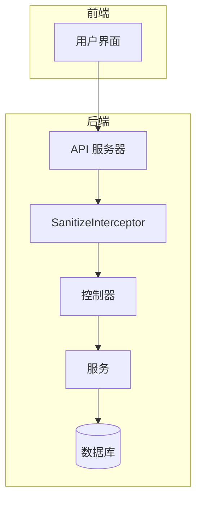
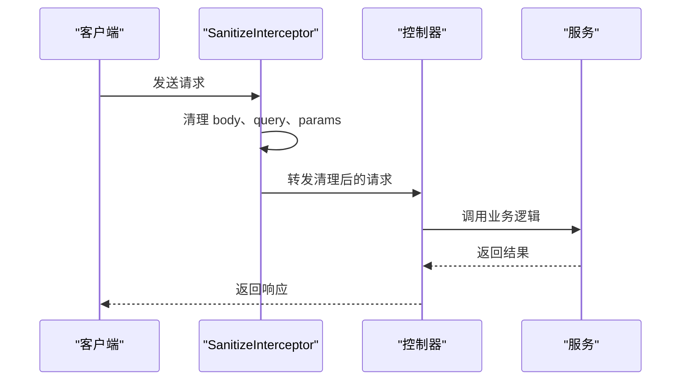
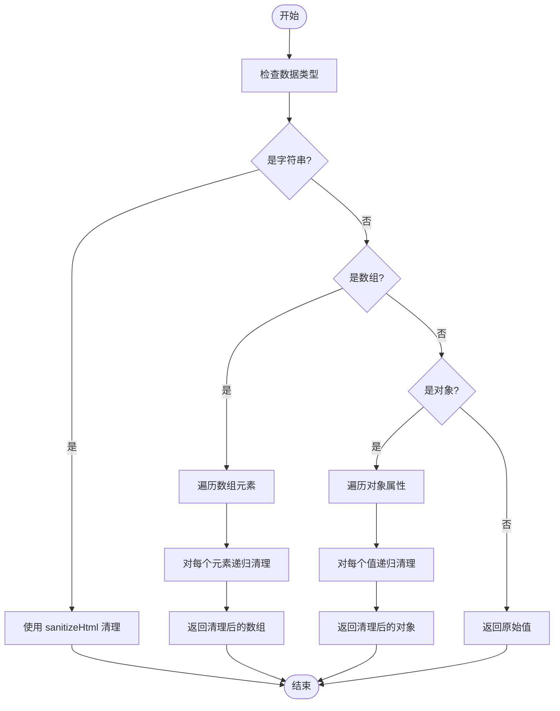
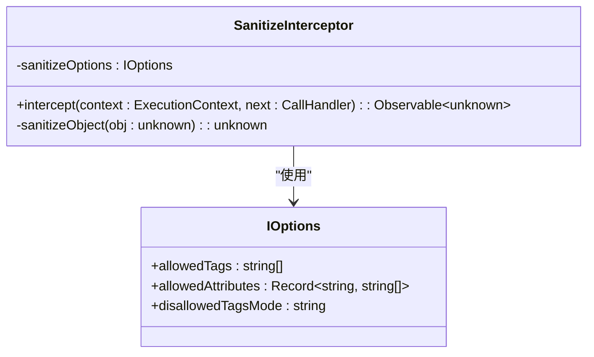
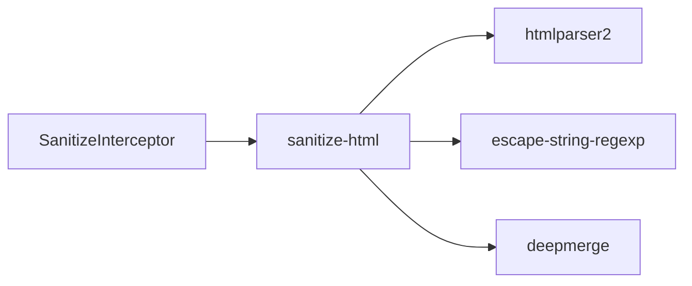

# SanitizeInterceptor 数据清理

<cite>
**本文档引用的文件**   
- [sanitize.interceptor.ts](file://apps/backend/src/common/interceptors/sanitize.interceptor.ts)
- [main.ts](file://apps/backend/src/main.ts)
- [auth.dto.ts](file://apps/backend/src/auth/auth.dto.ts)
- [users.controller.ts](file://apps/backend/src/users/users.controller.ts)
- [auth.controller.ts](file://apps/backend/src/auth/auth.controller.ts)
- [auth.schema.ts](file://packages/shared/src/schemas/auth.schema.ts)
</cite>

## 目录
1. [简介](#简介)
2. [项目结构](#项目结构)
3. [核心组件](#核心组件)
4. [架构概述](#架构概述)
5. [详细组件分析](#详细组件分析)
6. [依赖分析](#依赖分析)
7. [性能考虑](#性能考虑)
8. [故障排除指南](#故障排除指南)
9. [结论](#结论)

## 简介
SanitizeInterceptor 是一个 NestJS 拦截器，用于在请求生命周期中自动清理用户输入数据，防止跨站脚本（XSS）攻击。该拦截器通过递归遍历请求体、查询参数和路径参数中的所有字符串值，并使用 `sanitize-html` 库根据配置的规则清理潜在的恶意内容。拦截器默认配置为禁止所有 HTML 标签，确保应用程序的安全性。此外，它与 Zod Schema 验证机制协同工作，提供多层输入验证和清理。

## 项目结构
SanitizeInterceptor 位于 NestJS 后端应用的通用拦截器目录中，作为全局安全机制的一部分。它被集成到应用程序的请求处理管道中，确保所有传入请求在到达业务逻辑之前都经过数据清理。

**Diagram sources**
- [sanitize.interceptor.ts](file://apps/backend/src/common/interceptors/sanitize.interceptor.ts#L1-L60)
- [main.ts](file://apps/backend/src/main.ts#L71-L72)

**Section sources**
- [sanitize.interceptor.ts](file://apps/backend/src/common/interceptors/sanitize.interceptor.ts#L1-L60)
- [main.ts](file://apps/backend/src/main.ts#L71-L93)

## 核心组件
SanitizeInterceptor 的核心功能是通过 `sanitizeObject` 方法递归清理请求数据中的字符串值。该方法能够处理字符串、数组和对象类型的数据，确保嵌套结构中的所有字符串都被正确清理。拦截器在请求进入时自动应用，无需在每个控制器中手动调用。

**Section sources**
- [sanitize.interceptor.ts](file://apps/backend/src/common/interceptors/sanitize.interceptor.ts#L17-L35)
- [sanitize.interceptor.ts](file://apps/backend/src/common/interceptors/sanitize.interceptor.ts#L41-L59)

## 架构概述
SanitizeInterceptor 作为 NestJS 的全局拦截器，在请求处理管道的早期阶段运行。它在任何控制器逻辑执行之前清理请求数据，确保后续处理的安全性。拦截器通过 NestJS 的依赖注入系统管理，并配置为处理所有传入的 HTTP 请求。

**Diagram sources**
- [sanitize.interceptor.ts](file://apps/backend/src/common/interceptors/sanitize.interceptor.ts#L17-L35)
- [main.ts](file://apps/backend/src/main.ts#L71-L72)

## 详细组件分析

### SanitizeInterceptor 分析
SanitizeInterceptor 实现了 NestInterceptor 接口，通过 `intercept` 方法拦截请求并清理数据。它使用 `sanitize-html` 库的配置选项来定义清理规则，当前配置为禁止所有 HTML 标签，防止 XSS 攻击。

#### 递归清理机制

**Diagram sources**
- [sanitize.interceptor.ts](file://apps/backend/src/common/interceptors/sanitize.interceptor.ts#L41-L59)

#### 配置选项

**Diagram sources**
- [sanitize.interceptor.ts](file://apps/backend/src/common/interceptors/sanitize.interceptor.ts#L11-L15)

**Section sources**
- [sanitize.interceptor.ts](file://apps/backend/src/common/interceptors/sanitize.interceptor.ts#L1-L60)

### 业务场景使用示例
在用户注册和登录等业务场景中，SanitizeInterceptor 自动清理用户提交的数据，防止恶意脚本注入。例如，在注册新用户时，拦截器会清理用户名、邮箱等字段中的潜在 XSS 攻击代码。

**Section sources**
- [users.controller.ts](file://apps/backend/src/users/users.controller.ts#L37-L42)
- [auth.controller.ts](file://apps/backend/src/auth/auth.controller.ts#L22-L27)

## 依赖分析
SanitizeInterceptor 依赖于 `sanitize-html` 库进行实际的 HTML 清理操作。该库通过解析 HTML 并根据配置规则移除或转义危险内容来防止 XSS 攻击。拦截器作为全局拦截器注册，影响应用程序中的所有路由。

**Diagram sources**
- [sanitize.interceptor.ts](file://apps/backend/src/common/interceptors/sanitize.interceptor.ts#L3)
- [pnpm-lock.yaml](file://pnpm-lock.yaml#L15421-L15428)

**Section sources**
- [sanitize.interceptor.ts](file://apps/backend/src/common/interceptors/sanitize.interceptor.ts#L1-L60)
- [package.json](file://apps/backend/package.json#L63)

## 性能考虑
SanitizeInterceptor 在每个请求上执行递归操作，可能对性能产生一定影响，特别是在处理大型嵌套对象时。然而，由于其在请求处理管道的早期阶段运行，且 `sanitize-html` 库经过优化，实际性能影响通常可以接受。对于高吞吐量的应用，建议监控拦截器的执行时间并根据需要进行优化。

## 故障排除指南
### 常见问题
1. **特殊字符被误删**：检查 `sanitize-html` 的配置，确保允许必要的字符。
2. **嵌套对象处理异常**：确认数据结构没有循环引用，避免无限递归。
3. **性能瓶颈**：对于大型请求体，考虑在特定路由上禁用拦截器或优化清理逻辑。

### 配置调整
可以根据项目需求调整 `allowedTags` 和 `allowedAttributes` 配置，允许特定的 HTML 标签和属性。例如，如果需要支持富文本编辑器，可以配置允许 `
`、`<strong>` 等标签。

**Section sources**
- [sanitize.interceptor.ts](file://apps/backend/src/common/interceptors/sanitize.interceptor.ts#L11-L15)
- [auth.schema.ts](file://packages/shared/src/schemas/auth.schema.ts#L1-L55)

## 结论
SanitizeInterceptor 提供了一个强大而灵活的机制来防止 XSS 攻击，通过递归清理请求数据中的潜在恶意内容。它与 NestJS 的架构无缝集成，并与 Zod Schema 验证机制协同工作，提供多层安全防护。通过合理配置和监控，该拦截器可以有效保护应用程序免受常见的 Web 安全威胁。