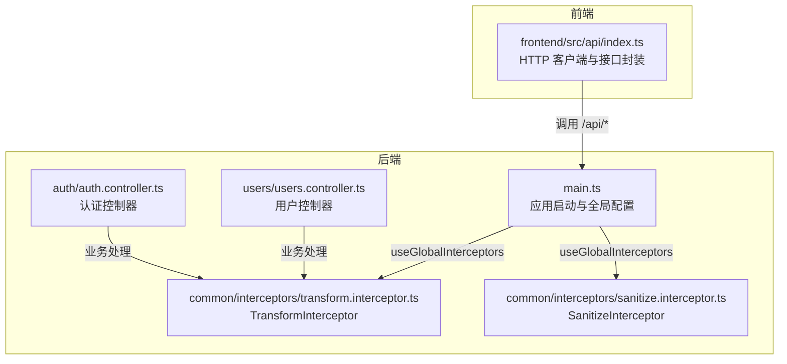
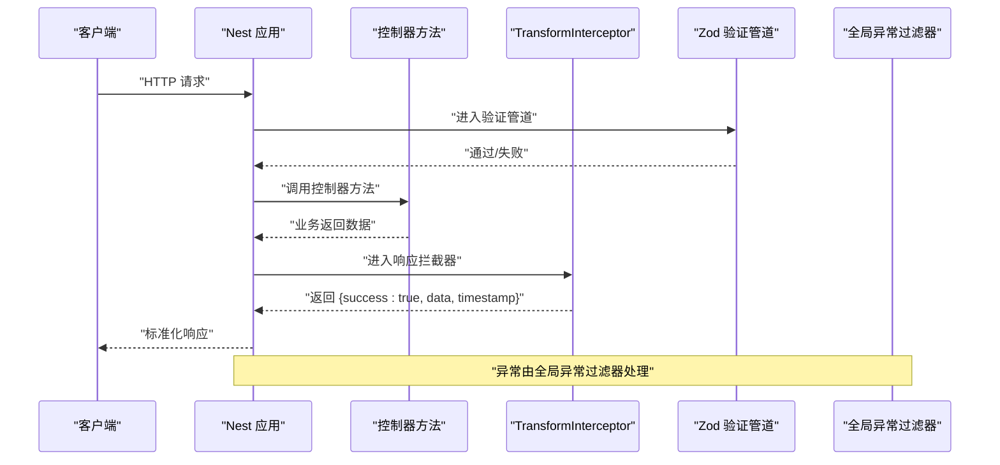
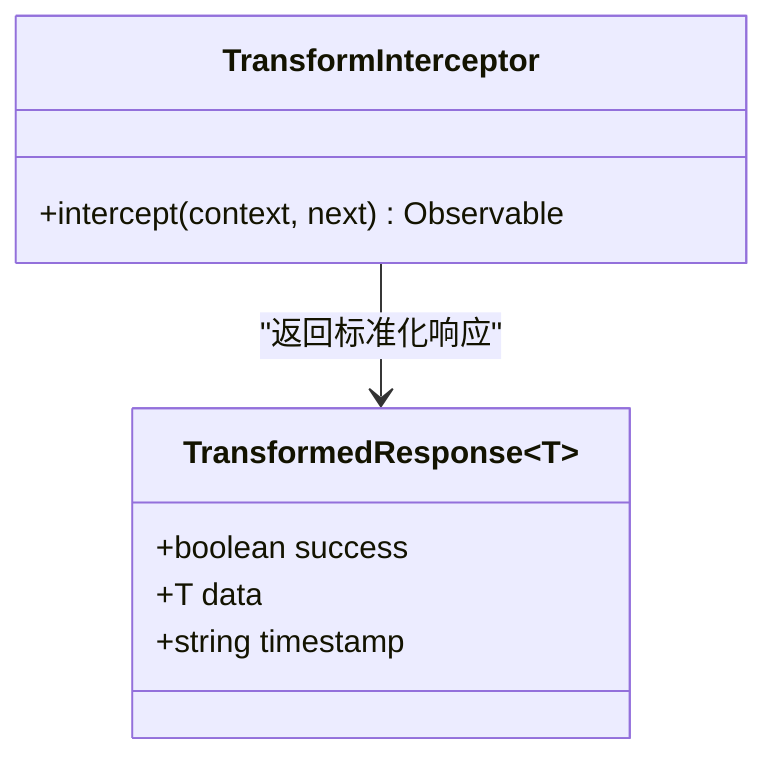
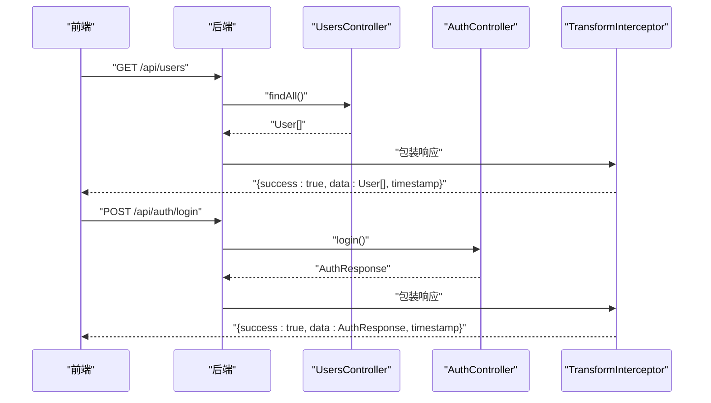
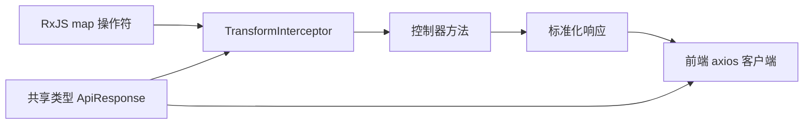

# TransformInterceptor 响应包装

<cite>
**本文引用的文件**
- [transform.interceptor.ts](file://apps/backend/src/common/interceptors/transform.interceptor.ts)
- [common.dto.ts](file://packages/shared/src/dto/common.dto.ts)
- [index.ts](file://apps/frontend/src/api/index.ts)
- [main.ts](file://apps/backend/src/main.ts)
- [users.controller.ts](file://apps/backend/src/users/users.controller.ts)
- [auth.controller.ts](file://apps/backend/src/auth/auth.controller.ts)
- [sanitize.interceptor.ts](file://apps/backend/src/common/interceptors/sanitize.interceptor.ts)
</cite>

## 目录
1. [简介](#简介)
2. [项目结构](#项目结构)
3. [核心组件](#核心组件)
4. [架构总览](#架构总览)
5. [详细组件分析](#详细组件分析)
6. [依赖关系分析](#依赖关系分析)
7. [性能考量](#性能考量)
8. [故障排查指南](#故障排查指南)
9. [结论](#结论)
10. [附录](#附录)

## 简介
本文件围绕 TransformInterceptor 响应格式化拦截器展开，系统阐述其如何在请求处理完成后统一包装成功响应，自动添加 success 标志、data 数据体与 timestamp 时间戳，从而保证 API 返回结构的一致性。文档还解释了 TransformedResponse 泛型接口的设计原理及其与 NestJS 响应流的集成方式；给出前端如何基于标准化响应进行统一处理的实际示例；讨论该拦截器在提升开发效率与前后端协作中的价值，并提出可扩展方向（如请求 ID 追踪、响应耗时统计）及调试技巧与跳过拦截器的方法。

## 项目结构
- 后端采用 NestJS 架构，拦截器位于公共模块目录下，作为全局拦截器之一参与请求生命周期。
- 前端使用 axios 构建 HTTP 客户端，统一处理响应数据结构，便于对接后端标准化响应。

图表来源
- [main.ts](file://apps/backend/src/main.ts#L65-L75)
- [transform.interceptor.ts](file://apps/backend/src/common/interceptors/transform.interceptor.ts#L1-L30)
- [sanitize.interceptor.ts](file://apps/backend/src/common/interceptors/sanitize.interceptor.ts#L1-L61)
- [users.controller.ts](file://apps/backend/src/users/users.controller.ts#L1-L43)
- [auth.controller.ts](file://apps/backend/src/auth/auth.controller.ts#L1-L51)
- [index.ts](file://apps/frontend/src/api/index.ts#L1-L92)

章节来源
- [main.ts](file://apps/backend/src/main.ts#L65-L75)
- [transform.interceptor.ts](file://apps/backend/src/common/interceptors/transform.interceptor.ts#L1-L30)
- [sanitize.interceptor.ts](file://apps/backend/src/common/interceptors/sanitize.interceptor.ts#L1-L61)
- [users.controller.ts](file://apps/backend/src/users/users.controller.ts#L1-L43)
- [auth.controller.ts](file://apps/backend/src/auth/auth.controller.ts#L1-L51)
- [index.ts](file://apps/frontend/src/api/index.ts#L1-L92)

## 核心组件
- TransformInterceptor：全局响应拦截器，负责将成功响应统一包装为包含 success、data、timestamp 的结构化对象。
- TransformedResponse 泛型接口：定义标准化响应的数据结构，支持泛型承载任意业务数据类型。
- 前端 ApiResponse 类型：与后端响应结构保持一致，便于前端统一处理。

章节来源
- [transform.interceptor.ts](file://apps/backend/src/common/interceptors/transform.interceptor.ts#L1-L30)
- [common.dto.ts](file://packages/shared/src/dto/common.dto.ts#L1-L13)
- [index.ts](file://apps/frontend/src/api/index.ts#L1-L92)

## 架构总览
TransformInterceptor 作为全局拦截器，接入 NestJS 的请求处理管线，在业务处理器返回数据后，通过 RxJS 的 map 操作符将其转换为统一的标准化响应格式。该流程对所有成功响应生效，不影响异常与错误处理（由全局异常过滤器负责）。

图表来源
- [main.ts](file://apps/backend/src/main.ts#L65-L75)
- [transform.interceptor.ts](file://apps/backend/src/common/interceptors/transform.interceptor.ts#L1-L30)
- [users.controller.ts](file://apps/backend/src/users/users.controller.ts#L1-L43)
- [auth.controller.ts](file://apps/backend/src/auth/auth.controller.ts#L1-L51)

## 详细组件分析

### TransformInterceptor 实现与设计
- 设计目标：统一成功响应结构，减少前端分支判断，提升一致性与可维护性。
- 关键实现：
  - 使用泛型 TransformedResponse<T> 表达“成功”状态下的响应载体。
  - 在拦截器内部通过 next.handle() 获取上游返回的数据，再用 map 包装为 { success: true, data, timestamp }。
  - 时间戳采用 ISO 字符串格式，便于前端解析与展示。
- 与 NestJS 响应流集成：
  - 作为全局拦截器，对所有路由的响应生效。
  - 与全局异常过滤器配合，确保错误场景不被该拦截器包裹。

图表来源
- [transform.interceptor.ts](file://apps/backend/src/common/interceptors/transform.interceptor.ts#L1-L30)

章节来源
- [transform.interceptor.ts](file://apps/backend/src/common/interceptors/transform.interceptor.ts#L1-L30)

### TransformedResponse 泛型接口与共享类型
- 后端：TransformInterceptor 返回的标准化响应结构。
- 前端：共享类型包中定义了 ApiResponse 接口，字段包含 success、data、message（可选）、timestamp，便于前端统一消费。
- 一致性保障：前后端共享类型，避免字段不一致导致的联调问题。

章节来源
- [transform.interceptor.ts](file://apps/backend/src/common/interceptors/transform.interceptor.ts#L1-L30)
- [common.dto.ts](file://packages/shared/src/dto/common.dto.ts#L1-L13)
- [index.ts](file://apps/frontend/src/api/index.ts#L1-L92)

### 控制器与拦截器交互
- 用户控制器与认证控制器均返回业务数据，经由 TransformInterceptor 统一包装。
- 示例方法：
  - 用户控制器：获取用户列表、获取单个用户、创建用户。
  - 认证控制器：登录、刷新令牌、获取当前用户信息。

图表来源
- [users.controller.ts](file://apps/backend/src/users/users.controller.ts#L1-L43)
- [auth.controller.ts](file://apps/backend/src/auth/auth.controller.ts#L1-L51)
- [transform.interceptor.ts](file://apps/backend/src/common/interceptors/transform.interceptor.ts#L1-L30)

章节来源
- [users.controller.ts](file://apps/backend/src/users/users.controller.ts#L1-L43)
- [auth.controller.ts](file://apps/backend/src/auth/auth.controller.ts#L1-L51)
- [transform.interceptor.ts](file://apps/backend/src/common/interceptors/transform.interceptor.ts#L1-L30)

### 与 SanitizeInterceptor 的协同
- SanitizeInterceptor 在请求阶段清理潜在的 HTML/XSS 内容，降低安全风险。
- TransformInterceptor 在响应阶段统一包装，两者分别作用于请求与响应两个维度，共同提升系统安全性与一致性。

章节来源
- [sanitize.interceptor.ts](file://apps/backend/src/common/interceptors/sanitize.interceptor.ts#L1-L61)
- [transform.interceptor.ts](file://apps/backend/src/common/interceptors/transform.interceptor.ts#L1-L30)

## 依赖关系分析
- TransformInterceptor 依赖 RxJS 的 map 操作符完成响应转换。
- 作为全局拦截器，它与控制器方法、验证管道、异常过滤器共同构成请求处理链。
- 前端通过 axios 客户端消费后端标准化响应，共享类型确保两端契约一致。

图表来源
- [transform.interceptor.ts](file://apps/backend/src/common/interceptors/transform.interceptor.ts#L1-L30)
- [index.ts](file://apps/frontend/src/api/index.ts#L1-L92)
- [common.dto.ts](file://packages/shared/src/dto/common.dto.ts#L1-L13)

章节来源
- [transform.interceptor.ts](file://apps/backend/src/common/interceptors/transform.interceptor.ts#L1-L30)
- [index.ts](file://apps/frontend/src/api/index.ts#L1-L92)
- [common.dto.ts](file://packages/shared/src/dto/common.dto.ts#L1-L13)

## 性能考量
- 转换开销极低：仅在成功响应路径上执行 map 操作，对性能影响可忽略。
- 建议：
  - 对于超大数据量的列表接口，优先考虑分页与懒加载，避免一次性传输大量数据。
  - 若需统计耗时，可在拦截器中增加耗时计算逻辑（见扩展建议）。

[本节为通用指导，无需列出具体文件来源]

## 故障排查指南
- 症状：某些路由未被拦截器包装
  - 检查是否在应用启动处注册了全局拦截器（参考 main.ts 中的 useGlobalInterceptors 调用）。
  - 确认控制器方法未显式禁用拦截器（参见“跳过拦截器”小节）。
- 症状：响应结构与预期不符
  - 核对前端类型定义与后端响应结构是否一致（参考 shared 包中的 ApiResponse）。
  - 检查是否存在自定义拦截器覆盖了 TransformInterceptor 的行为。
- 症状：时间戳格式不符合前端解析习惯
  - 可在拦截器中调整 timestamp 的生成策略（例如使用毫秒时间戳或本地化格式）。

章节来源
- [main.ts](file://apps/backend/src/main.ts#L65-L75)
- [common.dto.ts](file://packages/shared/src/dto/common.dto.ts#L1-L13)
- [transform.interceptor.ts](file://apps/backend/src/common/interceptors/transform.interceptor.ts#L1-L30)

## 结论
TransformInterceptor 通过统一的成功响应包装，显著提升了 API 的一致性与可维护性，降低了前端处理复杂度。结合共享类型与全局拦截器机制，前后端协作更加顺畅。未来可在此基础上扩展请求 ID 追踪、响应耗时统计等能力，进一步增强可观测性与调试体验。

[本节为总结性内容，无需列出具体文件来源]

## 附录

### 实际调用示例（前端）
- 前端通过 axios 客户端封装的 api 方法调用后端接口，统一接收标准化响应结构。
- 示例方法：
  - 获取用户列表：返回 ApiResponse<User[]>
  - 获取单个用户：返回 ApiResponse<User>
  - 创建用户：返回 ApiResponse<User>

章节来源
- [index.ts](file://apps/frontend/src/api/index.ts#L61-L91)

### 在特定路由中跳过拦截器
- 方法一：在控制器或方法上使用注解禁用全局拦截器（例如使用 @UseInterceptors(CustomInterceptor) 显式声明，或在方法级禁用）。
- 方法二：在应用启动时仅注册必要的拦截器，避免对某些特殊路由（如静态资源、健康检查）应用响应包装。

章节来源
- [main.ts](file://apps/backend/src/main.ts#L65-L75)
- [users.controller.ts](file://apps/backend/src/users/users.controller.ts#L1-L43)
- [auth.controller.ts](file://apps/backend/src/auth/auth.controller.ts#L1-L51)

### 扩展方向
- 请求 ID 追踪：在拦截器中注入或读取请求上下文中的 traceId，并在响应中携带，便于跨服务链路追踪。
- 响应耗时统计：记录请求开始时间与结束时间，计算耗时并在响应中返回，或输出到日志。
- 错误响应标准化：当前拦截器仅处理成功响应，可结合全局异常过滤器统一错误响应结构，形成完整的 API 规范。

[本节为概念性建议，无需列出具体文件来源]