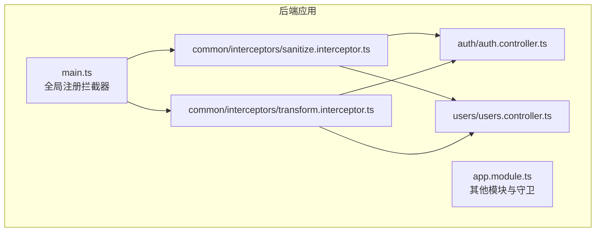
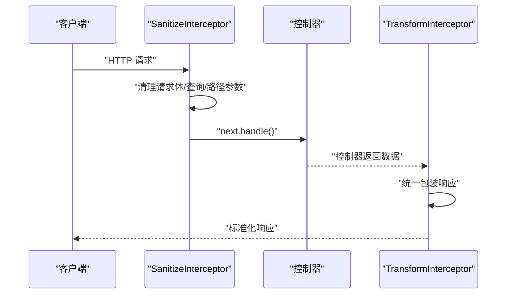
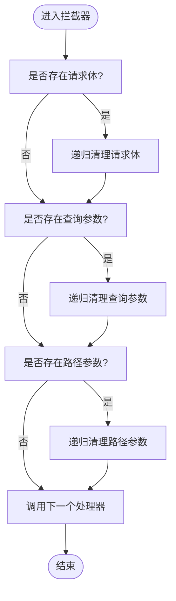
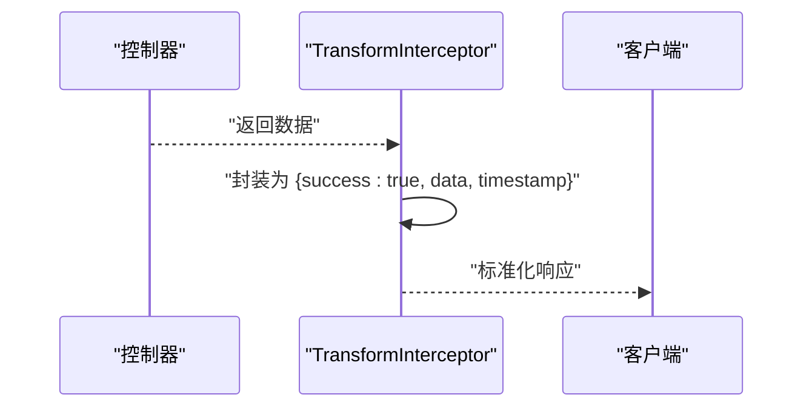
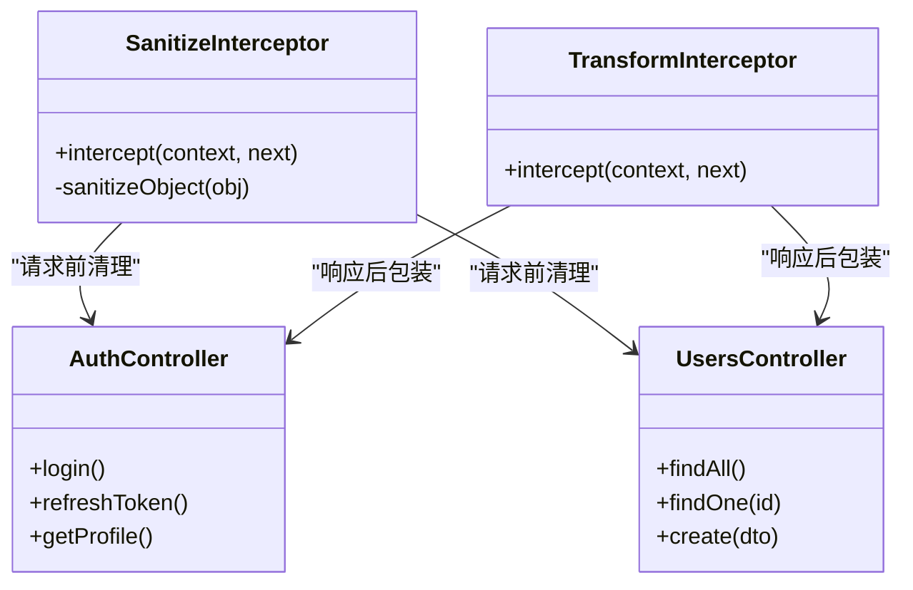
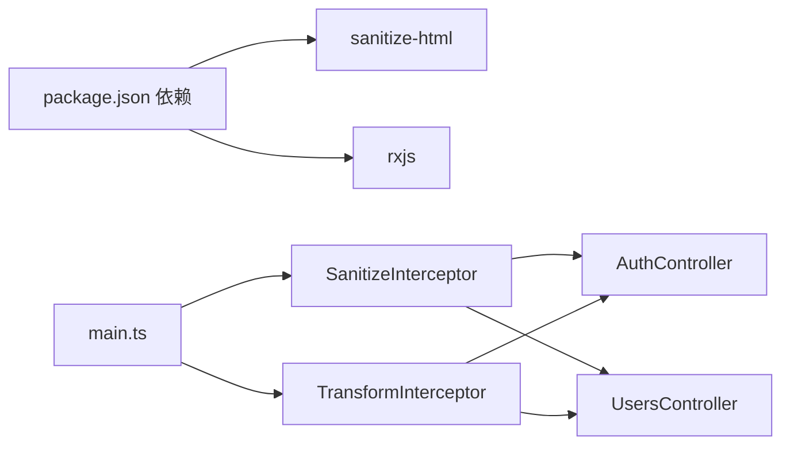

# 请求拦截器

<cite>
**本文引用的文件**
- [apps/backend/src/common/interceptors/sanitize.interceptor.ts](file://apps/backend/src/common/interceptors/sanitize.interceptor.ts)
- [apps/backend/src/common/interceptors/transform.interceptor.ts](file://apps/backend/src/common/interceptors/transform.interceptor.ts)
- [apps/backend/src/main.ts](file://apps/backend/src/main.ts)
- [apps/backend/src/app.module.ts](file://apps/backend/src/app.module.ts)
- [apps/backend/src/auth/auth.controller.ts](file://apps/backend/src/auth/auth.controller.ts)
- [apps/backend/src/users/users.controller.ts](file://apps/backend/src/users/users.controller.ts)
- [apps/backend/package.json](file://apps/backend/package.json)
</cite>

## 目录
1. [简介](#简介)
2. [项目结构](#项目结构)
3. [核心组件](#核心组件)
4. [架构总览](#架构总览)
5. [详细组件分析](#详细组件分析)
6. [依赖分析](#依赖分析)
7. [性能考虑](#性能考虑)
8. [故障排查指南](#故障排查指南)
9. [结论](#结论)
10. [附录](#附录)

## 简介
本文件围绕两个关键的请求拦截器展开：SanitizeInterceptor 与 TransformInterceptor。前者在请求进入控制器之前对输入数据进行清理，有效降低 XSS 风险；后者统一包装成功响应，输出包含状态码、时间戳与数据体的一致性结构，提升 API 的可预测性和前端消费体验。本文将阐述它们的实现原理、执行顺序、在 NestJS 生命周期中的位置、全局注册方式、自定义扩展建议、性能影响与调试技巧。

## 项目结构
拦截器位于通用模块下的 interceptors 目录，分别负责输入清理与输出统一化。全局注册在应用启动入口完成，确保所有控制器生效。

图表来源
- [apps/backend/src/main.ts](file://apps/backend/src/main.ts#L71-L73)
- [apps/backend/src/common/interceptors/sanitize.interceptor.ts](file://apps/backend/src/common/interceptors/sanitize.interceptor.ts#L1-L60)
- [apps/backend/src/common/interceptors/transform.interceptor.ts](file://apps/backend/src/common/interceptors/transform.interceptor.ts#L1-L29)
- [apps/backend/src/auth/auth.controller.ts](file://apps/backend/src/auth/auth.controller.ts#L1-L51)
- [apps/backend/src/users/users.controller.ts](file://apps/backend/src/users/users.controller.ts#L1-L43)

章节来源
- [apps/backend/src/main.ts](file://apps/backend/src/main.ts#L71-L73)
- [apps/backend/src/common/interceptors/sanitize.interceptor.ts](file://apps/backend/src/common/interceptors/sanitize.interceptor.ts#L1-L60)
- [apps/backend/src/common/interceptors/transform.interceptor.ts](file://apps/backend/src/common/interceptors/transform.interceptor.ts#L1-L29)

## 核心组件
- SanitizeInterceptor：在请求进入控制器前，递归清理请求体、查询参数与路径参数中的字符串值，禁止任何 HTML 标签，避免 XSS 攻击。
- TransformInterceptor：对成功响应进行统一包装，附加 success 字段与 timestamp 字段，保证前后端一致的数据结构。

章节来源
- [apps/backend/src/common/interceptors/sanitize.interceptor.ts](file://apps/backend/src/common/interceptors/sanitize.interceptor.ts#L1-L60)
- [apps/backend/src/common/interceptors/transform.interceptor.ts](file://apps/backend/src/common/interceptors/transform.interceptor.ts#L1-L29)

## 架构总览
拦截器在 NestJS 请求生命周期中的位置如下：
- 请求进入：先经过 SanitizeInterceptor，再进入控制器。
- 控制器返回：由 TransformInterceptor 包装响应，最终返回给客户端。

图表来源
- [apps/backend/src/common/interceptors/sanitize.interceptor.ts](file://apps/backend/src/common/interceptors/sanitize.interceptor.ts#L17-L36)
- [apps/backend/src/common/interceptors/transform.interceptor.ts](file://apps/backend/src/common/interceptors/transform.interceptor.ts#L20-L28)
- [apps/backend/src/auth/auth.controller.ts](file://apps/backend/src/auth/auth.controller.ts#L22-L27)

## 详细组件分析

### SanitizeInterceptor 分析
- 职责：在请求进入控制器前，递归清理请求体、查询参数与路径参数中的字符串值，禁止任何 HTML 标签，避免 XSS。
- 实现要点：
  - 使用 sanitize-html 并配置不允许任何标签与属性，遇到非法标签采用递归转义模式。
  - 对字符串直接清理，对数组与对象递归处理，保持原始结构不变。
  - 仅对存在值的对象进行清理，避免空对象或非字符串类型被误处理。
- 执行顺序：作为全局拦截器，优先于控制器执行，确保所有输入均被清理。

图表来源
- [apps/backend/src/common/interceptors/sanitize.interceptor.ts](file://apps/backend/src/common/interceptors/sanitize.interceptor.ts#L17-L36)
- [apps/backend/src/common/interceptors/sanitize.interceptor.ts](file://apps/backend/src/common/interceptors/sanitize.interceptor.ts#L41-L60)

章节来源
- [apps/backend/src/common/interceptors/sanitize.interceptor.ts](file://apps/backend/src/common/interceptors/sanitize.interceptor.ts#L1-L60)

### TransformInterceptor 分析
- 职责：统一包装成功响应，附加 success 字段与 timestamp 字段，便于前端统一处理。
- 实现要点：
  - 通过 RxJS 的 map 操作符对响应流进行转换，将任意数据包裹为包含 success 与 timestamp 的结构。
  - 该拦截器不改变错误响应的形态，仅作用于成功响应。
- 执行顺序：在控制器之后执行，确保能拿到控制器返回的数据并进行统一包装。

图表来源
- [apps/backend/src/common/interceptors/transform.interceptor.ts](file://apps/backend/src/common/interceptors/transform.interceptor.ts#L20-L28)

章节来源
- [apps/backend/src/common/interceptors/transform.interceptor.ts](file://apps/backend/src/common/interceptors/transform.interceptor.ts#L1-L29)

### 组件关系与类图

图表来源
- [apps/backend/src/common/interceptors/sanitize.interceptor.ts](file://apps/backend/src/common/interceptors/sanitize.interceptor.ts#L1-L60)
- [apps/backend/src/common/interceptors/transform.interceptor.ts](file://apps/backend/src/common/interceptors/transform.interceptor.ts#L1-L29)
- [apps/backend/src/auth/auth.controller.ts](file://apps/backend/src/auth/auth.controller.ts#L1-L51)
- [apps/backend/src/users/users.controller.ts](file://apps/backend/src/users/users.controller.ts#L1-L43)

## 依赖分析
- 外部依赖
  - sanitize-html：用于清理 HTML 与脚本片段，阻止 XSS。
  - rxjs：用于拦截器内部的响应流转换。
- 内部依赖
  - 在 main.ts 中全局注册 SanitizeInterceptor，TransformInterceptor 未在全局注册，但可通过控制器级装饰器按需启用。
- 模块关系
  - AppModule 导入多个模块，但与拦截器无直接耦合；拦截器通过全局注册生效。

图表来源
- [apps/backend/package.json](file://apps/backend/package.json#L21-L66)
- [apps/backend/src/main.ts](file://apps/backend/src/main.ts#L71-L73)
- [apps/backend/src/common/interceptors/sanitize.interceptor.ts](file://apps/backend/src/common/interceptors/sanitize.interceptor.ts#L1-L60)
- [apps/backend/src/common/interceptors/transform.interceptor.ts](file://apps/backend/src/common/interceptors/transform.interceptor.ts#L1-L29)
- [apps/backend/src/auth/auth.controller.ts](file://apps/backend/src/auth/auth.controller.ts#L1-L51)
- [apps/backend/src/users/users.controller.ts](file://apps/backend/src/users/users.controller.ts#L1-L43)

章节来源
- [apps/backend/package.json](file://apps/backend/package.json#L21-L66)
- [apps/backend/src/main.ts](file://apps/backend/src/main.ts#L71-L73)

## 性能考虑
- SanitizeInterceptor
  - 递归清理对象会带来一定 CPU 开销，尤其在深层嵌套或大体积请求体时。建议：
    - 仅对必要字段进行清理，避免对大型二进制或非文本字段进行处理。
    - 结合业务场景，必要时在控制器层对特定 DTO 进行更细粒度的清理策略。
- TransformInterceptor
  - 仅对成功响应进行包装，开销极低，几乎不影响性能。
- 其他安全措施
  - Helmet 提供安全头，减少 XSS 风险面。
  - 压缩中间件提升传输效率，但注意 SSE/WebSocket 场景不压缩。

章节来源
- [apps/backend/src/common/interceptors/sanitize.interceptor.ts](file://apps/backend/src/common/interceptors/sanitize.interceptor.ts#L41-L60)
- [apps/backend/src/main.ts](file://apps/backend/src/main.ts#L24-L55)

## 故障排查指南
- 输入未被清理
  - 确认 SanitizeInterceptor 已作为全局拦截器注册。
  - 检查请求体是否为字符串或可序列化的对象；非字符串不会被清理。
- 响应未被统一包装
  - TransformInterceptor 默认仅包装成功响应；若控制器抛出异常，将由异常过滤器处理，不会被 TransformInterceptor 包装。
- 调试技巧
  - 使用 Pino 日志记录请求与响应，观察请求体与响应体变化。
  - 在控制器中临时禁用 TransformInterceptor，验证是否为包装导致的问题。
  - 使用 Swagger 测试接口，对比清理前后数据差异。

章节来源
- [apps/backend/src/main.ts](file://apps/backend/src/main.ts#L71-L73)
- [apps/backend/src/common/interceptors/transform.interceptor.ts](file://apps/backend/src/common/interceptors/transform.interceptor.ts#L20-L28)

## 结论
SanitizeInterceptor 与 TransformInterceptor 分别从“输入安全”和“输出一致性”两个维度提升了系统的安全性与可用性。前者通过递归清理输入，有效降低 XSS 风险；后者通过统一响应结构，简化前端消费。两者配合 Helmet、压缩与 Zod 验证等安全与质量保障措施，形成完整的请求处理链路。

## 附录

### 全局注册与使用方式
- 全局注册 SanitizeInterceptor
  - 在应用启动入口中设置全局拦截器，确保所有请求均被清理。
  - 参考路径：[apps/backend/src/main.ts](file://apps/backend/src/main.ts#L71-L73)
- TransformInterceptor 的使用
  - 当前未在全局注册，可在控制器上按需使用，以实现对特定接口的响应包装。
  - 示例参考：[apps/backend/src/auth/auth.controller.ts](file://apps/backend/src/auth/auth.controller.ts#L22-L27)

章节来源
- [apps/backend/src/main.ts](file://apps/backend/src/main.ts#L71-L73)
- [apps/backend/src/auth/auth.controller.ts](file://apps/backend/src/auth/auth.controller.ts#L22-L27)

### 自定义拦截逻辑建议
- 自定义 SanitizeInterceptor
  - 若业务需要保留部分标签或属性，可在构造函数中调整 sanitize-html 的配置选项，谨慎评估风险。
  - 对于富文本场景，建议在入库前进行白名单策略，并在展示层再次进行二次清理。
- 自定义 TransformInterceptor
  - 可扩展包装字段，如加入 code、message、traceId 等，满足多语言或多版本 API 的差异化需求。
  - 对于分页场景，可将分页信息合并到 data 中，或单独提供 meta 字段。

章节来源
- [apps/backend/src/common/interceptors/sanitize.interceptor.ts](file://apps/backend/src/common/interceptors/sanitize.interceptor.ts#L11-L15)
- [apps/backend/src/common/interceptors/transform.interceptor.ts](file://apps/backend/src/common/interceptors/transform.interceptor.ts#L8-L12)