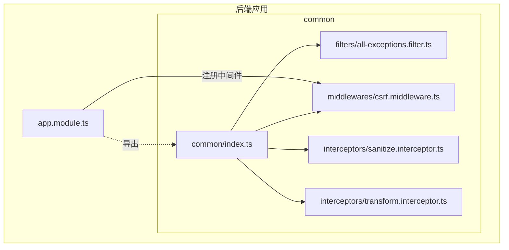
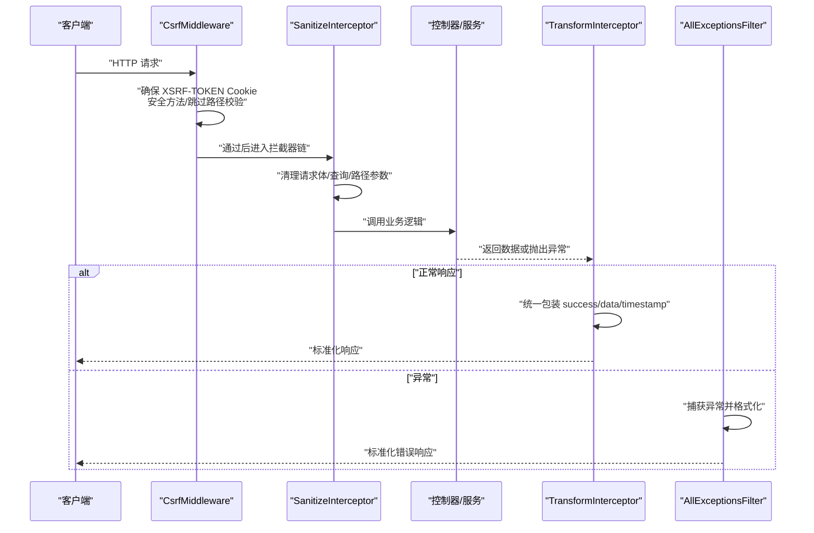
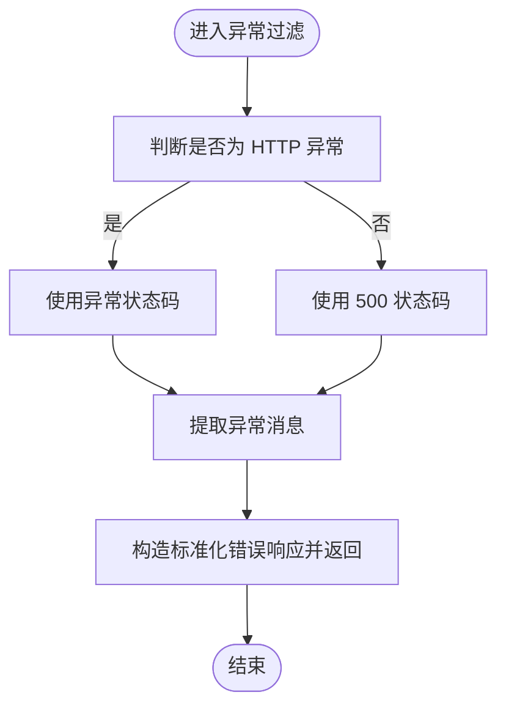
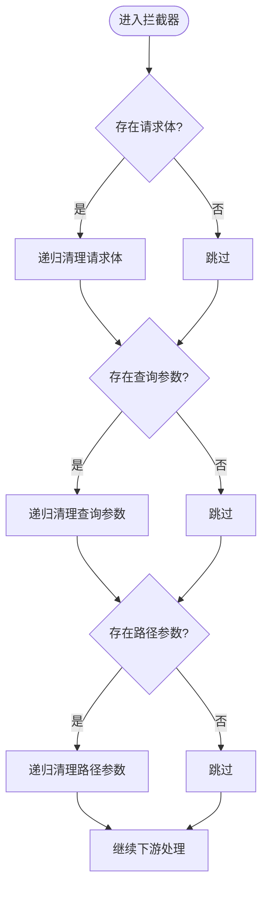
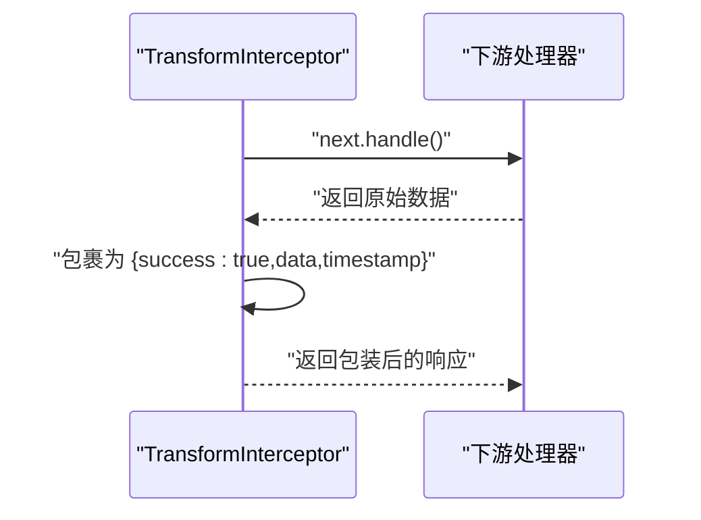
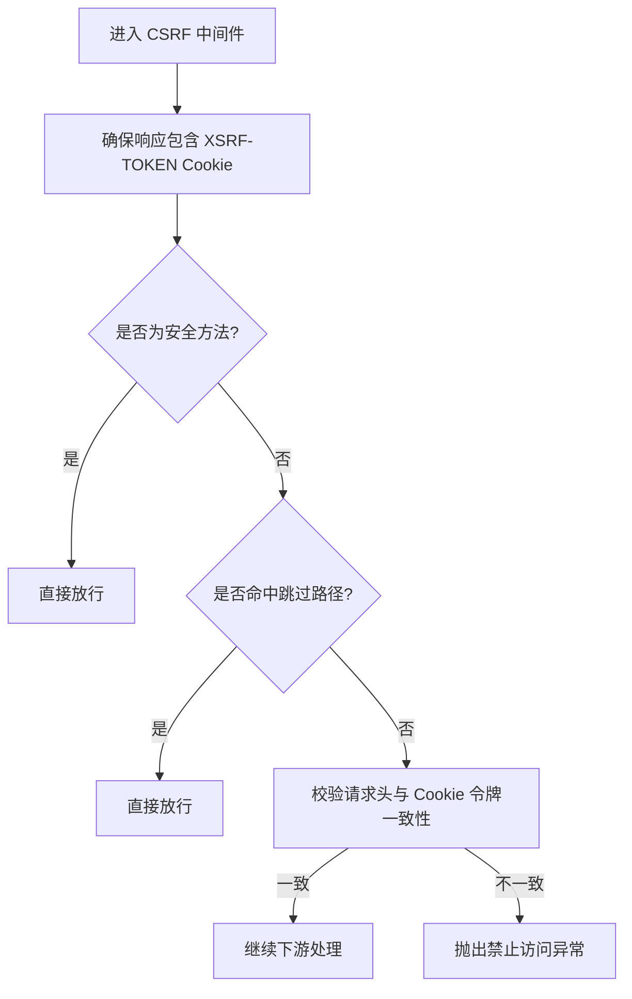
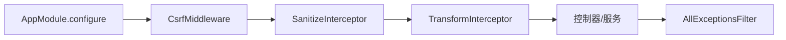

# 通用基础设施

<cite>
**本文引用的文件**
- [apps/backend/src/common/filters/all-exceptions.filter.ts](file://apps/backend/src/common/filters/all-exceptions.filter.ts)
- [apps/backend/src/common/interceptors/sanitize.interceptor.ts](file://apps/backend/src/common/interceptors/sanitize.interceptor.ts)
- [apps/backend/src/common/interceptors/transform.interceptor.ts](file://apps/backend/src/common/interceptors/transform.interceptor.ts)
- [apps/backend/src/common/middlewares/csrf.middleware.ts](file://apps/backend/src/common/middlewares/csrf.middleware.ts)
- [apps/backend/src/common/index.ts](file://apps/backend/src/common/index.ts)
- [apps/backend/src/app.module.ts](file://apps/backend/src/app.module.ts)
</cite>

## 目录
1. [简介](#简介)
2. [项目结构](#项目结构)
3. [核心组件](#核心组件)
4. [架构总览](#架构总览)
5. [组件详解](#组件详解)
6. [依赖关系分析](#依赖关系分析)
7. [性能考量](#性能考量)
8. [故障排查指南](#故障排查指南)
9. [结论](#结论)
10. [附录：自定义开发指南](#附录自定义开发指南)

## 简介
本文件聚焦于后端通用基础设施组件，覆盖异常处理、请求转换与安全防护三大领域，系统阐述以下能力：
- AllExceptionsFilter 如何统一捕获并格式化所有未处理异常（含 HTTP 与运行时错误）。
- SanitizeInterceptor 如何清理请求数据以抵御 XSS 攻击。
- TransformInterceptor 如何将成功响应统一包装为标准格式。
- CSRF 中间件的实现原理与在防止跨站请求伪造攻击中的作用。
- 在 AppModule 中的全局注册方式、执行顺序与性能影响。
- 自定义过滤器、拦截器与中间件的开发指南。

## 项目结构
通用基础设施位于后端应用的公共目录下，采用“按职责分类”的组织方式：
- common/filters：全局异常过滤器
- common/interceptors：请求清理与响应包装拦截器
- common/middlewares：CSRF 中间件
- common/index.ts：导出入口，便于模块级统一导入

图表来源
- [apps/backend/src/app.module.ts](file://apps/backend/src/app.module.ts#L153-L158)
- [apps/backend/src/common/index.ts](file://apps/backend/src/common/index.ts#L1-L9)

章节来源
- [apps/backend/src/app.module.ts](file://apps/backend/src/app.module.ts#L153-L158)
- [apps/backend/src/common/index.ts](file://apps/backend/src/common/index.ts#L1-L9)

## 核心组件
- AllExceptionsFilter：统一捕获未处理异常，输出标准化错误响应，包含状态码、消息与时间戳等字段。
- SanitizeInterceptor：递归清理请求体、查询参数与路径参数中的潜在危险内容，防止 XSS。
- TransformInterceptor：对成功响应进行统一包装，确保前端统一消费格式。
- CsrfMiddleware：基于双重提交 Cookie 的 CSRF 防护，支持安全方法豁免与特定路径跳过。

章节来源
- [apps/backend/src/common/filters/all-exceptions.filter.ts](file://apps/backend/src/common/filters/all-exceptions.filter.ts#L1-L31)
- [apps/backend/src/common/interceptors/sanitize.interceptor.ts](file://apps/backend/src/common/interceptors/sanitize.interceptor.ts#L1-L61)
- [apps/backend/src/common/interceptors/transform.interceptor.ts](file://apps/backend/src/common/interceptors/transform.interceptor.ts#L1-L30)
- [apps/backend/src/common/middlewares/csrf.middleware.ts](file://apps/backend/src/common/middlewares/csrf.middleware.ts#L1-L93)

## 架构总览
下图展示请求在进入业务逻辑前后的关键处理链路，以及异常与响应的统一出口：

图表来源
- [apps/backend/src/common/middlewares/csrf.middleware.ts](file://apps/backend/src/common/middlewares/csrf.middleware.ts#L31-L51)
- [apps/backend/src/common/interceptors/sanitize.interceptor.ts](file://apps/backend/src/common/interceptors/sanitize.interceptor.ts#L17-L36)
- [apps/backend/src/common/interceptors/transform.interceptor.ts](file://apps/backend/src/common/interceptors/transform.interceptor.ts#L18-L29)
- [apps/backend/src/common/filters/all-exceptions.filter.ts](file://apps/backend/src/common/filters/all-exceptions.filter.ts#L10-L29)

## 组件详解

### AllExceptionsFilter：统一异常捕获与格式化
- 捕获范围：装饰器声明为捕获所有异常类型。
- 错误映射：
  - 若为 HTTP 异常，使用其状态码与消息。
  - 否则默认映射为服务器内部错误。
- 输出格式：固定包含 success、data、message、statusCode、timestamp 字段，便于前端统一处理。
- 适用场景：未被业务层显式捕获的异常，保证对外输出一致且可诊断。

图表来源
- [apps/backend/src/common/filters/all-exceptions.filter.ts](file://apps/backend/src/common/filters/all-exceptions.filter.ts#L10-L29)

章节来源
- [apps/backend/src/common/filters/all-exceptions.filter.ts](file://apps/backend/src/common/filters/all-exceptions.filter.ts#L1-L31)

### SanitizeInterceptor：请求数据清理与 XSS 防护
- 清理范围：请求体、查询参数、路径参数三类输入。
- 清理策略：禁用所有 HTML 标签，递归处理对象与数组，对字符串进行转义或移除。
- 实现要点：通过拦截器在进入业务逻辑之前完成清洗，降低 XSS 风险面。
- 性能建议：对大型请求体谨慎使用，必要时可在上层限流或压缩。

图表来源
- [apps/backend/src/common/interceptors/sanitize.interceptor.ts](file://apps/backend/src/common/interceptors/sanitize.interceptor.ts#L17-L36)
- [apps/backend/src/common/interceptors/sanitize.interceptor.ts](file://apps/backend/src/common/interceptors/sanitize.interceptor.ts#L41-L60)

章节来源
- [apps/backend/src/common/interceptors/sanitize.interceptor.ts](file://apps/backend/src/common/interceptors/sanitize.interceptor.ts#L1-L61)

### TransformInterceptor：成功响应统一包装
- 包装策略：对下游返回的数据进行统一包装，添加 success 与 timestamp 字段，保持 data 原样。
- 适用范围：仅对成功响应生效；异常由 AllExceptionsFilter 统一处理。
- 前后端约定：前端可据此统一解析响应结构，简化错误分支处理。

图表来源
- [apps/backend/src/common/interceptors/transform.interceptor.ts](file://apps/backend/src/common/interceptors/transform.interceptor.ts#L18-L29)

章节来源
- [apps/backend/src/common/interceptors/transform.interceptor.ts](file://apps/backend/src/common/interceptors/transform.interceptor.ts#L1-L30)

### CSRF 中间件：双重提交 Cookie 防护
- 双重提交机制：服务器在响应中设置 XSRF-TOKEN Cookie；客户端需在请求头携带对应令牌。
- 安全策略：
  - 安全方法（GET/HEAD/OPTIONS）直接放行。
  - 对特定路径（如健康检查、登录、刷新）跳过验证。
  - 使用时间安全比较函数避免时序攻击。
  - Cookie 设置为严格 SameSite、可选 HTTPS、带过期时间。
- 执行顺序：在拦截器链之前执行，确保后续拦截器与控制器均在受保护状态下运行。

图表来源
- [apps/backend/src/common/middlewares/csrf.middleware.ts](file://apps/backend/src/common/middlewares/csrf.middleware.ts#L31-L51)
- [apps/backend/src/common/middlewares/csrf.middleware.ts](file://apps/backend/src/common/middlewares/csrf.middleware.ts#L53-L69)
- [apps/backend/src/common/middlewares/csrf.middleware.ts](file://apps/backend/src/common/middlewares/csrf.middleware.ts#L71-L84)
- [apps/backend/src/common/middlewares/csrf.middleware.ts](file://apps/backend/src/common/middlewares/csrf.middleware.ts#L86-L92)

章节来源
- [apps/backend/src/common/middlewares/csrf.middleware.ts](file://apps/backend/src/common/middlewares/csrf.middleware.ts#L1-L93)

## 依赖关系分析
- 导出与复用：common/index.ts 统一导出各基础设施组件，便于模块级集中引入。
- 注册位置：AppModule 作为根模块，负责全局中间件注册与守卫注入。
- 执行顺序：
  1) 中间件（CsrfMiddleware）
  2) 拦截器（SanitizeInterceptor -> TransformInterceptor）
  3) 控制器/服务
  4) 异常过滤器（AllExceptionsFilter）

图表来源
- [apps/backend/src/app.module.ts](file://apps/backend/src/app.module.ts#L153-L158)
- [apps/backend/src/common/index.ts](file://apps/backend/src/common/index.ts#L1-L9)

章节来源
- [apps/backend/src/app.module.ts](file://apps/backend/src/app.module.ts#L153-L158)
- [apps/backend/src/common/index.ts](file://apps/backend/src/common/index.ts#L1-L9)

## 性能考量
- 中间件阶段尽早放行：安全方法与跳过路径无需额外校验，减少不必要的 CPU 开销。
- 清洗成本控制：SanitizeInterceptor 对请求体/查询/路径参数进行递归处理，建议对超大载荷进行限流或压缩，避免放大处理开销。
- 响应包装：TransformInterceptor 仅在成功路径执行，开销极低，但需确保下游返回数据体积可控。
- 异常格式化：AllExceptionsFilter 仅在异常发生时触发，通常不会成为热点路径。
- 时间安全比较：CSRF 中间件使用时间安全比较函数，避免时序攻击，开销可忽略。

## 故障排查指南
- CSRF 验证失败
  - 检查客户端是否正确携带请求头与 Cookie 中的令牌一致。
  - 确认 Cookie 是否在同源、SameSite 严格策略下可用。
  - 排查是否命中了跳过路径或安全方法。
- 响应格式异常
  - 确认 TransformInterceptor 是否被正确应用（全局注册）。
  - 检查下游是否抛出了异常导致进入 AllExceptionsFilter。
- XSS 风险
  - 确认 SanitizeInterceptor 是否对请求体/查询/路径参数进行了清洗。
  - 对富文本场景，考虑在上层做更细粒度的白名单策略（需自定义拦截器）。

章节来源
- [apps/backend/src/common/middlewares/csrf.middleware.ts](file://apps/backend/src/common/middlewares/csrf.middleware.ts#L31-L51)
- [apps/backend/src/common/interceptors/transform.interceptor.ts](file://apps/backend/src/common/interceptors/transform.interceptor.ts#L18-L29)
- [apps/backend/src/common/filters/all-exceptions.filter.ts](file://apps/backend/src/common/filters/all-exceptions.filter.ts#L10-L29)
- [apps/backend/src/common/interceptors/sanitize.interceptor.ts](file://apps/backend/src/common/interceptors/sanitize.interceptor.ts#L17-L36)

## 结论
上述基础设施组件共同构成了后端系统的“安全网”与“契约边界”：
- AllExceptionsFilter 提供统一的异常出口，提升可观测性与前端一致性。
- SanitizeInterceptor 与 TransformInterceptor 分别承担“输入净化”与“输出标准化”，降低 XSS 风险并简化前端消费。
- CsrfMiddleware 通过双重提交 Cookie 有效抵御 CSRF 攻击，结合安全方法与路径跳过策略，兼顾安全性与可用性。
- 在 AppModule 中的全局注册确保了这些能力在应用启动时即生效，形成稳定、可预期的执行链路。

## 附录：自定义开发指南

### 自定义异常过滤器
- 建议步骤
  - 实现 ExceptionFilter 接口，覆盖 catch 方法。
  - 在 ArgumentsHost 中获取上下文与响应对象。
  - 根据异常类型决定状态码与消息。
  - 输出统一的错误响应结构（建议复用现有字段风格）。
- 注册方式
  - 在根模块或目标模块中通过 provide/useClass 方式注册。
  - 或在控制器/方法上局部使用，以实现差异化处理。

章节来源
- [apps/backend/src/common/filters/all-exceptions.filter.ts](file://apps/backend/src/common/filters/all-exceptions.filter.ts#L1-L31)

### 自定义拦截器
- 建议步骤
  - 实现 NestInterceptor 接口，覆盖 intercept 方法。
  - 在 next.handle() 前后分别进行输入清洗、参数校验、审计日志等。
  - 使用 map 操作符对成功响应进行统一包装。
- 注意事项
  - 保持拦截器职责单一，避免过度耦合。
  - 对大型请求体谨慎使用深度遍历清洗，必要时增加限流或压缩。
  - 与 TransformInterceptor 协作时，注意先后顺序与字段冲突。

章节来源
- [apps/backend/src/common/interceptors/sanitize.interceptor.ts](file://apps/backend/src/common/interceptors/sanitize.interceptor.ts#L1-L61)
- [apps/backend/src/common/interceptors/transform.interceptor.ts](file://apps/backend/src/common/interceptors/transform.interceptor.ts#L1-L30)

### 自定义中间件
- 建议步骤
  - 实现 NestMiddleware 接口，覆盖 use 方法。
  - 在中间件中尽早放行安全方法与跳过路径。
  - 对关键请求进行鉴权、限流、审计等处理。
- 注册方式
  - 在根模块的 configure 中通过 apply(...).forRoutes('*') 全局注册。
  - 或按模块/路由精确注册，以减少不必要的处理开销。

章节来源
- [apps/backend/src/common/middlewares/csrf.middleware.ts](file://apps/backend/src/common/middlewares/csrf.middleware.ts#L1-L93)
- [apps/backend/src/app.module.ts](file://apps/backend/src/app.module.ts#L153-L158)