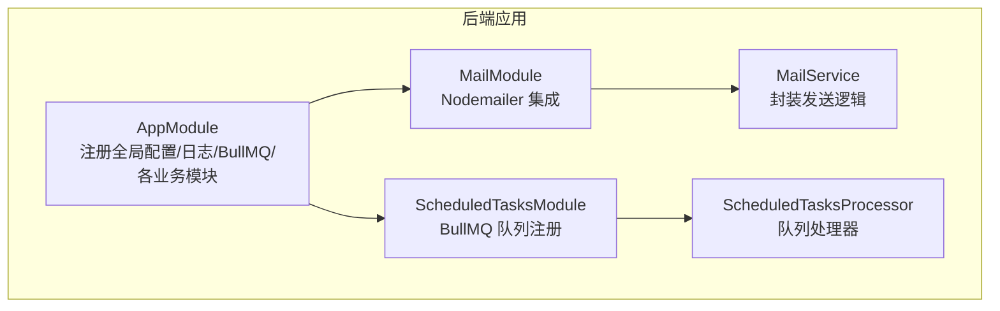
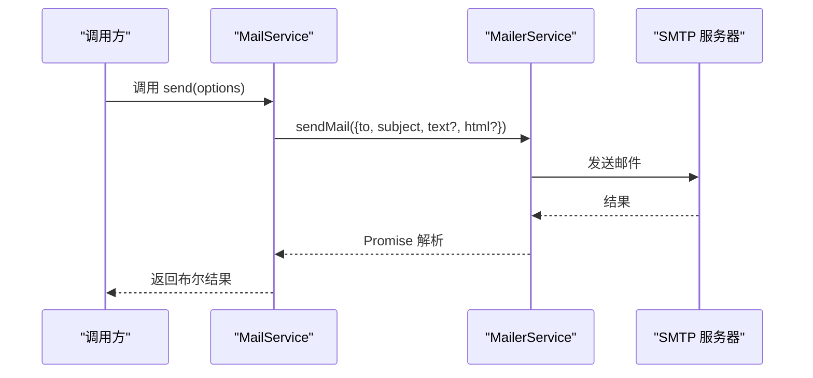
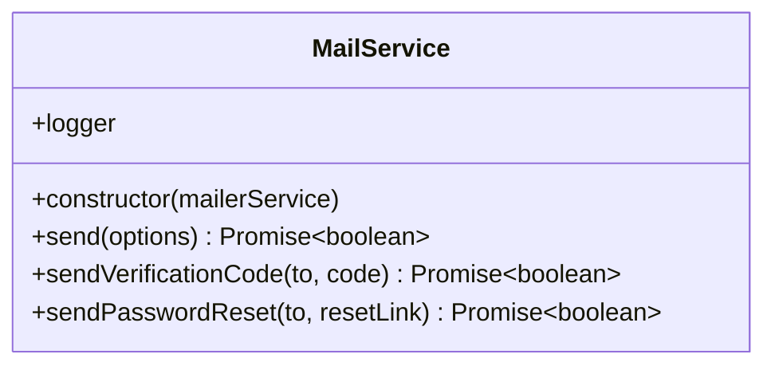
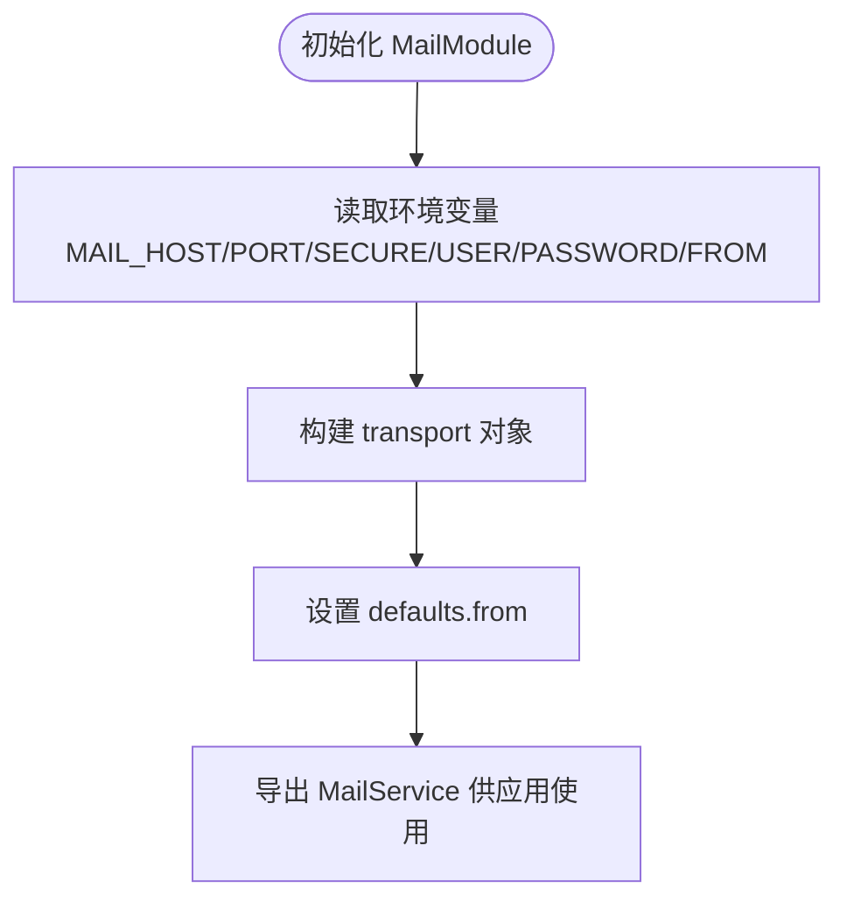
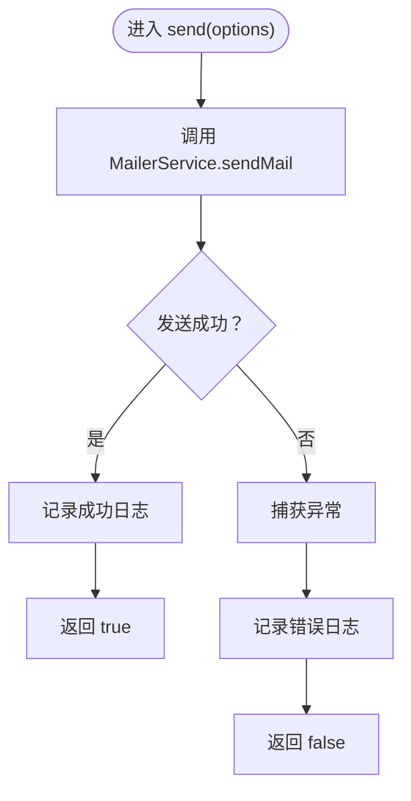
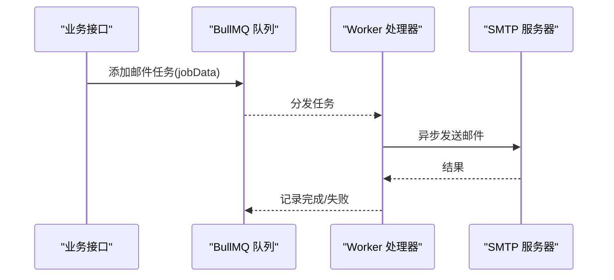
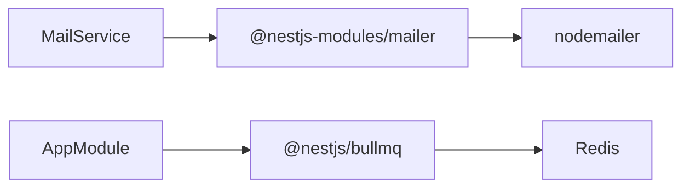

# 邮件服务

<cite>
**本文引用的文件**
- [apps/backend/src/mail/mail.service.ts](file://apps/backend/src/mail/mail.service.ts)
- [apps/backend/src/mail/mail.module.ts](file://apps/backend/src/mail/mail.module.ts)
- [apps/backend/src/app.module.ts](file://apps/backend/src/app.module.ts)
- [.env.example](file://.env.example)
- [pnpm-lock.yaml](file://pnpm-lock.yaml)
- [apps/backend/src/scheduled-tasks/scheduled-tasks.module.ts](file://apps/backend/src/scheduled-tasks/scheduled-tasks.module.ts)
- [apps/backend/src/scheduled-tasks/scheduled-tasks.processor.ts](file://apps/backend/src/scheduled-tasks/scheduled-tasks.processor.ts)
</cite>

## 目录
1. [简介](#简介)
2. [项目结构](#项目结构)
3. [核心组件](#核心组件)
4. [架构总览](#架构总览)
5. [详细组件分析](#详细组件分析)
6. [依赖关系分析](#依赖关系分析)
7. [性能考量](#性能考量)
8. [故障排查指南](#故障排查指南)
9. [结论](#结论)
10. [附录](#附录)

## 简介
本文件面向后端开发者，系统性说明基于 Nodemailer 的邮件发送机制在本项目的实现与扩展。重点覆盖：
- MailService 的 sendMail 方法参数结构与调用流程
- MailModule 的配置方式（SMTP 参数注入、发件人默认值）
- 文本邮件、HTML 邮件与附件发送的实践路径
- 队列化处理与与 BullMQ 的集成思路
- 错误处理、重试机制与发送状态跟踪
- 常见问题：被标记为垃圾邮件、发送延迟、模板国际化等

## 项目结构
邮件相关能力位于 backend 应用的 mail 子模块，并通过全局配置模块加载环境变量，同时在根模块中引入 BullMQ 作为后台任务基础设施。

图表来源
- [apps/backend/src/app.module.ts](file://apps/backend/src/app.module.ts#L1-L159)
- [apps/backend/src/mail/mail.module.ts](file://apps/backend/src/mail/mail.module.ts#L1-L33)
- [apps/backend/src/mail/mail.service.ts](file://apps/backend/src/mail/mail.service.ts#L1-L82)
- [apps/backend/src/scheduled-tasks/scheduled-tasks.module.ts](file://apps/backend/src/scheduled-tasks/scheduled-tasks.module.ts#L1-L77)
- [apps/backend/src/scheduled-tasks/scheduled-tasks.processor.ts](file://apps/backend/src/scheduled-tasks/scheduled-tasks.processor.ts#L1-L44)

章节来源
- [apps/backend/src/app.module.ts](file://apps/backend/src/app.module.ts#L1-L159)
- [apps/backend/src/mail/mail.module.ts](file://apps/backend/src/mail/mail.module.ts#L1-L33)
- [apps/backend/src/mail/mail.service.ts](file://apps/backend/src/mail/mail.service.ts#L1-L82)

## 核心组件
- MailService：封装邮件发送逻辑，提供通用 send 方法与常用场景快捷方法（验证码、密码重置）。
- MailModule：通过 @nestjs-modules/mailer 注入 SMTP 连接参数与默认发件人，向应用提供 MailerService。
- BullMQ：在根模块中统一配置连接与默认重试策略，为后续邮件队列化提供基础设施。

章节来源
- [apps/backend/src/mail/mail.service.ts](file://apps/backend/src/mail/mail.service.ts#L1-L82)
- [apps/backend/src/mail/mail.module.ts](file://apps/backend/src/mail/mail.module.ts#L1-L33)
- [apps/backend/src/app.module.ts](file://apps/backend/src/app.module.ts#L92-L111)

## 架构总览
下图展示从调用方到邮件发送的整体链路，以及可选的队列化路径。

图表来源
- [apps/backend/src/mail/mail.service.ts](file://apps/backend/src/mail/mail.service.ts#L24-L39)
- [apps/backend/src/mail/mail.module.ts](file://apps/backend/src/mail/mail.module.ts#L12-L28)

## 详细组件分析

### MailService 组件分析
- 参数结构：SendMailOptions 包含收件人、主题，以及可选的纯文本与 HTML 内容字段。
- 发送流程：内部委托 MailerService.sendMail，捕获异常并记录日志，返回布尔结果表示是否成功。
- 场景方法：提供验证码与密码重置两类常用 HTML 邮件的封装，便于复用。

图表来源
- [apps/backend/src/mail/mail.service.ts](file://apps/backend/src/mail/mail.service.ts#L1-L82)

章节来源
- [apps/backend/src/mail/mail.service.ts](file://apps/backend/src/mail/mail.service.ts#L4-L81)

### MailModule 组件分析
- 配置注入：通过 ConfigService 读取 MAIL_HOST、MAIL_PORT、MAIL_SECURE、MAIL_USER、MAIL_PASSWORD、MAIL_FROM 等环境变量。
- 默认发件人：将 defaults.from 设置为 MAIL_FROM，避免每次调用都重复传入。
- 传输层：使用 @nestjs-modules/mailer 的 transport 配置对接 SMTP。

图表来源
- [apps/backend/src/mail/mail.module.ts](file://apps/backend/src/mail/mail.module.ts#L12-L28)
- [.env.example](file://.env.example#L35-L42)

章节来源
- [apps/backend/src/mail/mail.module.ts](file://apps/backend/src/mail/mail.module.ts#L1-L33)
- [.env.example](file://.env.example#L35-L42)

### 发送流程与错误处理
- 成功路径：sendMail 返回后记录成功日志并返回 true。
- 失败路径：捕获异常，记录错误日志并返回 false。
- 建议：上层调用方应依据返回值进行业务分支处理；必要时结合队列化与重试策略提升可靠性。

图表来源
- [apps/backend/src/mail/mail.service.ts](file://apps/backend/src/mail/mail.service.ts#L24-L39)

章节来源
- [apps/backend/src/mail/mail.service.ts](file://apps/backend/src/mail/mail.service.ts#L24-L39)

### 队列化处理与 BullMQ 集成
- BullMQ 已在根模块中配置连接与默认重试策略（默认移除完成任务、保留失败任务、指数退避重试）。
- 可参考现有 ScheduledTasksModule 的方式，注册自定义队列并在处理器中消费任务，从而将邮件发送放入后台队列执行，提升接口响应性能。

图表来源
- [apps/backend/src/app.module.ts](file://apps/backend/src/app.module.ts#L92-L111)
- [apps/backend/src/scheduled-tasks/scheduled-tasks.module.ts](file://apps/backend/src/scheduled-tasks/scheduled-tasks.module.ts#L1-L77)
- [apps/backend/src/scheduled-tasks/scheduled-tasks.processor.ts](file://apps/backend/src/scheduled-tasks/scheduled-tasks.processor.ts#L1-L44)

章节来源
- [apps/backend/src/app.module.ts](file://apps/backend/src/app.module.ts#L92-L111)
- [apps/backend/src/scheduled-tasks/scheduled-tasks.module.ts](file://apps/backend/src/scheduled-tasks/scheduled-tasks.module.ts#L1-L77)
- [apps/backend/src/scheduled-tasks/scheduled-tasks.processor.ts](file://apps/backend/src/scheduled-tasks/scheduled-tasks.processor.ts#L1-L44)

## 依赖关系分析
- 邮件发送依赖 Nodemailer（通过 @nestjs-modules/mailer）。仓库锁文件显示存在 nodemailer 版本条目，表明依赖已纳入。
- BullMQ 作为后台任务基础设施，与邮件队列化紧密相关。

图表来源
- [apps/backend/src/mail/mail.service.ts](file://apps/backend/src/mail/mail.service.ts#L1-L20)
- [apps/backend/src/mail/mail.module.ts](file://apps/backend/src/mail/mail.module.ts#L1-L33)
- [apps/backend/src/app.module.ts](file://apps/backend/src/app.module.ts#L92-L111)
- [pnpm-lock.yaml](file://pnpm-lock.yaml#L5710-L5716)

章节来源
- [apps/backend/src/mail/mail.service.ts](file://apps/backend/src/mail/mail.service.ts#L1-L20)
- [apps/backend/src/mail/mail.module.ts](file://apps/backend/src/mail/mail.module.ts#L1-L33)
- [apps/backend/src/app.module.ts](file://apps/backend/src/app.module.ts#L92-L111)
- [pnpm-lock.yaml](file://pnpm-lock.yaml#L5710-L5716)

## 性能考量
- 同步发送阻塞请求线程：建议将邮件发送放入队列异步执行，避免影响接口响应时间。
- BullMQ 默认重试策略：已在根模块配置，可按需调整 attempts 与 backoff 策略。
- 并发与限流：结合应用的速率限制模块，控制邮件发送频率，避免触发上游限流。

章节来源
- [apps/backend/src/app.module.ts](file://apps/backend/src/app.module.ts#L113-L134)
- [apps/backend/src/scheduled-tasks/scheduled-tasks.module.ts](file://apps/backend/src/scheduled-tasks/scheduled-tasks.module.ts#L1-L77)

## 故障排查指南
- 邮件发送失败
  - 检查 MailService 的返回值与日志输出，定位异常原因。
  - 确认 SMTP 参数（主机、端口、安全模式、认证信息）正确。
- 垃圾邮件
  - 确保发件域名与 SPF/DKIM/DMARC 正确配置。
  - 邮件内容避免触发关键词与过度使用大写/表情符号。
  - 使用简洁明确的主题行与清晰的退订链接。
- 发送延迟
  - 使用队列异步发送，减少请求阻塞。
  - 优化网络与 SMTP 服务商质量。
- 模板国际化
  - 当前 MailService 未内置模板引擎；可在业务层自行组织多语言模板，或引入模板引擎（如 ejs/mjml 等）后在队列处理器中渲染。
  - 前端侧具备 i18n 能力，可作为用户语言偏好来源，但邮件模板渲染建议在后端完成。

章节来源
- [apps/backend/src/mail/mail.service.ts](file://apps/backend/src/mail/mail.service.ts#L24-L39)
- [apps/backend/src/mail/mail.module.ts](file://apps/backend/src/mail/mail.module.ts#L12-L28)
- [.env.example](file://.env.example#L35-L42)

## 结论
本项目已完整接入 Nodemailer 并通过 MailModule 提供了 SMTP 配置与默认发件人设置。MailService 封装了发送流程与常用场景方法，便于在业务中直接使用。为进一步提升性能与可靠性，建议将邮件发送迁移至 BullMQ 队列异步执行，并结合默认重试策略与日志监控完善错误处理与状态跟踪。

## 附录

### 配置项一览（来自环境变量）
- MAIL_HOST：SMTP 主机
- MAIL_PORT：SMTP 端口
- MAIL_SECURE：是否启用 TLS（true/false）
- MAIL_USER：SMTP 用户名
- MAIL_PASSWORD：SMTP 密码
- MAIL_FROM：默认发件人地址

章节来源
- [.env.example](file://.env.example#L35-L42)
- [apps/backend/src/mail/mail.module.ts](file://apps/backend/src/mail/mail.module.ts#L15-L26)

### 代码示例路径（不直接展示代码）
- 文本邮件发送
  - 调用路径：[apps/backend/src/mail/mail.service.ts](file://apps/backend/src/mail/mail.service.ts#L24-L39)
- HTML 邮件发送
  - 调用路径：[apps/backend/src/mail/mail.service.ts](file://apps/backend/src/mail/mail.service.ts#L44-L59)
  - 快捷方法：[apps/backend/src/mail/mail.service.ts](file://apps/backend/src/mail/mail.service.ts#L64-L80)
- 附件发送（实践路径）
  - 由于当前 MailService 未包含附件字段，若需发送附件，可在调用 sendMail 时传入附件数组（参考 @nestjs-modules/mailer 的 sendMail 支持），或在业务层扩展 MailService 的参数结构后再调用。
  - 参考调用位置：[apps/backend/src/mail/mail.service.ts](file://apps/backend/src/mail/mail.service.ts#L24-L39)

### 队列化与重试（实践路径）
- 注册队列与任务
  - 参考：[apps/backend/src/scheduled-tasks/scheduled-tasks.module.ts](file://apps/backend/src/scheduled-tasks/scheduled-tasks.module.ts#L1-L77)
- 处理器实现
  - 参考：[apps/backend/src/scheduled-tasks/scheduled-tasks.processor.ts](file://apps/backend/src/scheduled-tasks/scheduled-tasks.processor.ts#L1-L44)
- 全局默认重试策略
  - 参考：[apps/backend/src/app.module.ts](file://apps/backend/src/app.module.ts#L92-L111)