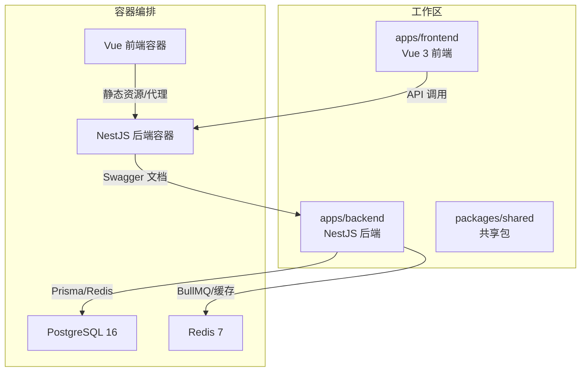
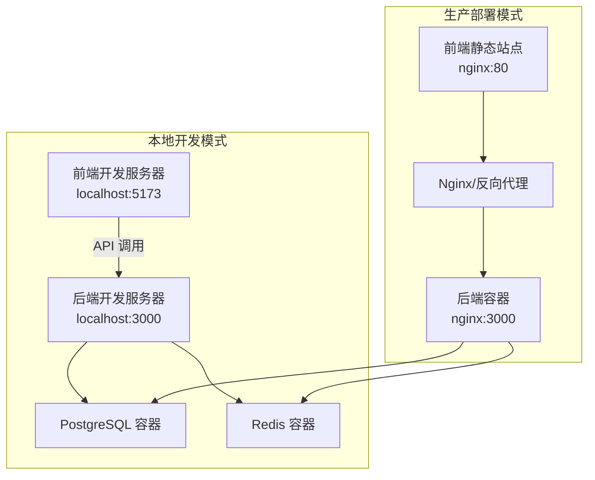
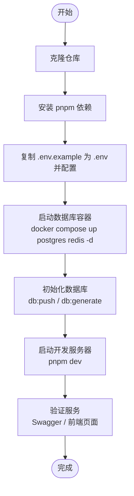
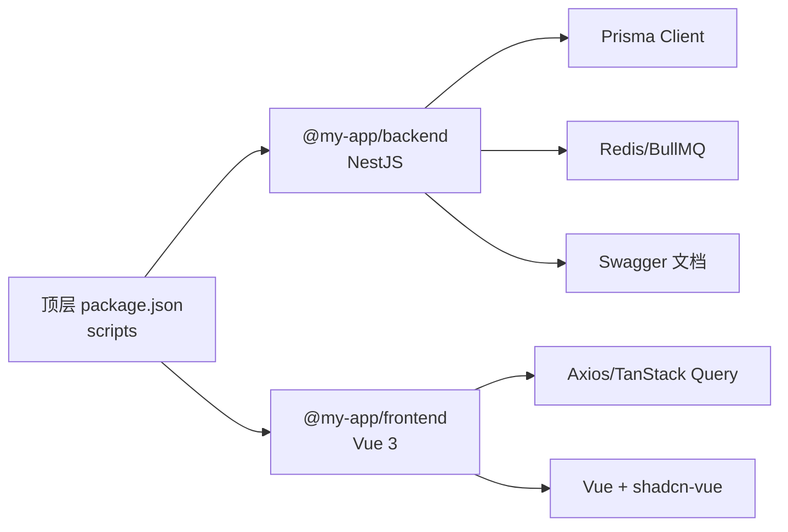

# 快速开始

<cite>
**本文引用的文件**
- [README.md](file://README.md)
- [.env.example](file://.env.example)
- [docker-compose.yml](file://docker-compose.yml)
- [package.json](file://package.json)
- [apps/backend/package.json](file://apps/backend/package.json)
- [apps/frontend/package.json](file://apps/frontend/package.json)
- [apps/backend/src/main.ts](file://apps/backend/src/main.ts)
- [apps/backend/src/app.module.ts](file://apps/backend/src/app.module.ts)
- [apps/backend/src/prisma/prisma.service.ts](file://apps/backend/src/prisma/prisma.service.ts)
- [apps/backend/src/redis/redis.module.ts](file://apps/backend/src/redis/redis.module.ts)
</cite>

## 目录
1. [简介](#简介)
2. [项目结构](#项目结构)
3. [核心组件](#核心组件)
4. [架构总览](#架构总览)
5. [详细组件分析](#详细组件分析)
6. [依赖关系分析](#依赖关系分析)
7. [性能注意事项](#性能注意事项)
8. [故障排除指南](#故障排除指南)
9. [结论](#结论)
10. [附录](#附录)

## 简介
本指南面向首次接触本项目的开发者，帮助你从零开始完成克隆、安装依赖、配置环境变量、启动数据库容器、初始化数据库、启动开发或生产服务，并验证服务是否成功运行。同时提供常见初始化问题的排查建议，确保你能一次性成功运行项目。

## 项目结构
本项目采用 pnpm monorepo 架构，包含后端（NestJS）、前端（Vue 3）、共享包（DTO、Schema、工具函数），并通过 Docker Compose 编排 PostgreSQL、Redis、后端与前端服务。

图表来源
- [docker-compose.yml](file://docker-compose.yml#L1-L108)
- [apps/backend/src/app.module.ts](file://apps/backend/src/app.module.ts#L1-L159)
- [apps/backend/src/redis/redis.module.ts](file://apps/backend/src/redis/redis.module.ts#L1-L84)
- [apps/backend/src/prisma/prisma.service.ts](file://apps/backend/src/prisma/prisma.service.ts#L1-L20)

章节来源
- [README.md](file://README.md#L1-L120)
- [docker-compose.yml](file://docker-compose.yml#L1-L108)

## 核心组件
- 后端（NestJS）
  - 使用 Prisma 连接 PostgreSQL，使用 Redis 实现缓存与队列（BullMQ）。
  - 提供 Swagger 文档（/api/docs），默认端口 3000。
- 前端（Vue 3）
  - 使用 Vite 构建，提供开发服务器（默认端口 5173）。
- 数据库与缓存
  - PostgreSQL 与 Redis 通过 Docker Compose 提供，支持健康检查与持久化卷。
- 环境变量
  - 关键变量包括 DATABASE_URL、REDIS_*、JWT_*、CORS_ORIGIN 等，需在本地复制 .env.example 并按需配置。

章节来源
- [apps/backend/src/main.ts](file://apps/backend/src/main.ts#L1-L94)
- [apps/backend/src/app.module.ts](file://apps/backend/src/app.module.ts#L1-L159)
- [apps/backend/src/prisma/prisma.service.ts](file://apps/backend/src/prisma/prisma.service.ts#L1-L20)
- [apps/backend/src/redis/redis.module.ts](file://apps/backend/src/redis/redis.module.ts#L1-L84)
- [.env.example](file://.env.example#L1-L53)

## 架构总览
下图展示了本地开发与生产部署两种模式下的服务交互关系。

图表来源
- [docker-compose.yml](file://docker-compose.yml#L1-L108)
- [apps/backend/src/main.ts](file://apps/backend/src/main.ts#L1-L94)

## 详细组件分析

### 本地开发启动流程（推荐）
- 步骤 1：克隆仓库并进入项目目录
- 步骤 2：安装 pnpm 依赖（monorepo 工作区）
- 步骤 3：复制并编辑 .env（配置数据库、Redis、JWT、CORS 等）
- 步骤 4：启动数据库容器（PostgreSQL、Redis）
- 步骤 5：初始化数据库（推送 Schema、生成 Prisma 客户端）
- 步骤 6：启动开发服务器（同时启动前后端或分别启动）

图表来源
- [README.md](file://README.md#L78-L120)
- [package.json](file://package.json#L1-L30)
- [apps/backend/package.json](file://apps/backend/package.json#L1-L30)
- [apps/frontend/package.json](file://apps/frontend/package.json#L1-L30)
- [docker-compose.yml](file://docker-compose.yml#L1-L108)

章节来源
- [README.md](file://README.md#L78-L120)
- [package.json](file://package.json#L1-L30)

### 开发模式与生产模式的区别
- 开发模式
  - 使用 pnpm dev 同时启动前后端；后端默认端口 3000，前端默认端口 5173。
  - Swagger 文档路径：/api/docs。
- 生产模式
  - 使用 Docker Compose 启动，前端以 Nginx 提供静态资源，后端通过 Nginx 反向代理。
  - Swagger 文档路径：/api/docs（同开发）。
  - 健康检查与端口映射在 docker-compose.yml 中定义。

章节来源
- [apps/backend/src/main.ts](file://apps/backend/src/main.ts#L1-L94)
- [docker-compose.yml](file://docker-compose.yml#L1-L108)
- [README.md](file://README.md#L363-L370)

### 验证服务是否成功启动
- 后端 Swagger 文档
  - 本地访问：http://localhost:3000/api/docs
  - 生产环境：http://your-domain/api/docs
- 前端页面
  - 本地访问：http://localhost:5173（开发模式）或 http://localhost（生产模式）
- Docker 健康检查
  - 使用 docker compose ps 查看服务状态
  - 使用 docker compose logs -f 查看实时日志

章节来源
- [README.md](file://README.md#L363-L370)
- [docker-compose.yml](file://docker-compose.yml#L60-L98)

### 数据库与缓存配置要点
- 数据库连接
  - 后端通过 Prisma 读取 DATABASE_URL 环境变量进行连接。
- Redis 连接
  - 后端通过 ConfigModule 读取 REDIS_HOST、REDIS_PORT、REDIS_PASSWORD、REDIS_DB、REDIS_KEY_PREFIX、REDIS_DEFAULT_TTL 等配置。
- CORS 与安全
  - CORS 来源可通过 CORS_ORIGIN 配置，后端启用 Helmet、压缩、CSRF 中间件与全局过滤器。

章节来源
- [apps/backend/src/prisma/prisma.service.ts](file://apps/backend/src/prisma/prisma.service.ts#L1-L20)
- [apps/backend/src/redis/redis.module.ts](file://apps/backend/src/redis/redis.module.ts#L1-L84)
- [apps/backend/src/app.module.ts](file://apps/backend/src/app.module.ts#L1-L159)
- [.env.example](file://.env.example#L1-L53)

## 依赖关系分析
- 工作区脚本
  - 顶层 package.json 提供统一的开发、构建、测试、数据库相关脚本，内部委托给各子包。
- 子包脚本
  - 后端 package.json 提供 NestJS 开发、构建、Prisma 相关脚本。
  - 前端 package.json 提供 Vite 开发、构建、跨端与 PWA 相关脚本。
- Docker 编排
  - docker-compose.yml 定义了 PostgreSQL、Redis、后端、前端四类服务，含健康检查与网络/卷配置。

图表来源
- [package.json](file://package.json#L1-L30)
- [apps/backend/package.json](file://apps/backend/package.json#L1-L30)
- [apps/frontend/package.json](file://apps/frontend/package.json#L1-L30)

章节来源
- [package.json](file://package.json#L1-L30)
- [apps/backend/package.json](file://apps/backend/package.json#L1-L30)
- [apps/frontend/package.json](file://apps/frontend/package.json#L1-L30)

## 性能注意事项
- 响应压缩
  - 后端启用 gzip 压缩，对大于阈值的响应生效，避免对 SSE/WebSocket 压缩。
- 日志级别
  - 开发环境使用 pino-pretty 输出，生产环境使用 JSON 日志，便于日志收集与分析。
- Redis 连接重试
  - Redis 连接具备重试策略与最大重试次数，避免瞬时故障导致服务不可用。
- 健康检查
  - Docker Compose 为后端与前端配置健康检查，确保服务可用性。

章节来源
- [apps/backend/src/main.ts](file://apps/backend/src/main.ts#L1-L94)
- [apps/backend/src/redis/redis.module.ts](file://apps/backend/src/redis/redis.module.ts#L1-L84)
- [docker-compose.yml](file://docker-compose.yml#L60-L98)

## 故障排除指南
- 数据库连接失败
  - 检查 .env 中 DATABASE_URL 是否正确指向 PostgreSQL 容器或外部实例。
  - 确认数据库容器已启动且健康（docker compose ps）。
  - 若使用外部数据库，确保网络可达与防火墙放行。
- Redis 连接失败
  - 检查 REDIS_HOST、REDIS_PORT、REDIS_PASSWORD 等配置是否正确。
  - 确认 Redis 容器已启动且健康（docker compose ps）。
  - 观察后端日志中的 Redis 连接重试信息。
- Swagger 文档无法访问
  - 确认后端已启动并监听端口（默认 3000）。
  - 检查 CORS_ORIGIN 是否允许当前前端来源。
- 前端页面空白或 404
  - 开发模式下访问 http://localhost:5173；生产模式下访问 http://localhost。
  - 确认后端容器健康，Nginx 反向代理正常。
- 环境变量未配置
  - 复制 .env.example 为 .env，并按需填写 DATABASE_URL、REDIS_*、JWT_SECRET、CORS_ORIGIN 等。
- 数据库初始化失败
  - 确保数据库容器先于后端启动（depends_on 与健康检查已配置）。
  - 先执行 db:push，再执行 db:generate；如需迁移，使用 db:migrate。

章节来源
- [README.md](file://README.md#L381-L427)
- [.env.example](file://.env.example#L1-L53)
- [apps/backend/src/prisma/prisma.service.ts](file://apps/backend/src/prisma/prisma.service.ts#L1-L20)
- [apps/backend/src/redis/redis.module.ts](file://apps/backend/src/redis/redis.module.ts#L1-L84)
- [docker-compose.yml](file://docker-compose.yml#L1-L108)

## 结论
按照本指南的步骤，你可以快速完成从零到一的本地开发与生产部署准备。重点在于正确配置环境变量、启动数据库与缓存容器、初始化数据库、以及验证 Swagger 与前端页面。遇到问题时，结合健康检查与日志定位，通常可以快速解决。

## 附录

### 常用命令速查
- 安装依赖：pnpm install
- 启动数据库容器：docker compose up postgres redis -d
- 初始化数据库：pnpm db:push；pnpm db:generate
- 启动开发服务器：pnpm dev
- 常用脚本：查看顶层 package.json 的 scripts 字段
- Docker 相关：docker compose up -d、ps、logs -f、down、build

章节来源
- [README.md](file://README.md#L103-L149)
- [package.json](file://package.json#L1-L30)
- [docker-compose.yml](file://docker-compose.yml#L1-L108)