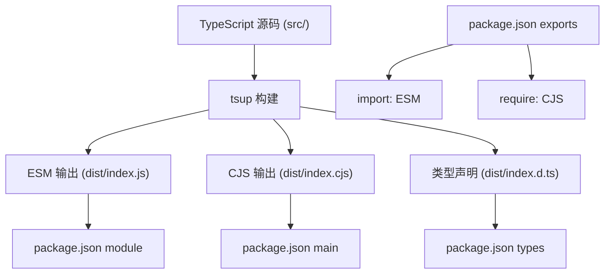
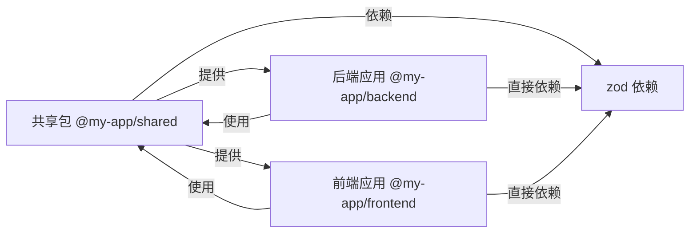
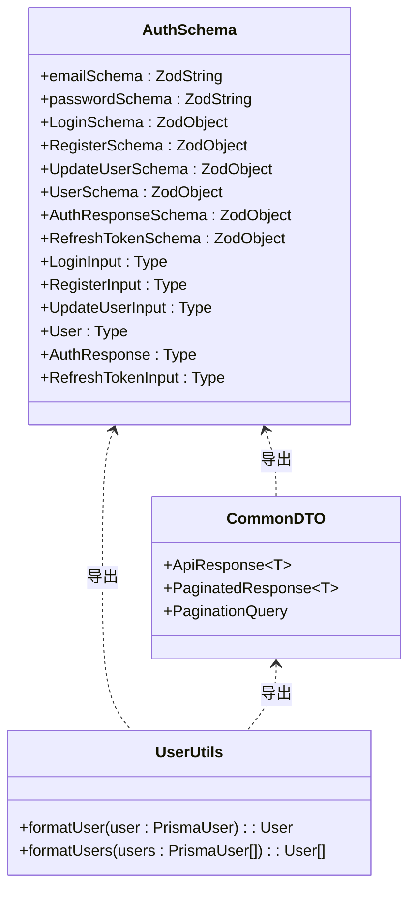
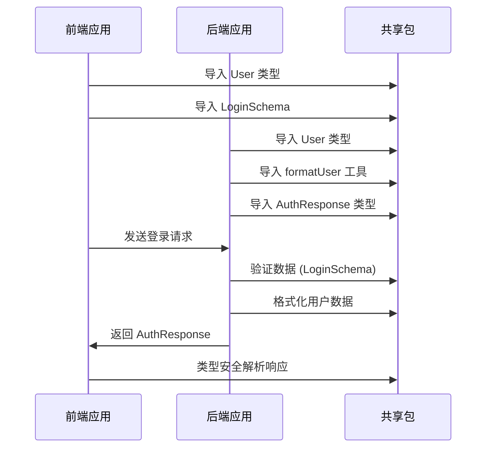
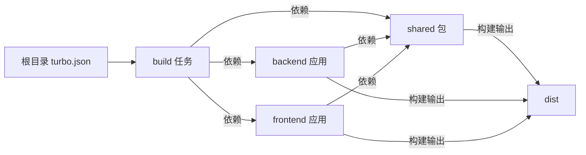

# 共享包构建配置与模块兼容性

<cite>
**本文档引用的文件**
- [package.json](file://packages/shared/package.json)
- [tsup.config.ts](file://packages/shared/tsup.config.ts)
- [tsconfig.json](file://packages/shared/tsconfig.json)
- [index.ts](file://packages/shared/src/index.ts)
- [auth.schema.ts](file://packages/shared/src/schemas/auth.schema.ts)
- [common.dto.ts](file://packages/shared/src/dto/common.dto.ts)
- [user.utils.ts](file://packages/shared/src/utils/user.utils.ts)
- [tsconfig.base.json](file://tsconfig.base.json)
- [turbo.json](file://turbo.json)
- [backend/package.json](file://apps/backend/package.json)
- [frontend/package.json](file://apps/frontend/package.json)
- [auth.service.ts](file://apps/backend/src/auth/auth.service.ts)
- [users.ts](file://apps/frontend/src/stores/users.ts)
</cite>

## 目录
1. [简介](#简介)
2. [共享包构建配置](#共享包构建配置)
3. [模块兼容性分析](#模块兼容性分析)
4. [共享包内容结构](#共享包内容结构)
5. [跨平台使用示例](#跨平台使用示例)
6. [构建系统集成](#构建系统集成)
7. [最佳实践建议](#最佳实践建议)

## 简介
本项目采用 monorepo 架构，通过 `pnpm` 工作区管理多个子项目。其中，`packages/shared` 包作为核心共享模块，为前后端应用提供统一的数据结构、验证规则和工具函数。该共享包的设计确保了类型安全、减少重复代码，并通过合理的构建配置实现跨平台兼容性。

## 共享包构建配置

**Diagram sources**
- [tsup.config.ts](file://packages/shared/tsup.config.ts#L1-L11)
- [package.json](file://packages/shared/package.json#L1-L36)
- [tsconfig.json](file://packages/shared/tsconfig.json#L1-L12)

**Section sources**
- [tsup.config.ts](file://packages/shared/tsup.config.ts#L1-L11)
- [package.json](file://packages/shared/package.json#L1-L36)

### 构建工具配置
共享包使用 `tsup` 作为构建工具，配置支持同时生成 ESM 和 CJS 两种模块格式：

- **入口文件**: `src/index.ts`
- **输出格式**: `cjs` (CommonJS) 和 `esm` (ES Module)
- **类型声明**: 自动生成 `.d.ts` 文件
- **清理**: 构建前自动清理 `dist` 目录
- **Source Map**: 启用源码映射

### 包配置
`package.json` 中的配置确保了模块的正确解析和类型支持：

- **type**: `module` 表示使用 ES 模块
- **exports**: 精确控制导入路径，区分 `import` 和 `require` 场景
- **main/module/types**: 分别指向 CJS、ESM 和类型文件
- **files**: 仅包含 `dist` 目录，避免发布不必要的文件

## 模块兼容性分析

**Diagram sources**
- [package.json](file://packages/shared/package.json#L1-L36)
- [backend/package.json](file://apps/backend/package.json#L1-L87)
- [frontend/package.json](file://apps/frontend/package.json#L1-L81)

**Section sources**
- [package.json](file://packages/shared/package.json#L1-L36)
- [backend/package.json](file://apps/backend/package.json#L1-L87)
- [frontend/package.json](file://apps/frontend/package.json#L1-L81)

### 兼容性策略
共享包通过以下方式确保与不同环境的兼容性：

1. **双重模块格式**: 同时提供 ESM 和 CJS 格式，适应 Node.js 和浏览器环境
2. **精确的 exports 配置**: 避免模块解析冲突，确保类型和运行时的一致性
3. **工作区协议**: 使用 `workspace:*` 依赖版本，确保本地开发时的即时同步
4. **类型共用**: 前后端使用相同的 TypeScript 类型定义，保证类型安全

## 共享包内容结构

**Diagram sources**
- [auth.schema.ts](file://packages/shared/src/schemas/auth.schema.ts#L1-L94)
- [common.dto.ts](file://packages/shared/src/dto/common.dto.ts#L1-L40)
- [user.utils.ts](file://packages/shared/src/utils/user.utils.ts#L1-L36)
- [index.ts](file://packages/shared/src/index.ts#L1-L9)

**Section sources**
- [auth.schema.ts](file://packages/shared/src/schemas/auth.schema.ts#L1-L94)
- [common.dto.ts](file://packages/shared/src/dto/common.dto.ts#L1-L40)
- [user.utils.ts](file://packages/shared/src/utils/user.utils.ts#L1-L36)

### 核心组件
共享包包含三个主要模块：

- **验证 Schema**: 基于 `zod` 的表单和 API 数据验证规则
- **通用 DTO**: 标准化的 API 响应格式和分页结构
- **工具函数**: 数据格式化等实用工具

## 跨平台使用示例

**Diagram sources**
- [auth.service.ts](file://apps/backend/src/auth/auth.service.ts#L1-L150)
- [users.ts](file://apps/frontend/src/stores/users.ts#L1-L42)

**Section sources**
- [auth.service.ts](file://apps/backend/src/auth/auth.service.ts#L1-L150)
- [users.ts](file://apps/frontend/src/stores/users.ts#L1-L42)

### 后端使用示例
在后端服务中，共享包被用于：

- 类型定义：`LoginInput`, `User`, `AuthResponse`
- 工具函数：`formatUser` 用于将 Prisma 查询结果转换为标准格式
- 数据验证：与 `nestjs-zod` 结合使用 Schema 进行请求验证

### 前端使用示例
在前端应用中，共享包被用于：

- 状态管理：Pinia store 中使用 `User` 类型定义状态
- API 交互：确保 API 响应数据的类型安全
- 表单验证：结合 `vee-validate` 和 `zod` 进行客户端验证

## 构建系统集成

**Diagram sources**
- [turbo.json](file://turbo.json#L1-L24)
- [backend/package.json](file://apps/backend/package.json#L1-L87)
- [frontend/package.json](file://apps/frontend/package.json#L1-L81)

**Section sources**
- [turbo.json](file://turbo.json#L1-L24)
- [pnpm-workspace.yaml](file://pnpm-workspace.yaml#L1-L3)

### 构建流程
项目使用 `turbo` 作为构建系统，实现高效的增量构建：

- **任务依赖**: `build` 任务依赖于所有前置构建
- **缓存机制**: 利用缓存加速重复构建
- **工作区管理**: `pnpm-workspace.yaml` 定义了 `apps/*` 和 `packages/*` 作为工作区包
- **依赖解析**: 通过 `workspace:*` 协议实现本地包的即时链接

## 最佳实践建议
1. **类型优先**: 始终使用共享包中的类型定义，避免重复声明
2. **验证统一**: 前后端使用相同的验证规则，确保数据一致性
3. **构建优化**: 利用 `tsup` 的高效构建特性，减少构建时间
4. **版本管理**: 在共享包版本稳定前，使用 `workspace:*` 进行开发
5. **文档同步**: 更新共享包时，同步更新相关文档和使用示例