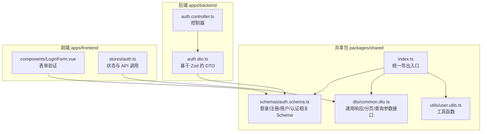
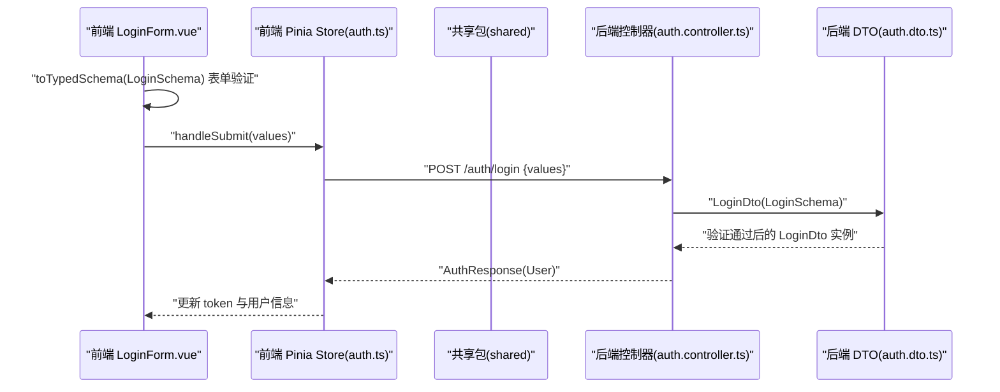
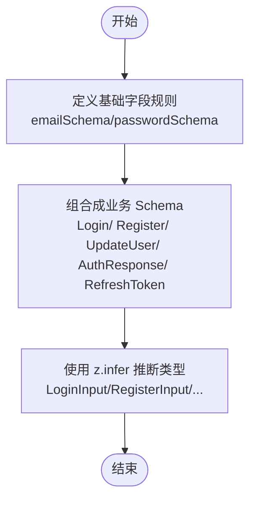
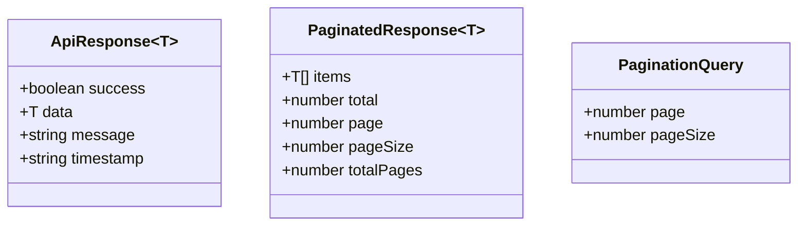
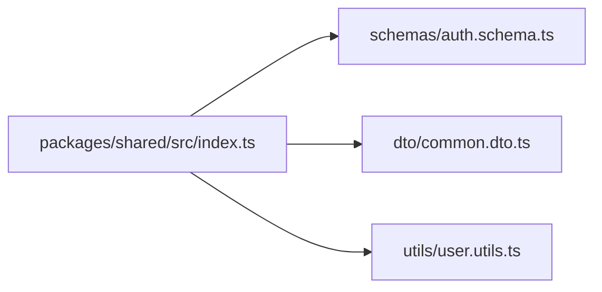
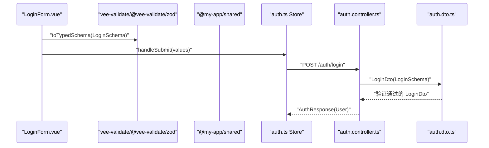
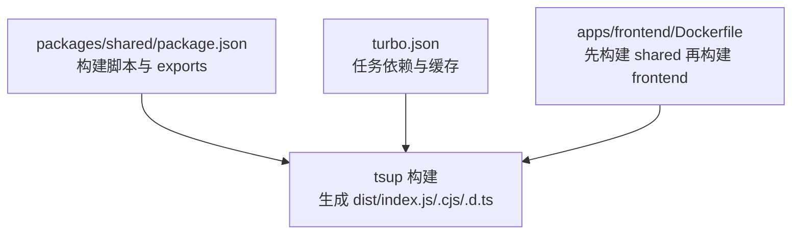
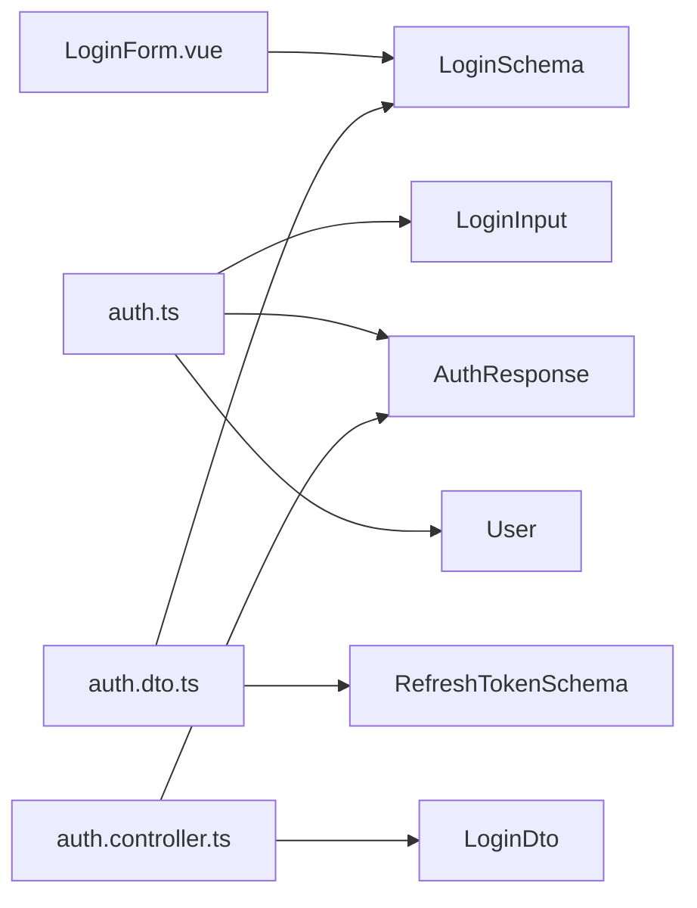

# 共享包设计

<cite>
**本文引用的文件**
- [packages/shared/src/schemas/auth.schema.ts](file://packages/shared/src/schemas/auth.schema.ts)
- [packages/shared/src/dto/common.dto.ts](file://packages/shared/src/dto/common.dto.ts)
- [packages/shared/src/index.ts](file://packages/shared/src/index.ts)
- [packages/shared/package.json](file://packages/shared/package.json)
- [apps/backend/src/auth/auth.dto.ts](file://apps/backend/src/auth/auth.dto.ts)
- [apps/backend/src/auth/auth.controller.ts](file://apps/backend/src/auth/auth.controller.ts)
- [apps/frontend/src/components/LoginForm.vue](file://apps/frontend/src/components/LoginForm.vue)
- [apps/frontend/src/stores/auth.ts](file://apps/frontend/src/stores/auth.ts)
- [README.md](file://README.md)
- [turbo.json](file://turbo.json)
- [package.json](file://package.json)
- [apps/frontend/Dockerfile](file://apps/frontend/Dockerfile)
</cite>

## 目录
1. [引言](#引言)
2. [项目结构](#项目结构)
3. [核心组件](#核心组件)
4. [架构总览](#架构总览)
5. [详细组件分析](#详细组件分析)
6. [依赖关系分析](#依赖关系分析)
7. [性能考量](#性能考量)
8. [故障排查指南](#故障排查指南)
9. [结论](#结论)
10. [附录](#附录)

## 引言
本设计文档聚焦于 packages/shared 作为“单一可信源”（Single Source of Truth, SSOT）在本 Monorepo 中的核心作用，系统阐述如何通过 Zod Schema 在前后端之间共享验证规则与类型定义，如何在后端使用 nestjs-zod 将 Schema 转换为 DTO 并自动生成 Swagger 文档，以及在前端使用 vee-validate + @vee-validate/zod 复用同一套 Schema 进行表单验证。同时，文档还覆盖共享包的导出机制、版本管理策略与在 Monorepo 中的构建优化实践。

## 项目结构
共享包位于 packages/shared，采用按功能域分层组织：
- schemas：存放 Zod Schema 与类型推断，形成前后端共用的验证规则与类型定义
- dto：存放通用数据传输对象接口，如通用响应、分页等
- utils：存放工具函数
- index.ts：集中导出，提供统一入口，便于 backend 与 frontend 统一导入

图表来源
- [packages/shared/src/index.ts](file://packages/shared/src/index.ts#L1-L9)
- [packages/shared/src/schemas/auth.schema.ts](file://packages/shared/src/schemas/auth.schema.ts#L1-L94)
- [packages/shared/src/dto/common.dto.ts](file://packages/shared/src/dto/common.dto.ts#L1-L40)
- [apps/backend/src/auth/auth.dto.ts](file://apps/backend/src/auth/auth.dto.ts#L1-L19)
- [apps/backend/src/auth/auth.controller.ts](file://apps/backend/src/auth/auth.controller.ts#L1-L51)
- [apps/frontend/src/components/LoginForm.vue](file://apps/frontend/src/components/LoginForm.vue#L1-L99)
- [apps/frontend/src/stores/auth.ts](file://apps/frontend/src/stores/auth.ts#L1-L97)

章节来源
- [packages/shared/src/index.ts](file://packages/shared/src/index.ts#L1-L9)
- [packages/shared/src/schemas/auth.schema.ts](file://packages/shared/src/schemas/auth.schema.ts#L1-L94)
- [packages/shared/src/dto/common.dto.ts](file://packages/shared/src/dto/common.dto.ts#L1-L40)

## 核心组件
- Zod Schema（SSOT）
  - 在共享包中定义 emailSchema、passwordSchema、LoginSchema、RegisterSchema、UpdateUserSchema、UserSchema、AuthResponseSchema、RefreshTokenSchema 等，形成前后端一致的验证规则与类型推断
  - 通过 z.infer 推断 LoginInput、RegisterInput、UpdateUserInput、User、AuthResponse、RefreshTokenInput 等类型，避免重复定义
- 通用 DTO
  - 提供 ApiResponse<T>、PaginatedResponse<T>、PaginationQuery 等通用接口，统一前后端响应结构
- 导出机制
  - index.ts 通过 export * from 将 Schema、DTO、工具函数集中导出，便于 backend 与 frontend 统一导入

章节来源
- [packages/shared/src/schemas/auth.schema.ts](file://packages/shared/src/schemas/auth.schema.ts#L1-L94)
- [packages/shared/src/dto/common.dto.ts](file://packages/shared/src/dto/common.dto.ts#L1-L40)
- [packages/shared/src/index.ts](file://packages/shared/src/index.ts#L1-L9)

## 架构总览
共享包作为“单一可信源”，在前后端之间建立强一致的验证与类型契约：
- 前端：LoginForm.vue 使用 toTypedSchema(LoginSchema) 进行表单验证；Pinia Store 使用 LoginInput、AuthResponse、User 等类型
- 后端：auth.dto.ts 使用 createZodDto(LoginSchema/RefreshTokenSchema) 生成 DTO；auth.controller.ts 使用 LoginDto、AuthResponse 类型
- 共享包：index.ts 统一导出，便于跨应用导入

图表来源
- [apps/frontend/src/components/LoginForm.vue](file://apps/frontend/src/components/LoginForm.vue#L1-L99)
- [apps/frontend/src/stores/auth.ts](file://apps/frontend/src/stores/auth.ts#L1-L97)
- [apps/backend/src/auth/auth.controller.ts](file://apps/backend/src/auth/auth.controller.ts#L1-L51)
- [apps/backend/src/auth/auth.dto.ts](file://apps/backend/src/auth/auth.dto.ts#L1-L19)
- [packages/shared/src/schemas/auth.schema.ts](file://packages/shared/src/schemas/auth.schema.ts#L1-L94)

## 详细组件分析

### Zod Schema 设计与复用
- 字段级复用
  - emailSchema/passwordSchema 作为可复用的基础规则，保证前后端一致的邮箱与密码校验策略
- 组合 Schema
  - LoginSchema/RegisterSchema/UpdateUserSchema/AuthResponseSchema/RefreshTokenSchema 等组合字段规则，形成完整的请求/响应模型
- 类型推断
  - 通过 z.infer 推断 LoginInput/RegisterInput/UpdateUserInput/User/AuthResponse/RefreshTokenInput，避免手写重复类型定义

图表来源
- [packages/shared/src/schemas/auth.schema.ts](file://packages/shared/src/schemas/auth.schema.ts#L1-L94)

章节来源
- [packages/shared/src/schemas/auth.schema.ts](file://packages/shared/src/schemas/auth.schema.ts#L1-L94)

### 通用 DTO 设计原则
- ApiResponse<T>
  - 统一 success、data、message、timestamp 字段，便于前后端一致的响应结构
- PaginatedResponse<T>
  - 统一分页 items、total、page、pageSize、totalPages 字段
- PaginationQuery
  - 统一 page/pageSize 查询参数接口

图表来源
- [packages/shared/src/dto/common.dto.ts](file://packages/shared/src/dto/common.dto.ts#L1-L40)

章节来源
- [packages/shared/src/dto/common.dto.ts](file://packages/shared/src/dto/common.dto.ts#L1-L40)

### 导出机制与模块化暴露
- index.ts 通过 export * from 将 schemas、dto、utils 下的内容集中导出，形成统一入口
- 前端与后端均可通过 @my-app/shared 统一导入，减少路径差异带来的维护成本

图表来源
- [packages/shared/src/index.ts](file://packages/shared/src/index.ts#L1-L9)

章节来源
- [packages/shared/src/index.ts](file://packages/shared/src/index.ts#L1-L9)

### 前端表单验证与后端 API 校验共用 Schema
- 前端
  - LoginForm.vue 使用 toTypedSchema(LoginSchema) 将 Zod Schema 转换为 vee-validate 的验证规则，实现即时 UI 层验证
  - Pinia Store 使用 LoginInput、AuthResponse、User 等类型，确保调用 API 时的数据结构一致
- 后端
  - auth.dto.ts 使用 createZodDto(LoginSchema/RefreshTokenSchema) 生成 DTO，自动支持 Swagger 文档生成与 NestJS 验证管道
  - auth.controller.ts 使用 LoginDto、AuthResponse 类型，保证控制器入参与响应结构一致

图表来源
- [apps/frontend/src/components/LoginForm.vue](file://apps/frontend/src/components/LoginForm.vue#L1-L99)
- [apps/frontend/src/stores/auth.ts](file://apps/frontend/src/stores/auth.ts#L1-L97)
- [apps/backend/src/auth/auth.controller.ts](file://apps/backend/src/auth/auth.controller.ts#L1-L51)
- [apps/backend/src/auth/auth.dto.ts](file://apps/backend/src/auth/auth.dto.ts#L1-L19)
- [packages/shared/src/schemas/auth.schema.ts](file://packages/shared/src/schemas/auth.schema.ts#L1-L94)

章节来源
- [apps/frontend/src/components/LoginForm.vue](file://apps/frontend/src/components/LoginForm.vue#L1-L99)
- [apps/frontend/src/stores/auth.ts](file://apps/frontend/src/stores/auth.ts#L1-L97)
- [apps/backend/src/auth/auth.dto.ts](file://apps/backend/src/auth/auth.dto.ts#L1-L19)
- [apps/backend/src/auth/auth.controller.ts](file://apps/backend/src/auth/auth.controller.ts#L1-L51)

### 版本管理与 Monorepo 构建优化
- 版本管理
  - packages/shared/package.json 中定义了 name、version、exports 等字段，遵循 npm 包规范，便于在 monorepo 内部统一版本与发布策略
- 构建优化
  - 使用 tsup 生成 CJS/ESM 两种格式与 d.ts 类型声明，满足不同运行时需求
  - Turbo Pipeline 通过 turbo.json 配置 build 任务依赖与缓存，加速构建
  - 前端 Dockerfile 中先构建共享包再构建前端，确保依赖可用

图表来源
- [packages/shared/package.json](file://packages/shared/package.json#L1-L33)
- [turbo.json](file://turbo.json#L1-L24)
- [apps/frontend/Dockerfile](file://apps/frontend/Dockerfile#L1-L45)

章节来源
- [packages/shared/package.json](file://packages/shared/package.json#L1-L33)
- [turbo.json](file://turbo.json#L1-L24)
- [apps/frontend/Dockerfile](file://apps/frontend/Dockerfile#L1-L45)

## 依赖关系分析
- 前端对共享包的依赖
  - LoginForm.vue 依赖 LoginSchema
  - auth.ts Store 依赖 LoginInput、AuthResponse、User
- 后端对共享包的依赖
  - auth.dto.ts 依赖 LoginSchema/RefreshTokenSchema
  - auth.controller.ts 依赖 LoginDto、AuthResponse
- 共享包对第三方库的依赖
  - zod 用于 Schema 定义与类型推断

图表来源
- [apps/frontend/src/components/LoginForm.vue](file://apps/frontend/src/components/LoginForm.vue#L1-L99)
- [apps/frontend/src/stores/auth.ts](file://apps/frontend/src/stores/auth.ts#L1-L97)
- [apps/backend/src/auth/auth.dto.ts](file://apps/backend/src/auth/auth.dto.ts#L1-L19)
- [apps/backend/src/auth/auth.controller.ts](file://apps/backend/src/auth/auth.controller.ts#L1-L51)
- [packages/shared/src/schemas/auth.schema.ts](file://packages/shared/src/schemas/auth.schema.ts#L1-L94)

章节来源
- [apps/frontend/src/components/LoginForm.vue](file://apps/frontend/src/components/LoginForm.vue#L1-L99)
- [apps/frontend/src/stores/auth.ts](file://apps/frontend/src/stores/auth.ts#L1-L97)
- [apps/backend/src/auth/auth.dto.ts](file://apps/backend/src/auth/auth.dto.ts#L1-L19)
- [apps/backend/src/auth/auth.controller.ts](file://apps/backend/src/auth/auth.controller.ts#L1-L51)
- [packages/shared/src/schemas/auth.schema.ts](file://packages/shared/src/schemas/auth.schema.ts#L1-L94)

## 性能考量
- 构建阶段
  - 使用 tsup 生成多格式产物，减少运行时转换开销
  - Turbo Pipeline 缓存与并行任务，缩短整体构建时间
- 运行阶段
  - 前端表单验证在 UI 层即时反馈，减少无效网络请求
  - 后端 DTO 验证与 Swagger 自动生成，降低手写样板代码与文档维护成本

## 故障排查指南
- 前端表单验证不生效
  - 检查 toTypedSchema(LoginSchema) 是否正确传入共享包中的 LoginSchema
  - 确认 LoginForm.vue 中 useForm 的 validationSchema 是否由 toTypedSchema(LoginSchema) 生成
- 后端 DTO 验证失败
  - 检查 auth.dto.ts 中是否正确使用 createZodDto(LoginSchema/RefreshTokenSchema)
  - 确认 auth.controller.ts 中控制器方法的入参类型是否为 LoginDto/RefreshTokenDto
- 类型不匹配
  - 确认 @my-app/shared 的版本与各应用一致
  - 检查 packages/shared/src/index.ts 是否正确导出了所需内容
- 构建问题
  - 查看 packages/shared/package.json 的 build 脚本是否执行成功
  - 确认 Turbo Pipeline 任务依赖配置与缓存策略

章节来源
- [apps/frontend/src/components/LoginForm.vue](file://apps/frontend/src/components/LoginForm.vue#L1-L99)
- [apps/backend/src/auth/auth.dto.ts](file://apps/backend/src/auth/auth.dto.ts#L1-L19)
- [apps/backend/src/auth/auth.controller.ts](file://apps/backend/src/auth/auth.controller.ts#L1-L51)
- [packages/shared/src/index.ts](file://packages/shared/src/index.ts#L1-L9)
- [packages/shared/package.json](file://packages/shared/package.json#L1-L33)
- [turbo.json](file://turbo.json#L1-L24)

## 结论
通过将 Zod Schema 作为共享包的“单一可信源”，本项目实现了前后端在验证规则与类型定义上的高度一致，显著减少了重复代码与维护成本。配合统一的导出机制、Monorepo 构建优化与 Docker 流水线，共享包在开发效率、类型安全与可维护性方面均取得良好效果。

## 附录
- 实践要点
  - 在共享包中优先定义可复用的基础字段规则，再组合成业务 Schema
  - 使用 z.infer 推断类型，避免手写重复类型定义
  - 前端使用 toTypedSchema(LoginSchema) 进行表单验证，后端使用 createZodDto(LoginSchema) 生成 DTO
  - 通过 index.ts 统一导出，便于跨应用导入
- 参考示例路径
  - [共享包导出入口](file://packages/shared/src/index.ts#L1-L9)
  - [登录/注册验证规则](file://packages/shared/src/schemas/auth.schema.ts#L1-L94)
  - [通用 DTO 接口](file://packages/shared/src/dto/common.dto.ts#L1-L40)
  - [后端 DTO 定义](file://apps/backend/src/auth/auth.dto.ts#L1-L19)
  - [后端控制器使用类型](file://apps/backend/src/auth/auth.controller.ts#L1-L51)
  - [前端表单验证](file://apps/frontend/src/components/LoginForm.vue#L1-L99)
  - [前端 Store 使用类型](file://apps/frontend/src/stores/auth.ts#L1-L97)
  - [共享包构建配置](file://packages/shared/package.json#L1-L33)
  - [Monorepo 构建任务](file://turbo.json#L1-L24)
  - [前端 Docker 构建顺序](file://apps/frontend/Dockerfile#L1-L45)
  - [项目 README 中的 Zod 类型共享说明](file://README.md#L267-L351)