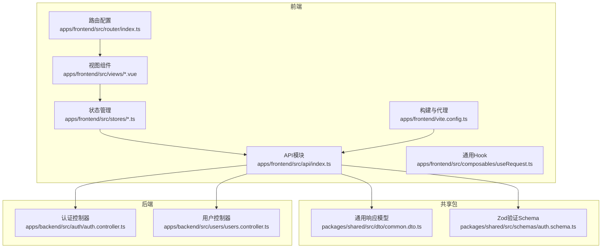
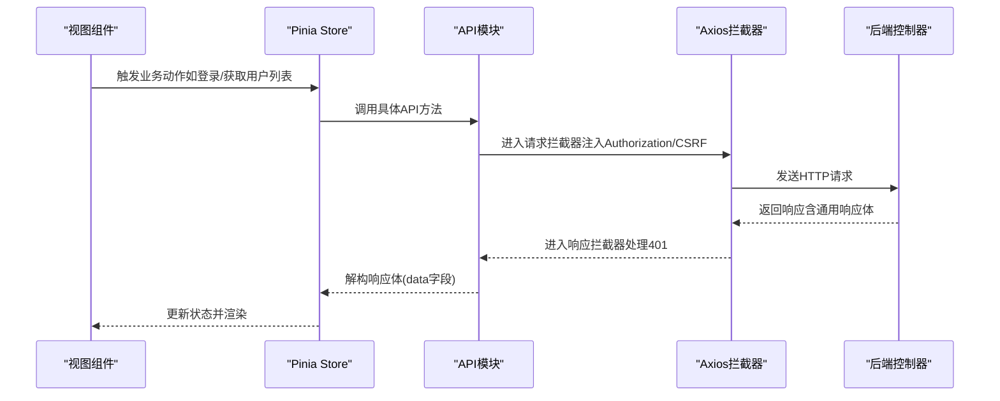
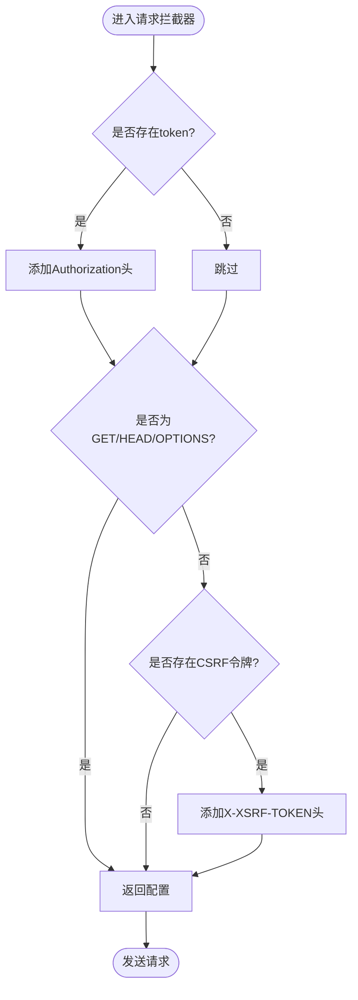
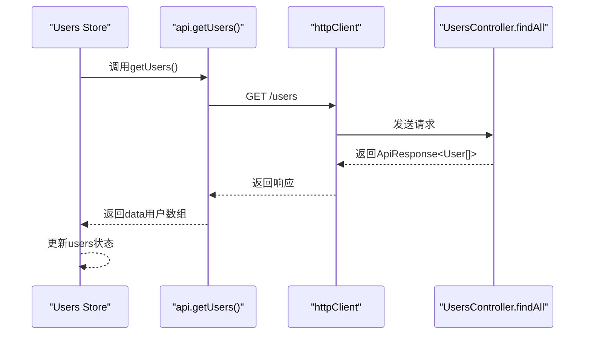
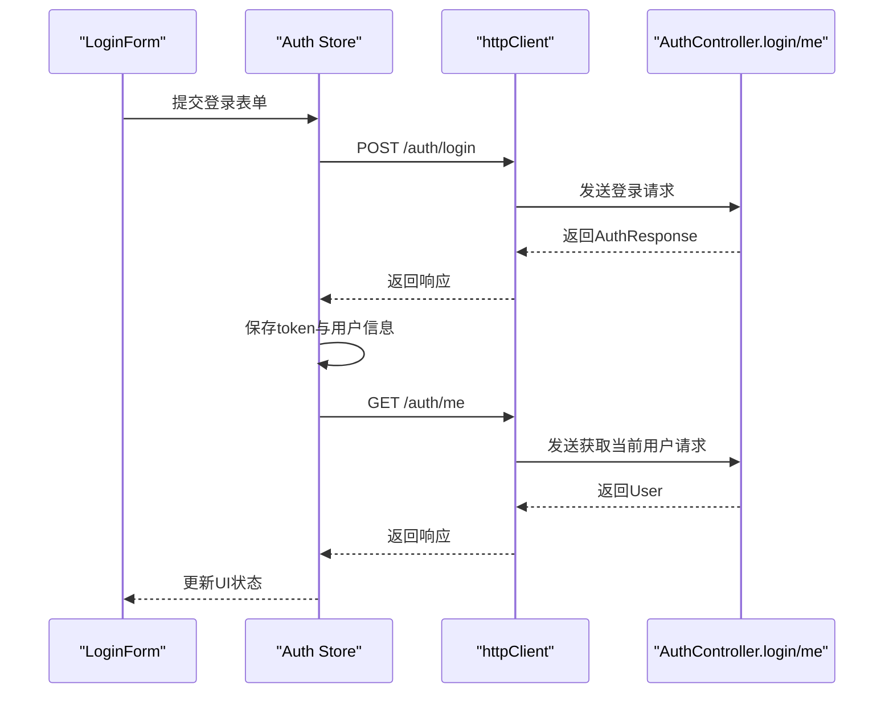
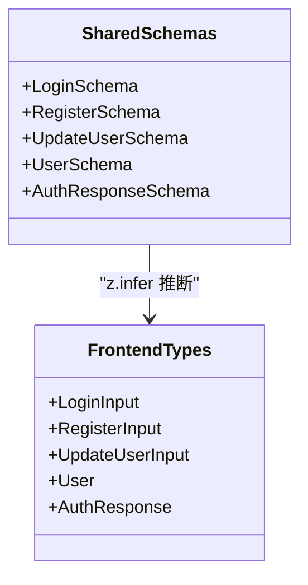
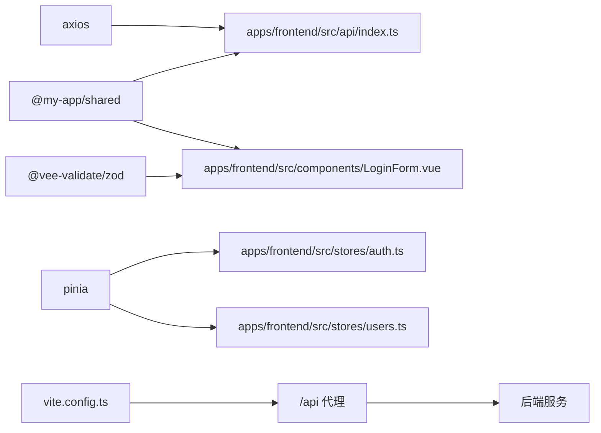

# API客户端集成

<cite>
**本文引用的文件**
- [apps/frontend/src/api/index.ts](file://apps/frontend/src/api/index.ts)
- [apps/frontend/src/stores/auth.ts](file://apps/frontend/src/stores/auth.ts)
- [apps/frontend/src/stores/users.ts](file://apps/frontend/src/stores/users.ts)
- [apps/frontend/src/composables/useRequest.ts](file://apps/frontend/src/composables/useRequest.ts)
- [apps/frontend/src/components/LoginForm.vue](file://apps/frontend/src/components/LoginForm.vue)
- [apps/frontend/src/views/UsersView.vue](file://apps/frontend/src/views/UsersView.vue)
- [apps/frontend/src/router/index.ts](file://apps/frontend/src/router/index.ts)
- [apps/frontend/vite.config.ts](file://apps/frontend/vite.config.ts)
- [packages/shared/src/schemas/auth.schema.ts](file://packages/shared/src/schemas/auth.schema.ts)
- [packages/shared/src/dto/common.dto.ts](file://packages/shared/src/dto/common.dto.ts)
- [apps/backend/src/auth/auth.controller.ts](file://apps/backend/src/auth/auth.controller.ts)
- [apps/backend/src/users/users.controller.ts](file://apps/backend/src/users/users.controller.ts)
</cite>

## 目录
1. [简介](#简介)
2. [项目结构](#项目结构)
3. [核心组件](#核心组件)
4. [架构总览](#架构总览)
5. [详细组件分析](#详细组件分析)
6. [依赖关系分析](#依赖关系分析)
7. [性能考量](#性能考量)
8. [故障排查指南](#故障排查指南)
9. [结论](#结论)
10. [附录](#附录)

## 简介
本文件面向前端开发者，系统性说明如何通过统一的API模块与后端NestJS服务进行通信。重点覆盖：
- 统一HTTP客户端与拦截器（自动注入JWT、CSRF保护、统一错误处理）
- 请求参数序列化、响应数据解构与类型安全校验（基于共享Zod Schema）
- 典型业务场景：用户登录、获取用户列表
- 高级特性：请求取消、超时控制、缓存策略
- Mock数据调试方案与生产环境API调用监控建议

## 项目结构
前端采用模块化组织，API层位于统一入口，状态管理通过Pinia Store承载，视图组件负责UI交互与触发业务动作。

图表来源
- [apps/frontend/src/api/index.ts](file://apps/frontend/src/api/index.ts#L1-L92)
- [apps/frontend/src/stores/auth.ts](file://apps/frontend/src/stores/auth.ts#L1-L97)
- [apps/frontend/src/stores/users.ts](file://apps/frontend/src/stores/users.ts#L1-L42)
- [apps/frontend/src/composables/useRequest.ts](file://apps/frontend/src/composables/useRequest.ts#L1-L44)
- [apps/frontend/src/router/index.ts](file://apps/frontend/src/router/index.ts#L1-L44)
- [apps/frontend/vite.config.ts](file://apps/frontend/vite.config.ts#L1-L124)
- [packages/shared/src/dto/common.dto.ts](file://packages/shared/src/dto/common.dto.ts#L1-L40)
- [packages/shared/src/schemas/auth.schema.ts](file://packages/shared/src/schemas/auth.schema.ts#L1-L94)
- [apps/backend/src/auth/auth.controller.ts](file://apps/backend/src/auth/auth.controller.ts#L1-L51)
- [apps/backend/src/users/users.controller.ts](file://apps/backend/src/users/users.controller.ts#L1-L43)

章节来源
- [apps/frontend/src/api/index.ts](file://apps/frontend/src/api/index.ts#L1-L92)
- [apps/frontend/src/router/index.ts](file://apps/frontend/src/router/index.ts#L1-L44)
- [apps/frontend/vite.config.ts](file://apps/frontend/vite.config.ts#L1-L124)

## 核心组件
- 统一HTTP客户端与拦截器
  - 基础配置：基础URL、超时、默认Content-Type
  - 请求拦截器：自动附加Authorization头；非GET请求附加CSRF头
  - 响应拦截器：统一处理401未授权并清理本地token
- API接口集合
  - 提供用户列表、单个用户、创建用户的轻量封装
- 状态管理与业务流
  - 认证Store：登录、登出、获取当前用户
  - 用户Store：拉取用户列表
- 通用Hook
  - useRequest：封装加载、错误、执行流程
- 共享Schema与响应模型
  - Zod Schema用于表单与响应的类型安全校验
  - 通用响应体结构定义

章节来源
- [apps/frontend/src/api/index.ts](file://apps/frontend/src/api/index.ts#L1-L92)
- [apps/frontend/src/stores/auth.ts](file://apps/frontend/src/stores/auth.ts#L1-L97)
- [apps/frontend/src/stores/users.ts](file://apps/frontend/src/stores/users.ts#L1-L42)
- [apps/frontend/src/composables/useRequest.ts](file://apps/frontend/src/composables/useRequest.ts#L1-L44)
- [packages/shared/src/schemas/auth.schema.ts](file://packages/shared/src/schemas/auth.schema.ts#L1-L94)
- [packages/shared/src/dto/common.dto.ts](file://packages/shared/src/dto/common.dto.ts#L1-L40)

## 架构总览
前端通过统一API模块与后端交互，遵循“请求拦截器注入令牌与CSRF -> 发送请求 -> 响应拦截器统一处理 -> 返回解构后的数据”的闭环。

图表来源
- [apps/frontend/src/api/index.ts](file://apps/frontend/src/api/index.ts#L1-L92)
- [apps/frontend/src/stores/auth.ts](file://apps/frontend/src/stores/auth.ts#L1-L97)
- [apps/frontend/src/stores/users.ts](file://apps/frontend/src/stores/users.ts#L1-L42)
- [apps/backend/src/auth/auth.controller.ts](file://apps/backend/src/auth/auth.controller.ts#L1-L51)
- [apps/backend/src/users/users.controller.ts](file://apps/backend/src/users/users.controller.ts#L1-L43)

## 详细组件分析

### 统一HTTP客户端与拦截器
- 基础配置
  - baseURL指向“/api”，便于开发时通过Vite代理转发至后端
  - timeout设置为10秒，避免请求长时间挂起
  - 默认JSON Content-Type
- 请求拦截器
  - 自动从localStorage读取token并附加到Authorization头
  - 对非GET请求（HEAD/OPTIONS除外）从cookie读取CSRF令牌并附加到请求头
- 响应拦截器
  - 对401未授权进行统一处理：清理本地token，便于后续登出或重定向

图表来源
- [apps/frontend/src/api/index.ts](file://apps/frontend/src/api/index.ts#L1-L92)

章节来源
- [apps/frontend/src/api/index.ts](file://apps/frontend/src/api/index.ts#L1-L92)
- [apps/frontend/vite.config.ts](file://apps/frontend/vite.config.ts#L115-L122)

### API接口集合（用户相关）
- getUsers/getUser/createUser
  - 通过httpClient封装GET/POST请求
  - 返回值为通用响应体的data字段，确保前后端一致的数据结构
- 与共享Schema的关系
  - 用户类型User与认证响应AuthResponse由共享包Zod Schema推断，前端在Store与API处直接使用这些类型

图表来源
- [apps/frontend/src/stores/users.ts](file://apps/frontend/src/stores/users.ts#L1-L42)
- [apps/frontend/src/api/index.ts](file://apps/frontend/src/api/index.ts#L61-L92)
- [apps/backend/src/users/users.controller.ts](file://apps/backend/src/users/users.controller.ts#L1-L43)
- [packages/shared/src/dto/common.dto.ts](file://packages/shared/src/dto/common.dto.ts#L1-L40)

章节来源
- [apps/frontend/src/api/index.ts](file://apps/frontend/src/api/index.ts#L61-L92)
- [apps/frontend/src/stores/users.ts](file://apps/frontend/src/stores/users.ts#L1-L42)
- [apps/backend/src/users/users.controller.ts](file://apps/backend/src/users/users.controller.ts#L1-L43)
- [packages/shared/src/dto/common.dto.ts](file://packages/shared/src/dto/common.dto.ts#L1-L40)

### 认证流程（登录、获取当前用户）
- 登录
  - 使用LoginForm组件收集表单数据，基于共享Zod Schema进行前端校验
  - 调用Auth Store的login方法，向后端发送登录请求
  - 后端返回认证响应，前端保存accessToken并更新用户信息
- 获取当前用户
  - 若存在token，则调用后端/me接口获取用户资料
  - 若请求失败（可能token失效），自动logout并清空状态

图表来源
- [apps/frontend/src/components/LoginForm.vue](file://apps/frontend/src/components/LoginForm.vue#L1-L99)
- [apps/frontend/src/stores/auth.ts](file://apps/frontend/src/stores/auth.ts#L1-L97)
- [apps/backend/src/auth/auth.controller.ts](file://apps/backend/src/auth/auth.controller.ts#L1-L51)
- [packages/shared/src/schemas/auth.schema.ts](file://packages/shared/src/schemas/auth.schema.ts#L1-L94)

章节来源
- [apps/frontend/src/components/LoginForm.vue](file://apps/frontend/src/components/LoginForm.vue#L1-L99)
- [apps/frontend/src/stores/auth.ts](file://apps/frontend/src/stores/auth.ts#L1-L97)
- [apps/backend/src/auth/auth.controller.ts](file://apps/backend/src/auth/auth.controller.ts#L1-L51)
- [packages/shared/src/schemas/auth.schema.ts](file://packages/shared/src/schemas/auth.schema.ts#L1-L94)

### 类型安全与Zod Schema
- 表单与响应类型
  - LoginSchema/RegisterSchema/UpdateUserSchema/UserSchema/AuthResponseSchema均由共享包导出
  - 前端通过z.infer推断得到强类型，用于Store、API、组件的输入输出
- 通用响应体
  - ApiResponse<T>定义了success/data/message/timestamp字段，前后端保持一致

图表来源
- [packages/shared/src/schemas/auth.schema.ts](file://packages/shared/src/schemas/auth.schema.ts#L1-L94)
- [packages/shared/src/dto/common.dto.ts](file://packages/shared/src/dto/common.dto.ts#L1-L40)

章节来源
- [packages/shared/src/schemas/auth.schema.ts](file://packages/shared/src/schemas/auth.schema.ts#L1-L94)
- [packages/shared/src/dto/common.dto.ts](file://packages/shared/src/dto/common.dto.ts#L1-L40)

### 高级特性：请求取消、超时控制、缓存策略
- 请求取消
  - 在需要时可借助AbortController中断请求，避免竞态与内存泄漏
- 超时控制
  - httpClient已设置timeout为10秒，可在调用侧根据场景调整
- 缓存策略
  - PWA Workbox配置对以“https://api.”开头的请求采用NetworkFirst策略，缓存名称为“api-cache”，最大条目数100，过期时间24小时
  - 开发环境通过Vite代理将“/api”转发至后端，不走PWA缓存

章节来源
- [apps/frontend/src/api/index.ts](file://apps/frontend/src/api/index.ts#L1-L92)
- [apps/frontend/vite.config.ts](file://apps/frontend/vite.config.ts#L88-L107)

### Mock数据调试方案
- 前端Mock
  - 可在本地启动Vite时，利用插件或中间件对特定端点返回固定数据，便于联调与UI测试
- 后端Mock
  - 在开发阶段可临时替换服务实现或使用测试数据库，减少对真实后端的依赖
- 调试建议
  - 使用浏览器网络面板观察请求/响应头、状态码与响应体
  - 在拦截器中打印关键信息（如token、CSRF），定位鉴权问题

[本节为概念性指导，不直接分析具体文件，故无章节来源]

### 生产环境API调用监控建议
- 指标采集
  - 请求成功率、平均/分位延迟、错误分布（4xx/5xx）、CSRF与鉴权失败率
- 日志与追踪
  - 为每个请求生成唯一traceId，串联前端、网关与后端日志
- 健康检查
  - 定期探测后端可用性与关键端点延迟，异常时告警并降级
- 性能优化
  - 结合缓存策略与分页接口，降低首屏与列表加载压力

[本节为概念性指导，不直接分析具体文件，故无章节来源]

## 依赖关系分析
- 前端依赖
  - axios：统一HTTP客户端
  - @my-app/shared：共享Schema与通用响应模型
  - pinia/pinia-plugin-persistedstate：状态管理与持久化
  - vee-validate/@vee-validate/zod：表单校验与Zod集成
- 构建与代理
  - Vite代理将“/api”转发至后端3000端口，便于开发联调
  - PWA Workbox对API缓存进行配置

图表来源
- [apps/frontend/src/api/index.ts](file://apps/frontend/src/api/index.ts#L1-L92)
- [apps/frontend/src/components/LoginForm.vue](file://apps/frontend/src/components/LoginForm.vue#L1-L99)
- [apps/frontend/src/stores/auth.ts](file://apps/frontend/src/stores/auth.ts#L1-L97)
- [apps/frontend/src/stores/users.ts](file://apps/frontend/src/stores/users.ts#L1-L42)
- [apps/frontend/vite.config.ts](file://apps/frontend/vite.config.ts#L115-L122)

章节来源
- [apps/frontend/src/api/index.ts](file://apps/frontend/src/api/index.ts#L1-L92)
- [apps/frontend/src/components/LoginForm.vue](file://apps/frontend/src/components/LoginForm.vue#L1-L99)
- [apps/frontend/src/stores/auth.ts](file://apps/frontend/src/stores/auth.ts#L1-L97)
- [apps/frontend/src/stores/users.ts](file://apps/frontend/src/stores/users.ts#L1-L42)
- [apps/frontend/vite.config.ts](file://apps/frontend/vite.config.ts#L115-L122)

## 性能考量
- 请求超时与重试
  - 合理设置timeout，避免阻塞UI线程
  - 对幂等操作可考虑指数退避重试，但需避免重复副作用
- 缓存与分页
  - 对列表类接口优先使用分页，结合Workbox缓存提升二次访问速度
- 并发控制
  - 避免同时发起大量请求，必要时使用队列或并发上限控制
- 体积与加载
  - 通过懒加载与按需引入减少首屏负担

[本节为通用指导，不直接分析具体文件，故无章节来源]

## 故障排查指南
- 401未授权
  - 检查本地token是否存在且未过期
  - 确认请求拦截器是否正确附加Authorization头
  - 后端响应拦截器会清理token，前端应据此登出并提示重新登录
- CSRF失败
  - 确认非GET请求携带X-XSRF-TOKEN头
  - 检查cookie中是否存在XSRF-TOKEN
- 网络代理
  - 开发时确认Vite代理已将“/api”转发至后端
  - 生产环境确认代理或反向代理配置正确
- 缓存问题
  - 若出现陈旧数据，可清理PWA缓存或禁用缓存后再试

章节来源
- [apps/frontend/src/api/index.ts](file://apps/frontend/src/api/index.ts#L1-L92)
- [apps/frontend/vite.config.ts](file://apps/frontend/vite.config.ts#L115-L122)

## 结论
该前端API集成方案通过统一HTTP客户端与拦截器，实现了鉴权、CSRF、错误处理的一致性；配合共享Zod Schema与通用响应模型，保证了前后端类型安全与数据结构一致性。结合Pinia Store与通用Hook，能够快速构建可维护的业务流程。在开发与生产环境中，建议充分利用代理、缓存与监控能力，持续优化用户体验与稳定性。

[本节为总结性内容，不直接分析具体文件，故无章节来源]

## 附录
- 关键端点参考
  - 登录：POST /auth/login
  - 刷新令牌：POST /auth/refresh
  - 获取当前用户：GET /auth/me
  - 获取用户列表：GET /users
  - 获取单个用户：GET /users/:id
  - 创建用户：POST /users

章节来源
- [apps/backend/src/auth/auth.controller.ts](file://apps/backend/src/auth/auth.controller.ts#L1-L51)
- [apps/backend/src/users/users.controller.ts](file://apps/backend/src/users/users.controller.ts#L1-L43)