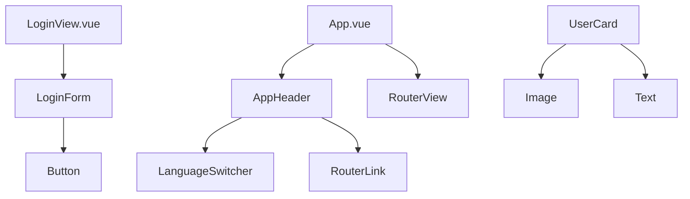
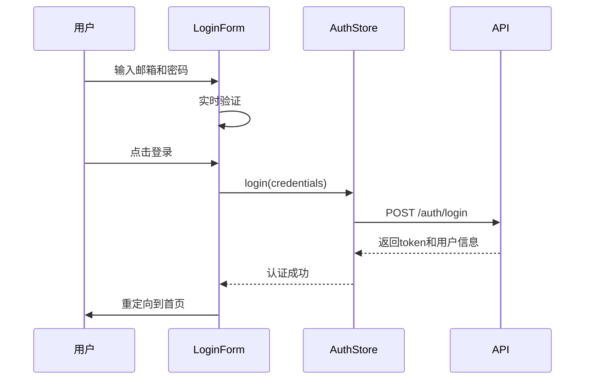
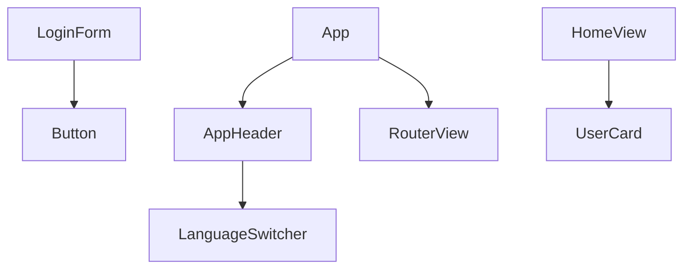

# UI组件体系

<cite>
**本文档引用的文件**  
- [AppHeader.vue](file://apps/frontend/src/components/AppHeader.vue)
- [LanguageSwitcher.vue](file://apps/frontend/src/components/LanguageSwitcher.vue)
- [LoginForm.vue](file://apps/frontend/src/components/LoginForm.vue)
- [UserCard.vue](file://apps/frontend/src/components/UserCard.vue)
- [Button.vue](file://apps/frontend/src/components/ui/button/Button.vue)
- [button/index.ts](file://apps/frontend/src/components/ui/button/index.ts)
- [auth.ts](file://apps/frontend/src/stores/auth.ts)
- [i18n/index.ts](file://apps/frontend/src/i18n/index.ts)
- [zh-CN.ts](file://apps/frontend/src/i18n/locales/zh-CN.ts)
- [en-US.ts](file://apps/frontend/src/i18n/locales/en-US.ts)
- [main.css](file://apps/frontend/src/styles/main.css)
- [tailwind.config.js](file://apps/frontend/tailwind.config.js)
- [LoginSchema](file://packages/shared/src/dto/common.dto.ts)
</cite>

## 目录
1. [简介](#简介)
2. [组件概览](#组件概览)
3. [AppHeader 组件](#appheader-组件)
4. [LanguageSwitcher 组件](#languageswitcher-组件)
5. [LoginForm 组件](#loginform-组件)
6. [UserCard 组件](#usercard-组件)
7. [Button 基础组件](#button-基础组件)
8. [组件嵌套与数据传递](#组件嵌套与数据传递)
9. [主题与样式定制](#主题与样式定制)
10. [可访问性支持](#可访问性支持)

## 简介
本文档全面介绍前端应用中的核心UI组件体系，涵盖布局、表单、数据展示和基础交互组件的设计与使用规范。系统阐述了组件的API接口、响应式行为、多语言支持、状态管理及样式定制策略，为开发者提供一致的开发体验和高质量的用户界面实现方案。

## 组件概览
本应用采用模块化组件设计，核心UI组件包括：
- **AppHeader**: 应用顶部导航栏，集成路由链接和语言切换功能
- **LanguageSwitcher**: 多语言切换控件，支持中英文切换
- **LoginForm**: 用户登录表单，集成表单验证和状态管理
- **UserCard**: 用户信息展示卡片，支持响应式布局
- **Button**: 基础按钮组件，提供多种样式变体和尺寸

这些组件共同构成了应用的用户界面基础，通过组合使用实现完整的用户交互体验。



**图示来源**
- [App.vue](file://apps/frontend/src/App.vue)
- [LoginView.vue](file://apps/frontend/src/views/LoginView.vue)
- [AppHeader.vue](file://apps/frontend/src/components/AppHeader.vue)
- [LoginForm.vue](file://apps/frontend/src/components/LoginForm.vue)

## AppHeader 组件

AppHeader组件是应用的全局导航头部，提供品牌标识、主要导航链接和语言切换功能。

### 布局结构
组件采用Flexbox布局，包含左侧品牌标识和右侧导航菜单。使用Tailwind CSS的`container mx-auto`实现响应式容器，`flex items-center justify-between`实现水平分布。

### API接口
**Props**: 无
**Events**: 无
**Slots**: 默认插槽未使用

### 使用示例
```vue
<AppHeader />
```

### 响应式行为
组件在所有屏幕尺寸下保持良好显示效果，导航链接在小屏幕上自动紧凑排列。

**组件来源**
- [AppHeader.vue](file://apps/frontend/src/components/AppHeader.vue)

## LanguageSwitcher 组件

LanguageSwitcher组件实现应用的多语言切换功能，支持中文和英文两种语言。

### 多语言切换逻辑
组件通过`vue-i18n`库管理多语言状态，切换时：
1. 更新`locale`值以触发界面语言变化
2. 将用户偏好存储到`localStorage`实现持久化
3. 支持浏览器语言自动检测作为默认值

### API接口
**Props**: 无
**Events**: 无
**Slots**: 无

### 使用示例
```vue
<LanguageSwitcher />
```

### 可访问性
按钮具有适当的焦点状态和悬停效果，确保键盘导航可用性。

**组件来源**
- [LanguageSwitcher.vue](file://apps/frontend/src/components/LanguageSwitcher.vue)
- [i18n/index.ts](file://apps/frontend/src/i18n/index.ts)

## LoginForm 组件

LoginForm组件处理用户登录流程，包含表单验证、状态管理和错误处理。

### 表单验证与提交流程
1. 使用`vee-validate`和`zod`进行客户端验证
2. 验证规则来自共享的`LoginSchema`，确保前后端一致性
3. 提交时调用`authStore.login()`方法处理认证
4. 根据结果重定向到首页或显示错误信息

### API接口
**Props**: 无
**Events**: 无
**Slots**: 无

### 状态管理
组件通过Pinia store (`useAuthStore`)管理认证状态，包括：
- `loading`: 提交状态
- `error`: 错误信息
- `token`: 认证令牌



**图示来源**
- [LoginForm.vue](file://apps/frontend/src/components/LoginForm.vue)
- [auth.ts](file://apps/frontend/src/stores/auth.ts)

**组件来源**
- [LoginForm.vue](file://apps/frontend/src/components/LoginForm.vue)
- [auth.ts](file://apps/frontend/src/stores/auth.ts)

## UserCard 组件

UserCard组件用于展示用户信息，采用卡片式设计，支持头像和基本信息展示。

### 数据展示模式
组件接收`user`对象作为prop，展示：
- 用户头像（优先显示avatar，否则显示首字母）
- 用户姓名和邮箱
- 注册日期（根据当前语言格式化）

### API接口
**Props**:
- `user`: User对象，包含id、name、email、avatar、createdAt等属性

**Events**: 无
**Slots**: 无

### 响应式设计
在移动设备上自动调整布局，确保信息清晰可读。

**组件来源**
- [UserCard.vue](file://apps/frontend/src/components/UserCard.vue)

## Button 基础组件

Button组件是应用的基础交互元素，提供统一的样式和行为。

### 样式定制
通过`class-variance-authority` (cva) 定义多种变体和尺寸：
- **变体**: default, destructive, outline, secondary, ghost, link
- **尺寸**: default, xs, sm, lg, icon

### 事件处理机制
组件封装了基础的点击事件处理，通过`Primitive`组件确保无障碍访问性。

### API接口
**Props**:
- `variant`: 按钮变体
- `size`: 按钮尺寸
- `class`: 自定义CSS类

**Events**: 继承原生按钮事件
**Slots**: 默认插槽用于按钮内容

### 使用示例
```vue
<Button variant="default" size="lg">主要按钮</Button>
<Button variant="outline">轮廓按钮</Button>
```

**组件来源**
- [Button.vue](file://apps/frontend/src/components/ui/button/Button.vue)
- [button/index.ts](file://apps/frontend/src/components/ui/button/index.ts)

## 组件嵌套与数据传递

### 组件嵌套关系


### 数据传递方式
- **Props**: 父组件向子组件传递数据（如UserCard接收user对象）
- **Events**: 子组件向父组件通信（本例中较少使用）
- **状态管理**: 跨组件共享状态（如authStore管理登录状态）
- **依赖注入**: 通过provide/inject传递全局依赖

**图示来源**
- [App.vue](file://apps/frontend/src/App.vue)
- [AppHeader.vue](file://apps/frontend/src/components/AppHeader.vue)
- [LoginForm.vue](file://apps/frontend/src/components/LoginForm.vue)
- [UserCard.vue](file://apps/frontend/src/components/UserCard.vue)

## 主题与样式定制

### Tailwind CSS样式覆盖
通过`cn()`工具函数合并类名，支持样式覆盖：
```ts
import { cn } from '@/lib/utils'
// 合并基础样式和自定义样式
:class="cn(buttonVariants({ variant, size }), props.class)"
```

### 主题适配策略
- 使用CSS变量定义主题颜色
- 支持暗色模式切换
- 主题配置在`tailwind.config.js`和`main.css`中定义

### 样式配置
```js
// tailwind.config.js
theme: {
  extend: {
    colors: {
      primary: 'hsl(var(--primary))',
      secondary: 'hsl(var(--secondary))'
    }
  }
}
```

**组件来源**
- [tailwind.config.js](file://apps/frontend/tailwind.config.js)
- [main.css](file://apps/frontend/src/styles/main.css)
- [utils.ts](file://apps/frontend/src/lib/utils.ts)

## 可访问性支持

### ARIA最佳实践
- 表单字段使用`label`和`for`关联
- 导航链接具有清晰的焦点状态
- 按钮提供适当的语义化标签

### 键盘导航
所有交互元素支持键盘操作，确保无障碍访问。

### 屏幕阅读器支持
通过适当的HTML语义和ARIA属性，确保屏幕阅读器用户能够理解界面结构和功能。

**组件来源**
- [LoginForm.vue](file://apps/frontend/src/components/LoginForm.vue)
- [Button.vue](file://apps/frontend/src/components/ui/button/Button.vue)