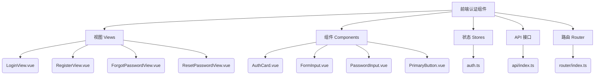
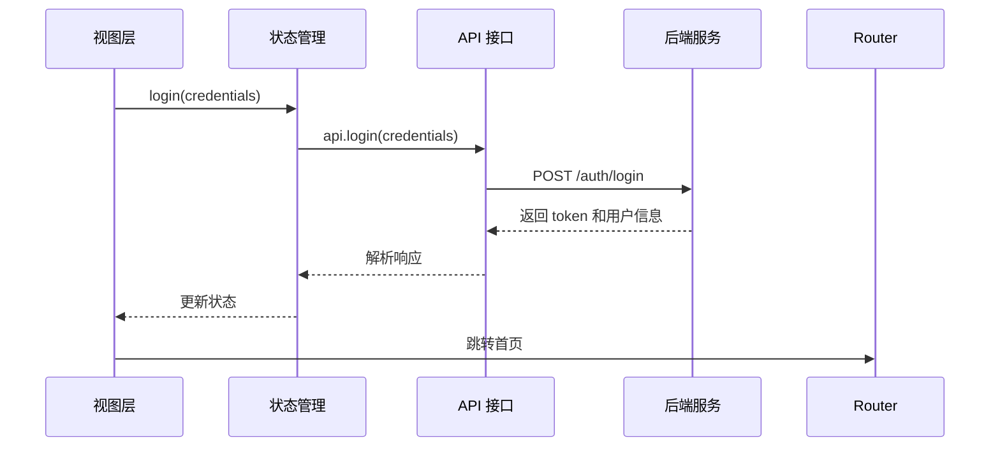
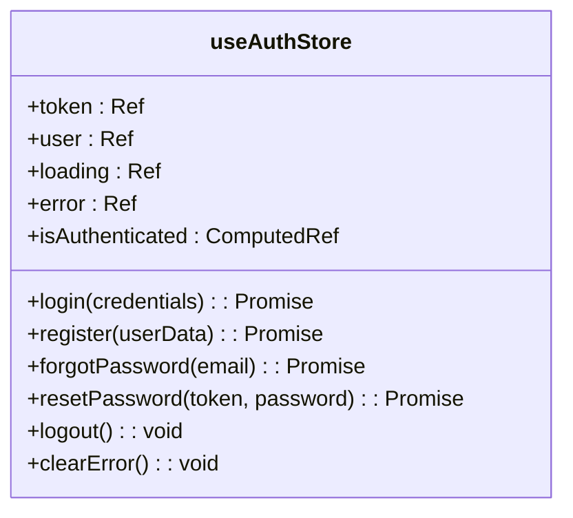
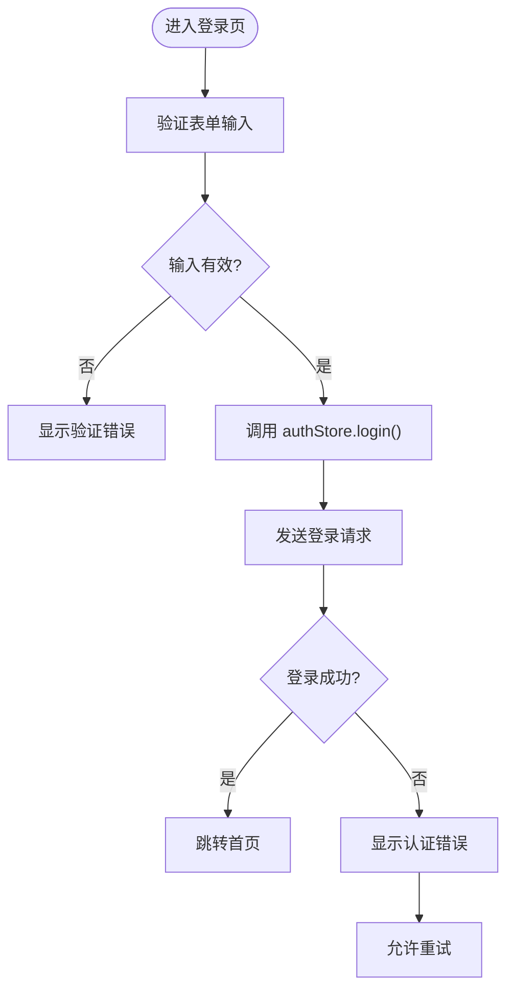
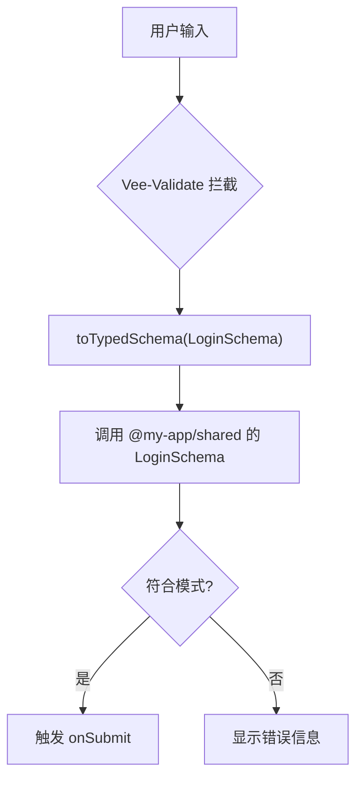
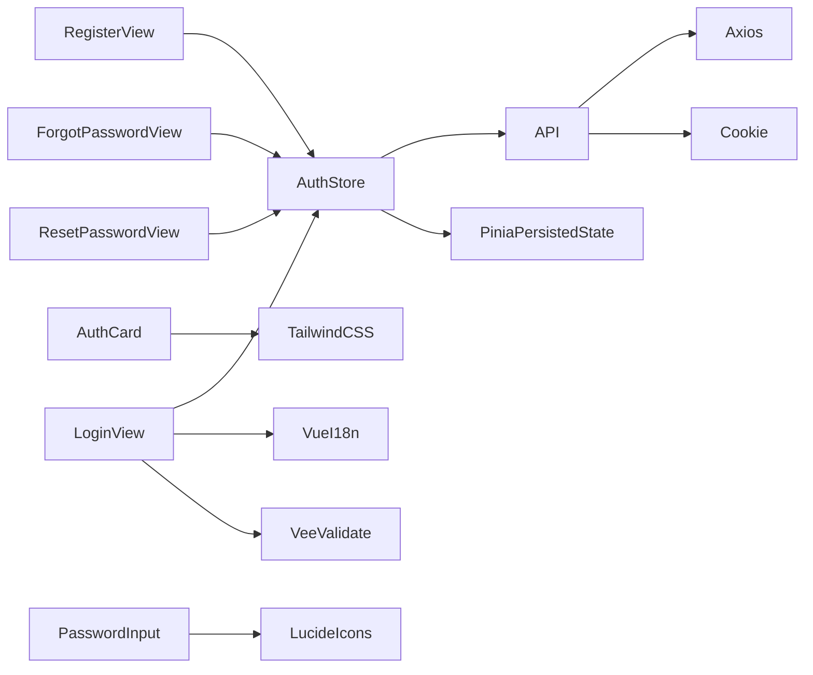

# 前端认证组件

<cite>
**本文档中引用的文件**  
- [auth.ts](file://apps/frontend/src/stores/auth.ts)
- [LoginView.vue](file://apps/frontend/src/views/LoginView.vue)
- [RegisterView.vue](file://apps/frontend/src/views/RegisterView.vue)
- [ForgotPasswordView.vue](file://apps/frontend/src/views/ForgotPasswordView.vue)
- [ResetPasswordView.vue](file://apps/frontend/src/views/ResetPasswordView.vue)
- [AuthCard.vue](file://apps/frontend/src/components/auth/AuthCard.vue)
- [FormInput.vue](file://apps/frontend/src/components/auth/FormInput.vue)
- [PasswordInput.vue](file://apps/frontend/src/components/auth/PasswordInput.vue)
- [PrimaryButton.vue](file://apps/frontend/src/components/auth/PrimaryButton.vue)
- [api/index.ts](file://apps/frontend/src/api/index.ts)
- [router/index.ts](file://apps/frontend/src/router/index.ts)
- [auth.schema.ts](file://packages/shared/src/schemas/auth.schema.ts)
- [auth.service.ts](file://apps/backend/src/auth/auth.service.ts)
- [auth.controller.ts](file://apps/backend/src/auth/auth.controller.ts)
- [jwt-auth.guard.ts](file://apps/backend/src/auth/jwt-auth.guard.ts)
- [current-user.decorator.ts](file://apps/backend/src/auth/current-user.decorator.ts)
</cite>

## 目录
1. [简介](#简介)
2. [项目结构](#项目结构)
3. [核心组件](#核心组件)
4. [架构概览](#架构概览)
5. [详细组件分析](#详细组件分析)
6. [依赖分析](#依赖分析)
7. [性能考虑](#性能考虑)
8. [故障排除指南](#故障排除指南)
9. [结论](#结论)

## 简介
本项目是一个基于 Vue 3 和 NestJS 的全栈应用，其中前端认证组件负责用户登录、注册、密码重置等核心身份验证功能。该组件采用模块化设计，结合 Pinia 状态管理、Vue Router 路由控制以及共享类型定义，实现了前后端类型安全的交互。认证流程包括标准登录/注册、JWT 令牌管理、CSRF 防护、邮箱密码重置等功能，并通过 Zod 模式验证确保数据完整性。

## 项目结构
前端认证相关文件主要分布在 `apps/frontend/src` 目录下，采用功能模块化组织方式：

**图示来源**  
- [LoginView.vue](file://apps/frontend/src/views/LoginView.vue)
- [AuthCard.vue](file://apps/frontend/src/components/auth/AuthCard.vue)
- [auth.ts](file://apps/frontend/src/stores/auth.ts)

**章节来源**  
- [LoginView.vue](file://apps/frontend/src/views/LoginView.vue)
- [components/auth](file://apps/frontend/src/components/auth)
- [stores/auth.ts](file://apps/frontend/src/stores/auth.ts)

## 核心组件
前端认证系统由多个核心组件构成，主要包括状态管理、UI 组件、视图层、API 封装和路由控制。这些组件协同工作，实现完整的用户认证流程。

**章节来源**  
- [auth.ts](file://apps/frontend/src/stores/auth.ts)
- [api/index.ts](file://apps/frontend/src/api/index.ts)
- [router/index.ts](file://apps/frontend/src/router/index.ts)

## 架构概览
整个认证系统的架构采用分层设计，从前端用户界面到后端服务调用形成清晰的数据流。

**图示来源**  
- [auth.ts](file://apps/frontend/src/stores/auth.ts#L25-L38)
- [api/index.ts](file://apps/frontend/src/api/index.ts#L93-L96)
- [auth.controller.ts](file://apps/backend/src/auth/auth.controller.ts#L31-L33)

## 详细组件分析
### 状态管理分析
使用 Pinia 实现认证状态的集中管理，支持持久化存储。

**图示来源**  
- [auth.ts](file://apps/frontend/src/stores/auth.ts#L10-L155)

**章节来源**  
- [auth.ts](file://apps/frontend/src/stores/auth.ts#L1-L155)

### 视图组件分析
各认证视图通过组合基础 UI 组件构建完整表单。

#### 登录视图流程

**图示来源**  
- [LoginView.vue](file://apps/frontend/src/views/LoginView.vue#L24-L29)
- [auth.ts](file://apps/frontend/src/stores/auth.ts#L25-L38)

**章节来源**  
- [LoginView.vue](file://apps/frontend/src/views/LoginView.vue#L1-L83)
- [RegisterView.vue](file://apps/frontend/src/views/RegisterView.vue#L1-L101)

### 表单验证机制
基于 Vee-Validate 和 Zod 的双重验证体系。

**图示来源**  
- [LoginView.vue](file://apps/frontend/src/views/LoginView.vue#L17-L19)
- [auth.schema.ts](file://packages/shared/src/schemas/auth.schema.ts)

**章节来源**  
- [LoginView.vue](file://apps/frontend/src/views/LoginView.vue#L1-L83)
- [RegisterView.vue](file://apps/frontend/src/views/RegisterView.vue#L1-L101)

## 依赖分析
认证组件依赖多个内部和外部模块，形成复杂的依赖关系网。

**图示来源**  
- [auth.ts](file://apps/frontend/src/stores/auth.ts)
- [api/index.ts](file://apps/frontend/src/api/index.ts)
- [LoginView.vue](file://apps/frontend/src/views/LoginView.vue)

**章节来源**  
- [package.json](file://apps/frontend/package.json)
- [auth.ts](file://apps/frontend/src/stores/auth.ts)
- [api/index.ts](file://apps/frontend/src/api/index.ts)

## 性能考虑
- 所有认证视图采用懒加载，减少初始包体积
- 表单验证使用即时反馈，提升用户体验
- 状态持久化仅保存 token，避免敏感信息泄露
- HTTP 客户端设置 10 秒超时，防止请求挂起
- 图标采用按需导入，减少 bundle 大小

## 故障排除指南
常见问题及解决方案：

| 问题现象 | 可能原因 | 解决方案 |
|---------|--------|--------|
| 登录失败但无错误提示 | 响应结构不匹配 | 检查后端返回格式是否符合 ApiResponse |
| 密码重置链接无效 | token 过期或格式错误 | 确认后端生成的 token 是否正确传递 |
| 表单验证不触发 | Zod 模式未正确导入 | 检查 shared 包版本一致性 |
| 自动登录失效 | 持久化配置错误 | 确认 pinia-plugin-persistedstate 配置正确 |
| CSRF 错误 | cookie 未正确设置 | 检查后端是否正确设置 XSRF-TOKEN cookie |

**章节来源**  
- [auth.ts](file://apps/frontend/src/stores/auth.ts#L35-L37)
- [api/index.ts](file://apps/frontend/src/api/index.ts#L46-L55)
- [auth.service.ts](file://apps/backend/src/auth/auth.service.ts#L256-L259)

## 结论
该前端认证组件设计合理，具备良好的可维护性和扩展性。通过共享类型定义实现了前后端类型安全，利用 Pinia 状态管理统一处理认证逻辑，结合 Vue Router 实现导航控制。建议后续可增加生物识别登录、多因素认证等高级功能以提升安全性。