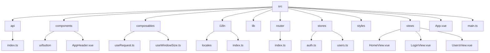
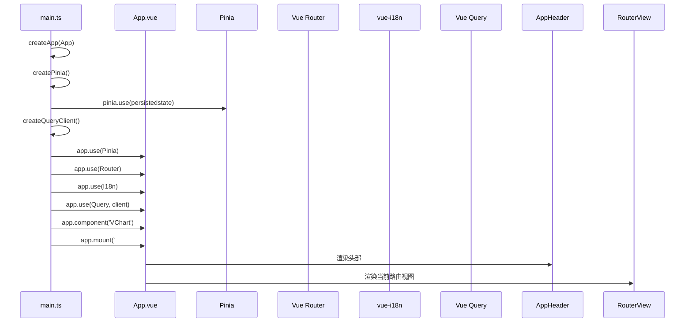
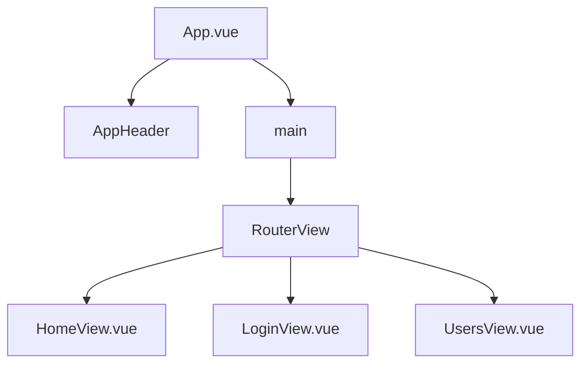
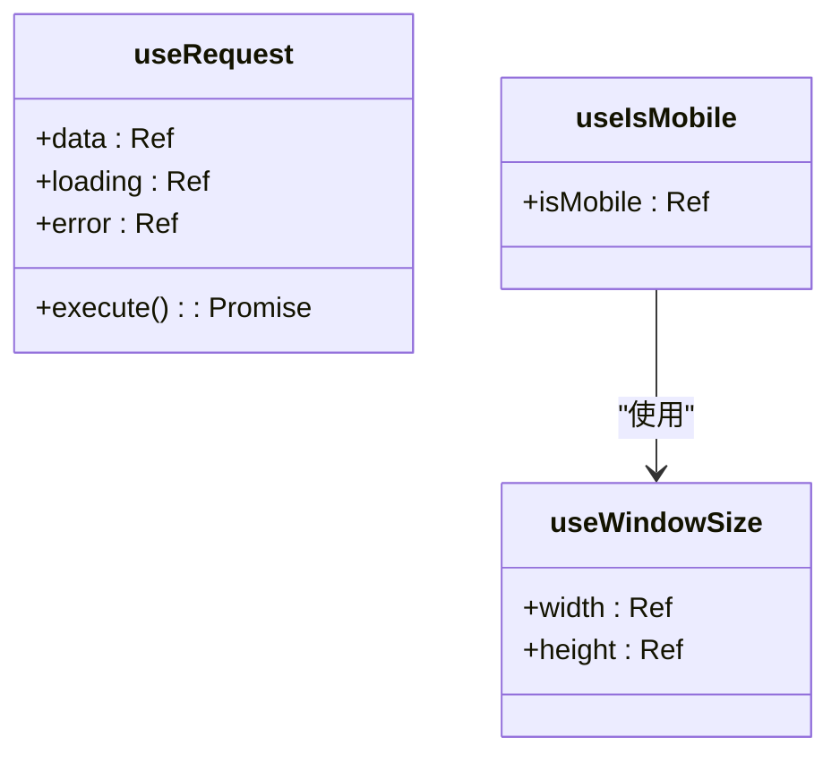
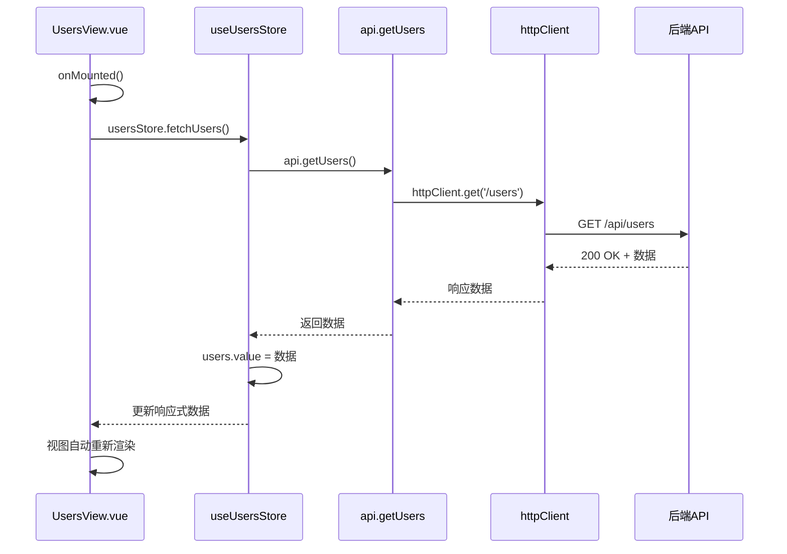

# 前端架构

<cite>
**本文档中引用的文件**  
- [main.ts](file://apps/frontend/src/main.ts)
- [App.vue](file://apps/frontend/src/App.vue)
- [useRequest.ts](file://apps/frontend/src/composables/useRequest.ts)
- [useWindowSize.ts](file://apps/frontend/src/composables/useWindowSize.ts)
- [auth.ts](file://apps/frontend/src/stores/auth.ts)
- [users.ts](file://apps/frontend/src/stores/users.ts)
- [index.ts](file://apps/frontend/src/router/index.ts)
- [i18n/index.ts](file://apps/frontend/src/i18n/index.ts)
- [api/index.ts](file://apps/frontend/src/api/index.ts)
- [HomeView.vue](file://apps/frontend/src/views/HomeView.vue)
- [UsersView.vue](file://apps/frontend/src/views/UsersView.vue)
- [AppHeader.vue](file://apps/frontend/src/components/AppHeader.vue)
</cite>

## 目录
1. [简介](#简介)
2. [项目结构](#项目结构)
3. [核心组件](#核心组件)
4. [架构概览](#架构概览)
5. [详细组件分析](#详细组件分析)
6. [依赖分析](#依赖分析)
7. [性能考虑](#性能考虑)
8. [故障排除指南](#故障排除指南)
9. [结论](#结论)

## 简介
本架构文档全面解析基于 Vue 3 的前端应用初始化流程与组织结构。重点阐述应用如何通过 `main.ts` 启动，集成 Pinia 状态管理、Vue Router 路由系统、i18n 国际化支持以及 Vue Query 数据获取方案。文档进一步说明根组件 `App.vue` 的布局设计、基于 Composition API 的可组合函数（composables）的设计理念、Pinia 模块的状态管理模式，以及组件如何通过 API 客户端与后端通信。通过时序图和组件层级图，帮助开发者深入理解整体运行机制。

## 项目结构
前端应用位于 `apps/frontend` 目录下，采用标准的 Vue 3 + Vite 项目结构，结合 TypeScript 和模块化设计。核心源码位于 `src/` 目录，按功能划分模块，确保高内聚低耦合。

**Diagram sources**
- [main.ts](file://apps/frontend/src/main.ts#L1-L57)
- [App.vue](file://apps/frontend/src/App.vue#L1-L14)

**Section sources**
- [main.ts](file://apps/frontend/src/main.ts#L1-L57)
- [App.vue](file://apps/frontend/src/App.vue#L1-L14)

## 核心组件
本应用的核心组件包括：`main.ts` 作为应用入口，负责初始化和插件挂载；`App.vue` 作为根组件，定义全局布局；`router/index.ts` 提供路由导航；`stores/` 目录下的 Pinia 模块管理全局状态；`composables/` 目录下的可组合函数封装可复用逻辑；`api/index.ts` 封装与后端的通信。

**Section sources**
- [main.ts](file://apps/frontend/src/main.ts#L1-L57)
- [router/index.ts](file://apps/frontend/src/router/index.ts#L1-L44)
- [stores/auth.ts](file://apps/frontend/src/stores/auth.ts#L1-L97)
- [composables/useRequest.ts](file://apps/frontend/src/composables/useRequest.ts#L1-L44)

## 架构概览
应用采用现代化的 Vue 3 组合式 API 架构，以 `main.ts` 为起点，通过 `createApp` 创建应用实例，并依次挂载 Pinia、Vue Router、i18n 和 Vue Query 等核心插件。状态管理采用 Pinia，结合 `pinia-plugin-persistedstate` 实现关键状态（如 token）的持久化。路由系统采用动态导入实现代码分割。国际化支持通过 `vue-i18n` 实现，可自动检测浏览器语言。数据获取通过 `@tanstack/vue-query` 管理，提供缓存、重试等高级功能。

**Diagram sources**
- [main.ts](file://apps/frontend/src/main.ts#L32-L56)
- [App.vue](file://apps/frontend/src/App.vue#L7-L10)

## 详细组件分析

### 应用初始化分析
`main.ts` 是应用的入口文件，负责创建 Vue 应用实例并集成所有全局插件。它首先导入 `createApp` 和 `createPinia` 等工厂函数，然后创建应用和 Pinia 实例，并应用持久化插件。接着配置 Vue Query 的 `QueryClient`，最后通过 `app.use()` 方法依次注册 Pinia、Router、i18n 和 Vue Query 插件，并全局注册 `VChart` 组件，最终挂载到 DOM。

**Section sources**
- [main.ts](file://apps/frontend/src/main.ts#L1-L57)

### 根组件与路由集成
`App.vue` 作为应用的根组件，采用 `<script setup>` 语法，结构简洁。其模板包含一个全屏的 flex 布局容器，顶部固定 `AppHeader` 组件，主体部分使用 `<RouterView />` 组件动态渲染当前路由匹配的视图。这种设计实现了布局与内容的分离，确保了路由切换时头部和导航的持久性。

**Diagram sources**
- [App.vue](file://apps/frontend/src/App.vue#L7-L10)
- [AppHeader.vue](file://apps/frontend/src/components/AppHeader.vue#L1-L25)
- [HomeView.vue](file://apps/frontend/src/views/HomeView.vue#L1-L307)
- [UsersView.vue](file://apps/frontend/src/views/UsersView.vue#L1-L67)

**Section sources**
- [App.vue](file://apps/frontend/src/App.vue#L1-L14)
- [AppHeader.vue](file://apps/frontend/src/components/AppHeader.vue#L1-L25)

### 可组合函数设计
可组合函数（Composables）是 Vue 3 Composition API 的核心，用于封装和复用有状态的逻辑。`useRequest.ts` 封装了通用的请求逻辑，提供 `data`、`loading`、`error` 状态和 `execute` 执行函数，简化了异步操作的处理。`useWindowSize.ts` 监听窗口大小变化，返回响应式的 `width` 和 `height`，并在此基础上衍生出 `useIsMobile` 函数，用于响应式布局判断。

**Diagram sources**
- [useRequest.ts](file://apps/frontend/src/composables/useRequest.ts#L1-L44)
- [useWindowSize.ts](file://apps/frontend/src/composables/useWindowSize.ts#L1-L35)

**Section sources**
- [useRequest.ts](file://apps/frontend/src/composables/useRequest.ts#L1-L44)
- [useWindowSize.ts](file://apps/frontend/src/composables/useWindowSize.ts#L1-L35)

### Pinia 状态管理
Pinia 模块位于 `stores/` 目录下，每个模块使用 `defineStore` 定义。`auth.ts` 模块管理用户认证状态，包含 `token`、`user`、`loading`、`error` 等状态，`isAuthenticated` 计算属性，以及 `login`、`logout`、`fetchCurrentUser` 等 actions。通过配置 `persist` 选项，仅将 `token` 持久化到本地存储。`users.ts` 模块则管理用户列表数据，提供 `fetchUsers` action 从 API 获取数据。

**Section sources**
- [auth.ts](file://apps/frontend/src/stores/auth.ts#L1-L97)
- [users.ts](file://apps/frontend/src/stores/users.ts#L1-L42)

### API 客户端与数据流
`api/index.ts` 文件创建了一个全局的 `axios` 实例 `httpClient`，配置了基础 URL 和请求头。通过请求拦截器，自动在请求头中添加 `Authorization` token 和 CSRF token。响应拦截器处理 401 未授权错误，自动清除本地 token。`api` 对象封装了具体的业务方法（如 `getUsers`），返回标准化的响应。在 `UsersView.vue` 中，通过 `useUsersStore` 获取 store 实例，并在 `onMounted` 钩子中调用 `fetchUsers` action。该 action 更新 store 中的 `users` 数组，由于 `users` 是响应式引用（ref），视图会自动更新。

**Diagram sources**
- [api/index.ts](file://apps/frontend/src/api/index.ts#L1-L92)
- [users.ts](file://apps/frontend/src/stores/users.ts#L20-L32)
- [UsersView.vue](file://apps/frontend/src/views/UsersView.vue#L12-L14)

**Section sources**
- [api/index.ts](file://apps/frontend/src/api/index.ts#L1-L92)
- [users.ts](file://apps/frontend/src/stores/users.ts#L1-L42)
- [UsersView.vue](file://apps/frontend/src/views/UsersView.vue#L1-L67)

## 依赖分析
应用依赖关系清晰，`main.ts` 依赖所有核心插件和 `App.vue`。`App.vue` 依赖 `AppHeader` 和 `RouterView`。各视图组件（如 `UsersView.vue`）依赖其使用的子组件（如 `UserCard`）和 Pinia store。`composables` 和 `api` 模块被多个组件复用。Pinia store 依赖 `api` 模块进行数据获取。这种依赖结构避免了循环依赖，保证了应用的可维护性。

**Section sources**
- [main.ts](file://apps/frontend/src/main.ts#L1-L57)
- [App.vue](file://apps/frontend/src/App.vue#L1-L14)
- [UsersView.vue](file://apps/frontend/src/views/UsersView.vue#L1-L67)
- [api/index.ts](file://apps/frontend/src/api/index.ts#L1-L92)

## 性能考虑
应用在性能方面做了多项优化：路由采用动态导入实现代码分割，减少首屏加载体积；Vue Query 提供了强大的缓存机制（`staleTime`），避免重复请求；Pinia 状态管理确保了数据的单一来源，减少了不必要的组件重新渲染；ECharts 组件使用 `autoresize` 属性，确保图表响应式；`useWindowSize` 等可组合函数正确地在组件卸载时移除事件监听器，防止内存泄漏。

## 故障排除指南
*   **页面空白/白屏**：检查 `main.ts` 中 `app.mount('#app')` 的选择器是否与 `index.html` 中的根元素 ID 一致。
*   **路由无法跳转**：确认 `router/index.ts` 中的路径配置正确，且组件路径无误。
*   **状态未持久化**：检查 `pinia-plugin-persistedstate` 是否已正确安装和使用，并确认 `persist.paths` 配置了需要持久化的状态字段。
*   **API 请求 401 错误**：检查 `httpClient` 的请求拦截器是否正确添加了 `Authorization` 头，以及本地存储的 `token` 是否有效。
*   **ECharts 不显示**：确保在使用 `VChart` 前，已在 `main.ts` 或组件内正确注册了所需的 ECharts 组件。

**Section sources**
- [main.ts](file://apps/frontend/src/main.ts#L56)
- [router/index.ts](file://apps/frontend/src/router/index.ts#L9-L34)
- [auth.ts](file://apps/frontend/src/stores/auth.ts#L91-L95)
- [api/index.ts](file://apps/frontend/src/api/index.ts#L24-L43)
- [HomeView.vue](file://apps/frontend/src/views/HomeView.vue#L21-L22)

## 结论
本前端架构文档详细解析了 Vue 3 应用的初始化流程、核心组件、状态管理、数据流和依赖关系。通过 `main.ts` 的集中式插件挂载、`App.vue` 的清晰布局、Composition API 的逻辑复用、Pinia 的模块化状态管理以及 Vue Query 的高效数据获取，构建了一个结构清晰、可维护性强、性能优良的现代化前端应用。开发者可依据此文档快速理解项目架构，进行高效开发和问题排查。