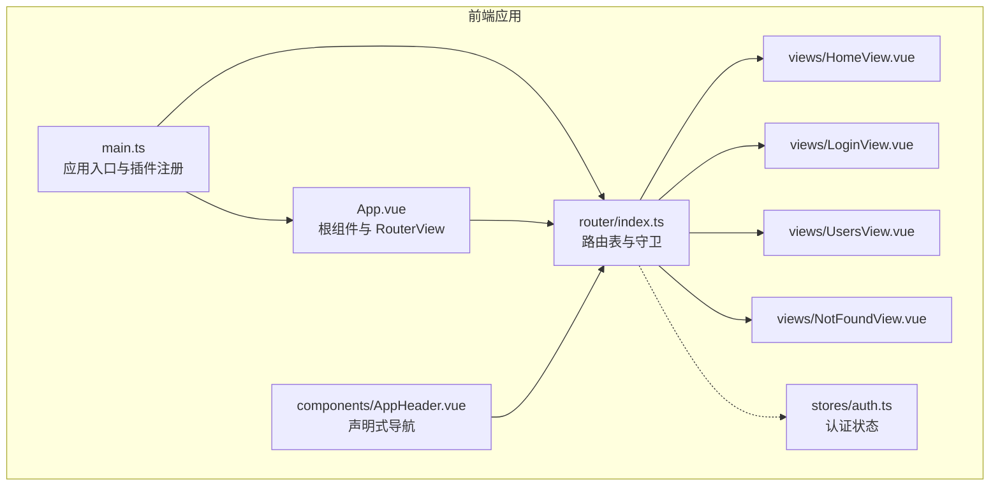
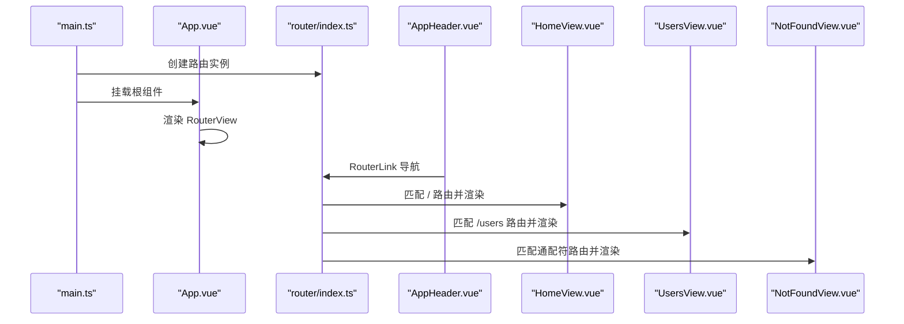
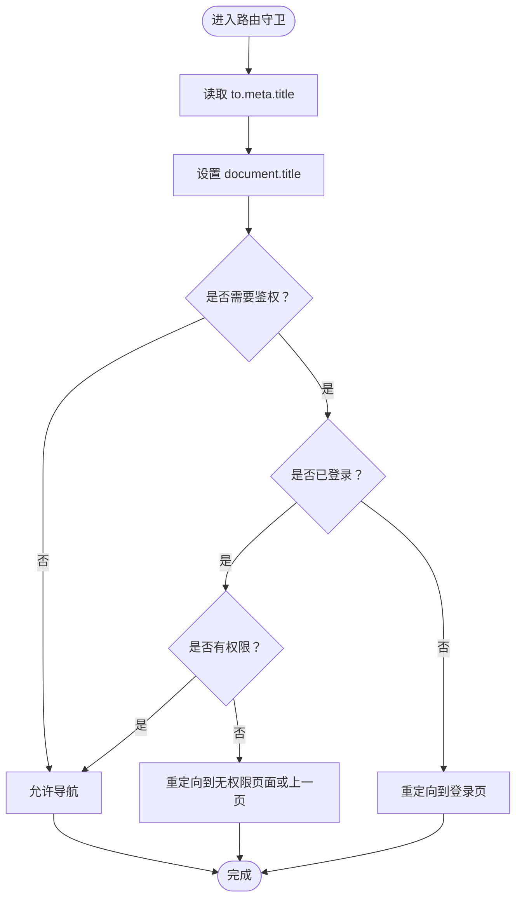
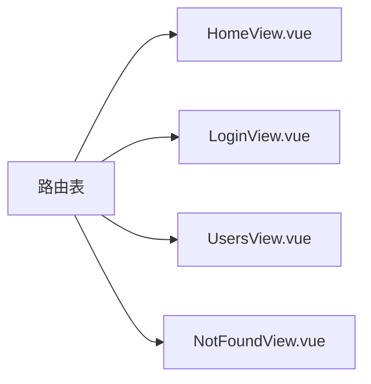
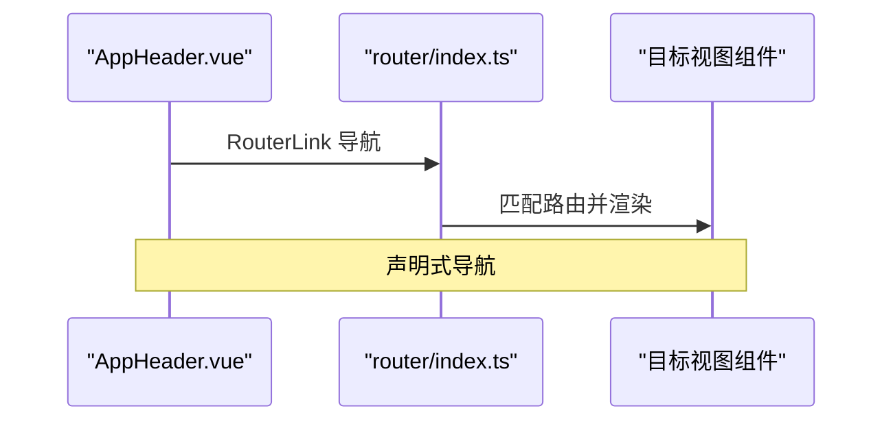
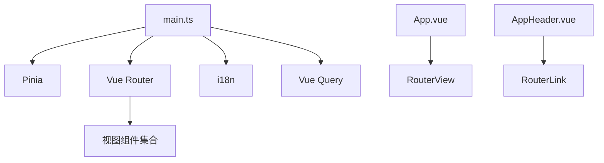

# 前端路由配置

<cite>
**本文引用的文件**
- [apps/frontend/src/router/index.ts](file://apps/frontend/src/router/index.ts)
- [apps/frontend/src/main.ts](file://apps/frontend/src/main.ts)
- [apps/frontend/src/App.vue](file://apps/frontend/src/App.vue)
- [apps/frontend/src/components/AppHeader.vue](file://apps/frontend/src/components/AppHeader.vue)
- [apps/frontend/src/views/HomeView.vue](file://apps/frontend/src/views/HomeView.vue)
- [apps/frontend/src/views/LoginView.vue](file://apps/frontend/src/views/LoginView.vue)
- [apps/frontend/src/views/UsersView.vue](file://apps/frontend/src/views/UsersView.vue)
- [apps/frontend/src/views/NotFoundView.vue](file://apps/frontend/src/views/NotFoundView.vue)
- [apps/frontend/src/stores/auth.ts](file://apps/frontend/src/stores/auth.ts)
</cite>

## 目录
1. [简介](#简介)
2. [项目结构](#项目结构)
3. [核心组件](#核心组件)
4. [架构总览](#架构总览)
5. [详细组件分析](#详细组件分析)
6. [依赖分析](#依赖分析)
7. [性能考虑](#性能考虑)
8. [故障排查指南](#故障排查指南)
9. [结论](#结论)

## 简介
本文件围绕基于 Vue Router 的前端路由系统进行系统化说明，覆盖路由表定义、懒加载、嵌套与导航、路由元信息（meta）在页面标题管理中的应用，以及与视图组件的映射关系。同时给出常见问题的定位与解决思路，帮助开发者快速理解并维护该路由体系。

## 项目结构
前端路由相关的核心文件集中在 apps/frontend/src 下：
- 路由入口与配置：apps/frontend/src/router/index.ts
- 应用挂载与插件注入：apps/frontend/src/main.ts
- 根组件与 RouterView：apps/frontend/src/App.vue
- 导航组件（声明式导航）：apps/frontend/src/components/AppHeader.vue
- 视图组件（映射到路由）：apps/frontend/src/views/HomeView.vue、LoginView.vue、UsersView.vue、NotFoundView.vue
- 认证状态（与路由守卫配合）：apps/frontend/src/stores/auth.ts

图表来源
- [apps/frontend/src/main.ts](file://apps/frontend/src/main.ts#L1-L57)
- [apps/frontend/src/App.vue](file://apps/frontend/src/App.vue#L1-L14)
- [apps/frontend/src/router/index.ts](file://apps/frontend/src/router/index.ts#L1-L44)
- [apps/frontend/src/components/AppHeader.vue](file://apps/frontend/src/components/AppHeader.vue#L1-L25)
- [apps/frontend/src/views/HomeView.vue](file://apps/frontend/src/views/HomeView.vue#L1-L307)
- [apps/frontend/src/views/LoginView.vue](file://apps/frontend/src/views/LoginView.vue#L1-L8)
- [apps/frontend/src/views/UsersView.vue](file://apps/frontend/src/views/UsersView.vue#L1-L67)
- [apps/frontend/src/views/NotFoundView.vue](file://apps/frontend/src/views/NotFoundView.vue#L1-L21)
- [apps/frontend/src/stores/auth.ts](file://apps/frontend/src/stores/auth.ts#L1-L97)

章节来源
- [apps/frontend/src/router/index.ts](file://apps/frontend/src/router/index.ts#L1-L44)
- [apps/frontend/src/main.ts](file://apps/frontend/src/main.ts#L1-L57)
- [apps/frontend/src/App.vue](file://apps/frontend/src/App.vue#L1-L14)

## 核心组件
- 路由表与守卫：在路由配置中定义了首页、登录页、用户列表页与 404 页面，并通过全局前置守卫统一设置页面标题。
- 视图组件映射：每个路由名称对应一个视图组件，如 home 对应 HomeView、login 对应 LoginView、users 对应 UsersView、not-found 对应 NotFoundView。
- 声明式导航：通过 RouterLink 在 AppHeader 与 HomeView 中进行页面跳转。
- 懒加载：登录页与用户列表页采用动态导入的方式按需加载，降低首屏体积。
- 认证状态：通过 Pinia 管理 token 与用户信息，为后续路由守卫的权限控制提供基础。

章节来源
- [apps/frontend/src/router/index.ts](file://apps/frontend/src/router/index.ts#L1-L44)
- [apps/frontend/src/views/HomeView.vue](file://apps/frontend/src/views/HomeView.vue#L1-L307)
- [apps/frontend/src/views/LoginView.vue](file://apps/frontend/src/views/LoginView.vue#L1-L8)
- [apps/frontend/src/views/UsersView.vue](file://apps/frontend/src/views/UsersView.vue#L1-L67)
- [apps/frontend/src/views/NotFoundView.vue](file://apps/frontend/src/views/NotFoundView.vue#L1-L21)
- [apps/frontend/src/stores/auth.ts](file://apps/frontend/src/stores/auth.ts#L1-L97)

## 架构总览
下图展示了从应用启动到路由渲染的关键流程，包括插件注册、路由实例创建、根组件挂载 RouterView 以及导航触发后的视图切换。

图表来源
- [apps/frontend/src/main.ts](file://apps/frontend/src/main.ts#L1-L57)
- [apps/frontend/src/App.vue](file://apps/frontend/src/App.vue#L1-L14)
- [apps/frontend/src/router/index.ts](file://apps/frontend/src/router/index.ts#L1-L44)
- [apps/frontend/src/components/AppHeader.vue](file://apps/frontend/src/components/AppHeader.vue#L1-L25)
- [apps/frontend/src/views/HomeView.vue](file://apps/frontend/src/views/HomeView.vue#L1-L307)
- [apps/frontend/src/views/UsersView.vue](file://apps/frontend/src/views/UsersView.vue#L1-L67)
- [apps/frontend/src/views/NotFoundView.vue](file://apps/frontend/src/views/NotFoundView.vue#L1-L21)

## 详细组件分析

### 路由表与导航
- 路由表定义：包含首页、登录页、用户列表页与 404 页面，每个路由项包含 path、name、component 与 meta 字段。
- 嵌套路由：当前路由表未显式声明嵌套路由；若需嵌套，可在子路由中使用 RouterView 并在父级路由中配置 children。
- 动态路由参数：当前路由未使用动态段（如 :id），如需参数化路由，可在 path 中添加占位符并在组件内通过 $route.params 访问。
- 声明式导航：通过 RouterLink 在 AppHeader 与 HomeView 中进行跳转，适合静态或简单参数的导航。
- 编程式导航：可通过 useRouter 或 this.$router 进行编程式跳转，适合条件判断、登录后跳转、错误处理后的回退等场景。

章节来源
- [apps/frontend/src/router/index.ts](file://apps/frontend/src/router/index.ts#L1-L44)
- [apps/frontend/src/components/AppHeader.vue](file://apps/frontend/src/components/AppHeader.vue#L1-L25)
- [apps/frontend/src/views/HomeView.vue](file://apps/frontend/src/views/HomeView.vue#L1-L307)

### 路由守卫与权限控制
- 全局前置守卫：在 beforeEach 中根据 to.meta.title 设置页面标题，便于 SEO 与用户体验。
- 权限控制：当前守卫未实现鉴权逻辑。建议在 beforeEach 中读取认证状态（如 useAuthStore.isAuthenticated），对未登录访问受保护路由时重定向至登录页；对已登录但无权限访问的路由，可提示或返回上一页。

图表来源
- [apps/frontend/src/router/index.ts](file://apps/frontend/src/router/index.ts#L36-L41)
- [apps/frontend/src/stores/auth.ts](file://apps/frontend/src/stores/auth.ts#L1-L97)

章节来源
- [apps/frontend/src/router/index.ts](file://apps/frontend/src/router/index.ts#L36-L41)
- [apps/frontend/src/stores/auth.ts](file://apps/frontend/src/stores/auth.ts#L1-L97)

### 懒加载与性能优化
- 懒加载实现：登录页与用户列表页通过动态导入按需加载，减少首屏资源体积。
- 首屏优化策略：将非关键页面（如登录、用户列表）延迟加载；首页可保持同步加载以提升首次可见速度。
- 代码分割：结合路由分块（Route-level code splitting）可进一步拆分大组件，提升缓存命中率。

章节来源
- [apps/frontend/src/router/index.ts](file://apps/frontend/src/router/index.ts#L16-L33)

### 路由与视图组件映射
- 首页：/ 映射到 HomeView，用于展示依赖测试与演示内容。
- 登录页：/login 映射到 LoginView，承载登录表单。
- 用户列表：/users 映射到 UsersView，负责用户数据获取与展示。
- 404：/:pathMatch(.*)* 映射到 NotFoundView，作为兜底页面。

图表来源
- [apps/frontend/src/router/index.ts](file://apps/frontend/src/router/index.ts#L1-L35)
- [apps/frontend/src/views/HomeView.vue](file://apps/frontend/src/views/HomeView.vue#L1-L307)
- [apps/frontend/src/views/LoginView.vue](file://apps/frontend/src/views/LoginView.vue#L1-L8)
- [apps/frontend/src/views/UsersView.vue](file://apps/frontend/src/views/UsersView.vue#L1-L67)
- [apps/frontend/src/views/NotFoundView.vue](file://apps/frontend/src/views/NotFoundView.vue#L1-L21)

章节来源
- [apps/frontend/src/router/index.ts](file://apps/frontend/src/router/index.ts#L1-L35)
- [apps/frontend/src/views/HomeView.vue](file://apps/frontend/src/views/HomeView.vue#L1-L307)
- [apps/frontend/src/views/LoginView.vue](file://apps/frontend/src/views/LoginView.vue#L1-L8)
- [apps/frontend/src/views/UsersView.vue](file://apps/frontend/src/views/UsersView.vue#L1-L67)
- [apps/frontend/src/views/NotFoundView.vue](file://apps/frontend/src/views/NotFoundView.vue#L1-L21)

### 导航流程与使用场景
- 声明式导航（RouterLink）：适合固定链接与简单参数的页面跳转，如 AppHeader 中的首页与用户列表导航。
- 编程式导航：适合复杂逻辑（如登录成功后跳转）、条件判断、错误处理后的回退等。

图表来源
- [apps/frontend/src/components/AppHeader.vue](file://apps/frontend/src/components/AppHeader.vue#L1-L25)
- [apps/frontend/src/router/index.ts](file://apps/frontend/src/router/index.ts#L1-L44)

章节来源
- [apps/frontend/src/components/AppHeader.vue](file://apps/frontend/src/components/AppHeader.vue#L1-L25)
- [apps/frontend/src/views/HomeView.vue](file://apps/frontend/src/views/HomeView.vue#L1-L307)

### 路由元信息（meta）与页面标题
- 元信息用途：在路由项中设置 meta.title，在守卫中读取并设置 document.title，实现页面标题动态更新。
- 扩展应用：可将权限标识、面包屑、页面描述等信息纳入 meta，供守卫与页面逻辑复用。

章节来源
- [apps/frontend/src/router/index.ts](file://apps/frontend/src/router/index.ts#L10-L35)

## 依赖分析
- 插件注册顺序：main.ts 中先注册 Pinia、Vue Query，再注册路由，最后挂载应用，确保路由守卫与组件生命周期内的状态可用。
- 组件依赖：App.vue 通过 RouterView 渲染当前路由对应的视图；AppHeader.vue 通过 RouterLink 提供导航；各视图组件按需引入 Store 与 API。

图表来源
- [apps/frontend/src/main.ts](file://apps/frontend/src/main.ts#L1-L57)
- [apps/frontend/src/App.vue](file://apps/frontend/src/App.vue#L1-L14)
- [apps/frontend/src/components/AppHeader.vue](file://apps/frontend/src/components/AppHeader.vue#L1-L25)
- [apps/frontend/src/router/index.ts](file://apps/frontend/src/router/index.ts#L1-L44)

章节来源
- [apps/frontend/src/main.ts](file://apps/frontend/src/main.ts#L1-L57)
- [apps/frontend/src/App.vue](file://apps/frontend/src/App.vue#L1-L14)

## 性能考虑
- 懒加载：登录页与用户列表页采用动态导入，减少首屏包体积。
- 首屏优先：首页保持同步加载，保证首次可见体验。
- 代码分割：结合路由分块与组件拆分，提升缓存命中与加载效率。
- 路由守卫轻量化：守卫仅做必要逻辑（如标题设置），避免阻塞导航。

章节来源
- [apps/frontend/src/router/index.ts](file://apps/frontend/src/router/index.ts#L16-L33)

## 故障排查指南
- 404 路由匹配失败
  - 现象：访问不存在的路径未进入 NotFoundView。
  - 排查要点：确认通配符路由是否位于路由表末尾；确保未被更早的同层路由拦截。
  - 参考路径：[apps/frontend/src/router/index.ts](file://apps/frontend/src/router/index.ts#L28-L33)
- 路由跳转循环
  - 现象：在守卫中对未登录用户重定向到登录页，但登录后仍被重定向。
  - 排查要点：避免在守卫中对目标路由再次执行重定向；可引入白名单或临时标志位避免重复跳转。
  - 参考路径：[apps/frontend/src/router/index.ts](file://apps/frontend/src/router/index.ts#L36-L41)
- 页面标题未更新
  - 现象：切换路由后页面标题未变化。
  - 排查要点：确认路由项是否设置 meta.title；检查守卫是否执行。
  - 参考路径：[apps/frontend/src/router/index.ts](file://apps/frontend/src/router/index.ts#L10-L35)
- 声明式导航无效
  - 现象：点击 RouterLink 不跳转。
  - 排查要点：确认 RouterLink 的 to 属性与路由 path 匹配；检查 App.vue 中是否存在 RouterView。
  - 参考路径：[apps/frontend/src/components/AppHeader.vue](file://apps/frontend/src/components/AppHeader.vue#L1-L25), [apps/frontend/src/App.vue](file://apps/frontend/src/App.vue#L1-L14)

## 结论
该路由系统以简洁清晰的路由表为基础，结合懒加载与全局守卫实现了良好的首屏性能与页面标题管理。通过声明式与编程式导航满足不同场景的导航需求。建议后续补充权限守卫逻辑与嵌套路由配置，以进一步完善路由体系的安全性与扩展性。