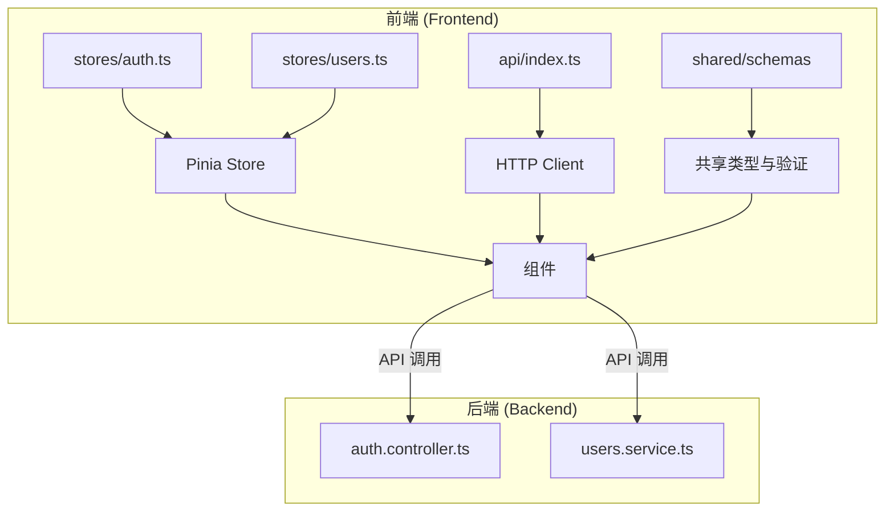
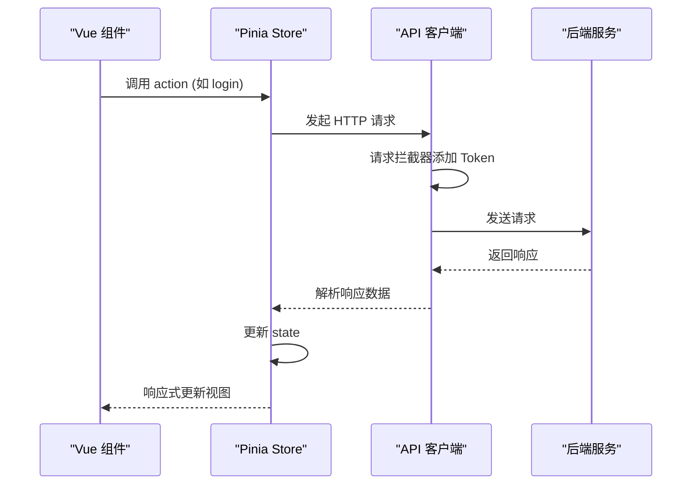
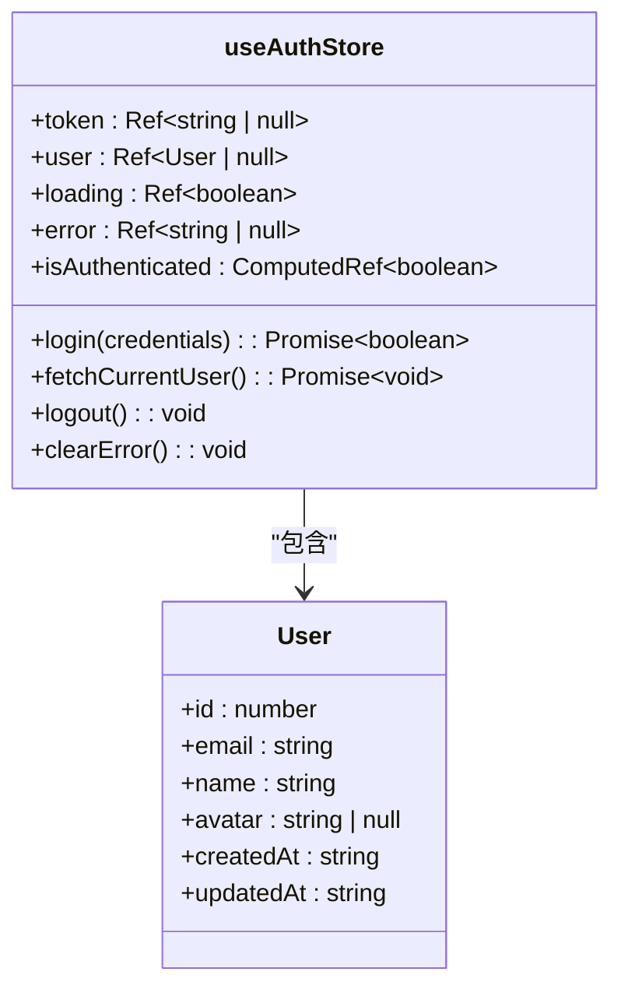
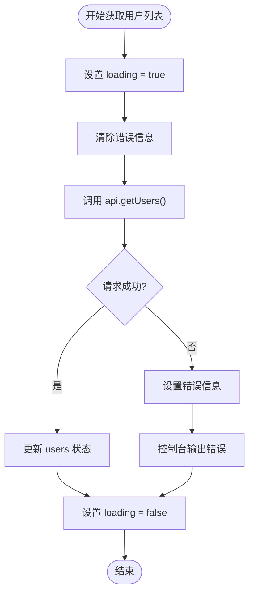
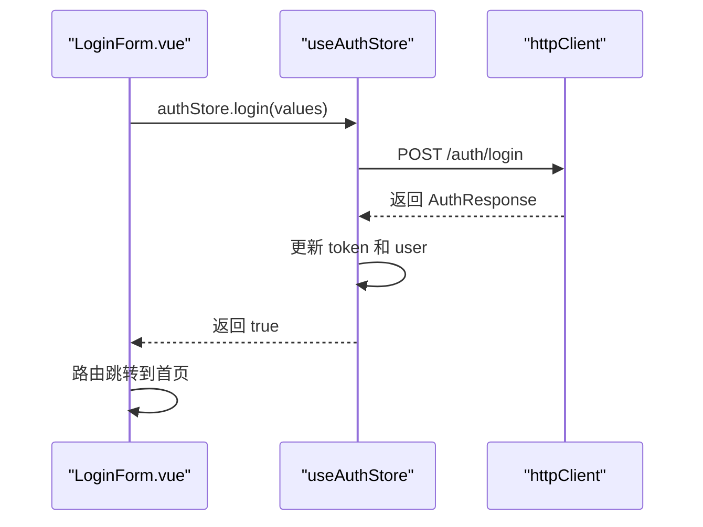

# 状态管理机制

<cite>
**本文档引用的文件**  
- [auth.ts](file://apps/frontend/src/stores/auth.ts)
- [users.ts](file://apps/frontend/src/stores/users.ts)
- [main.ts](file://apps/frontend/src/main.ts)
- [api/index.ts](file://apps/frontend/src/api/index.ts)
- [LoginForm.vue](file://apps/frontend/src/components/LoginForm.vue)
- [UsersView.vue](file://apps/frontend/src/views/UsersView.vue)
- [AppHeader.vue](file://apps/frontend/src/components/AppHeader.vue)
- [router/index.ts](file://apps/frontend/src/router/index.ts)
- [shared/schemas/auth.schema.ts](file://packages/shared/src/schemas/auth.schema.ts)
- [shared/dto/common.dto.ts](file://packages/shared/src/dto/common.dto.ts)
</cite>

## 目录
1. [简介](#简介)
2. [项目结构](#项目结构)
3. [核心组件](#核心组件)
4. [架构概览](#架构概览)
5. [详细组件分析](#详细组件分析)
6. [依赖分析](#依赖分析)
7. [性能考虑](#性能考虑)
8. [故障排除指南](#故障排除指南)
9. [结论](#结论)

## 简介
本项目采用 Pinia 作为 Vue 3 的状态管理库，结合 `pinia-plugin-persistedstate` 实现状态持久化。系统设计了 `auth` 和 `users` 两个核心 store 模块，分别管理用户认证状态和用户数据。通过响应式 state、封装业务逻辑的 actions 以及提供计算属性的 getters，实现了清晰的状态管理架构。前端通过 axios 进行 API 调用，并利用共享的 Zod Schema 确保表单验证的一致性。

## 项目结构
项目采用模块化设计，前端状态管理位于 `apps/frontend/src/stores/` 目录下，包含 `auth.ts` 和 `users.ts` 两个独立的 store 文件。API 客户端定义在 `src/api/index.ts`，并通过 `@my-app/shared` 包共享类型定义和验证规则。Pinia 实例在 `main.ts` 中初始化并应用持久化插件。



**Diagram sources**
- [auth.ts](file://apps/frontend/src/stores/auth.ts)
- [users.ts](file://apps/frontend/src/stores/users.ts)
- [api/index.ts](file://apps/frontend/src/api/index.ts)

**Section sources**
- [auth.ts](file://apps/frontend/src/stores/auth.ts)
- [users.ts](file://apps/frontend/src/stores/users.ts)
- [main.ts](file://apps/frontend/src/main.ts)

## 核心组件
`auth` store 管理用户认证状态，包括 token、用户信息、加载和错误状态。`users` store 管理用户列表数据、加载状态和错误信息。两个 store 均通过 actions 封装异步业务逻辑，如登录、登出和获取用户列表。

**Section sources**
- [auth.ts](file://apps/frontend/src/stores/auth.ts#L1-L97)
- [users.ts](file://apps/frontend/src/stores/users.ts#L1-L42)

## 架构概览
系统采用分层架构，Pinia store 作为状态中心，与 Vue 组件通过 `useStore` 钩子进行双向绑定。API 客户端处理所有 HTTP 通信，并通过拦截器自动注入认证头。共享包提供类型安全和表单验证规则，确保前后端数据一致性。



**Diagram sources**
- [auth.ts](file://apps/frontend/src/stores/auth.ts#L25-L88)
- [api/index.ts](file://apps/frontend/src/api/index.ts#L7-L56)
- [LoginForm.vue](file://apps/frontend/src/components/LoginForm.vue#L23-L28)

## 详细组件分析

### 认证模块分析
`auth` store 使用 `defineStore` 创建，定义了 `token`、`user`、`loading` 和 `error` 等响应式状态。`isAuthenticated` 计算属性基于 token 存在性判断认证状态。`login` action 处理登录逻辑，`fetchCurrentUser` 获取当前用户信息，`logout` 清除认证状态。

#### 类图


**Diagram sources**
- [auth.ts](file://apps/frontend/src/stores/auth.ts#L14-L89)
- [shared/schemas/auth.schema.ts](file://packages/shared/src/schemas/auth.schema.ts#L60-L67)

**Section sources**
- [auth.ts](file://apps/frontend/src/stores/auth.ts#L1-L97)
- [LoginForm.vue](file://apps/frontend/src/components/LoginForm.vue#L10-L28)

### 用户模块分析
`users` store 管理用户列表数据，通过 `fetchUsers` action 从后端获取用户列表。该 action 处理加载状态和错误信息，确保 UI 能正确反映请求过程。

#### 流程图


**Diagram sources**
- [users.ts](file://apps/frontend/src/stores/users.ts#L20-L32)
- [api/index.ts](file://apps/frontend/src/api/index.ts#L65-L68)

**Section sources**
- [users.ts](file://apps/frontend/src/stores/users.ts#L1-L42)
- [UsersView.vue](file://apps/frontend/src/views/UsersView.vue#L13-L14)

### 组件集成分析
Vue 组件通过 `useAuthStore` 和 `useUsersStore` 钩子访问 store 状态和方法。`LoginForm.vue` 直接使用 store 的 `login` 方法和 `error` 状态，`UsersView.vue` 使用 `storeToRefs` 解构响应式状态。

#### 序列图


**Diagram sources**
- [LoginForm.vue](file://apps/frontend/src/components/LoginForm.vue#L23-L28)
- [auth.ts](file://apps/frontend/src/stores/auth.ts#L25-L38)

**Section sources**
- [LoginForm.vue](file://apps/frontend/src/components/LoginForm.vue#L1-L99)
- [UsersView.vue](file://apps/frontend/src/views/UsersView.vue#L1-L67)

## 依赖分析
项目依赖关系清晰，前端 store 依赖于 API 客户端和共享类型定义。Pinia 插件 `pinia-plugin-persistedstate` 在 `main.ts` 中全局注册，为所有 store 提供持久化能力。路由系统与状态管理协同工作，实现基于认证状态的导航控制。

```mermaid
graph TD
A[main.ts] --> B[Pinia]
A --> C[pinia-plugin-persistedstate]
B --> D[auth.ts]
B --> E[users.ts]
D --> F[api/index.ts]
E --> F
F --> G[@my-app/shared]
D --> G
E --> G
```

**Diagram sources**
- [main.ts](file://apps/frontend/src/main.ts#L35-L37)
- [package.json](file://apps/frontend/package.json#L45)
- [auth.ts](file://apps/frontend/src/stores/auth.ts#L92-L94)

**Section sources**
- [main.ts](file://apps/frontend/src/main.ts#L1-L57)
- [package.json](file://apps/frontend/package.json)

## 性能考虑
状态管理设计考虑了性能优化。`pinia-plugin-persistedstate` 仅持久化 `token` 字段，减少本地存储开销。API 客户端设置 10 秒超时，避免请求长时间挂起。`users` store 采用按需加载模式，仅在用户访问 `/users` 页面时获取数据，减少不必要的网络请求。

## 故障排除指南
常见问题包括登录失败、用户列表加载错误和状态不持久化。检查网络请求是否成功，验证 token 是否正确存储在 localStorage 中，确认响应数据格式是否符合 `ApiResponse` 和 `User` 类型定义。错误处理在 store 层统一进行，确保 UI 能显示有意义的错误信息。

**Section sources**
- [auth.ts](file://apps/frontend/src/stores/auth.ts#L34-L37)
- [users.ts](file://apps/frontend/src/stores/users.ts#L27-L29)
- [api/index.ts](file://apps/frontend/src/api/index.ts#L45-L55)

## 结论
该项目的 Pinia 状态管理设计良好，实现了关注点分离和代码复用。通过共享类型定义确保了前后端数据一致性，利用持久化插件提升了用户体验。建议未来可以增加更细粒度的状态重置功能，并考虑使用 Vue Query 进行服务端状态管理，进一步优化数据获取和缓存策略。