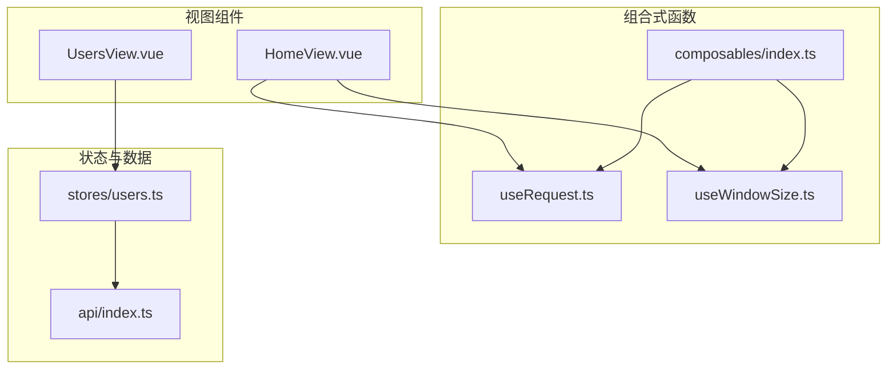
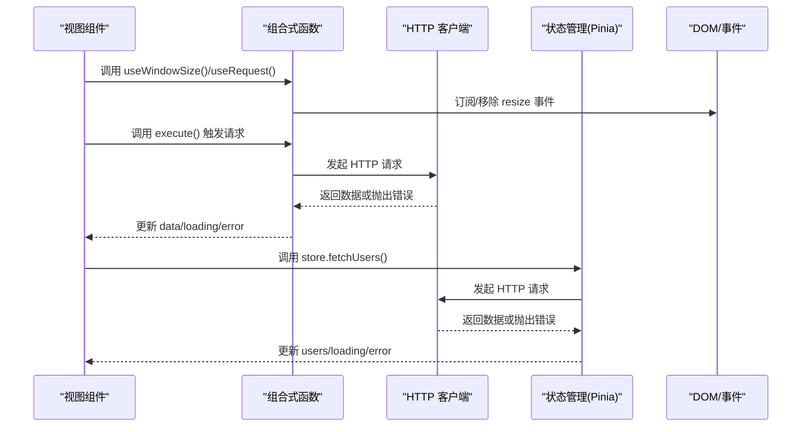
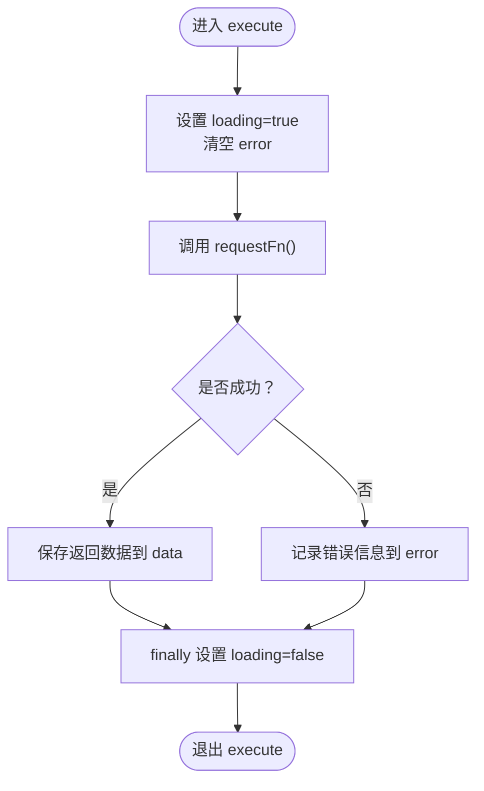
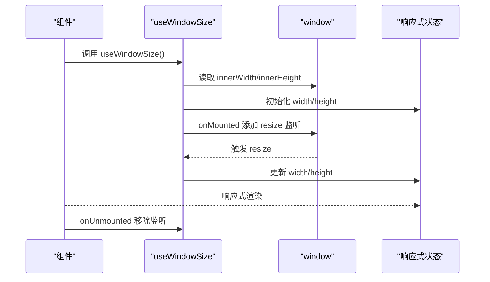
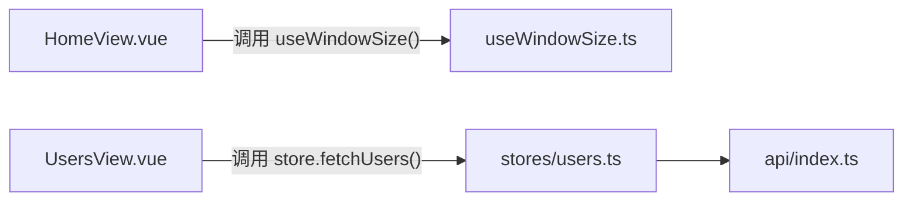
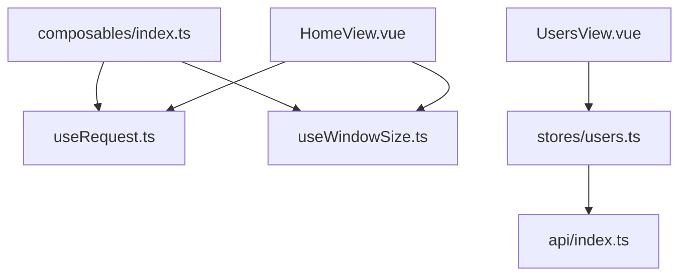

# 组合式函数

<cite>
**本文引用的文件**
- [useRequest.ts](file://apps/frontend/src/composables/useRequest.ts)
- [useWindowSize.ts](file://apps/frontend/src/composables/useWindowSize.ts)
- [index.ts](file://apps/frontend/src/composables/index.ts)
- [HomeView.vue](file://apps/frontend/src/views/HomeView.vue)
- [users.ts](file://apps/frontend/src/stores/users.ts)
- [api/index.ts](file://apps/frontend/src/api/index.ts)
</cite>

## 目录
1. [简介](#简介)
2. [项目结构](#项目结构)
3. [核心组件](#核心组件)
4. [架构总览](#架构总览)
5. [详细组件分析](#详细组件分析)
6. [依赖关系分析](#依赖关系分析)
7. [性能考量](#性能考量)
8. [故障排查指南](#故障排查指南)
9. [结论](#结论)
10. [附录：自定义 Composables 开发指南](#附录自定义-composables-开发指南)

## 简介
本文件聚焦于前端工程中的两个组合式函数：useRequest 与 useWindowSize。前者用于封装通用的 HTTP 请求逻辑，统一管理加载状态、错误处理与手动触发执行；后者用于监听浏览器窗口尺寸变化，提供响应式的宽高值。文档将系统阐述它们的设计理念、实现要点、使用方式与最佳实践，并给出自定义 Composables 的开发指南与性能优化建议。

## 项目结构
- 组合式函数位于 apps/frontend/src/composables，包含 useRequest 与 useWindowSize 两个文件，以及导出入口 index.ts。
- 组件层在 apps/frontend/src/views 下，HomeView.vue 展示了 useWindowSize 的使用；用户列表视图 UsersView.vue 使用 Pinia 状态管理与 api 封装进行数据获取。
- 数据访问层位于 apps/frontend/src/api/index.ts，提供基于 axios 的 HTTP 客户端与通用 API 方法。

图表来源
- [useRequest.ts](file://apps/frontend/src/composables/useRequest.ts#L1-L44)
- [useWindowSize.ts](file://apps/frontend/src/composables/useWindowSize.ts#L1-L35)
- [index.ts](file://apps/frontend/src/composables/index.ts#L1-L3)
- [HomeView.vue](file://apps/frontend/src/views/HomeView.vue#L1-L307)
- [users.ts](file://apps/frontend/src/stores/users.ts#L1-L42)
- [api/index.ts](file://apps/frontend/src/api/index.ts#L1-L92)

章节来源
- [index.ts](file://apps/frontend/src/composables/index.ts#L1-L3)
- [HomeView.vue](file://apps/frontend/src/views/HomeView.vue#L1-L307)
- [users.ts](file://apps/frontend/src/stores/users.ts#L1-L42)
- [api/index.ts](file://apps/frontend/src/api/index.ts#L1-L92)

## 核心组件
- useRequest：以函数式 Hook 形式封装请求执行流程，返回 data、loading、error 三类状态与一个 execute 手动触发器，便于在需要时再发起请求。
- useWindowSize：在组件挂载时订阅 resize 事件，更新响应式宽高；同时提供 useIsMobile 辅助判断移动端断点。

章节来源
- [useRequest.ts](file://apps/frontend/src/composables/useRequest.ts#L1-L44)
- [useWindowSize.ts](file://apps/frontend/src/composables/useWindowSize.ts#L1-L35)

## 架构总览
下图展示了从视图到组合式函数与数据层的整体调用路径，以及状态与副作用的流向。

图表来源
- [useWindowSize.ts](file://apps/frontend/src/composables/useWindowSize.ts#L1-L35)
- [useRequest.ts](file://apps/frontend/src/composables/useRequest.ts#L1-L44)
- [api/index.ts](file://apps/frontend/src/api/index.ts#L1-L92)
- [users.ts](file://apps/frontend/src/stores/users.ts#L1-L42)

## 详细组件分析

### useRequest 分析
- 设计目标
  - 解耦请求逻辑与 UI，避免在组件内重复编写加载、错误处理与 finally 清理。
  - 提供 execute 手动触发能力，满足“点击按钮才请求”等交互需求。
- 关键实现
  - 状态：data、loading、error 三个响应式引用，初始值合理设置。
  - 执行：execute 内部设置 loading=true，捕获异常写入 error，finally 设置 loading=false；成功后将结果赋给 data。
  - 类型：泛型 T 支持任意返回类型，返回值包含 execute 函数，便于外部调用。
- 使用建议
  - 在需要手动触发的场景优先使用 useRequest，如登录、提交表单、分页加载。
  - 对于自动加载场景，可直接在 onMounted 中调用 execute 或在 watch 中监听依赖变化。

图表来源
- [useRequest.ts](file://apps/frontend/src/composables/useRequest.ts#L16-L43)

章节来源
- [useRequest.ts](file://apps/frontend/src/composables/useRequest.ts#L1-L44)

### useWindowSize 分析
- 设计目标
  - 提供窗口尺寸的响应式观测，便于根据屏幕尺寸切换布局或行为。
  - 提供 useIsMobile 简化移动端断点判断。
- 关键实现
  - 初始化：构造时读取当前窗口宽高，作为初始值。
  - 事件绑定：onMounted 订阅 resize 事件，onUnmounted 移除监听，避免内存泄漏。
  - 返回值：width、height 两个响应式引用，useIsMobile 基于 width 计算断点。
- 使用建议
  - 在需要实时响应窗口变化的组件中使用，如导航栏折叠、图表自适应、布局切换。
  - 注意在 SSR 场景下的容错（例如仅在客户端运行），避免 window 未定义。

图表来源
- [useWindowSize.ts](file://apps/frontend/src/composables/useWindowSize.ts#L1-L35)

章节来源
- [useWindowSize.ts](file://apps/frontend/src/composables/useWindowSize.ts#L1-L35)

### 在组件中的复用模式
- HomeView.vue 展示了 useWindowSize 的使用：在模板中直接显示窗口宽高，体现响应式更新效果。
- UsersView.vue 与 stores/users.ts 展示了另一种模式：通过 Pinia 管理用户列表的状态与请求逻辑，组件只负责展示与触发，实现逻辑集中在 store 中。

图表来源
- [HomeView.vue](file://apps/frontend/src/views/HomeView.vue#L1-L307)
- [useWindowSize.ts](file://apps/frontend/src/composables/useWindowSize.ts#L1-L35)
- [users.ts](file://apps/frontend/src/stores/users.ts#L1-L42)
- [api/index.ts](file://apps/frontend/src/api/index.ts#L1-L92)

章节来源
- [HomeView.vue](file://apps/frontend/src/views/HomeView.vue#L1-L307)
- [users.ts](file://apps/frontend/src/stores/users.ts#L1-L42)

## 依赖关系分析
- 导出入口：composables/index.ts 统一导出 useRequest 与 useWindowSize，便于上层按需引入。
- 组件依赖：
  - HomeView.vue 同时使用 useWindowSize 与 useRequest（在模板中展示 useWindowSize，逻辑中可结合 useRequest 进行请求）。
  - UsersView.vue 依赖 Pinia store，store 再依赖 api 封装。
- 外部依赖：
  - useWindowSize 依赖 Vue 生命周期钩子与 window 对象。
  - useRequest 依赖 Vue 响应式系统与传入的请求函数。

图表来源
- [index.ts](file://apps/frontend/src/composables/index.ts#L1-L3)
- [useRequest.ts](file://apps/frontend/src/composables/useRequest.ts#L1-L44)
- [useWindowSize.ts](file://apps/frontend/src/composables/useWindowSize.ts#L1-L35)
- [HomeView.vue](file://apps/frontend/src/views/HomeView.vue#L1-L307)
- [users.ts](file://apps/frontend/src/stores/users.ts#L1-L42)
- [api/index.ts](file://apps/frontend/src/api/index.ts#L1-L92)

章节来源
- [index.ts](file://apps/frontend/src/composables/index.ts#L1-L3)

## 性能考量
- useWindowSize
  - 事件频率：resize 事件可能高频触发，建议在组件内部做节流/防抖或仅在必要时使用 width/height 的变化。
  - 作用域：尽量在需要监听的组件内使用，避免全局重复监听导致的性能问题。
- useRequest
  - 避免不必要的重复请求：在组件卸载前取消或忽略旧请求（若需要）。
  - UI 体验：loading 状态与错误提示要简洁明确，减少不必要的重渲染。
- 与 Pinia 的配合
  - 将请求逻辑下沉至 store，组件只负责展示与触发，有助于集中管理缓存与去重策略。

[本节为通用指导，不直接分析具体文件]

## 故障排查指南
- useRequest
  - 现象：loading 一直为 true
    - 可能原因：execute 未被调用或请求未结束
    - 排查步骤：确认调用 execute；检查 finally 是否执行
  - 现象：error 未显示
    - 可能原因：错误被捕获但未上报
    - 排查步骤：检查错误分支是否写入 error；确认 UI 是否绑定 error
- useWindowSize
  - 现象：SSR 报错 window 未定义
    - 可能原因：服务端渲染时直接访问 window
    - 排查步骤：仅在客户端运行；或在 onMounted 后再使用
  - 现象：resize 不生效
    - 可能原因：未在 onUnmounted 移除监听
    - 排查步骤：确认生命周期钩子是否正确绑定与解绑
- 与 API 层协作
  - 现象：鉴权失败或 401
    - 可能原因：缺少 token 或 CSRF 校验失败
    - 排查步骤：检查请求拦截器是否注入 Authorization/X-XSRF-TOKEN；响应拦截器是否清理 token

章节来源
- [useRequest.ts](file://apps/frontend/src/composables/useRequest.ts#L16-L43)
- [useWindowSize.ts](file://apps/frontend/src/composables/useWindowSize.ts#L1-L35)
- [api/index.ts](file://apps/frontend/src/api/index.ts#L1-L92)

## 结论
useRequest 与 useWindowSize 通过最小职责原则实现了对通用逻辑的抽象与复用：前者统一了请求的加载与错误处理，后者提供了窗口尺寸的响应式观测。二者均可在组件中以极简方式接入，显著降低样板代码，提升可维护性与可测试性。对于更复杂的业务场景，建议将请求逻辑下沉至 store，结合 API 层拦截器与响应式状态，形成清晰的分层与职责边界。

[本节为总结性内容，不直接分析具体文件]

## 附录：自定义 Composables 开发指南
- 参数设计
  - 明确输入：尽可能将外部依赖（如 API 方法、配置项）以外部参数形式传入，保持组合式函数的可测试性与可替换性。
  - 可选参数：通过对象参数提供默认值，避免过多重载。
- 返回值规范
  - 状态：返回响应式状态（如 loading、data、error），便于在模板中直接使用。
  - 行为：提供必要的执行器（如 execute、refetch、reset），满足不同交互需求。
  - 辅助：提供派生状态（如 useIsMobile 基于 width 的断点判断）。
- 副作用管理
  - 生命周期：在 onMounted/onUnmounted 中注册/注销事件，避免内存泄漏。
  - 异步：确保 finally 中清理状态，防止状态悬挂。
- 性能优化
  - 避免高频事件：对 resize、scroll 等事件做节流/防抖。
  - 状态粒度：按需拆分状态，减少不必要的响应式依赖。
  - 缓存与去重：在 store 或外部缓存层做请求去重与缓存。
- 常见陷阱规避
  - SSR 容错：避免在服务端直接访问 window/document 等全局对象。
  - 依赖泄漏：确保在组件卸载时移除事件监听与定时器。
  - 错误处理：统一错误格式，避免吞掉错误或重复上报。
  - 类型安全：为组合式函数提供明确的泛型约束，提升 IDE 体验与可维护性。

[本节为通用指导，不直接分析具体文件]