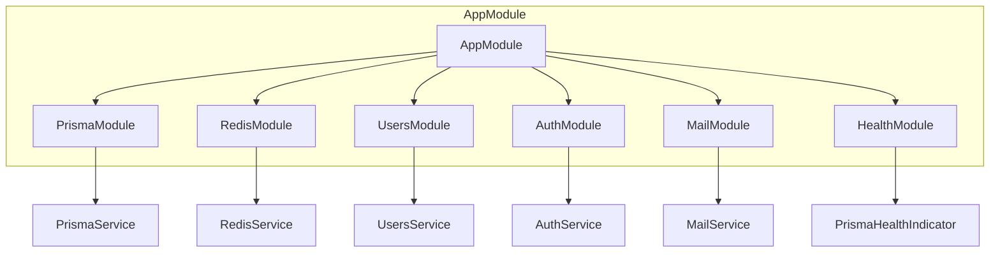
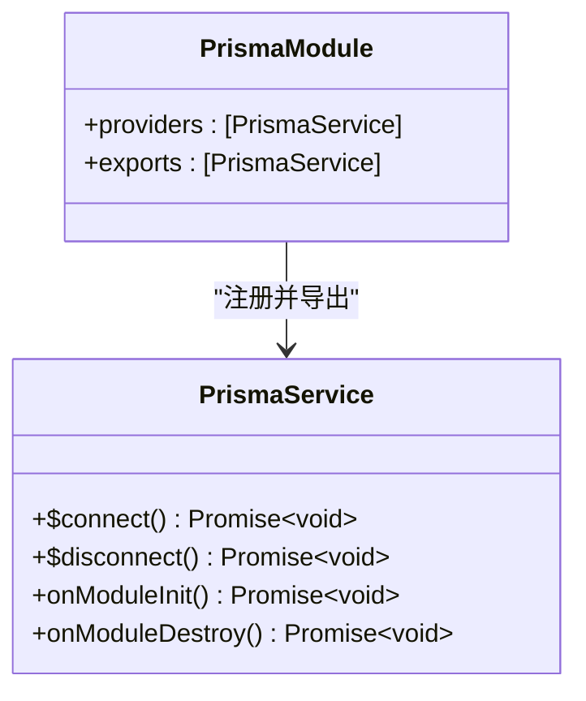
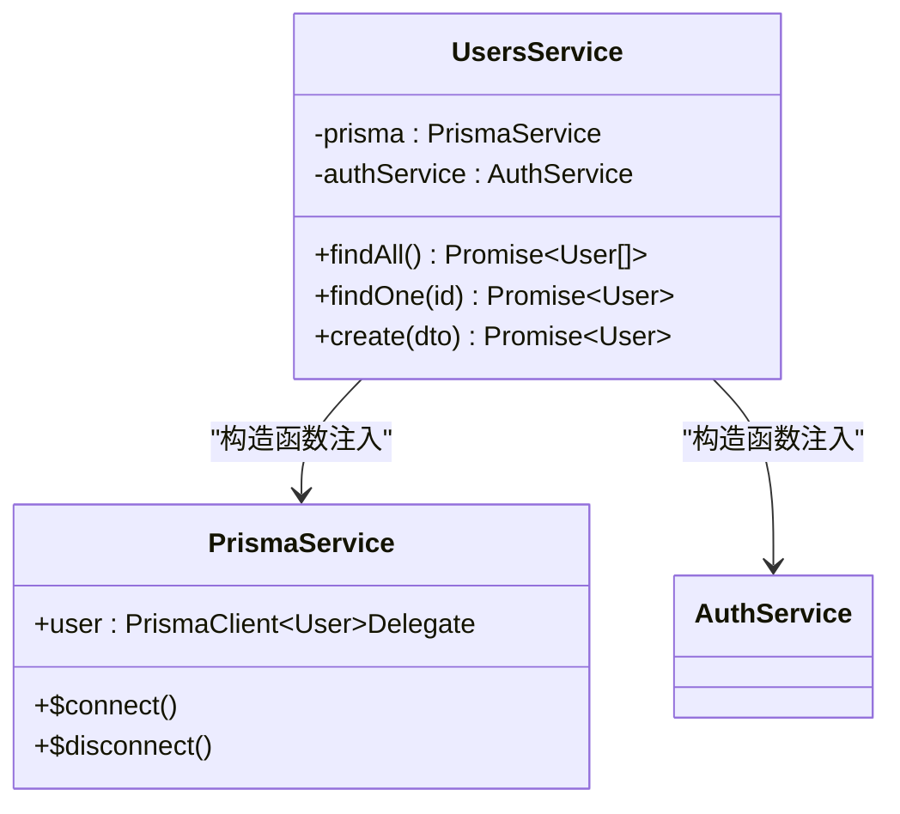
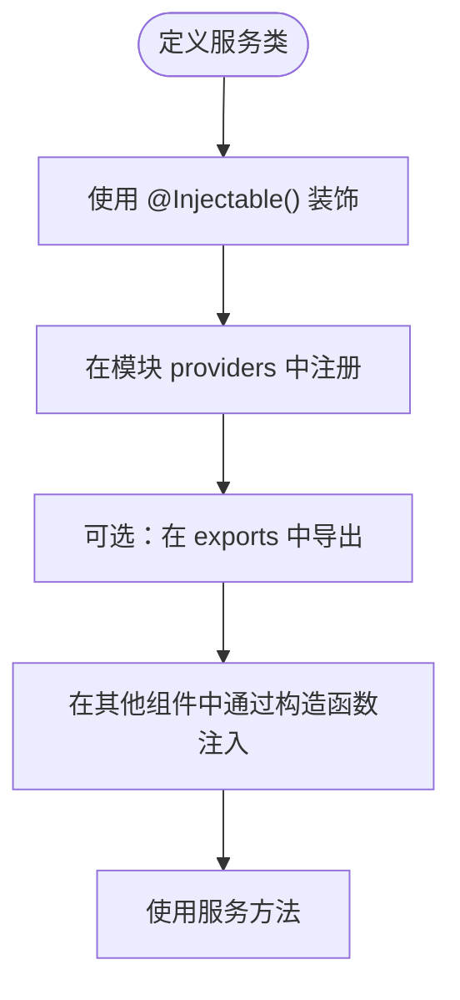
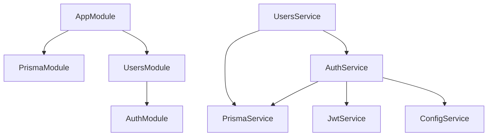
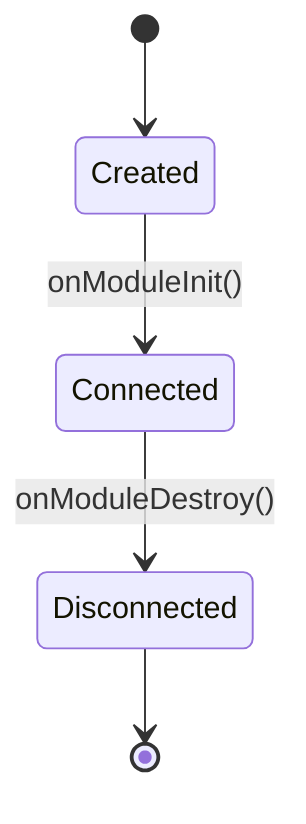
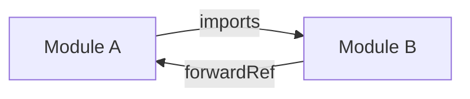
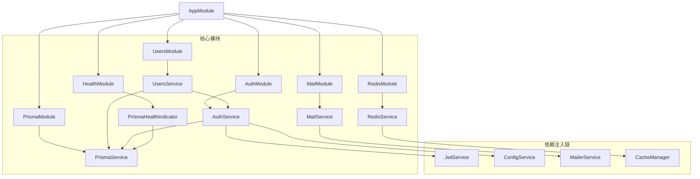
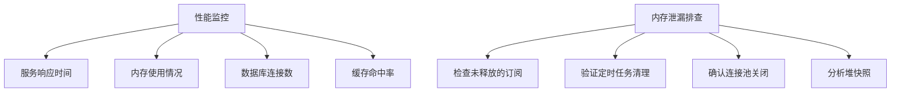

# 依赖注入机制

<cite>
**本文档引用文件**  
- [app.module.ts](file://apps/backend/src/app.module.ts)
- [prisma.module.ts](file://apps/backend/src/prisma/prisma.module.ts)
- [prisma.service.ts](file://apps/backend/src/prisma/prisma.service.ts)
- [users.service.ts](file://apps/backend/src/users/users.service.ts)
- [users.module.ts](file://apps/backend/src/users/users.module.ts)
- [auth.service.ts](file://apps/backend/src/auth/auth.service.ts)
- [auth.module.ts](file://apps/backend/src/auth/auth.module.ts)
- [redis.service.ts](file://apps/backend/src/redis/redis.service.ts)
- [redis.module.ts](file://apps/backend/src/redis/redis.module.ts)
- [mail.service.ts](file://apps/backend/src/mail/mail.service.ts)
- [mail.module.ts](file://apps/backend/src/mail/mail.module.ts)
- [prisma.health.ts](file://apps/backend/src/health/prisma.health.ts)
- [health.module.ts](file://apps/backend/src/health/health.module.ts)
</cite>

## 目录
1. [简介](#简介)
2. [模块结构与DI容器角色](#模块结构与di容器角色)
3. [核心组件分析](#核心组件分析)
4. [依赖注入树构建过程](#依赖注入树构建过程)
5. [服务作用域与生命周期](#服务作用域与生命周期)
6. [循环依赖处理机制](#循环依赖处理机制)
7. [测试中的依赖替换策略](#测试中的依赖替换策略)
8. [依赖关系图谱](#依赖关系图谱)
9. [性能监控与内存泄漏排查](#性能监控与内存泄漏排查)
10. [结论](#结论)

## 简介
NestJS 的依赖注入（DI）系统是其核心架构的基础，实现了松耦合、高内聚的设计原则。通过模块化组织 providers、controllers 和 imports，NestJS 构建了一个可预测、可测试且易于维护的应用结构。本文件深入分析该系统的实现机制，以 `PrismaService` 为例说明数据访问层如何被封装并注入到业务服务中，展示服务间依赖关系的管理方式，并探讨 DI 容器在应用启动时的解析流程。

## 模块结构与DI容器角色

NestJS 使用模块（Module）作为组织代码的单元，每个模块通过 `@Module()` 装饰器定义其内部结构。模块中的 `providers`、`controllers` 和 `imports` 在 DI 容器中扮演不同角色：

- **Providers**：可被注入的服务、工厂、值或类，由 DI 容器管理生命周期
- **Controllers**：处理 HTTP 请求的路由处理器
- **Imports**：导入其他模块以复用其导出的 providers

根模块 `AppModule` 通过导入多个功能模块（如 `PrismaModule`、`UsersModule`）构建完整的依赖图谱。



**图示来源**
- [app.module.ts](file://apps/backend/src/app.module.ts#L8-L16)
- [prisma.module.ts](file://apps/backend/src/prisma/prisma.module.ts#L5-L8)
- [users.module.ts](file://apps/backend/src/users/users.module.ts#L6-L11)

## 核心组件分析

### PrismaService 作为全局提供者

`PrismaService` 是一个典型的提供者（Provider），封装了数据库连接与操作逻辑。它通过 `@Injectable()` 标记为可注入类，并在 `PrismaModule` 中注册为 provider 和 export，使其在整个应用中可用。



**图示来源**
- [prisma.service.ts](file://apps/backend/src/prisma/prisma.service.ts#L4-L19)
- [prisma.module.ts](file://apps/backend/src/prisma/prisma.module.ts#L6-L7)

**本节来源**
- [prisma.service.ts](file://apps/backend/src/prisma/prisma.service.ts#L1-L20)
- [prisma.module.ts](file://apps/backend/src/prisma/prisma.module.ts#L1-L10)

### UsersService 对 PrismaService 的依赖

`UsersService` 通过构造函数注入 `PrismaService`，实现数据访问层与业务逻辑层的分离。这种依赖注入方式使得服务职责清晰，便于单元测试和替换实现。



**图示来源**
- [users.service.ts](file://apps/backend/src/users/users.service.ts#L13-L16)
- [prisma.service.ts](file://apps/backend/src/prisma/prisma.service.ts#L5-L6)

**本节来源**
- [users.service.ts](file://apps/backend/src/users/users.service.ts#L1-L66)
- [auth.service.ts](file://apps/backend/src/auth/auth.service.ts#L25-L28)

### 自定义服务的创建与注册

自定义服务（如 `MailService`、`RedisService`）遵循统一的创建模式：使用 `@Injectable()` 装饰器标记，通过模块的 `providers` 数组注册，并可选择性地通过 `exports` 暴露给其他模块使用。



**图示来源**
- [mail.service.ts](file://apps/backend/src/mail/mail.service.ts#L15)
- [mail.module.ts](file://apps/backend/src/mail/mail.module.ts#L30)
- [redis.service.ts](file://apps/backend/src/redis/redis.service.ts#L51)

## 依赖注入树构建过程

NestJS 在应用启动时构建依赖注入树，解析所有模块及其依赖关系。该过程包括：

1. **模块解析**：扫描所有 `@Module()` 装饰的类，收集 `imports`、`providers`、`controllers`
2. **提供者注册**：将 `providers` 注册到 DI 容器，支持单例（Singleton）或请求作用域（Request-scoped）
3. **依赖解析**：根据构造函数参数类型自动解析并注入依赖
4. **循环依赖检测**：识别并处理潜在的循环依赖问题

例如，`UsersModule` 导入 `AuthModule`，而 `UsersService` 又依赖 `AuthService`，形成跨模块依赖链。



**图示来源**
- [app.module.ts](file://apps/backend/src/app.module.ts#L10-L14)
- [users.module.ts](file://apps/backend/src/users/users.module.ts#L7)
- [auth.module.ts](file://apps/backend/src/auth/auth.module.ts#L15)

## 服务作用域与生命周期

NestJS 支持多种服务作用域：

- **Singleton（默认）**：整个应用生命周期内仅创建一个实例
- **Request-scoped**：每个请求创建独立实例，适用于需要隔离状态的场景

`PrismaService` 继承自 `PrismaClient` 并实现 `OnModuleInit` 和 `OnModuleDestroy` 接口，在模块初始化时建立数据库连接，销毁时断开连接，确保资源正确管理。



**图示来源**
- [prisma.service.ts](file://apps/backend/src/prisma/prisma.service.ts#L12-L17)

## 循环依赖处理机制

当两个模块或服务相互依赖时，会出现循环依赖。NestJS 提供以下解决方案：

- **forwardRef()**：延迟引用，解决模块间循环依赖
- **@Inject()**：显式注入令牌，解决构造函数参数循环依赖

虽然当前代码库中未出现明显循环依赖，但设计上已预留处理机制。例如，若 `AuthService` 需要调用 `UsersService` 方法，则可通过 `forwardRef` 解决。



## 测试中的依赖替换策略

在单元测试中，可通过 `useValue`、`useClass` 或 `useFactory` 替换真实依赖，实现隔离测试。例如，为 `UsersService` 测试提供模拟的 `PrismaService` 实例。

```typescript
const module = await Test.createTestingModule({
  providers: [
    UsersService,
    {
      provide: PrismaService,
      useValue: mockPrismaService,
    },
  ],
}).compile();
```

此机制依赖 DI 容器的可配置性，允许在不同环境（开发、测试、生产）中灵活替换实现。

## 依赖关系图谱

以下是系统主要组件的依赖关系全景图：



**图示来源**
- [app.module.ts](file://apps/backend/src/app.module.ts#L8-L16)
- [users.service.ts](file://apps/backend/src/users/users.service.ts#L13-L16)
- [auth.service.ts](file://apps/backend/src/auth/auth.service.ts#L25-L28)
- [prisma.health.ts](file://apps/backend/src/health/prisma.health.ts#L11)

## 性能监控与内存泄漏排查

### 性能建议
- 尽量使用单例服务以减少实例化开销
- 避免在服务中存储大量状态数据
- 对高频调用的服务考虑缓存机制（如 `RedisService`）

### 内存泄漏排查
- 监控 `PrismaClient` 连接池状态
- 确保 `OnModuleDestroy` 正确执行资源释放
- 使用 `@nestjs/terminus` 健康检查模块定期检测数据库连接



**图示来源**
- [prisma.service.ts](file://apps/backend/src/prisma/prisma.service.ts#L16-L17)
- [redis.service.ts](file://apps/backend/src/redis/redis.service.ts#L58-L72)
- [prisma.health.ts](file://apps/backend/src/health/prisma.health.ts#L20)

## 结论
NestJS 的依赖注入机制通过模块化设计和构造函数注入，实现了高度解耦的架构。`PrismaService` 作为全局提供者被多个服务共享，体现了数据访问层的集中管理。服务间的依赖关系清晰可追溯，DI 容器负责实例化和生命周期管理，极大提升了代码的可测试性和可维护性。合理利用作用域配置、循环依赖解决方案和测试替换策略，能够构建出稳定高效的后端系统。