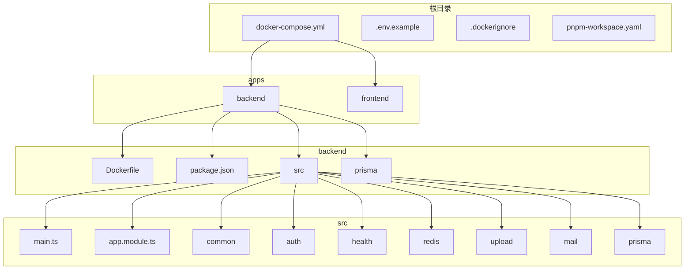
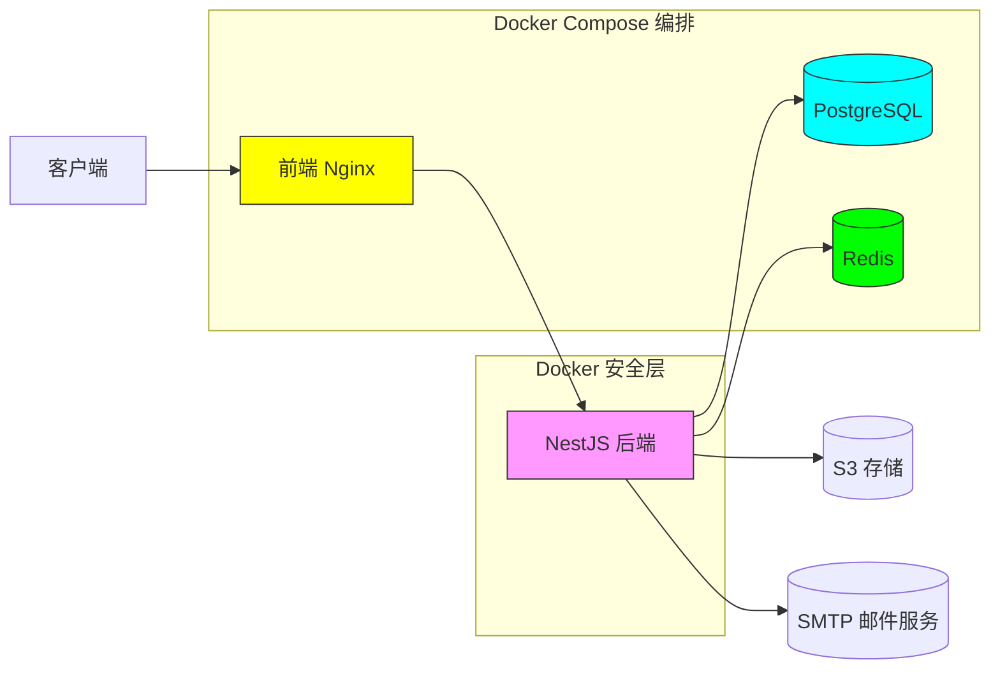
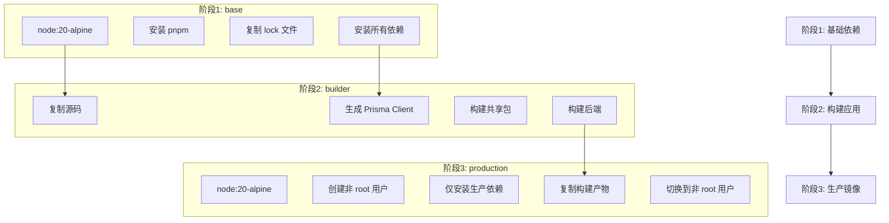
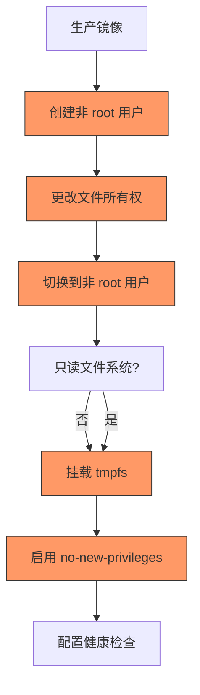
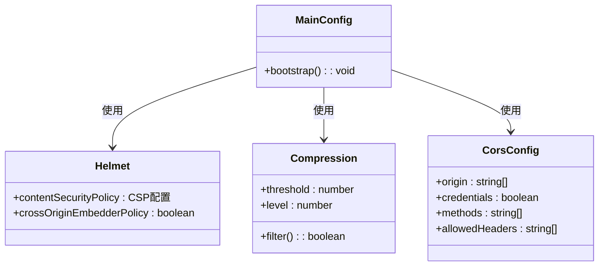
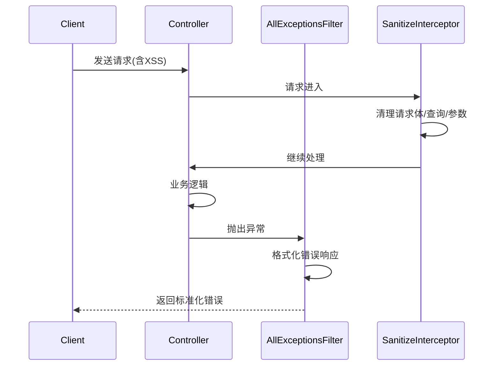
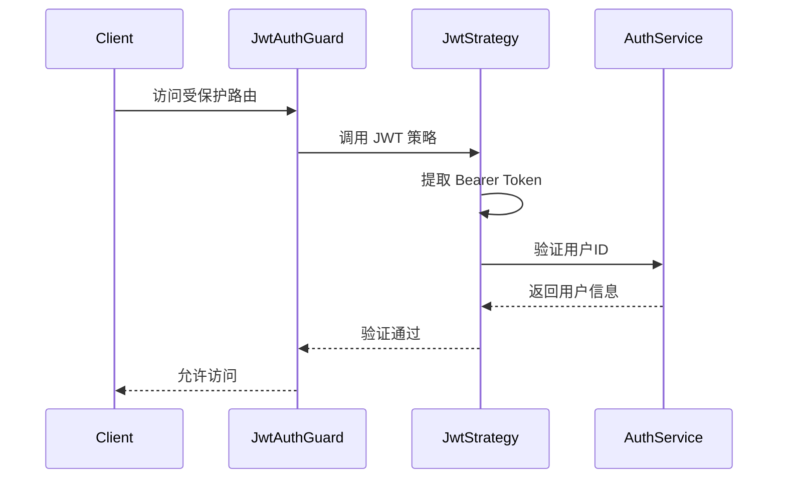

# 后端 Docker 安全优化与依赖调整

<cite>
**本文档引用文件**  
- [Dockerfile](file://apps/backend/Dockerfile)
- [package.json](file://apps/backend/package.json)
- [docker-compose.yml](file://docker-compose.yml)
- [main.ts](file://apps/backend/src/main.ts)
- [app.module.ts](file://apps/backend/src/app.module.ts)
- [csrf.middleware.ts](file://apps/backend/src/common/middlewares/csrf.middleware.ts)
- [all-exceptions.filter.ts](file://apps/backend/src/common/filters/all-exceptions.filter.ts)
- [sanitize.interceptor.ts](file://apps/backend/src/common/interceptors/sanitize.interceptor.ts)
- [transform.interceptor.ts](file://apps/backend/src/common/interceptors/transform.interceptor.ts)
- [jwt.strategy.ts](file://apps/backend/src/auth/jwt.strategy.ts)
- [health.controller.ts](file://apps/backend/src/health/health.controller.ts)
- [prisma.health.ts](file://apps/backend/src/health/prisma.health.ts)
- [redis.health.ts](file://apps/backend/src/redis/redis.health.ts)
- [storage.service.ts](file://apps/backend/src/upload/storage.service.ts)
- [mail.service.ts](file://apps/backend/src/mail/mail.service.ts)
- [prisma.service.ts](file://apps/backend/src/prisma/prisma.service.ts)
</cite>

## 目录
1. [简介](#简介)
2. [项目结构](#项目结构)
3. [核心组件](#核心组件)
4. [架构概览](#架构概览)
5. [详细组件分析](#详细组件分析)
6. [依赖分析](#依赖分析)
7. [性能考量](#性能考量)
8. [故障排除指南](#故障排除指南)
9. [结论](#结论)

## 简介
本项目是一个基于 NestJS 的后端服务，采用多阶段 Docker 构建策略，结合 Prisma ORM、Redis 缓存、BullMQ 队列和 AWS S3 存储，构建了一个现代化的全栈应用。项目通过 Docker Compose 实现服务编排，具备完整的健康检查、安全防护和日志记录机制。本文档重点分析其 Docker 安全优化措施与依赖管理策略。

## 项目结构



**图示来源**  
- [Dockerfile](file://apps/backend/Dockerfile)
- [docker-compose.yml](file://docker-compose.yml)
- [package.json](file://apps/backend/package.json)

**本节来源**  
- [Dockerfile](file://apps/backend/Dockerfile#L1-L97)
- [docker-compose.yml](file://docker-compose.yml#L1-L189)

## 核心组件

后端服务的核心组件包括：基于多阶段构建的安全 Docker 镜像、通过 `main.ts` 配置的安全中间件、在 `app.module.ts` 中定义的全局模块与守卫、以及分布在 `common` 目录下的全局过滤器、拦截器和中间件。这些组件共同构成了应用的安全基线与运行时环境。

**本节来源**  
- [main.ts](file://apps/backend/src/main.ts#L1-L94)
- [app.module.ts](file://apps/backend/src/app.module.ts#L1-L159)
- [Dockerfile](file://apps/backend/Dockerfile#L1-L97)

## 架构概览



**图示来源**  
- [docker-compose.yml](file://docker-compose.yml#L1-L189)
- [Dockerfile](file://apps/backend/Dockerfile#L1-L97)

## 详细组件分析

### Docker 安全与构建优化分析

#### 多阶段构建与依赖分离


**图示来源**  
- [Dockerfile](file://apps/backend/Dockerfile#L1-L97)

#### 安全配置与加固措施


**图示来源**  
- [Dockerfile](file://apps/backend/Dockerfile#L54-L81)
- [docker-compose.yml](file://docker-compose.yml#L137-L142)

**本节来源**  
- [Dockerfile](file://apps/backend/Dockerfile#L1-L97)
- [docker-compose.yml](file://docker-compose.yml#L137-L142)

### 后端安全中间件分析

#### 全局安全中间件配置


**图示来源**  
- [main.ts](file://apps/backend/src/main.ts#L24-L63)

#### 全局异常处理与数据清理


**图示来源**  
- [all-exceptions.filter.ts](file://apps/backend/src/common/filters/all-exceptions.filter.ts#L1-L31)
- [sanitize.interceptor.ts](file://apps/backend/src/common/interceptors/sanitize.interceptor.ts#L1-L61)

**本节来源**  
- [main.ts](file://apps/backend/src/main.ts#L65-L72)
- [all-exceptions.filter.ts](file://apps/backend/src/common/filters/all-exceptions.filter.ts#L1-L31)
- [sanitize.interceptor.ts](file://apps/backend/src/common/interceptors/sanitize.interceptor.ts#L1-L61)

### 认证与健康检查机制

#### JWT 认证流程


**图示来源**  
- [jwt-auth.guard.ts](file://apps/backend/src/auth/jwt-auth.guard.ts#L1-L10)
- [jwt.strategy.ts](file://apps/backend/src/auth/jwt.strategy.ts#L1-L47)

#### 健康检查端点设计
```mermaid
flowchart TD
A[/health] --> B[数据库检查]
A --> C[Redis检查]
A --> D[内存堆检查]
A --> E[内存RSS检查]
A --> F[磁盘存储检查]
G[/health/readiness] --> H[数据库检查]
G --> I[Redis检查]
J[/health/liveness] --> K[返回OK]
style A fill:#6f9,stroke:#333
style G fill:#6f9,stroke:#333
style J fill:#6f9,stroke:#333
```

**图示来源**  
- [health.controller.ts](file://apps/backend/src/health/health.controller.ts#L1-L77)
- [prisma.health.ts](file://apps/backend/src/health/prisma.health.ts#L1-L32)
- [redis.health.ts](file://apps/backend/src/redis/redis.health.ts#L1-L43)

**本节来源**  
- [app.module.ts](file://apps/backend/src/app.module.ts#L137-L138)
- [health.controller.ts](file://apps/backend/src/health/health.controller.ts#L1-L77)

## 依赖分析

```mermaid
graph LR
Backend[后端应用] --> Prisma[@prisma/client]
Backend --> Redis[ioredis]
Backend --> BullMQ[bulmq]
Backend --> Mailer[@nestjs-modules/mailer]
Backend --> S3[@aws-sdk/client-s3]
Backend --> Security[helmet,xss,sanitize-html]
Backend --> Logging[nestjs-pino]
Backend --> Validation[nestjs-zod]
subgraph "生产依赖"
Prisma
Redis
BullMQ
Mailer
S3
Security
Logging
Validation
end
style Prisma fill:#f99,stroke:#333
style Redis fill:#9f9,stroke:#333
style BullMQ fill:#9f9,stroke:#333
style Mailer fill:#99f,stroke:#333
style S3 fill:#ff9,stroke:#333
style Security fill:#f96,stroke:#333
style Logging fill:#9ff,stroke:#333
style Validation fill:#f66,stroke:#333
```

**图示来源**  
- [package.json](file://apps/backend/package.json#L21-L66)
- [docker-compose.yml](file://docker-compose.yml#L5-L64)

**本节来源**  
- [package.json](file://apps/backend/package.json#L21-L66)
- [docker-compose.yml](file://docker-compose.yml#L5-L64)

## 性能考量
项目通过多阶段 Docker 构建优化了镜像大小与构建速度，利用层缓存提升 CI/CD 效率。生产镜像仅包含运行时依赖，显著减小了攻击面。应用层面通过 Gzip 压缩、Redis 缓存和数据库连接池提升了响应性能。速率限制守卫有效防止了暴力破解攻击，保障了服务稳定性。

## 故障排除指南

当遇到服务启动失败时，应首先检查 `docker-compose logs backend` 日志，确认环境变量是否正确注入，特别是 `DATABASE_URL` 和 `JWT_SECRET`。若健康检查失败，需验证 PostgreSQL 和 Redis 服务是否正常运行。文件上传问题通常与 S3 凭据或网络配置有关。JWT 认证失败应检查密钥配置与用户状态。

**本节来源**  
- [main.ts](file://apps/backend/src/main.ts#L84-L90)
- [app.module.ts](file://apps/backend/src/app.module.ts#L25-L28)
- [jwt.strategy.ts](file://apps/backend/src/auth/jwt.strategy.ts#L22-L25)

## 结论
该项目展示了现代化 NestJS 应用的最佳实践，通过严谨的 Docker 多阶段构建、全面的安全中间件配置和清晰的依赖管理，构建了一个安全、高效、可维护的后端服务。其安全加固措施（非 root 用户、只读文件系统、no-new-privileges）符合生产环境要求，健康检查与日志配置便于运维监控，整体架构设计合理，具备良好的扩展性与稳定性。