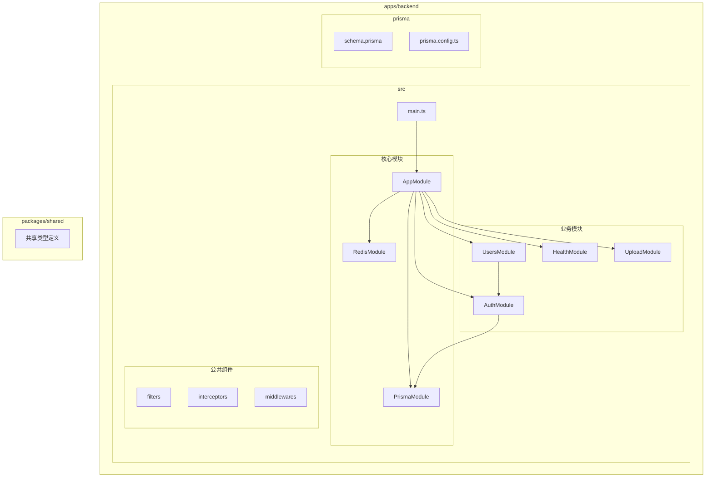
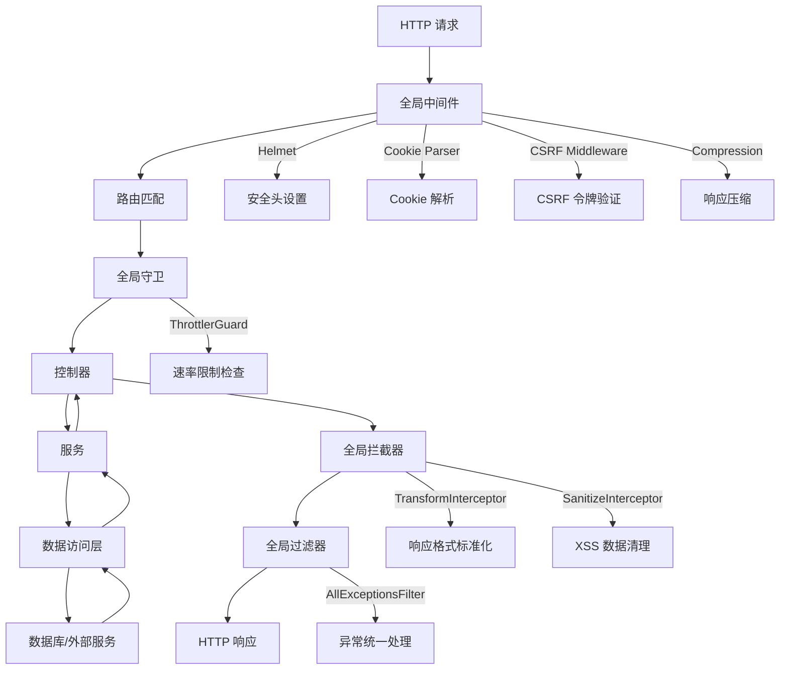
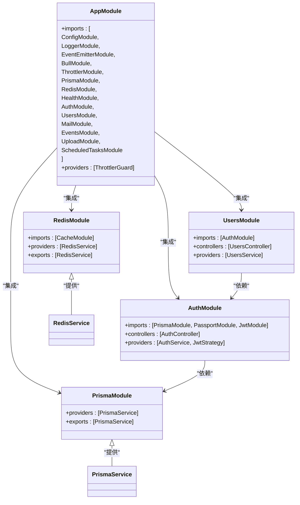
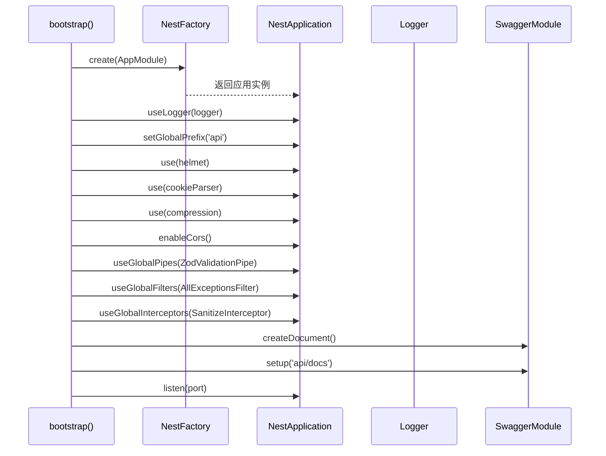
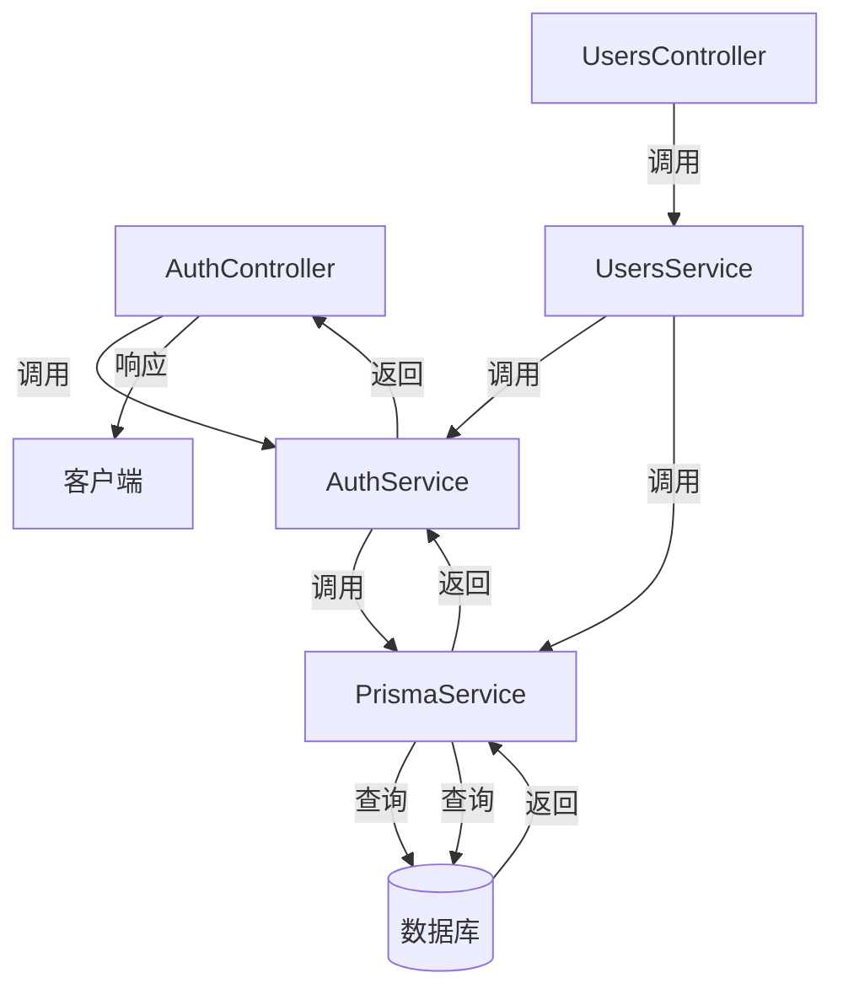
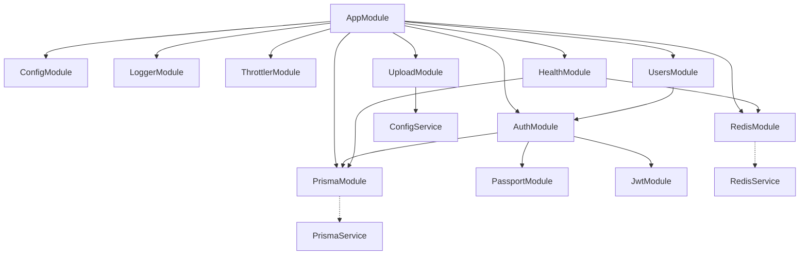

# 后端架构

<cite>
**本文档中引用的文件**  
- [app.module.ts](file://apps/backend/src/app.module.ts)
- [main.ts](file://apps/backend/src/main.ts)
- [auth.module.ts](file://apps/backend/src/auth/auth.module.ts)
- [users.module.ts](file://apps/backend/src/users/users.module.ts)
- [prisma.module.ts](file://apps/backend/src/prisma/prisma.module.ts)
- [redis.module.ts](file://apps/backend/src/redis/redis.module.ts)
- [all-exceptions.filter.ts](file://apps/backend/src/common/filters/all-exceptions.filter.ts)
- [transform.interceptor.ts](file://apps/backend/src/common/interceptors/transform.interceptor.ts)
- [csrf.middleware.ts](file://apps/backend/src/common/middlewares/csrf.middleware.ts)
- [auth.controller.ts](file://apps/backend/src/auth/auth.controller.ts)
- [users.controller.ts](file://apps/backend/src/users/users.controller.ts)
- [auth.service.ts](file://apps/backend/src/auth/auth.service.ts)
- [users.service.ts](file://apps/backend/src/users/users.service.ts)
- [prisma.service.ts](file://apps/backend/src/prisma/prisma.service.ts)
- [redis.service.ts](file://apps/backend/src/redis/redis.service.ts)
- [health.module.ts](file://apps/backend/src/health/health.module.ts)
- [upload.module.ts](file://apps/backend/src/upload/upload.module.ts)
</cite>

## 目录
1. [简介](#简介)
2. [项目结构](#项目结构)
3. [核心组件](#核心组件)
4. [架构概览](#架构概览)
5. [详细组件分析](#详细组件分析)
6. [依赖分析](#依赖分析)
7. [性能考虑](#性能考虑)
8. [故障排除指南](#故障排除指南)
9. [结论](#结论)

## 简介
本架构文档深入分析基于 NestJS 的后端应用设计。文档详细阐述了模块化架构、依赖注入机制、请求处理生命周期以及安全策略的实现。通过分析 AppModule 的模块集成、main.ts 的初始化流程以及控制器-服务-数据库的三层结构，展示了系统的可维护性和扩展性优势。同时，文档还涵盖了全局异常处理、请求响应标准化、速率限制和 CSRF 防护等关键安全特性。

## 项目结构
该项目采用多应用工作区结构，后端服务位于 `apps/backend` 目录下，遵循 NestJS 的标准模块化组织方式。核心业务逻辑按功能划分到独立模块（如 auth、users、prisma），公共组件（如过滤器、拦截器、中间件）集中于 common 目录，实现了高内聚低耦合的设计原则。

**Diagram sources**
- [app.module.ts](file://apps/backend/src/app.module.ts#L22-L158)
- [main.ts](file://apps/backend/src/main.ts#L14-L93)

**Section sources**
- [app.module.ts](file://apps/backend/src/app.module.ts#L1-L159)
- [main.ts](file://apps/backend/src/main.ts#L1-L94)

## 核心组件
本系统的核心组件包括：AppModule 作为根模块集成所有功能模块；PrismaModule 提供数据库访问服务；RedisModule 实现缓存和会话管理；AuthModule 负责用户认证与授权；UsersModule 处理用户管理业务逻辑。这些组件通过依赖注入机制协同工作，形成了清晰的职责划分。

**Section sources**
- [app.module.ts](file://apps/backend/src/app.module.ts#L22-L158)
- [prisma.module.ts](file://apps/backend/src/prisma/prisma.module.ts#L4-L9)
- [redis.module.ts](file://apps/backend/src/redis/redis.module.ts#L26-L83)
- [auth.module.ts](file://apps/backend/src/auth/auth.module.ts#L13-L31)
- [users.module.ts](file://apps/backend/src/users/users.module.ts#L6-L12)

## 架构概览
该 NestJS 应用采用分层架构设计，从上至下分为：入口层（main.ts）、模块层（AppModule 及其导入模块）、控制器层（Controllers）、服务层（Services）和数据访问层（PrismaService）。全局中间件、守卫、过滤器和拦截器贯穿整个请求处理流程，提供统一的安全、日志和响应处理。

**Diagram sources**
- [main.ts](file://apps/backend/src/main.ts#L25-L73)
- [app.module.ts](file://apps/backend/src/app.module.ts#L146-L150)
- [csrf.middleware.ts](file://apps/backend/src/common/middlewares/csrf.middleware.ts#L15-L92)
- [all-exceptions.filter.ts](file://apps/backend/src/common/filters/all-exceptions.filter.ts#L8-L30)
- [transform.interceptor.ts](file://apps/backend/src/common/interceptors/transform.interceptor.ts#L18-L29)

## 详细组件分析

### 模块集成与依赖关系
AppModule 作为应用的根模块，通过 `imports` 数组集成所有核心功能模块。这种模块化设计实现了关注点分离，提高了代码的可维护性和可测试性。各模块之间通过明确的依赖关系进行通信，避免了紧耦合。

**Diagram sources**
- [app.module.ts](file://apps/backend/src/app.module.ts#L22-L158)
- [auth.module.ts](file://apps/backend/src/auth/auth.module.ts#L13-L31)
- [users.module.ts](file://apps/backend/src/users/users.module.ts#L6-L12)
- [prisma.module.ts](file://apps/backend/src/prisma/prisma.module.ts#L4-L9)
- [redis.module.ts](file://apps/backend/src/redis/redis.module.ts#L26-L83)

**Section sources**
- [app.module.ts](file://apps/backend/src/app.module.ts#L22-L158)
- [auth.module.ts](file://apps/backend/src/auth/auth.module.ts#L13-L31)
- [users.module.ts](file://apps/backend/src/users/users.module.ts#L6-L12)

### 初始化流程分析
main.ts 文件中的 `bootstrap` 函数负责应用的初始化。通过 NestFactory.create() 创建应用实例后，依次配置了安全中间件、CORS、全局管道、过滤器和拦截器，并设置了 Swagger 文档。这一系列配置确保了应用启动时具备完整的安全防护和开发支持。

**Diagram sources**
- [main.ts](file://apps/backend/src/main.ts#L14-L93)

**Section sources**
- [main.ts](file://apps/backend/src/main.ts#L14-L93)

### 三层架构实现
系统严格遵循控制器-服务-数据访问的三层架构。控制器负责处理 HTTP 请求和响应，服务层封装业务逻辑，数据访问层（PrismaService）直接与数据库交互。这种分层设计使得各层职责清晰，便于单元测试和维护。

**Diagram sources**
- [auth.controller.ts](file://apps/backend/src/auth/auth.controller.ts#L15-L50)
- [users.controller.ts](file://apps/backend/src/users/users.controller.ts#L12-L42)
- [auth.service.ts](file://apps/backend/src/auth/auth.service.ts#L21-L149)
- [users.service.ts](file://apps/backend/src/users/users.service.ts#L12-L65)
- [prisma.service.ts](file://apps/backend/src/prisma/prisma.service.ts#L5-L19)

**Section sources**
- [auth.controller.ts](file://apps/backend/src/auth/auth.controller.ts#L1-L51)
- [users.controller.ts](file://apps/backend/src/users/users.controller.ts#L1-L43)
- [auth.service.ts](file://apps/backend/src/auth/auth.service.ts#L1-L150)
- [users.service.ts](file://apps/backend/src/users/users.service.ts#L1-L66)

## 依赖分析
系统通过模块化设计实现了清晰的依赖关系。AppModule 作为顶级容器，依赖所有功能模块。AuthModule 依赖 PrismaModule 进行数据库操作，UsersModule 依赖 AuthModule 进行用户认证。PrismaModule 和 RedisModule 被标记为全局模块，可被其他任何模块直接使用而无需重复导入。

**Diagram sources**
- [app.module.ts](file://apps/backend/src/app.module.ts#L23-L143)
- [auth.module.ts](file://apps/backend/src/auth/auth.module.ts#L14-L26)
- [users.module.ts](file://apps/backend/src/users/users.module.ts#L7-L8)
- [health.module.ts](file://apps/backend/src/health/health.module.ts#L9-L11)
- [upload.module.ts](file://apps/backend/src/upload/upload.module.ts#L14-L43)

**Section sources**
- [app.module.ts](file://apps/backend/src/app.module.ts#L23-L143)
- [auth.module.ts](file://apps/backend/src/auth/auth.module.ts#L14-L26)
- [users.module.ts](file://apps/backend/src/users/users.module.ts#L7-L8)

## 性能考虑
系统在性能方面进行了多项优化：使用 Pino 日志库进行高效日志记录，通过 compression 中间件对响应进行 Gzip 压缩以减少传输体积，利用 Redis 缓存频繁访问的数据以降低数据库负载。此外，BullMQ 队列模块将耗时任务异步处理，避免阻塞主线程。

## 故障排除指南
当遇到问题时，首先检查日志输出（使用 Pino 记录），查看是否有异常信息。对于认证相关问题，确认 JWT 令牌是否有效且未过期。对于数据库问题，检查 Prisma 连接配置和 schema 定义。对于缓存问题，验证 Redis 连接状态和键值是否存在。Swagger 文档（/api/docs）可用于测试 API 端点。

**Section sources**
- [all-exceptions.filter.ts](file://apps/backend/src/common/filters/all-exceptions.filter.ts#L8-L30)
- [main.ts](file://apps/backend/src/main.ts#L74-L83)
- [prisma.service.ts](file://apps/backend/src/prisma/prisma.service.ts#L12-L17)
- [redis.service.ts](file://apps/backend/src/redis/redis.service.ts#L58-L73)

## 结论
该 NestJS 后端架构展现了现代 Node.js 应用的最佳实践。通过模块化设计、依赖注入和分层架构，实现了高内聚低耦合的代码结构。全面的安全防护（CSRF、速率限制、XSS 防护）和标准化的错误处理机制确保了系统的稳定性和安全性。清晰的三层架构和详细的文档支持使得系统具有良好的可维护性和扩展性，为后续功能开发奠定了坚实基础。