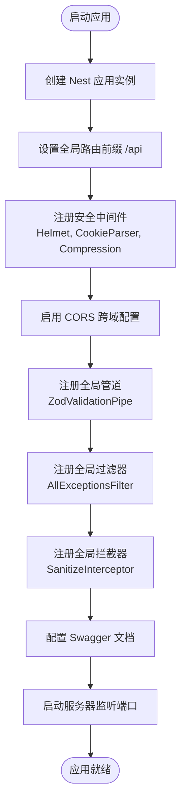
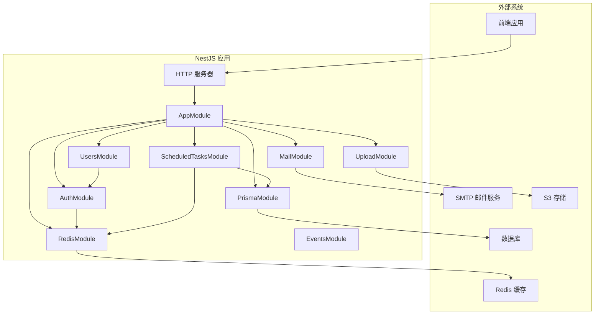
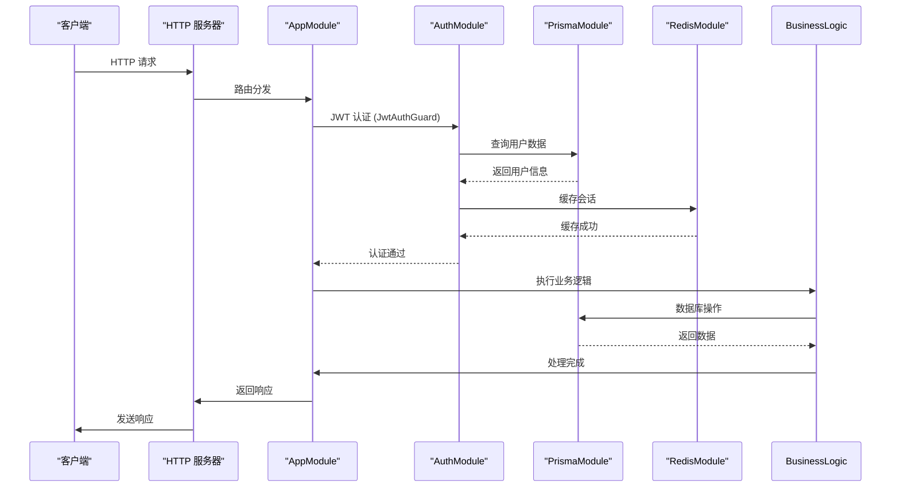

# 后端架构概述

<cite>
**本文档引用的文件**
- [main.ts](file://apps/backend/src/main.ts)
- [app.module.ts](file://apps/backend/src/app.module.ts)
- [auth.module.ts](file://apps/backend/src/auth/auth.module.ts)
- [prisma.module.ts](file://apps/backend/src/prisma/prisma.module.ts)
- [redis.module.ts](file://apps/backend/src/redis/redis.module.ts)
- [csrf.middleware.ts](file://apps/backend/src/common/middlewares/csrf.middleware.ts)
- [all-exceptions.filter.ts](file://apps/backend/src/common/filters/all-exceptions.filter.ts)
- [transform.interceptor.ts](file://apps/backend/src/common/interceptors/transform.interceptor.ts)
- [sanitize.interceptor.ts](file://apps/backend/src/common/interceptors/sanitize.interceptor.ts)
- [current-user.decorator.ts](file://apps/backend/src/auth/current-user.decorator.ts)
- [jwt-auth.guard.ts](file://apps/backend/src/auth/jwt-auth.guard.ts)
- [users.module.ts](file://apps/backend/src/users/users.module.ts)
- [mail.module.ts](file://apps/backend/src/mail/mail.module.ts)
- [events.module.ts](file://apps/backend/src/events/events.module.ts)
- [upload.module.ts](file://apps/backend/src/upload/upload.module.ts)
- [health.module.ts](file://apps/backend/src/health/health.module.ts)
- [scheduled-tasks.module.ts](file://apps/backend/src/scheduled-tasks/scheduled-tasks.module.ts)
- [pnpm-workspace.yaml](file://pnpm-workspace.yaml)
- [package.json](file://package.json)
- [turbo.json](file://turbo.json)
</cite>

## 目录
1. [项目结构](#项目结构)
2. [核心模块与依赖注入](#核心模块与依赖注入)
3. [应用初始化流程](#应用初始化流程)
4. [系统上下文图](#系统上下文图)
5. [组件交互图](#组件交互图)
6. [中间件、守卫与装饰器](#中间件守卫与装饰器)
7. [模块化设计优势](#模块化设计优势)

## 项目结构

本项目采用基于 pnpm workspace 的 Monorepo 架构，通过 `pnpm-workspace.yaml` 配置文件统一管理多个子项目。项目根目录下包含 `apps` 和 `packages` 两个主要目录：

- `apps/backend`：NestJS 后端服务，包含完整的 API 实现
- `apps/frontend`：前端应用，支持多端部署
- `packages/shared`：共享代码包，供前后端共同使用

该结构通过 pnpm 的 workspace 功能实现模块共享与依赖管理，确保依赖版本一致性，提升构建效率。`package.json` 中通过 `turbo` 配置任务依赖关系，实现高效缓存与并行执行。

**Section sources**
- [pnpm-workspace.yaml](file://pnpm-workspace.yaml#L1-L4)
- [package.json](file://package.json#L1-L51)
- [turbo.json](file://turbo.json#L1-L24)

## 核心模块与依赖注入

`AppModule` 作为应用的根模块，通过 `@Module` 装饰器集成多个核心功能模块，形成完整的应用架构。各模块通过依赖注入机制实现松耦合通信。

`AppModule` 导入了以下核心模块：
- `PrismaModule`：数据库访问层，封装 Prisma ORM
- `RedisModule`：缓存服务，基于 `cache-manager-ioredis-yet` 实现
- `AuthModule`：认证授权模块，集成 JWT 与 Passport
- `UsersModule`：用户管理模块，依赖认证模块
- `MailModule`：邮件服务模块，基于 Nodemailer
- `EventsModule`：WebSocket 实时通信模块
- `UploadModule`：文件上传模块，支持 S3 存储
- `ScheduledTasksModule`：定时任务模块，基于 BullMQ

通过 `providers` 配置全局守卫 `ThrottlerGuard`，实现全局限流保护。`RedisModule` 和 `PrismaModule` 使用 `@Global()` 装饰器声明为全局模块，避免重复导入。

**Section sources**
- [app.module.ts](file://apps/backend/src/app.module.ts#L1-L159)
- [prisma.module.ts](file://apps/backend/src/prisma/prisma.module.ts#L1-L10)
- [redis.module.ts](file://apps/backend/src/redis/redis.module.ts#L1-L84)
- [auth.module.ts](file://apps/backend/src/auth/auth.module.ts#L1-L32)
- [users.module.ts](file://apps/backend/src/users/users.module.ts#L1-L13)
- [mail.module.ts](file://apps/backend/src/mail/mail.module.ts#L1-L34)
- [events.module.ts](file://apps/backend/src/events/events.module.ts#L1-L13)
- [upload.module.ts](file://apps/backend/src/upload/upload.module.ts#L1-L50)
- [health.module.ts](file://apps/backend/src/health/health.module.ts#L1-L14)
- [scheduled-tasks.module.ts](file://apps/backend/src/scheduled-tasks/scheduled-tasks.module.ts#L1-L78)

## 应用初始化流程

`main.ts` 是应用的入口文件，通过 `NestFactory.create()` 初始化应用实例。初始化流程包含以下关键步骤：

1. 创建 `AppModule` 实例并启用日志缓冲
2. 设置全局路由前缀为 `/api`
3. 注册安全中间件（Helmet、CookieParser、Compression）
4. 启用 CORS 支持，配置跨域策略
5. 注册全局管道 `ZodValidationPipe`，实现请求数据验证
6. 注册全局异常过滤器 `AllExceptionsFilter`，统一错误响应格式
7. 注册全局拦截器 `SanitizeInterceptor`，防止 XSS 攻击
8. 配置 Swagger API 文档，提供可视化接口文档
9. 启动 HTTP 服务器并监听指定端口

该流程确保应用在启动时完成所有必要的配置与安全设置，为后续请求处理奠定基础。



**Diagram sources**
- [main.ts](file://apps/backend/src/main.ts#L1-L94)

## 系统上下文图



**Diagram sources**
- [app.module.ts](file://apps/backend/src/app.module.ts#L1-L159)
- [main.ts](file://apps/backend/src/main.ts#L1-L94)

## 组件交互图



**Diagram sources**
- [app.module.ts](file://apps/backend/src/app.module.ts#L1-L159)
- [auth.module.ts](file://apps/backend/src/auth/auth.module.ts#L1-L32)
- [prisma.module.ts](file://apps/backend/src/prisma/prisma.module.ts#L1-L10)
- [redis.module.ts](file://apps/backend/src/redis/redis.module.ts#L1-L84)

## 中间件守卫与装饰器

### 中间件
`CsrfMiddleware` 实现 CSRF 保护，采用双重提交 Cookie 模式：
- 为每个响应设置 `XSRF-TOKEN` Cookie
- 要求客户端在请求头 `X-XSRF-TOKEN` 中提交相同 token
- 使用 `crypto.timingSafeEqual` 防止时序攻击
- 跳过安全方法（GET、HEAD、OPTIONS）和特定路径

### 守卫
`ThrottlerGuard` 作为全局守卫，实现多级速率限制：
- 短期：1秒内最多3次请求
- 中期：10秒内最多20次请求
- 长期：1分钟内最多100次请求

### 装饰器
`@CurrentUser` 装饰器从请求上下文中提取认证后的用户信息，支持属性选择：
```typescript
@Get('profile')
getProfile(@CurrentUser() user: User) { }

@Get('email')
getEmail(@CurrentUser('email') email: string) { }
```

**Section sources**
- [csrf.middleware.ts](file://apps/backend/src/common/middlewares/csrf.middleware.ts#L1-L93)
- [jwt-auth.guard.ts](file://apps/backend/src/auth/jwt-auth.guard.ts#L1-L10)
- [current-user.decorator.ts](file://apps/backend/src/auth/current-user.decorator.ts#L1-L19)
- [app.module.ts](file://apps/backend/src/app.module.ts#L146-L150)

## 模块化设计优势

本架构的模块化设计带来以下优势：

1. **可维护性**：功能模块高度内聚，职责清晰，便于定位和修改
2. **可测试性**：模块间松耦合，可独立进行单元测试和集成测试
3. **可扩展性**：新功能可通过新增模块实现，不影响现有代码
4. **复用性**：`shared` 包和全局模块（如 Prisma、Redis）可在多处复用
5. **配置灵活性**：各模块支持异步配置，可根据环境变量动态调整行为

关键技术决策依据：
- 选择 pnpm workspace 实现 Monorepo，优化依赖管理和构建性能
- 使用 Zod 替代 class-validator，获得更好的类型安全和性能
- 采用 BullMQ 实现定时任务，确保分布式环境下任务唯一执行
- 集成 Pino 日志，支持结构化日志输出和性能优化

**Section sources**
- [app.module.ts](file://apps/backend/src/app.module.ts#L1-L159)
- [main.ts](file://apps/backend/src/main.ts#L1-L94)
- [package.json](file://package.json#L1-L51)
- [pnpm-workspace.yaml](file://pnpm-workspace.yaml#L1-L4)