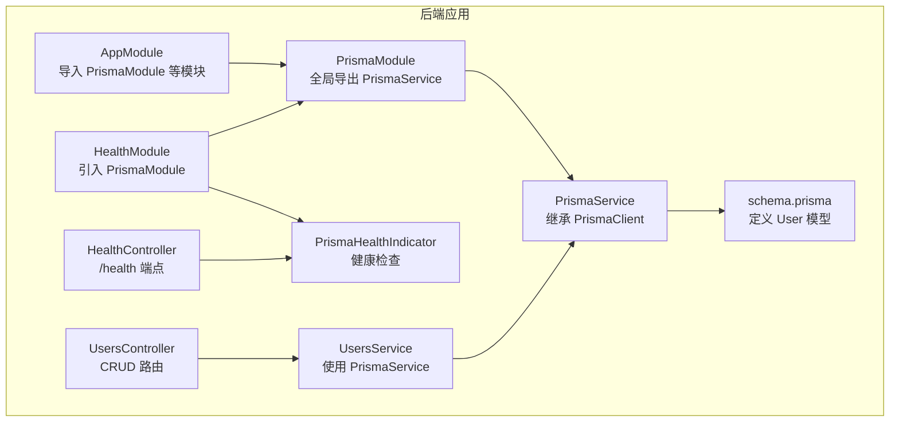
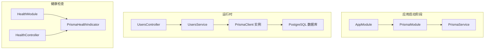
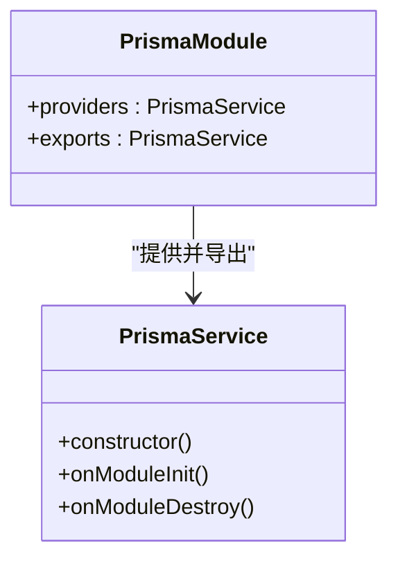
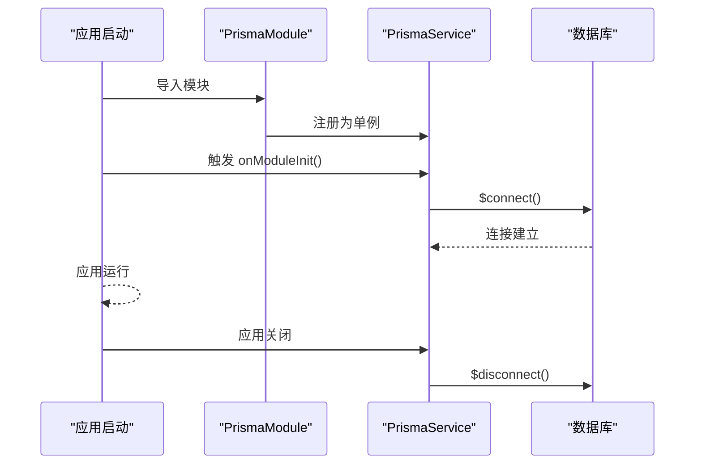
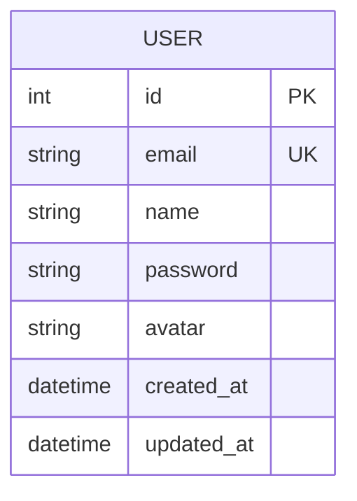
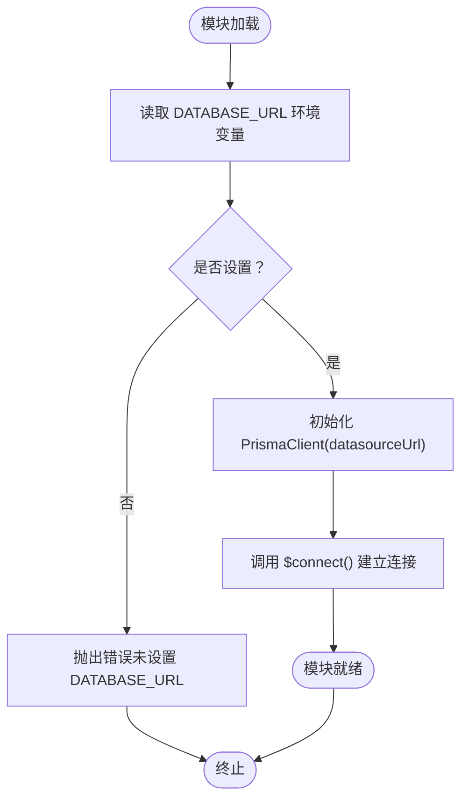
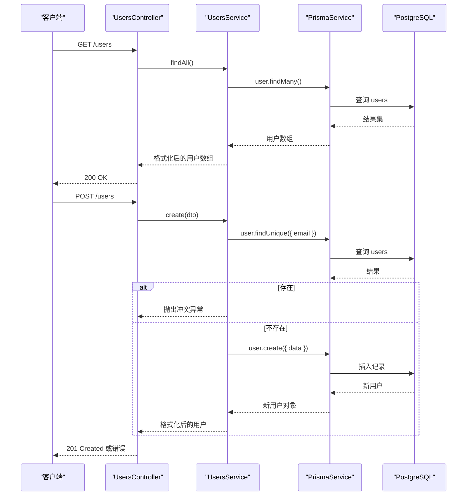
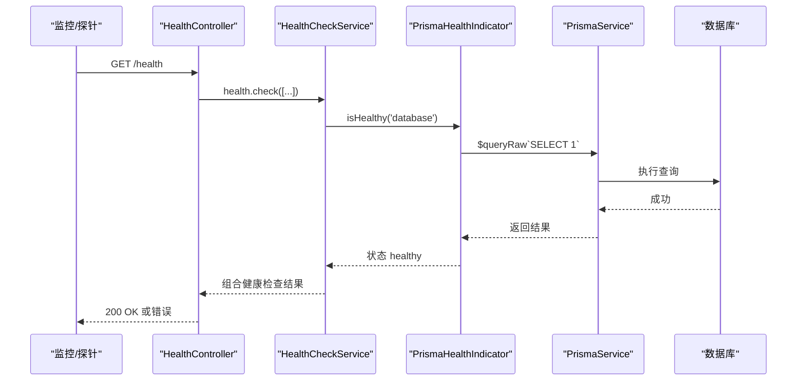
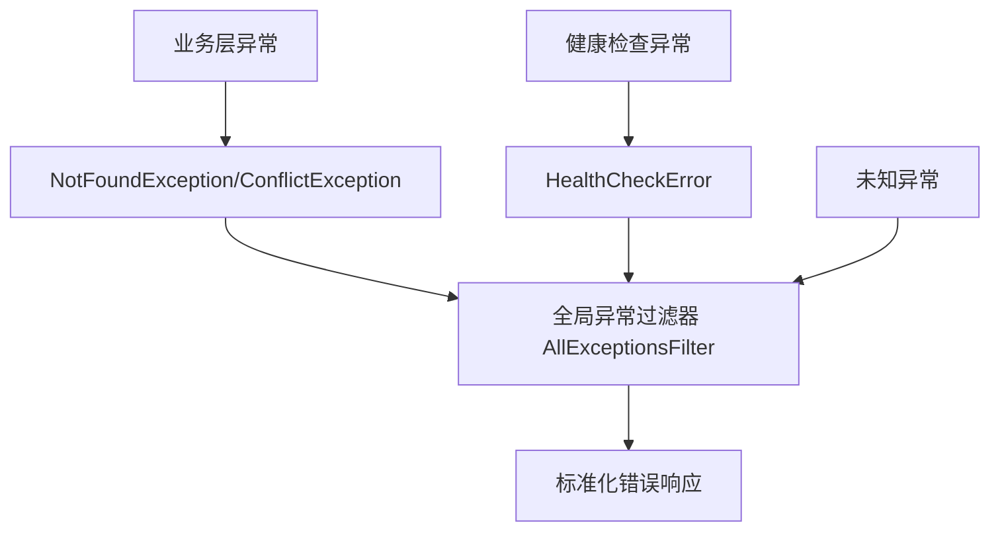
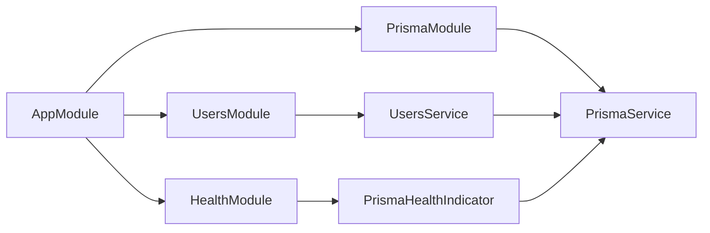

# Prisma 模块

<cite>
**本文引用的文件**
- [apps/backend/src/prisma/prisma.module.ts](file://apps/backend/src/prisma/prisma.module.ts)
- [apps/backend/src/prisma/prisma.service.ts](file://apps/backend/src/prisma/prisma.service.ts)
- [apps/backend/prisma/schema.prisma](file://apps/backend/prisma/schema.prisma)
- [apps/backend/prisma/prisma.config.ts](file://apps/backend/prisma/prisma.config.ts)
- [apps/backend/src/health/prisma.health.ts](file://apps/backend/src/health/prisma.health.ts)
- [apps/backend/src/health/health.module.ts](file://apps/backend/src/health/health.module.ts)
- [apps/backend/src/health/health.controller.ts](file://apps/backend/src/health/health.controller.ts)
- [apps/backend/src/app.module.ts](file://apps/backend/src/app.module.ts)
- [apps/backend/src/users/users.service.ts](file://apps/backend/src/users/users.service.ts)
- [apps/backend/src/users/users.controller.ts](file://apps/backend/src/users/users.controller.ts)
- [apps/backend/src/common/filters/all-exceptions.filter.ts](file://apps/backend/src/common/filters/all-exceptions.filter.ts)
</cite>

## 目录
1. [引言](#引言)
2. [项目结构](#项目结构)
3. [核心组件](#核心组件)
4. [架构总览](#架构总览)
5. [详细组件分析](#详细组件分析)
6. [依赖分析](#依赖分析)
7. [性能考虑](#性能考虑)
8. [故障排除指南](#故障排除指南)
9. [结论](#结论)
10. [附录](#附录)

## 引言
本文件围绕 Prisma 模块在 NestJS 中的设计与实现展开，重点说明：
- PrismaModule 作为全局模块（@Global）的封装方式及其在依赖注入系统中的作用
- PrismaService 如何封装 PrismaClient 并提供类型安全的数据库访问接口
- 模块如何通过 forRootAsync 实现异步初始化以支持连接配置的动态注入
- schema.prisma 的数据模型定义与服务层调用之间的映射关系
- 结合健康检查（prisma.health.ts）的实现方式
- 连接管理、事务处理、异常映射等关键机制
- 常见使用陷阱与优化建议

## 项目结构
Prisma 相关代码集中在后端应用中，主要文件分布如下：
- 模块与服务：apps/backend/src/prisma
- 数据模型：apps/backend/prisma/schema.prisma
- 健康检查：apps/backend/src/health
- 应用入口：apps/backend/src/app.module.ts
- 用户模块示例：apps/backend/src/users

图表来源
- [apps/backend/src/app.module.ts](file://apps/backend/src/app.module.ts#L135-L135)
- [apps/backend/src/prisma/prisma.module.ts](file://apps/backend/src/prisma/prisma.module.ts#L1-L9)
- [apps/backend/src/prisma/prisma.service.ts](file://apps/backend/src/prisma/prisma.service.ts#L1-L19)
- [apps/backend/prisma/schema.prisma](file://apps/backend/prisma/schema.prisma#L1-L19)
- [apps/backend/src/health/health.module.ts](file://apps/backend/src/health/health.module.ts#L1-L13)
- [apps/backend/src/health/prisma.health.ts](file://apps/backend/src/health/prisma.health.ts#L1-L31)
- [apps/backend/src/health/health.controller.ts](file://apps/backend/src/health/health.controller.ts#L1-L77)
- [apps/backend/src/users/users.service.ts](file://apps/backend/src/users/users.service.ts#L1-L66)
- [apps/backend/src/users/users.controller.ts](file://apps/backend/src/users/users.controller.ts#L1-L43)

章节来源
- [apps/backend/src/app.module.ts](file://apps/backend/src/app.module.ts#L135-L135)
- [apps/backend/src/prisma/prisma.module.ts](file://apps/backend/src/prisma/prisma.module.ts#L1-L9)

## 核心组件
- PrismaModule：全局模块，向整个应用提供 PrismaService 单例实例，并将其导出供其他模块使用。
- PrismaService：继承自 PrismaClient，负责连接初始化与销毁；通过构造函数注入 DATABASE_URL 环境变量，确保运行时可配置的数据源 URL。
- schema.prisma：定义数据源为 PostgreSQL，生成 Prisma Client；定义 User 模型及字段约束（唯一索引、默认值、时间戳等），并通过 @@map 映射到 users 表。
- PrismaHealthIndicator：基于 @nestjs/terminus 的健康检查指示器，使用原生 SQL 查询验证数据库连通性。
- HealthModule/HealthController：整合多个健康检查指标，包括数据库、Redis、内存与磁盘，统一暴露 /health、/health/liveness、/health/readiness 端点。
- UsersService/UsersController：演示如何在服务层注入 PrismaService 并执行 CRUD 操作（查询列表、按 ID 查询、创建用户）。

章节来源
- [apps/backend/src/prisma/prisma.module.ts](file://apps/backend/src/prisma/prisma.module.ts#L1-L9)
- [apps/backend/src/prisma/prisma.service.ts](file://apps/backend/src/prisma/prisma.service.ts#L1-L19)
- [apps/backend/prisma/schema.prisma](file://apps/backend/prisma/schema.prisma#L1-L19)
- [apps/backend/src/health/prisma.health.ts](file://apps/backend/src/health/prisma.health.ts#L1-L31)
- [apps/backend/src/health/health.module.ts](file://apps/backend/src/health/health.module.ts#L1-L13)
- [apps/backend/src/health/health.controller.ts](file://apps/backend/src/health/health.controller.ts#L1-L77)
- [apps/backend/src/users/users.service.ts](file://apps/backend/src/users/users.service.ts#L1-L66)
- [apps/backend/src/users/users.controller.ts](file://apps/backend/src/users/users.controller.ts#L1-L43)

## 架构总览
下图展示了 Prisma 在应用中的整体架构与交互流程。

图表来源
- [apps/backend/src/app.module.ts](file://apps/backend/src/app.module.ts#L135-L135)
- [apps/backend/src/prisma/prisma.module.ts](file://apps/backend/src/prisma/prisma.module.ts#L1-L9)
- [apps/backend/src/prisma/prisma.service.ts](file://apps/backend/src/prisma/prisma.service.ts#L1-L19)
- [apps/backend/src/users/users.controller.ts](file://apps/backend/src/users/users.controller.ts#L1-L43)
- [apps/backend/src/users/users.service.ts](file://apps/backend/src/users/users.service.ts#L1-L66)
- [apps/backend/src/health/health.module.ts](file://apps/backend/src/health/health.module.ts#L1-L13)
- [apps/backend/src/health/health.controller.ts](file://apps/backend/src/health/health.controller.ts#L1-L77)
- [apps/backend/src/health/prisma.health.ts](file://apps/backend/src/health/prisma.health.ts#L1-L31)

## 详细组件分析

### PrismaModule 设计与全局封装
- 全局模块：通过 @Global() 修饰，使 PrismaService 在整个应用范围内可用，无需在各模块重复导入。
- 导出机制：将 PrismaService 作为 provider 导出，其他模块只需在 imports 中引入 PrismaModule 或直接注入 PrismaService 即可使用。
- 依赖注入：PrismaService 作为单例提供，避免多实例导致的连接分散与资源浪费。

图表来源
- [apps/backend/src/prisma/prisma.module.ts](file://apps/backend/src/prisma/prisma.module.ts#L1-L9)
- [apps/backend/src/prisma/prisma.service.ts](file://apps/backend/src/prisma/prisma.service.ts#L1-L19)

章节来源
- [apps/backend/src/prisma/prisma.module.ts](file://apps/backend/src/prisma/prisma.module.ts#L1-L9)

### PrismaService 类型安全封装与生命周期
- 类型安全：PrismaService 继承 PrismaClient，生成的客户端类型与 schema.prisma 定义一致，提供编译期类型检查与智能提示。
- 生命周期钩子：
  - onModuleInit：启动时调用 $connect() 建立数据库连接。
  - onModuleDestroy：关闭时调用 $disconnect() 断开连接，避免连接泄漏。
- 连接配置：通过构造函数传入 datasourceUrl，该值来自环境变量 DATABASE_URL，便于在不同环境动态切换。

图表来源
- [apps/backend/src/prisma/prisma.module.ts](file://apps/backend/src/prisma/prisma.module.ts#L1-L9)
- [apps/backend/src/prisma/prisma.service.ts](file://apps/backend/src/prisma/prisma.service.ts#L1-L19)

章节来源
- [apps/backend/src/prisma/prisma.service.ts](file://apps/backend/src/prisma/prisma.service.ts#L1-L19)

### schema.prisma 与服务层映射关系
- 数据源与生成器：datasource db 指定 provider 为 postgresql；generator client 指定 prisma-client-js，生成客户端类型。
- User 模型：包含 id、email、name、password、avatar、createdAt、updatedAt 等字段；email 设置唯一索引；id 默认自增；表名通过 @@map("users") 映射。
- 服务层调用：UsersService 通过 this.prisma.user 执行 findMany、findUnique、create 等操作，这些方法由 Prisma Client 根据 schema.prisma 自动生成。

图表来源
- [apps/backend/prisma/schema.prisma](file://apps/backend/prisma/schema.prisma#L1-L19)
- [apps/backend/src/users/users.service.ts](file://apps/backend/src/users/users.service.ts#L1-L66)

章节来源
- [apps/backend/prisma/schema.prisma](file://apps/backend/prisma/schema.prisma#L1-L19)
- [apps/backend/src/users/users.service.ts](file://apps/backend/src/users/users.service.ts#L1-L66)

### 异步初始化与动态配置（forRootAsync）
当前仓库中 PrismaModule 未显式使用 forRootAsync，但 PrismaService 的构造函数已从环境变量 DATABASE_URL 注入连接字符串，满足动态配置需求。若需进一步增强（例如通过 ConfigService 动态解析连接参数、支持多数据源或工厂模式），可在 PrismaModule 中采用 forRootAsync 形式实现。

图表来源
- [apps/backend/src/prisma/prisma.service.ts](file://apps/backend/src/prisma/prisma.service.ts#L1-L19)

章节来源
- [apps/backend/src/prisma/prisma.service.ts](file://apps/backend/src/prisma/prisma.service.ts#L1-L19)

### 用户模块注入与 CRUD 示例
- 注入方式：UsersService 在构造函数中注入 PrismaService，从而获得 user 模型的查询与写入能力。
- CRUD 行为：
  - findAll：调用 prisma.user.findMany 获取用户列表。
  - findOne：调用 prisma.user.findUnique 并在未找到时抛出 NotFoundException。
  - create：先检查 email 是否已存在，再哈希密码后调用 prisma.user.create 创建用户。
- 控制器路由：UsersController 提供 /users GET、/users/:id GET、/users POST 等端点，委托给 UsersService 处理。

图表来源
- [apps/backend/src/users/users.controller.ts](file://apps/backend/src/users/users.controller.ts#L1-L43)
- [apps/backend/src/users/users.service.ts](file://apps/backend/src/users/users.service.ts#L1-L66)
- [apps/backend/src/prisma/prisma.service.ts](file://apps/backend/src/prisma/prisma.service.ts#L1-L19)

章节来源
- [apps/backend/src/users/users.controller.ts](file://apps/backend/src/users/users.controller.ts#L1-L43)
- [apps/backend/src/users/users.service.ts](file://apps/backend/src/users/users.service.ts#L1-L66)

### 健康检查集成（prisma.health.ts）
- PrismaHealthIndicator：继承 HealthIndicator，实现 isHealthy(key) 方法，使用原生 SQL 查询 SELECT 1 验证数据库连通性；失败时抛出 HealthCheckError 并携带错误信息。
- HealthModule：导入 PrismaModule 与 TerminusModule，并注册 PrismaHealthIndicator。
- HealthController：提供 /health、/health/liveness、/health/readiness 端点，组合数据库、Redis、内存与磁盘健康检查。

图表来源
- [apps/backend/src/health/health.controller.ts](file://apps/backend/src/health/health.controller.ts#L1-L77)
- [apps/backend/src/health/health.module.ts](file://apps/backend/src/health/health.module.ts#L1-L13)
- [apps/backend/src/health/prisma.health.ts](file://apps/backend/src/health/prisma.health.ts#L1-L31)
- [apps/backend/src/prisma/prisma.service.ts](file://apps/backend/src/prisma/prisma.service.ts#L1-L19)

章节来源
- [apps/backend/src/health/prisma.health.ts](file://apps/backend/src/health/prisma.health.ts#L1-L31)
- [apps/backend/src/health/health.module.ts](file://apps/backend/src/health/health.module.ts#L1-L13)
- [apps/backend/src/health/health.controller.ts](file://apps/backend/src/health/health.controller.ts#L1-L77)

### 连接管理、事务处理与异常映射
- 连接管理：
  - 启动连接：onModuleInit 中调用 $connect() 建立连接。
  - 关闭连接：onModuleDestroy 中调用 $disconnect() 断开连接，避免进程退出时连接泄漏。
- 事务处理：当前仓库未展示显式的事务 API 使用；如需事务，可在 PrismaService 上使用 $transaction 包裹一组数据库操作，保证原子性。
- 异常映射：
  - 业务异常：UsersService 对于未找到用户抛出 NotFoundException，对于邮箱冲突抛出 ConflictException，由全局异常过滤器统一转换为标准化响应。
  - 健康检查异常：PrismaHealthIndicator 捕获连接失败并抛出 HealthCheckError，由 @nestjs/terminus 统一处理。
  - 全局异常过滤器：AllExceptionsFilter 将未知异常转换为统一的 JSON 错误响应，包含状态码、消息与时间戳。

图表来源
- [apps/backend/src/users/users.service.ts](file://apps/backend/src/users/users.service.ts#L1-L66)
- [apps/backend/src/health/prisma.health.ts](file://apps/backend/src/health/prisma.health.ts#L1-L31)
- [apps/backend/src/common/filters/all-exceptions.filter.ts](file://apps/backend/src/common/filters/all-exceptions.filter.ts#L1-L31)

章节来源
- [apps/backend/src/users/users.service.ts](file://apps/backend/src/users/users.service.ts#L1-L66)
- [apps/backend/src/common/filters/all-exceptions.filter.ts](file://apps/backend/src/common/filters/all-exceptions.filter.ts#L1-L31)

## 依赖分析
- 模块耦合：
  - AppModule 导入 PrismaModule，使其成为全局可用。
  - UsersModule 通过依赖注入使用 PrismaService，体现低耦合高内聚的服务层设计。
  - HealthModule 依赖 PrismaModule 与 TerminusModule，形成独立的健康检查子系统。
- 外部依赖：
  - @prisma/client：生成类型安全的数据库访问接口。
  - @nestjs/terminus：提供健康检查基础设施。
  - @nestjs/config：用于配置管理（虽然当前 PrismaModule 未显式使用，但可扩展为 forRootAsync）。
- 可能的循环依赖：
  - 当前结构未发现循环依赖；PrismaModule 仅提供服务，不反向依赖业务模块。

图表来源
- [apps/backend/src/app.module.ts](file://apps/backend/src/app.module.ts#L135-L135)
- [apps/backend/src/prisma/prisma.module.ts](file://apps/backend/src/prisma/prisma.module.ts#L1-L9)
- [apps/backend/src/users/users.module.ts](file://apps/backend/src/users/users.module.ts#L1-L13)
- [apps/backend/src/health/health.module.ts](file://apps/backend/src/health/health.module.ts#L1-L13)

章节来源
- [apps/backend/src/app.module.ts](file://apps/backend/src/app.module.ts#L135-L135)
- [apps/backend/src/prisma/prisma.module.ts](file://apps/backend/src/prisma/prisma.module.ts#L1-L9)
- [apps/backend/src/users/users.module.ts](file://apps/backend/src/users/users.module.ts#L1-L13)
- [apps/backend/src/health/health.module.ts](file://apps/backend/src/health/health.module.ts#L1-L13)

## 性能考虑
- 连接池与并发：
  - PrismaClient 默认使用连接池；在高并发场景下，应确保数据库连接上限与应用并发度匹配，避免连接耗尽。
  - 若使用外部连接池适配器（如 prismaPg），请确认池大小与超时配置合理。
- 查询优化：
  - 使用 select 与 include 精准控制字段与关联，减少不必要的数据传输。
  - 对高频查询建立合适的索引（如 email 唯一索引）。
- 事务边界：
  - 将相关联的多次写入放入 $transaction，减少锁竞争与网络往返。
- 健康检查频率：
  - /health 端点应避免过于频繁的全量检查，可适当降低检查频率或仅在就绪探针中进行轻量检查。

## 故障排除指南
- 连接失败：
  - 确认 DATABASE_URL 环境变量已正确设置且可访问数据库。
  - 查看 PrismaHealthIndicator 的错误信息，定位连接问题。
- 未处理的连接泄漏：
  - 确保应用正常关闭，触发 onModuleDestroy 断开连接。
  - 在微服务或多进程部署中，确保每个进程都正确释放连接。
- 查询性能问题：
  - 分析慢查询日志，为热点字段添加索引。
  - 减少 N+1 查询，使用 include 或 join 查询一次性获取所需数据。
- 异常处理：
  - 业务异常（如 NotFoundException、ConflictException）由服务层抛出，全局异常过滤器统一输出。
  - 健康检查异常由 HealthCheckError 抛出，确保监控系统能正确识别数据库不可用状态。

章节来源
- [apps/backend/src/health/prisma.health.ts](file://apps/backend/src/health/prisma.health.ts#L1-L31)
- [apps/backend/src/common/filters/all-exceptions.filter.ts](file://apps/backend/src/common/filters/all-exceptions.filter.ts#L1-L31)
- [apps/backend/src/prisma/prisma.service.ts](file://apps/backend/src/prisma/prisma.service.ts#L1-L19)

## 结论
本仓库对 Prisma 的封装简洁而实用：通过全局模块 PrismaModule 与 PrismaService 的生命周期钩子，实现了类型安全、可动态配置的数据库访问能力；配合健康检查与全局异常过滤器，提供了可观测性与稳定性保障。用户模块示例清晰展示了如何在服务层注入 PrismaService 并执行 CRUD 操作。未来可在 PrismaModule 中引入 forRootAsync 以支持更灵活的配置注入与多数据源场景。

## 附录
- 配置文件与适配器：
  - prisma.config.ts 使用 @prisma/adapter-pg 与 pg.Pool，将 Prisma 与 PostgreSQL 连接池集成，适合生产环境。
- 数据模型参考：
  - schema.prisma 定义了 User 模型与字段约束，PrismaService 自动生成对应的类型与查询方法。

章节来源
- [apps/backend/prisma/prisma.config.ts](file://apps/backend/prisma/prisma.config.ts#L1-L22)
- [apps/backend/prisma/schema.prisma](file://apps/backend/prisma/schema.prisma#L1-L19)