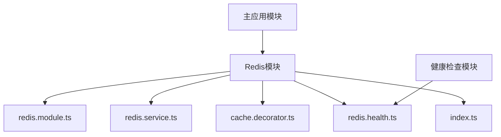
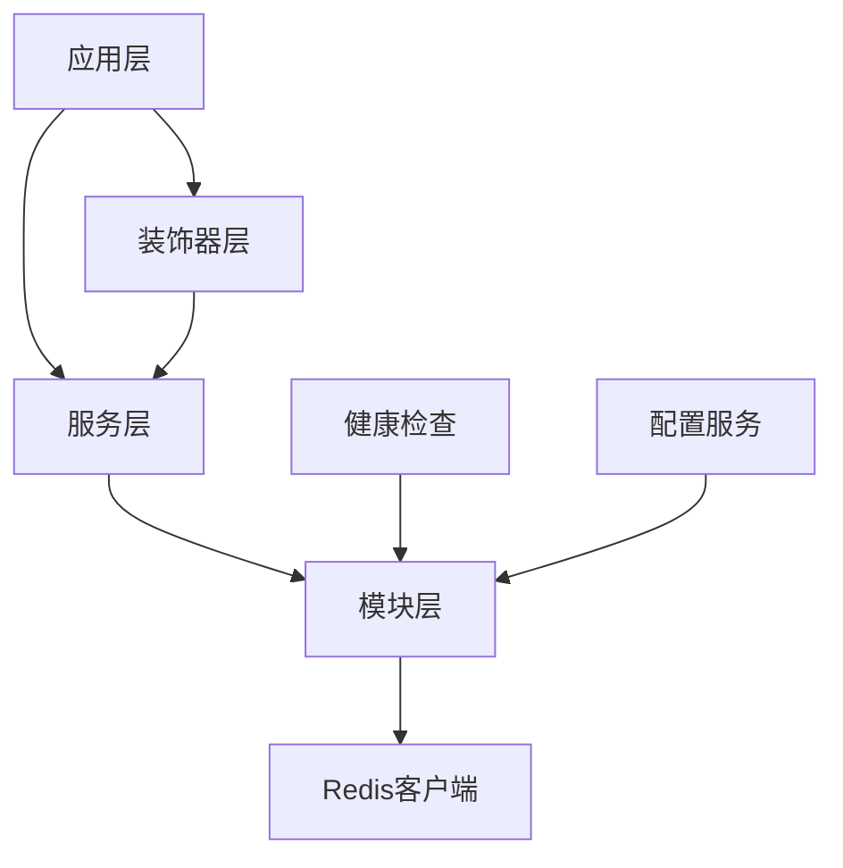
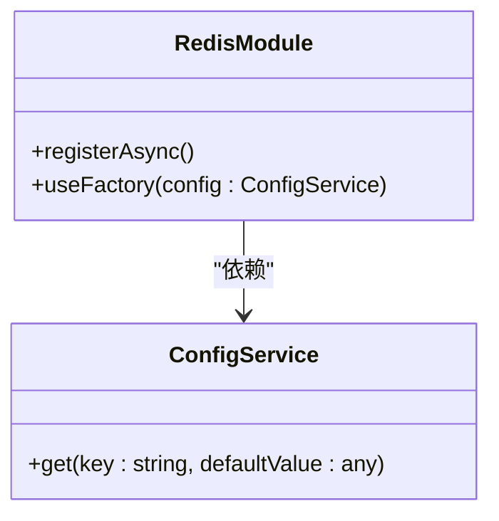
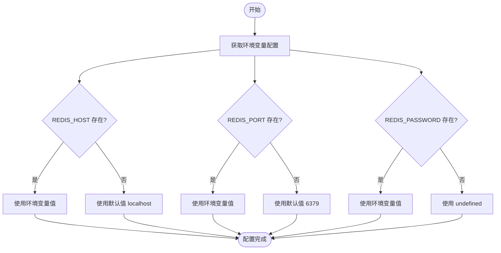
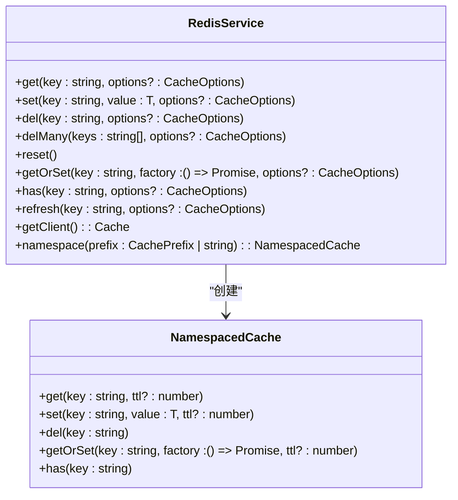
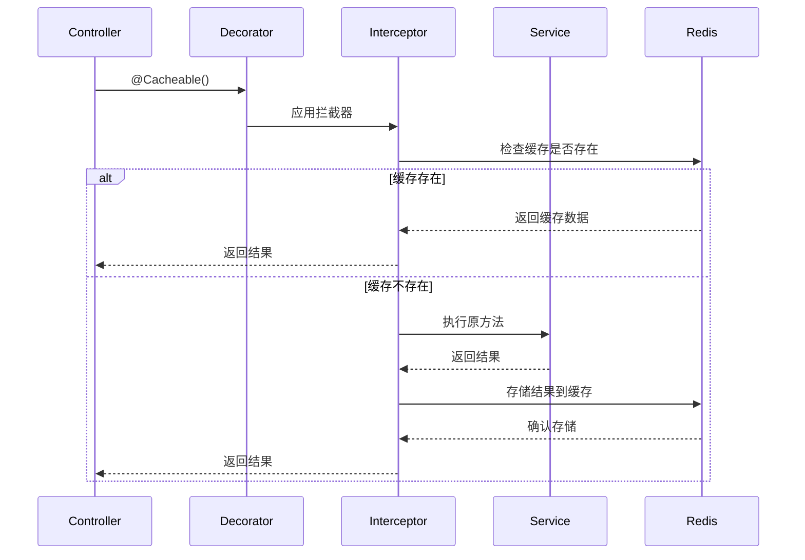
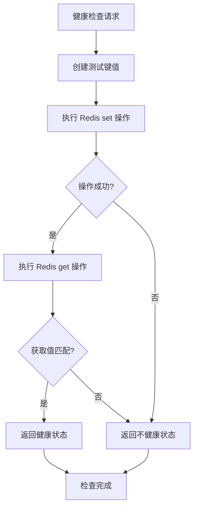
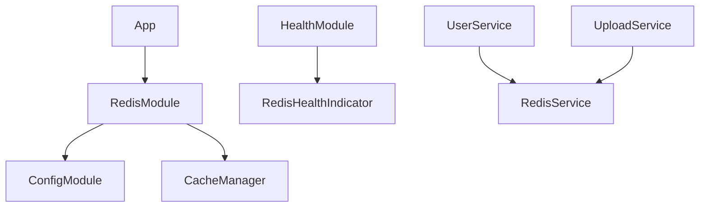

# Redis 模块

<cite>
**本文档引用文件**   
- [redis.module.ts](file://apps/backend/src/redis/redis.module.ts)
- [redis.service.ts](file://apps/backend/src/redis/redis.service.ts)
- [cache.decorator.ts](file://apps/backend/src/redis/cache.decorator.ts)
- [redis.health.ts](file://apps/backend/src/redis/redis.health.ts)
- [app.module.ts](file://apps/backend/src/app.module.ts)
- [health.module.ts](file://apps/backend/src/health/health.module.ts)
- [users.service.ts](file://apps/backend/src/users/users.service.ts)
- [storage.service.ts](file://apps/backend/src/upload/storage.service.ts)
</cite>

## 目录
1. [简介](#简介)
2. [项目结构](#项目结构)
3. [核心组件](#核心组件)
4. [架构概述](#架构概述)
5. [详细组件分析](#详细组件分析)
6. [依赖分析](#依赖分析)
7. [性能考虑](#性能考虑)
8. [故障排除指南](#故障排除指南)
9. [结论](#结论)

## 简介
Redis 模块为 Nest.js 应用程序提供了一套完整的缓存解决方案。该模块通过全局注册机制实现，封装了 Redis 客户端操作，并通过环境变量驱动配置连接参数。模块包含自定义装饰器实现方法级缓存管理、健康检查集成以及高级缓存策略。本文档详细解析其架构设计和实际应用。

## 项目结构
Redis 模块位于 `apps/backend/src/redis` 目录下，包含核心功能文件。该模块作为全局模块被主应用模块导入，提供缓存服务和健康检查功能。

**图示来源**
- [redis.module.ts](file://apps/backend/src/redis/redis.module.ts)
- [app.module.ts](file://apps/backend/src/app.module.ts)
- [health.module.ts](file://apps/backend/src/health/health.module.ts)

**章节来源**
- [redis.module.ts](file://apps/backend/src/redis/redis.module.ts)
- [app.module.ts](file://apps/backend/src/app.module.ts)

## 核心组件
Redis 模块的核心组件包括：RedisModule（全局模块）、RedisService（服务封装）、Cacheable 装饰器（AOP 缓存管理）和 RedisHealthIndicator（健康检查）。这些组件协同工作，提供完整的缓存解决方案。

**章节来源**
- [redis.module.ts](file://apps/backend/src/redis/redis.module.ts)
- [redis.service.ts](file://apps/backend/src/redis/redis.service.ts)
- [cache.decorator.ts](file://apps/backend/src/redis/cache.decorator.ts)
- [redis.health.ts](file://apps/backend/src/redis/redis.health.ts)

## 架构概述
Redis 模块采用分层架构设计，从上到下分为：模块层、服务层、装饰器层和健康检查层。模块层负责注册和配置，服务层提供基础操作，装饰器层实现 AOP 缓存，健康检查层监控 Redis 状态。

**图示来源**
- [redis.module.ts](file://apps/backend/src/redis/redis.module.ts)
- [redis.service.ts](file://apps/backend/src/redis/redis.service.ts)
- [cache.decorator.ts](file://apps/backend/src/redis/cache.decorator.ts)
- [redis.health.ts](file://apps/backend/src/redis/redis.health.ts)

## 详细组件分析

### Redis模块分析
RedisModule 是一个全局模块，通过 `@Global()` 装饰器注册，使其在应用中全局可用。模块使用 `CacheModule.registerAsync` 异步注册缓存，通过 ConfigService 注入配置。

**图示来源**
- [redis.module.ts](file://apps/backend/src/redis/redis.module.ts)
- [app.module.ts](file://apps/backend/src/app.module.ts)

#### 配置机制
Redis 模块通过 ConfigService 实现环境变量驱动配置，支持 host、port、password 等参数的灵活配置。配置优先级为：环境变量 > 默认值。

**图示来源**
- [redis.module.ts](file://apps/backend/src/redis/redis.module.ts)

**章节来源**
- [redis.module.ts](file://apps/backend/src/redis/redis.module.ts)

### Redis服务分析
RedisService 封装了 Redis 客户端操作，提供统一的缓存接口。服务实现了 OnModuleDestroy 接口，在模块销毁时优雅关闭连接。

**图示来源**
- [redis.service.ts](file://apps/backend/src/redis/redis.service.ts)

**章节来源**
- [redis.service.ts](file://apps/backend/src/redis/redis.service.ts)

### 缓存装饰器分析
cache.decorator.ts 实现了自定义的 Cacheable 装饰器，通过 AOP 方式实现方法级缓存自动管理。装饰器组合使用 NestJS 的拦截器和元数据功能。

**图示来源**
- [cache.decorator.ts](file://apps/backend/src/redis/cache.decorator.ts)

**章节来源**
- [cache.decorator.ts](file://apps/backend/src/redis/cache.decorator.ts)

### 健康检查分析
redis.health.ts 实现了 Redis 健康检查指示器，通过执行简单的 set/get 操作来验证 Redis 连接状态，集成到系统的健康检查机制中。

**图示来源**
- [redis.health.ts](file://apps/backend/src/redis/redis.health.ts)
- [health.module.ts](file://apps/backend/src/health/health.module.ts)

**章节来源**
- [redis.health.ts](file://apps/backend/src/redis/redis.health.ts)

## 依赖分析
Redis 模块与其他模块存在明确的依赖关系，通过依赖注入机制实现松耦合。

**图示来源**
- [redis.module.ts](file://apps/backend/src/redis/redis.module.ts)
- [app.module.ts](file://apps/backend/src/app.module.ts)
- [health.module.ts](file://apps/backend/src/health/health.module.ts)

**章节来源**
- [redis.module.ts](file://apps/backend/src/redis/redis.module.ts)
- [app.module.ts](file://apps/backend/src/app.module.ts)

## 性能考虑
Redis 模块在设计时考虑了多种性能优化策略，包括连接池管理、序列化策略和缓存失效模式。

### 连接池管理
模块通过 cache-manager-ioredis-yet 库管理 Redis 连接池，配置了重试策略和最大重试次数，确保连接的稳定性和可靠性。

### 序列化策略
使用默认的 JSON 序列化策略，平衡了性能和可读性。对于复杂对象，自动进行序列化和反序列化。

### 缓存失效模式
支持多种缓存失效模式，包括 TTL 过期、手动删除和批量删除，避免缓存雪崩和穿透问题。

**章节来源**
- [redis.module.ts](file://apps/backend/src/redis/redis.module.ts)
- [redis.service.ts](file://apps/backend/src/redis/redis.service.ts)

## 故障排除指南
### 缓存穿透
当查询不存在的数据时，可能导致缓存穿透。解决方案是使用 getOrSet 方法，在查询数据库后将空值也缓存一段时间。

### 缓存雪崩
大量缓存同时过期可能导致雪崩。建议使用随机化的 TTL 值，避免同时过期。

### 连接问题
如果 Redis 连接失败，模块会根据配置的重试策略进行重试，最多重试 10 次后停止。

**章节来源**
- [redis.service.ts](file://apps/backend/src/redis/redis.service.ts)
- [redis.module.ts](file://apps/backend/src/redis/redis.module.ts)

## 结论
Redis 模块提供了一套完整、健壮的缓存解决方案，通过全局模块注册、环境变量配置、AOP 装饰器和健康检查集成，大大简化了缓存的使用。模块设计考虑了性能、可靠性和可维护性，是 Nest.js 应用中理想的缓存解决方案。