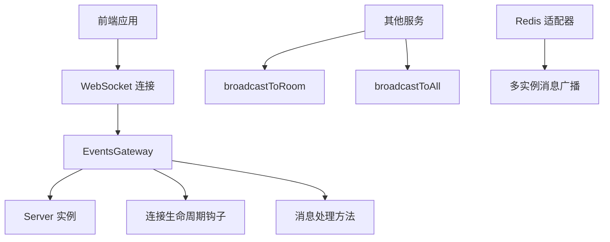
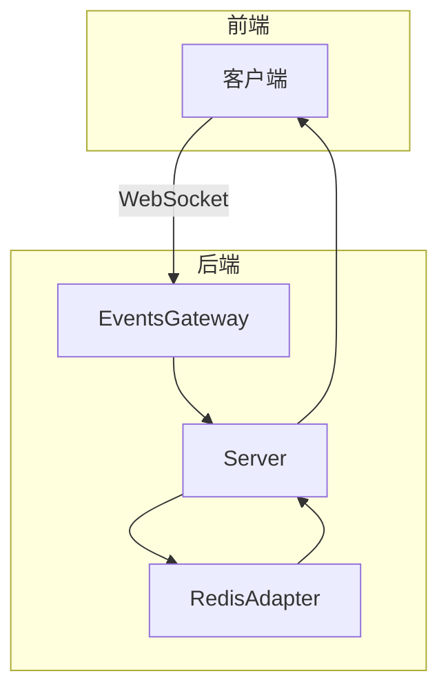
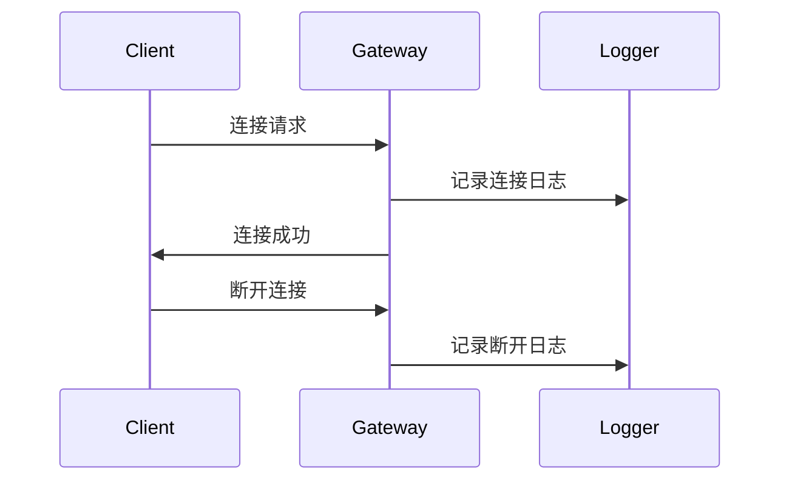
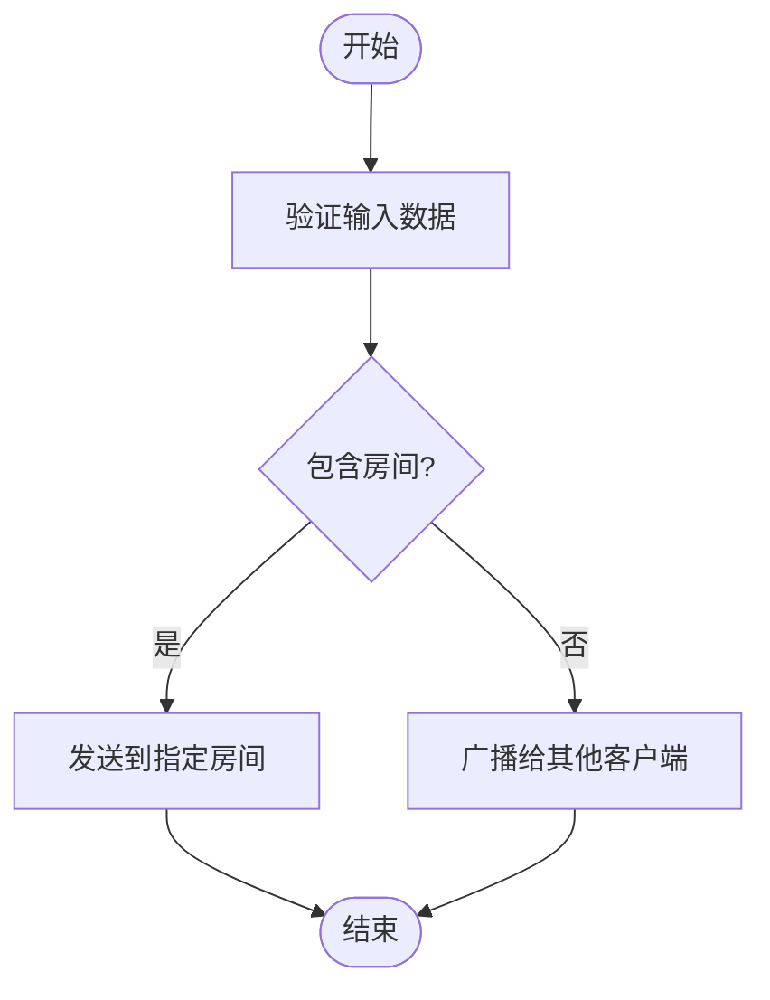
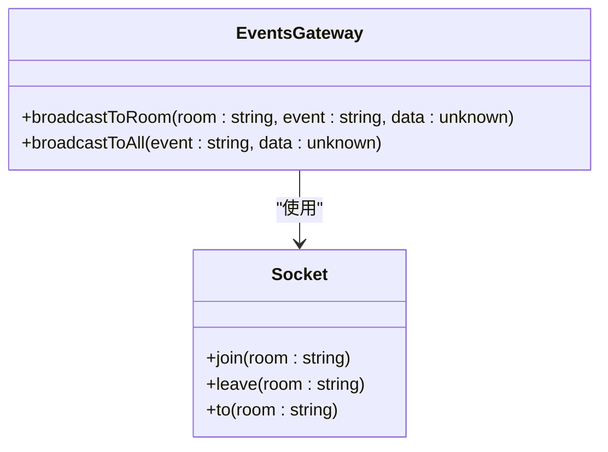

# 事件通信模块

<cite>
**本文档引用的文件**
- [events.module.ts](file://apps/backend/src/events/events.module.ts)
- [events.gateway.ts](file://apps/backend/src/events/events.gateway.ts)
- [app.module.ts](file://apps/backend/src/app.module.ts)
- [redis.module.ts](file://apps/backend/src/redis/redis.module.ts)
- [redis.service.ts](file://apps/backend/src/redis/redis.service.ts)
</cite>

## 目录
1. [项目结构](#项目结构)
2. [核心组件](#核心组件)
3. [架构概述](#架构概述)
4. [详细组件分析](#详细组件分析)
5. [依赖分析](#依赖分析)
6. [性能考虑](#性能考虑)
7. [故障排除指南](#故障排除指南)

## 项目结构

事件通信模块位于 `apps/backend/src/events` 目录下，包含网关和模块定义，通过 WebSocket 实现服务端事件推送。



**Diagram sources**
- [events.gateway.ts](file://apps/backend/src/events/events.gateway.ts#L18-L24)
- [events.module.ts](file://apps/backend/src/events/events.module.ts#L8-L12)

**Section sources**
- [events.module.ts](file://apps/backend/src/events/events.module.ts#L1-L12)
- [events.gateway.ts](file://apps/backend/src/events/events.gateway.ts#L1-L119)

## 核心组件

事件通信模块由 `EventsModule` 和 `EventsGateway` 组成。`EventsModule` 作为模块容器，导出 `EventsGateway` 提供实时通信能力。`EventsGateway` 是核心实现，定义了连接生命周期钩子和消息处理方法。

**Section sources**
- [events.module.ts](file://apps/backend/src/events/events.module.ts#L8-L12)
- [events.gateway.ts](file://apps/backend/src/events/events.gateway.ts#L25-L119)

## 架构概述

事件通信模块基于 NestJS 的 `@nestjs/websockets` 模块，集成 socket.io 实现 WebSocket 通信。模块通过命名空间 `/events` 提供服务，支持 CORS 配置，允许来自指定源的连接。`EventsGateway` 实现了 `OnGatewayInit`、`OnGatewayConnection` 和 `OnGatewayDisconnect` 接口，定义了网关初始化、客户端连接和断开的处理逻辑。



**Diagram sources**
- [events.gateway.ts](file://apps/backend/src/events/events.gateway.ts#L18-L24)
- [redis.module.ts](file://apps/backend/src/redis/redis.module.ts#L26-L84)

## 详细组件分析

### EventsGateway 分析

`EventsGateway` 类是事件通信的核心，负责处理客户端连接、消息收发和房间管理。

#### 连接生命周期钩子
`EventsGateway` 实现了三个生命周期钩子：
- `afterInit()`：网关初始化时调用，用于记录日志
- `handleConnection()`：客户端连接时调用，记录连接信息
- `handleDisconnect()`：客户端断开时调用，记录断开信息



**Diagram sources**
- [events.gateway.ts](file://apps/backend/src/events/events.gateway.ts#L31-L41)

#### 消息处理方法
`EventsGateway` 定义了多个消息处理方法，通过 `@SubscribeMessage` 装饰器订阅客户端事件：
- `handleMessage()`：处理普通消息，支持发送到指定房间或广播给其他客户端
- `handleJoin()`：处理加入房间请求，客户端加入指定房间并通知其他成员
- `handleLeave()`：处理离开房间请求，客户端离开指定房间并通知其他成员



**Diagram sources**
- [events.gateway.ts](file://apps/backend/src/events/events.gateway.ts#L46-L70)

#### 房间机制
模块支持房间（room）机制，客户端可以加入和离开房间，实现定向消息推送。房间管理通过 socket.io 的 `join()` 和 `leave()` 方法实现，支持向指定房间广播消息。



**Diagram sources**
- [events.gateway.ts](file://apps/backend/src/events/events.gateway.ts#L75-L104)

### 消息序列化与会话管理

模块通过 socket.io 的内置机制处理消息序列化，使用 JSON 格式传输数据。会话管理由 socket.io 自动处理，每个客户端连接都有唯一的 `client.id`，可用于标识客户端。

**Section sources**
- [events.gateway.ts](file://apps/backend/src/events/events.gateway.ts#L48-L50)
- [events.gateway.ts](file://apps/backend/src/events/events.gateway.ts#L36-L37)

## 依赖分析

事件通信模块依赖多个核心组件，包括 Redis 模块用于多实例部署下的消息广播，以及 NestJS 的 websockets 模块提供 WebSocket 功能。

```mermaid
graph TD
A[EventsModule] --> B[EventsGateway]
B --> C[@nestjs/websockets]
B --> D[socket.io]
B --> E[RedisAdapter]
F[RedisModule] --> E
G[AppModule] --> A
```

**Diagram sources**
- [app.module.ts](file://apps/backend/src/app.module.ts#L14-L141)
- [redis.module.ts](file://apps/backend/src/redis/redis.module.ts#L26-L84)

**Section sources**
- [app.module.ts](file://apps/backend/src/app.module.ts#L1-L159)
- [redis.module.ts](file://apps/backend/src/redis/redis.module.ts#L1-L84)

## 性能考虑

为确保高并发场景下的稳定性，建议进行性能测试，重点关注连接数优化策略。通过 Redis 适配器支持多实例部署下的消息广播，提高系统的可扩展性。

**Section sources**
- [redis.module.ts](file://apps/backend/src/redis/redis.module.ts#L45-L64)
- [events.gateway.ts](file://apps/backend/src/events/events.gateway.ts#L109-L118)

## 故障排除指南

当遇到连接问题时，检查 CORS 配置是否正确，确保客户端源在允许列表中。对于消息广播问题，验证 Redis 连接是否正常，检查适配器配置。

**Section sources**
- [events.gateway.ts](file://apps/backend/src/events/events.gateway.ts#L19-L22)
- [redis.module.ts](file://apps/backend/src/redis/redis.module.ts#L33-L76)