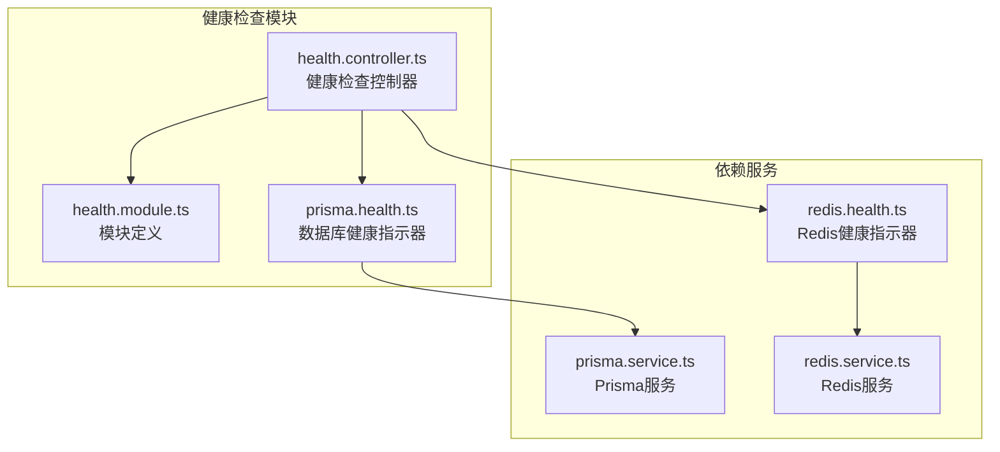
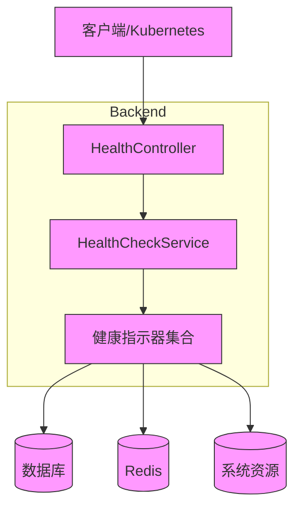
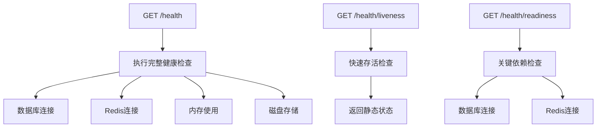
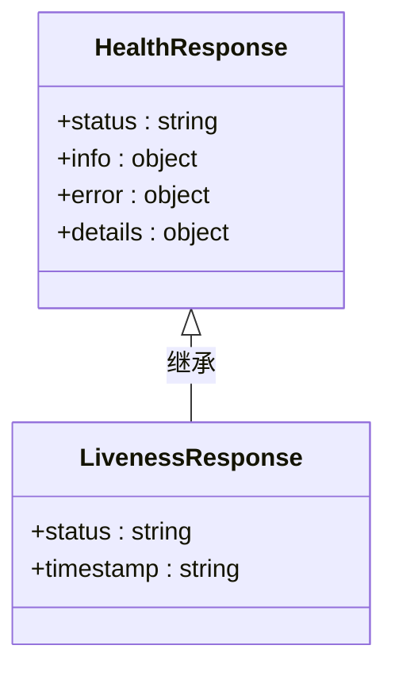
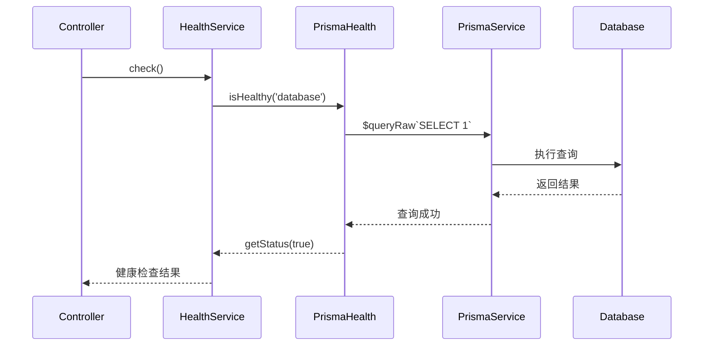
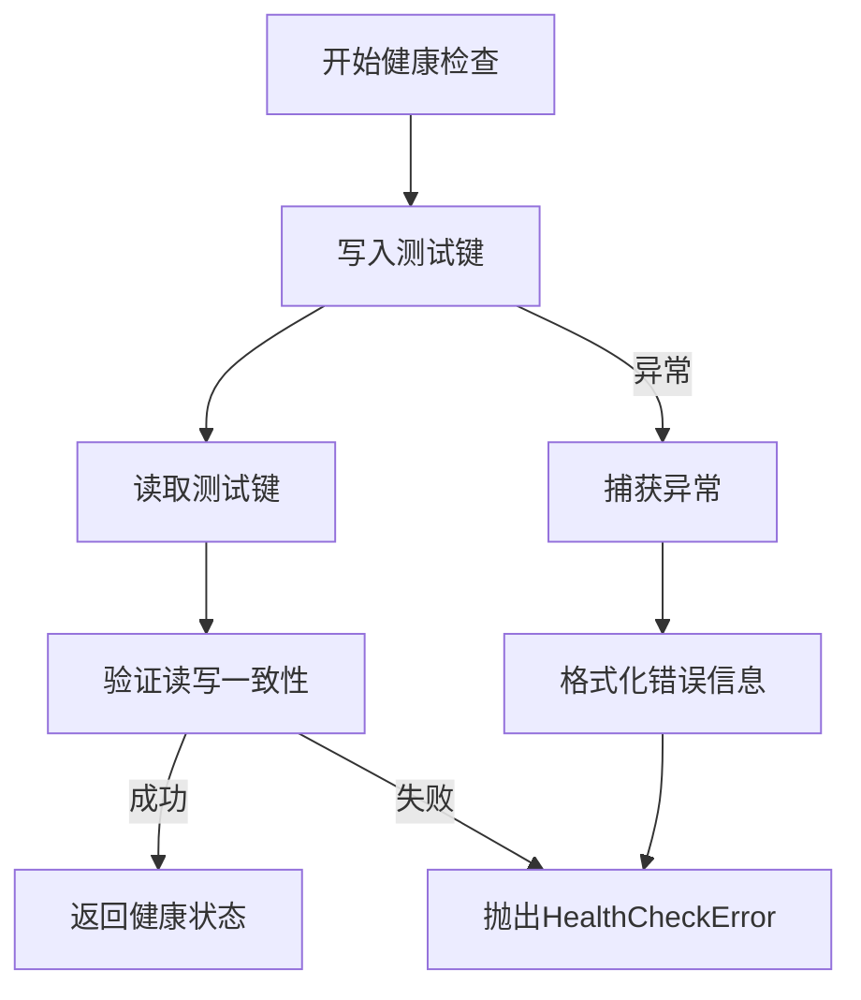
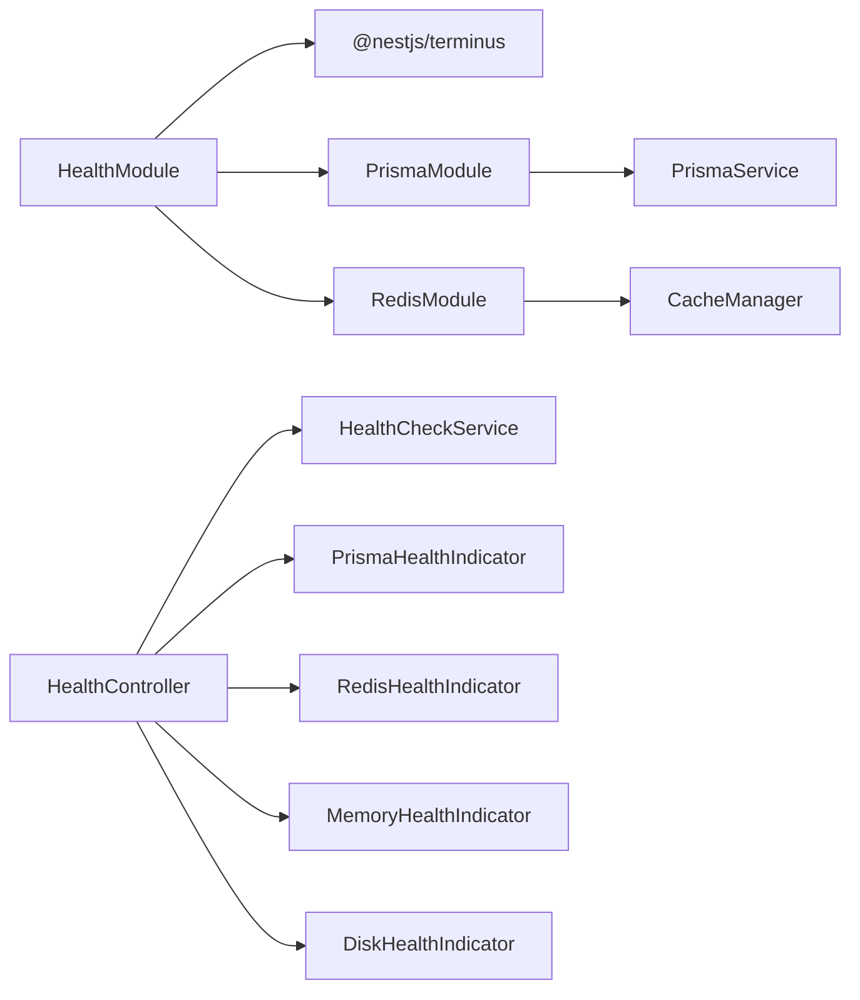
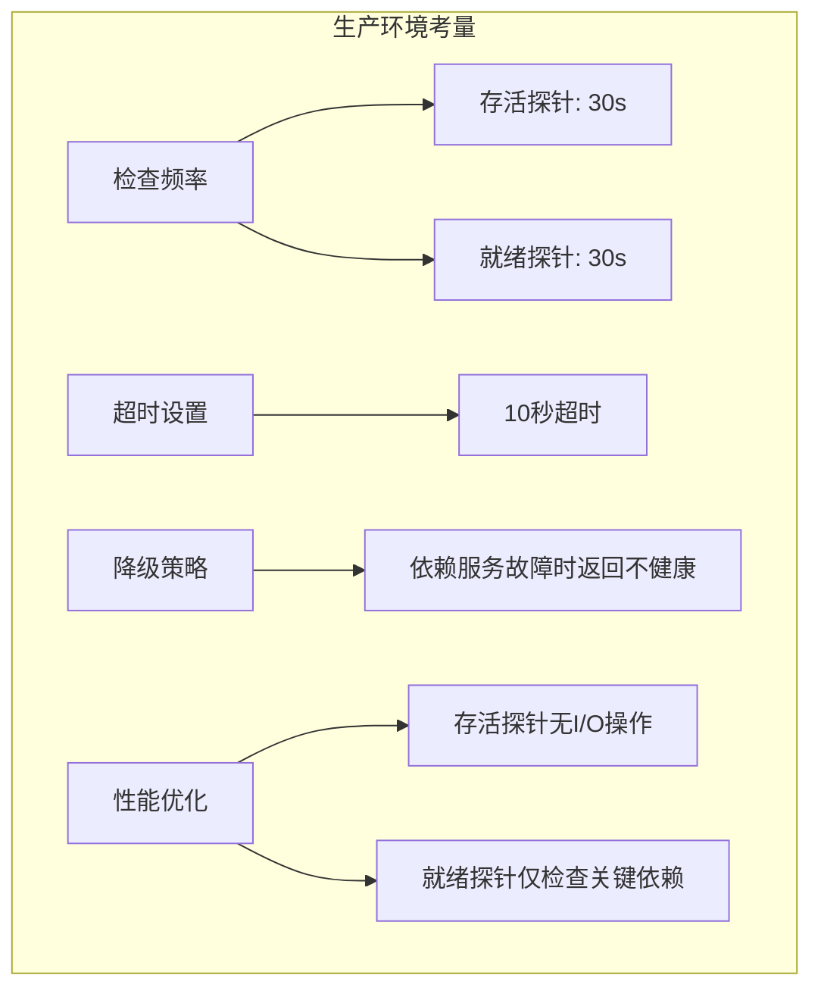

# 健康检查模块

<cite>
**本文档引用的文件**  
- [health.controller.ts](file://apps/backend/src/health/health.controller.ts)
- [health.module.ts](file://apps/backend/src/health/health.module.ts)
- [prisma.health.ts](file://apps/backend/src/health/prisma.health.ts)
- [redis.health.ts](file://apps/backend/src/redis/redis.health.ts)
- [redis.module.ts](file://apps/backend/src/redis/redis.module.ts)
- [prisma.service.ts](file://apps/backend/src/prisma/prisma.service.ts)
- [app.module.ts](file://apps/backend/src/app.module.ts)
- [docker-compose.yml](file://docker-compose.yml)
</cite>

## 目录
1. [简介](#简介)
2. [项目结构](#项目结构)
3. [核心组件](#核心组件)
4. [架构概述](#架构概述)
5. [详细组件分析](#详细组件分析)
6. [依赖分析](#依赖分析)
7. [性能考量](#性能考量)
8. [故障排除指南](#故障排除指南)
9. [结论](#结论)

## 简介
本项目中的健康检查模块旨在为系统运行状态提供全面的监控与暴露机制。通过集成NestJS生态系统中的`@nestjs/terminus`库，该模块实现了对数据库、缓存、内存和磁盘等关键组件的健康状态检测。模块设计支持Kubernetes环境下的存活（liveness）与就绪（readiness）探针配置，并通过可扩展的健康指示器架构允许自定义检查项。整体设计兼顾了生产环境的稳定性需求，同时避免健康检查本身成为性能瓶颈。

## 项目结构
健康检查模块位于`apps/backend/src/health`目录下，包含控制器、模块定义及自定义健康指示器。模块通过依赖注入机制与Prisma数据库服务和Redis缓存服务集成，实现端到端的健康状态验证。

**Diagram sources**  
- [health.controller.ts](file://apps/backend/src/health/health.controller.ts)
- [health.module.ts](file://apps/backend/src/health/health.module.ts)
- [prisma.health.ts](file://apps/backend/src/health/prisma.health.ts)
- [redis.health.ts](file://apps/backend/src/redis/redis.health.ts)
- [prisma.service.ts](file://apps/backend/src/prisma/prisma.service.ts)

**Section sources**  
- [health.controller.ts](file://apps/backend/src/health/health.controller.ts)
- [health.module.ts](file://apps/backend/src/health/health.module.ts)

## 核心组件
健康检查模块的核心组件包括`HealthController`、`HealthModule`、`PrismaHealthIndicator`和`RedisHealthIndicator`。这些组件协同工作，提供分层的健康状态检测能力。控制器暴露多个端点以适应不同场景，而健康指示器则封装了具体服务的连通性检测逻辑。

**Section sources**  
- [health.controller.ts](file://apps/backend/src/health/health.controller.ts#L1-L77)
- [prisma.health.ts](file://apps/backend/src/health/prisma.health.ts#L1-L32)
- [redis.health.ts](file://apps/backend/src/redis/redis.health.ts#L1-L43)

## 架构概述
健康检查模块采用分层架构设计，基于NestJS的依赖注入和模块系统。`HealthModule`负责注册所有健康检查相关的提供者和服务，`HealthController`作为入口点处理HTTP请求，而具体的健康指示器则实现底层检测逻辑。

**Diagram sources**  
- [health.controller.ts](file://apps/backend/src/health/health.controller.ts#L16-L76)
- [health.module.ts](file://apps/backend/src/health/health.module.ts#L8-L13)

## 详细组件分析

### 健康检查控制器分析
`HealthController`提供了三个主要端点：综合健康检查（`/health`）、存活探针（`/health/liveness`）和就绪探针（`/health/readiness`）。这种分层设计允许Kubernetes等编排系统根据不同的需求使用适当的探针。

#### API端点设计

**Diagram sources**  
- [health.controller.ts](file://apps/backend/src/health/health.controller.ts#L31-L75)

#### 响应格式设计
健康检查端点返回标准化的JSON响应，包含状态、时间戳和各检查项的详细结果。对于存活探针，返回极简的响应以减少开销。

**Diagram sources**  
- [health.controller.ts](file://apps/backend/src/health/health.controller.ts#L60)
- [health.controller.ts](file://apps/backend/src/health/health.controller.ts#L35-L50)

**Section sources**  
- [health.controller.ts](file://apps/backend/src/health/health.controller.ts#L18-L76)

### Prisma健康指示器分析
`PrismaHealthIndicator`通过执行一个简单的SQL查询（`SELECT 1`）来验证数据库连接的可用性。这种轻量级的检测方式既能确认连接状态，又不会对数据库造成显著负载。

**Diagram sources**  
- [prisma.health.ts](file://apps/backend/src/health/prisma.health.ts#L19-L30)
- [prisma.service.ts](file://apps/backend/src/prisma/prisma.service.ts#L13)

**Section sources**  
- [prisma.health.ts](file://apps/backend/src/health/prisma.health.ts#L1-L32)

### Redis健康指示器分析
`RedisHealthIndicator`通过执行一个完整的写入-读取周期来验证Redis连接的完整性。它使用一个临时键进行测试，确保不仅连接可用，而且读写功能正常。

**Diagram sources**  
- [redis.health.ts](file://apps/backend/src/redis/redis.health.ts#L20-L40)

**Section sources**  
- [redis.health.ts](file://apps/backend/src/redis/redis.health.ts#L1-L43)

## 依赖分析
健康检查模块依赖于NestJS的多个核心模块和第三方库，通过清晰的依赖关系实现功能解耦。

**Diagram sources**  
- [health.module.ts](file://apps/backend/src/health/health.module.ts#L8-L12)
- [app.module.ts](file://apps/backend/src/app.module.ts#L137)

**Section sources**  
- [health.module.ts](file://apps/backend/src/health/health.module.ts#L1-L14)
- [app.module.ts](file://apps/backend/src/app.module.ts#L11-L13)

## 性能考量
在生产环境中，健康检查的设计需要平衡检测的全面性与性能开销。本模块通过多种策略避免成为性能瓶颈：

1. **分层探针设计**：存活探针使用极简的静态响应，避免任何I/O操作。
2. **合理的检查频率**：通过Docker Compose配置，设置30秒的检查间隔，避免过于频繁的检查。
3. **超时设置**：在docker-compose.yml中配置10秒的超时，防止健康检查阻塞。
4. **非关键检查分离**：内存和磁盘检查仅在综合健康检查中执行，不在就绪探针中包含。

**Diagram sources**  
- [docker-compose.yml](file://docker-compose.yml#L69-L74)
- [health.controller.ts](file://apps/backend/src/health/health.controller.ts#L57-L61)

**Section sources**  
- [docker-compose.yml](file://docker-compose.yml#L69-L74)
- [health.controller.ts](file://apps/backend/src/health/health.controller.ts#L57-L61)

## 故障排除指南
当健康检查失败时，应按照以下步骤进行排查：

1. **检查数据库连接**：确认PostgreSQL服务是否正常运行，连接字符串是否正确。
2. **验证Redis状态**：确保Redis服务可用，且网络连接正常。
3. **查看日志信息**：健康检查的错误响应包含详细的错误消息，可用于诊断问题。
4. **检查资源限制**：确认内存和磁盘使用未超过预设阈值。

**Section sources**  
- [prisma.health.ts](file://apps/backend/src/health/prisma.health.ts#L24-L28)
- [redis.health.ts](file://apps/backend/src/redis/redis.health.ts#L35-L39)

## 结论
本健康检查模块通过合理的架构设计和实现，为系统提供了可靠的运行状态监控能力。模块充分利用了NestJS生态系统的优势，实现了可扩展、高性能的健康检查机制。通过分层的探针设计和合理的配置，既满足了Kubernetes等编排系统的需求，又避免了对系统性能的负面影响。未来可进一步扩展自定义健康指示器，以适应更多特定的业务场景。