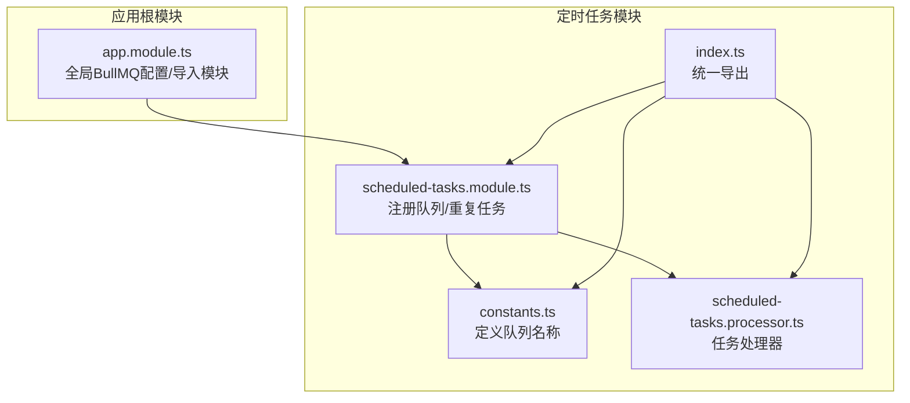
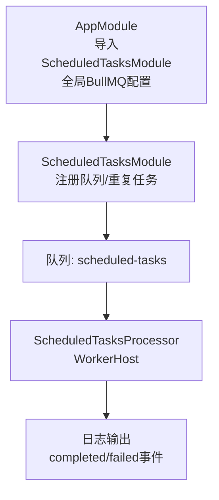
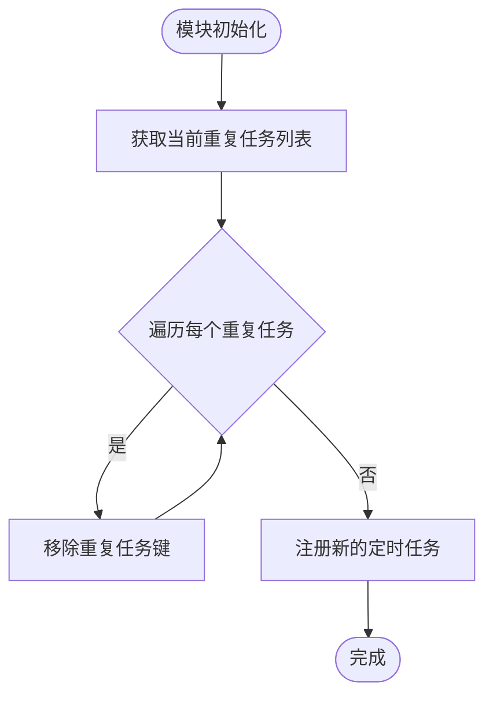
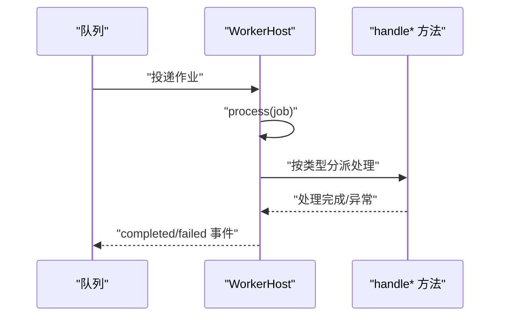
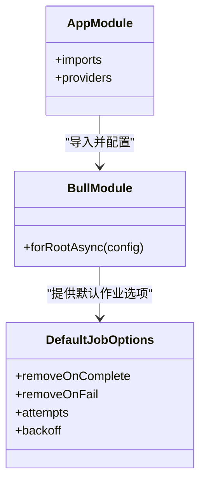
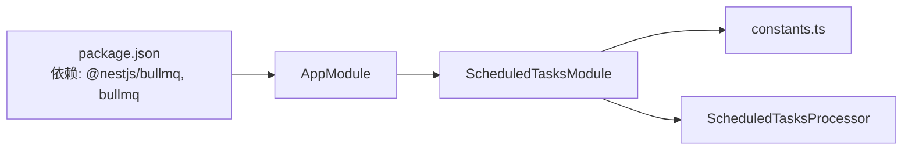

# 定时任务模块

<cite>
**本文引用的文件**
- [scheduled-tasks.module.ts](file://apps/backend/src/scheduled-tasks/scheduled-tasks.module.ts)
- [scheduled-tasks.processor.ts](file://apps/backend/src/scheduled-tasks/scheduled-tasks.processor.ts)
- [constants.ts](file://apps/backend/src/scheduled-tasks/constants.ts)
- [index.ts](file://apps/backend/src/scheduled-tasks/index.ts)
- [app.module.ts](file://apps/backend/src/app.module.ts)
- [package.json](file://apps/backend/package.json)
- [mail.module.ts](file://apps/backend/src/mail/mail.module.ts)
- [mail.service.ts](file://apps/backend/src/mail/mail.service.ts)
</cite>

## 目录
1. [简介](#简介)
2. [项目结构](#项目结构)
3. [核心组件](#核心组件)
4. [架构总览](#架构总览)
5. [详细组件分析](#详细组件分析)
6. [依赖关系分析](#依赖关系分析)
7. [性能考虑](#性能考虑)
8. [故障排查指南](#故障排查指南)
9. [结论](#结论)
10. [附录](#附录)

## 简介
本文件深入解析基于 BullMQ 的定时任务模块实现，围绕 ScheduledTasksModule 展开，说明任务队列、处理器（processor）与作业（job）的注册方式；阐述 scheduled-tasks.processor.ts 中任务处理逻辑的编写规范（错误处理、重试机制、日志记录）；结合 constants.ts 解释任务类型、重复规则等配置常量的组织方式；并提供每日数据清理、定期邮件通知等典型任务的定义与触发流程示例；最后讨论任务监控、失败告警、并发控制等运维需求及性能调优建议。

## 项目结构
定时任务模块位于 backend 应用的 scheduled-tasks 目录下，采用按功能分层的组织方式：
- constants.ts：集中定义队列名称等常量
- scheduled-tasks.module.ts：模块入口，负责注册队列、清理旧重复任务、注册新的定时任务
- scheduled-tasks.processor.ts：任务处理器，按任务类型分发处理
- index.ts：统一导出，便于上层模块引入

图表来源
- [scheduled-tasks.module.ts](file://apps/backend/src/scheduled-tasks/scheduled-tasks.module.ts#L1-L78)
- [scheduled-tasks.processor.ts](file://apps/backend/src/scheduled-tasks/scheduled-tasks.processor.ts#L1-L74)
- [constants.ts](file://apps/backend/src/scheduled-tasks/constants.ts#L1-L5)
- [index.ts](file://apps/backend/src/scheduled-tasks/index.ts#L1-L4)
- [app.module.ts](file://apps/backend/src/app.module.ts#L1-L159)

章节来源
- [scheduled-tasks.module.ts](file://apps/backend/src/scheduled-tasks/scheduled-tasks.module.ts#L1-L78)
- [scheduled-tasks.processor.ts](file://apps/backend/src/scheduled-tasks/scheduled-tasks.processor.ts#L1-L74)
- [constants.ts](file://apps/backend/src/scheduled-tasks/constants.ts#L1-L5)
- [index.ts](file://apps/backend/src/scheduled-tasks/index.ts#L1-L4)
- [app.module.ts](file://apps/backend/src/app.module.ts#L1-L159)

## 核心组件
- 队列名称常量：通过 constants.ts 统一管理队列名称，避免硬编码，便于维护与复用。
- 模块注册：ScheduledTasksModule 在 OnModuleInit 生命周期中清理旧的重复任务并注册新的定时任务，确保配置变更生效。
- 任务处理器：ScheduledTasksProcessor 实现 WorkerHost，按任务类型分发处理，并在完成/失败事件中输出日志。
- 全局队列配置：AppModule 通过 BullModule.forRootAsync 提供全局默认作业选项（如 removeOnComplete/removeOnFail、attempts/backoff），保障任务生命周期与重试策略的一致性。

章节来源
- [constants.ts](file://apps/backend/src/scheduled-tasks/constants.ts#L1-L5)
- [scheduled-tasks.module.ts](file://apps/backend/src/scheduled-tasks/scheduled-tasks.module.ts#L1-L78)
- [scheduled-tasks.processor.ts](file://apps/backend/src/scheduled-tasks/scheduled-tasks.processor.ts#L1-L74)
- [app.module.ts](file://apps/backend/src/app.module.ts#L92-L111)

## 架构总览
定时任务模块与应用根模块的关系如下：
- AppModule 导入 ScheduledTasksModule，并提供全局 BullMQ 连接与默认作业选项
- ScheduledTasksModule 注册指定名称的队列，并在初始化时清理旧重复任务、注册新的定时任务
- ScheduledTasksProcessor 监听该队列，按任务类型分派处理逻辑

图表来源
- [app.module.ts](file://apps/backend/src/app.module.ts#L135-L143)
- [scheduled-tasks.module.ts](file://apps/backend/src/scheduled-tasks/scheduled-tasks.module.ts#L14-L23)
- [scheduled-tasks.processor.ts](file://apps/backend/src/scheduled-tasks/scheduled-tasks.processor.ts#L15-L18)

## 详细组件分析

### 组件A：ScheduledTasksModule（模块）
职责与行为
- 引入 BullMQ 并注册名为“scheduled-tasks”的队列
- 在模块初始化时：
  - 清理旧的重复任务键，确保新配置生效
  - 注册三类定时任务：
    - 每分钟健康检查
    - 每小时清理过期数据
    - 每天凌晨两点的数据统计
- 每个任务均设置重复模式（cron 表达式）、完成/失败后的清理策略（removeOnComplete/removeOnFail）

关键实现要点
- 通过 InjectQueue 获取队列实例，保证处理器与模块共享同一队列
- 使用 getRepeatableJobs 与 removeRepeatableByKey 清理旧重复任务，避免重复注册导致的冲突
- 重复任务的 cron 表达式遵循标准语法，分别对应“每分钟”、“每小时整点”、“每天 02:00”

图表来源
- [scheduled-tasks.module.ts](file://apps/backend/src/scheduled-tasks/scheduled-tasks.module.ts#L24-L35)
- [scheduled-tasks.module.ts](file://apps/backend/src/scheduled-tasks/scheduled-tasks.module.ts#L37-L77)

章节来源
- [scheduled-tasks.module.ts](file://apps/backend/src/scheduled-tasks/scheduled-tasks.module.ts#L14-L23)
- [scheduled-tasks.module.ts](file://apps/backend/src/scheduled-tasks/scheduled-tasks.module.ts#L24-L35)
- [scheduled-tasks.module.ts](file://apps/backend/src/scheduled-tasks/scheduled-tasks.module.ts#L37-L77)

### 组件B：ScheduledTasksProcessor（处理器）
职责与行为
- 作为 WorkerHost，监听“scheduled-tasks”队列
- process(job) 根据 job.data.type 分发到不同处理函数
- 提供完成/失败事件回调，统一记录日志

处理逻辑规范
- 错误处理：处理器内部未显式抛出异常，但框架会依据全局默认作业选项进行重试与失败保留；可在各处理函数内部捕获异常并记录
- 重试机制：由全局默认作业选项控制（attempts/backoff），处理器无需手动实现重试
- 日志记录：使用 Logger 输出调试/信息/警告/错误级别的日志，便于监控与排障

图表来源
- [scheduled-tasks.processor.ts](file://apps/backend/src/scheduled-tasks/scheduled-tasks.processor.ts#L19-L35)
- [scheduled-tasks.processor.ts](file://apps/backend/src/scheduled-tasks/scheduled-tasks.processor.ts#L40-L62)
- [scheduled-tasks.processor.ts](file://apps/backend/src/scheduled-tasks/scheduled-tasks.processor.ts#L64-L73)

章节来源
- [scheduled-tasks.processor.ts](file://apps/backend/src/scheduled-tasks/scheduled-tasks.processor.ts#L1-L74)

### 组件C：常量与导出（constants.ts 与 index.ts）
- 常量：SCHEDULED_TASKS_QUEUE 统一定义队列名称，避免散落的字符串字面量
- 导出：index.ts 将常量、模块、处理器统一导出，便于上层模块按需引入

章节来源
- [constants.ts](file://apps/backend/src/scheduled-tasks/constants.ts#L1-L5)
- [index.ts](file://apps/backend/src/scheduled-tasks/index.ts#L1-L4)

### 组件D：全局队列配置（AppModule）
- BullModule.forRootAsync 提供 Redis 连接参数与默认作业选项
- 默认作业选项包含：
  - removeOnComplete：完成后自动删除
  - removeOnFail：失败后保留以便排查
  - attempts：失败重试次数
  - backoff：指数退避策略与初始延迟

图表来源
- [app.module.ts](file://apps/backend/src/app.module.ts#L92-L111)

章节来源
- [app.module.ts](file://apps/backend/src/app.module.ts#L92-L111)

## 依赖关系分析
- 模块耦合
  - ScheduledTasksModule 依赖 constants.ts 中的队列名称常量
  - ScheduledTasksModule 与 ScheduledTasksProcessor 通过同一队列名称耦合
  - AppModule 导入并启用 ScheduledTasksModule，提供全局队列配置
- 外部依赖
  - @nestjs/bullmq 与 bullmq 提供队列与作业管理能力
  - Redis 作为持久化存储与作业状态管理介质

图表来源
- [package.json](file://apps/backend/package.json#L21-L66)
- [app.module.ts](file://apps/backend/src/app.module.ts#L92-L111)
- [scheduled-tasks.module.ts](file://apps/backend/src/scheduled-tasks/scheduled-tasks.module.ts#L14-L23)
- [scheduled-tasks.processor.ts](file://apps/backend/src/scheduled-tasks/scheduled-tasks.processor.ts#L15-L18)

章节来源
- [package.json](file://apps/backend/package.json#L21-L66)
- [app.module.ts](file://apps/backend/src/app.module.ts#L92-L111)
- [scheduled-tasks.module.ts](file://apps/backend/src/scheduled-tasks/scheduled-tasks.module.ts#L14-L23)
- [scheduled-tasks.processor.ts](file://apps/backend/src/scheduled-tasks/scheduled-tasks.processor.ts#L15-L18)

## 性能考虑
- 重复任务清理
  - 在模块初始化时清理旧重复任务键，避免重复注册导致的资源浪费与执行冲突
- 作业生命周期
  - removeOnComplete=true 可减少已完成作业的存储占用；removeOnFail=false 便于失败排查
- 重试策略
  - 通过 attempts 与 backoff 控制失败重试频率与退避时间，降低瞬时故障对系统的影响
- 并发控制
  - Worker 数量与队列并发度应与 CPU/内存/Redis 负载匹配，避免过度竞争
- 监控与日志
  - 使用日志级别区分正常与异常路径，结合外部监控工具（如 Prometheus/Grafana）观察队列长度、作业耗时与失败率

[本节为通用性能建议，不直接分析具体文件]

## 故障排查指南
- 任务未执行
  - 检查模块是否正确导入与初始化
  - 确认 cron 表达式是否符合预期
- 重复任务冲突
  - 观察模块初始化时是否清理了旧重复任务键
- 失败排查
  - 查看 failed 事件日志，定位异常原因
  - 结合 removeOnFail=false 的配置保留的失败作业进行复盘
- 重试无效
  - 检查全局默认作业选项（attempts/backoff）是否生效
- 日志级别
  - 使用 debug/info/warn/error 级别区分不同场景，便于快速定位问题

章节来源
- [scheduled-tasks.module.ts](file://apps/backend/src/scheduled-tasks/scheduled-tasks.module.ts#L24-L35)
- [scheduled-tasks.processor.ts](file://apps/backend/src/scheduled-tasks/scheduled-tasks.processor.ts#L64-L73)
- [app.module.ts](file://apps/backend/src/app.module.ts#L92-L111)

## 结论
本模块以 BullMQ 为基础，通过统一的队列名称常量、模块初始化时的重复任务清理与注册、以及基于 WorkerHost 的任务分发与事件日志，实现了稳定可靠的定时任务调度。配合全局默认作业选项，可有效控制任务生命周期与重试策略。后续可通过扩展处理器方法与引入邮件服务等方式，实现更丰富的定时任务场景（如每日数据清理、定期邮件通知等）。

[本节为总结性内容，不直接分析具体文件]

## 附录

### 用例：每日数据清理
- 任务定义
  - 在模块初始化中注册“每天 02:00”执行的清理任务，使用 cron 表达式
  - 作业数据包含 type 字段，处理器按类型分派到清理逻辑
- 触发流程
  - 模块启动时清理旧重复任务键
  - 注册新的清理任务
  - 定时到达时，队列投递作业至处理器
  - 处理器执行清理逻辑并记录日志

章节来源
- [scheduled-tasks.module.ts](file://apps/backend/src/scheduled-tasks/scheduled-tasks.module.ts#L64-L75)
- [scheduled-tasks.processor.ts](file://apps/backend/src/scheduled-tasks/scheduled-tasks.processor.ts#L46-L53)

### 用例：定期邮件通知
- 任务定义
  - 可新增一个“定期邮件通知”任务，cron 表达式按需设定
  - 作业数据包含 type 字段与必要的通知参数
- 触发流程
  - 模块初始化时注册该任务
  - 定时到达时，队列投递作业至处理器
  - 处理器调用邮件服务发送通知，并记录日志

章节来源
- [scheduled-tasks.module.ts](file://apps/backend/src/scheduled-tasks/scheduled-tasks.module.ts#L37-L59)
- [scheduled-tasks.processor.ts](file://apps/backend/src/scheduled-tasks/scheduled-tasks.processor.ts#L19-L35)
- [mail.module.ts](file://apps/backend/src/mail/mail.module.ts#L1-L34)
- [mail.service.ts](file://apps/backend/src/mail/mail.service.ts#L1-L82)

### 任务监控与运维
- 监控指标
  - 队列长度、作业耗时、失败率、重试次数
- 告警策略
  - 失败率阈值、作业超时阈值、队列堆积阈值
- 并发控制
  - 合理设置 Worker 数量与队列并发度，避免资源争用
- 日志与审计
  - 使用统一日志级别与上下文标识，便于审计与排障

[本节为通用运维建议，不直接分析具体文件]