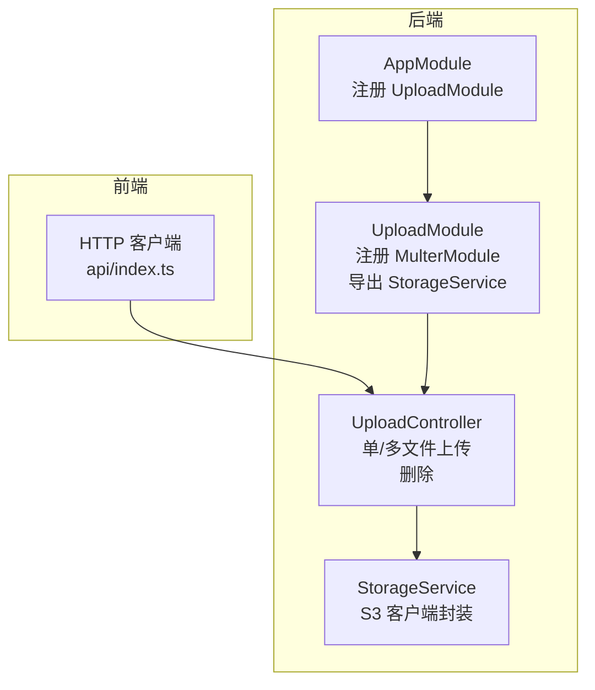
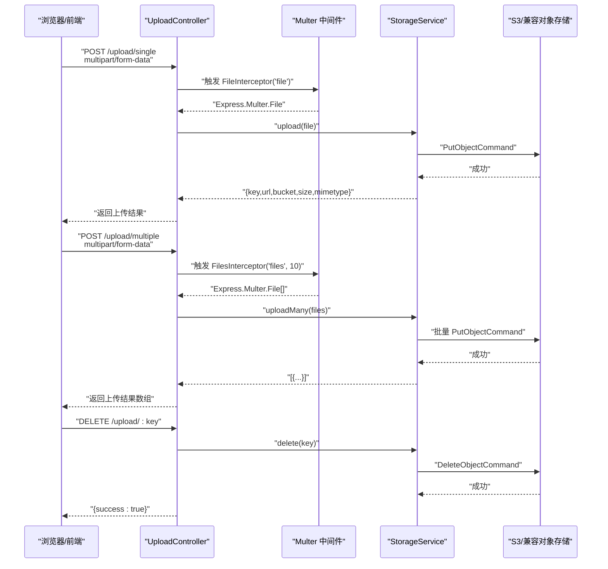
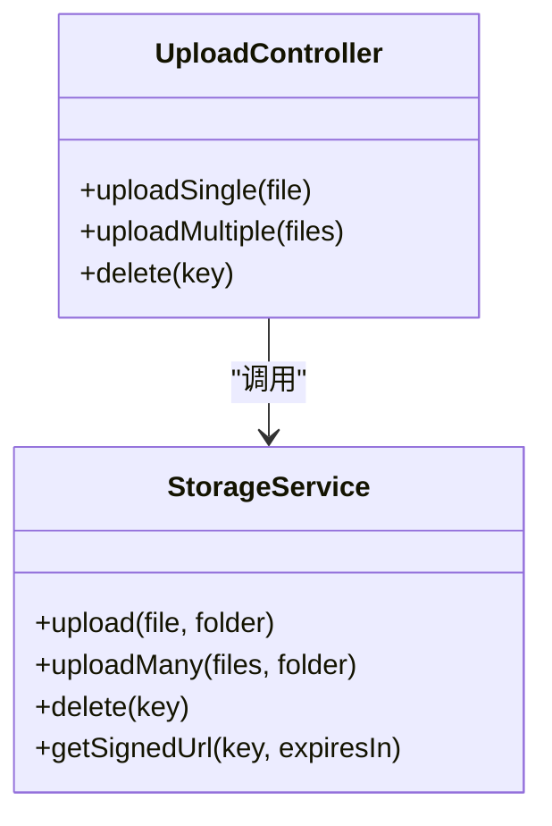
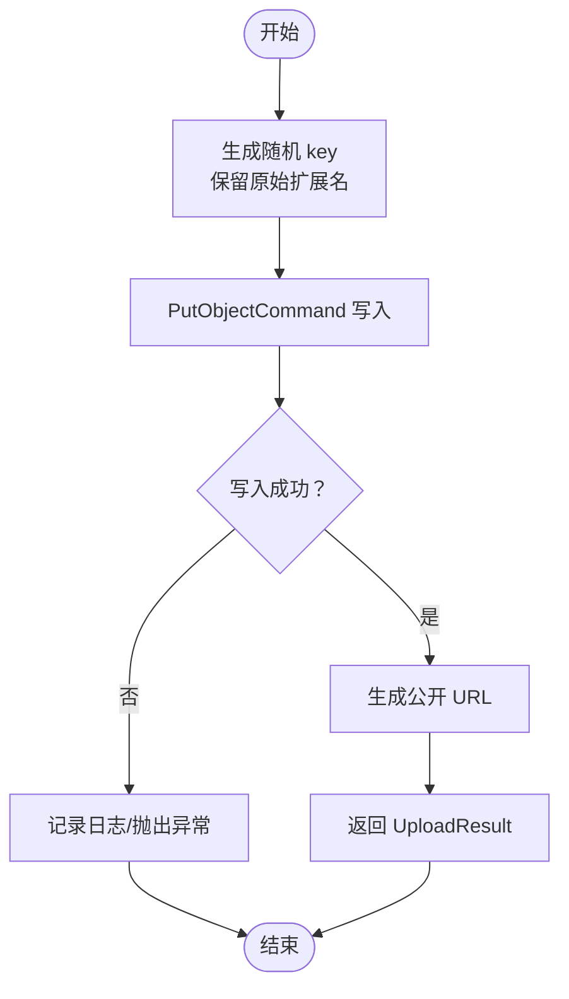
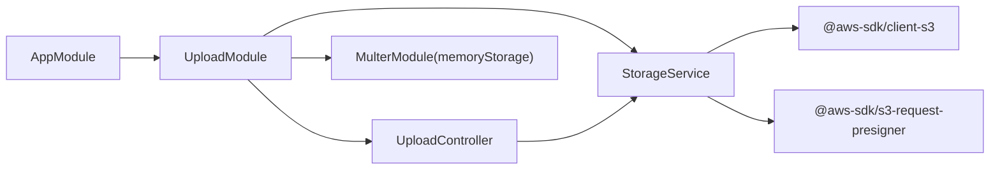

# 文件上传模块

<cite>
**本文引用的文件**
- [apps/backend/src/upload/upload.controller.ts](file://apps/backend/src/upload/upload.controller.ts)
- [apps/backend/src/upload/storage.service.ts](file://apps/backend/src/upload/storage.service.ts)
- [apps/backend/src/upload/upload.module.ts](file://apps/backend/src/upload/upload.module.ts)
- [apps/backend/src/app.module.ts](file://apps/backend/src/app.module.ts)
- [.env.example](file://.env.example)
- [apps/frontend/src/api/index.ts](file://apps/frontend/src/api/index.ts)
- [apps/backend/src/upload/index.ts](file://apps/backend/src/upload/index.ts)
</cite>

## 目录
1. [简介](#简介)
2. [项目结构](#项目结构)
3. [核心组件](#核心组件)
4. [架构总览](#架构总览)
5. [详细组件分析](#详细组件分析)
6. [依赖关系分析](#依赖关系分析)
7. [性能考虑](#性能考虑)
8. [故障排除指南](#故障排除指南)
9. [结论](#结论)
10. [附录](#附录)

## 简介
本文件上传模块围绕 UploadController 与 StorageService 的协作展开，提供基于 multipart/form-data 的文件上传能力，支持单文件与多文件上传、删除操作；通过 Multer 进行中间件级的安全控制（大小限制、类型校验），并通过 AWS SDK 客户端对接 S3 或兼容 S3 的对象存储（如 MinIO、阿里云 OSS）。模块采用可插拔的配置方式，便于在不同环境下切换存储后端；同时提供预签名 URL 与公开访问 URL 的生成策略，满足私有与公开场景的访问需求。

## 项目结构
- 后端模块划分清晰：UploadModule 负责上传相关功能，AppModule 将其纳入全局应用。
- 上传模块内部包含：
  - 控制器：处理 HTTP 请求，绑定路由与中间件。
  - 存储服务：封装 S3 客户端与对象存储交互。
  - 模块：注册 Multer 中间件、导出存储服务供其他模块使用。
- 前端通过统一的 HTTP 客户端发起上传请求，遵循后端接口规范。

图表来源
- [apps/backend/src/app.module.ts](file://apps/backend/src/app.module.ts#L135-L142)
- [apps/backend/src/upload/upload.module.ts](file://apps/backend/src/upload/upload.module.ts#L12-L49)
- [apps/backend/src/upload/upload.controller.ts](file://apps/backend/src/upload/upload.controller.ts#L23-L83)
- [apps/backend/src/upload/storage.service.ts](file://apps/backend/src/upload/storage.service.ts#L25-L124)
- [apps/frontend/src/api/index.ts](file://apps/frontend/src/api/index.ts#L1-L92)

章节来源
- [apps/backend/src/app.module.ts](file://apps/backend/src/app.module.ts#L135-L142)
- [apps/backend/src/upload/upload.module.ts](file://apps/backend/src/upload/upload.module.ts#L12-L49)

## 核心组件
- UploadController
  - 提供上传单文件、上传多文件、删除文件三个接口。
  - 使用 JWT 守卫鉴权，确保仅认证用户可操作。
  - 通过 FileInterceptor/FilesInterceptor 绑定 multipart/form-data 字段名与文件数量上限。
- StorageService
  - 基于 @aws-sdk/client-s3 构建 S3 客户端，支持自定义 endpoint（兼容 OSS/MinIO）。
  - 提供上传、批量上传、删除、预签名 URL 生成与公开 URL 生成。
  - 上传结果包含 key、url、bucket、size、mimetype 等元数据。
- UploadModule
  - 注册 MulterModule.Async 工厂，使用内存存储（memoryStorage），随后将文件写入 S3。
  - 通过 limits 与 fileFilter 实现大小限制与类型白名单校验。
  - 导出 StorageService 供其他模块注入使用。

章节来源
- [apps/backend/src/upload/upload.controller.ts](file://apps/backend/src/upload/upload.controller.ts#L23-L83)
- [apps/backend/src/upload/storage.service.ts](file://apps/backend/src/upload/storage.service.ts#L13-L124)
- [apps/backend/src/upload/upload.module.ts](file://apps/backend/src/upload/upload.module.ts#L12-L49)

## 架构总览
下图展示从浏览器到后端控制器再到对象存储的整体流程，以及中间件对请求的前置处理。

图表来源
- [apps/backend/src/upload/upload.controller.ts](file://apps/backend/src/upload/upload.controller.ts#L23-L83)
- [apps/backend/src/upload/storage.service.ts](file://apps/backend/src/upload/storage.service.ts#L53-L122)
- [apps/backend/src/upload/upload.module.ts](file://apps/backend/src/upload/upload.module.ts#L14-L43)

## 详细组件分析

### UploadController 设计与实现
- 路由与鉴权
  - 使用 @ApiBearerAuth 与 @UseGuards(JwtAuthGuard) 保证接口受 JWT 保护。
  - 单文件上传：字段名为 file，绑定 FileInterceptor。
  - 多文件上传：字段名为 files，绑定 FilesInterceptor('files', 10)，限制最多 10 个文件。
- 参数校验与异常
  - 若未上传文件，抛出 BadRequestException。
- 返回值
  - 单文件返回 UploadResult。
  - 多文件返回 UploadResult[]。
  - 删除接口返回 { success: boolean }。

图表来源
- [apps/backend/src/upload/upload.controller.ts](file://apps/backend/src/upload/upload.controller.ts#L23-L83)
- [apps/backend/src/upload/storage.service.ts](file://apps/backend/src/upload/storage.service.ts#L53-L122)

章节来源
- [apps/backend/src/upload/upload.controller.ts](file://apps/backend/src/upload/upload.controller.ts#L23-L83)

### StorageService 抽象设计与可扩展性
- 配置与初始化
  - 通过 ConfigService 读取 S3_BUCKET、S3_REGION、S3_ENDPOINT、S3_ACCESS_KEY_ID、S3_SECRET_ACCESS_KEY。
  - 当存在 endpoint 时启用 forcePathStyle，适配 OSS/MinIO。
- 上传流程
  - 生成带扩展名的随机 key（基于 UUID + 原始扩展名）。
  - 使用 PutObjectCommand 写入对象存储。
  - 返回 UploadResult，其中 url 由 getPublicUrl 生成。
- 删除流程
  - 使用 DeleteObjectCommand 删除对象。
- 预签名 URL
  - 使用 getSignedUrl 生成临时访问链接，适合私有资源的限时分享。
- 公开 URL 生成
  - 若配置了 endpoint，则按 OSS/MinIO 格式拼接；否则按 AWS S3 格式拼接。

图表来源
- [apps/backend/src/upload/storage.service.ts](file://apps/backend/src/upload/storage.service.ts#L53-L122)

章节来源
- [apps/backend/src/upload/storage.service.ts](file://apps/backend/src/upload/storage.service.ts#L13-L124)

### UploadModule 与中间件集成
- Multer 配置
  - storage: memoryStorage（先将文件暂存至内存，再写入 S3）。
  - limits: 通过环境变量 UPLOAD_MAX_SIZE 与 UPLOAD_MAX_FILES 控制单文件大小与文件数量。
  - fileFilter: 白名单 MIME 类型，避免上传不受支持的文件类型。
- 导出
  - UploadModule 导出 StorageService，供其他模块注入使用。

章节来源
- [apps/backend/src/upload/upload.module.ts](file://apps/backend/src/upload/upload.module.ts#L12-L49)

### 与用户模块的关联（头像上传）
- 当前仓库中，用户模块未直接依赖上传模块或存储服务；但可通过业务层在用户服务中保存头像 key 与 URL。
- 建议流程
  - 前端上传头像后，后端返回 UploadResult，业务层将 key/url 写入用户记录。
  - 读取用户信息时，返回包含头像 URL 的用户对象。
- 注意事项
  - 头像上传同样受 JWT 与 Multer 限制。
  - 若头像为私有资源，可使用 StorageService.getSignedUrl 生成临时链接。

章节来源
- [apps/backend/src/users/users.controller.ts](file://apps/backend/src/users/users.controller.ts#L1-L43)
- [apps/backend/src/users/users.service.ts](file://apps/backend/src/users/users.service.ts#L1-L66)
- [apps/backend/src/upload/storage.service.ts](file://apps/backend/src/upload/storage.service.ts#L100-L122)

## 依赖关系分析
- 模块耦合
  - UploadController 依赖 StorageService。
  - UploadModule 同时依赖 MulterModule 与 StorageService，并向外部导出 StorageService。
  - AppModule 将 UploadModule 纳入全局模块树。
- 外部依赖
  - @aws-sdk/client-s3 与 @aws-sdk/s3-request-presigner 提供对象存储与预签名能力。
  - @nestjs/platform-express 与 @nestjs/swagger 提供中间件与接口文档能力。
  - @nestjs/config 提供环境变量读取。

图表来源
- [apps/backend/src/app.module.ts](file://apps/backend/src/app.module.ts#L135-L142)
- [apps/backend/src/upload/upload.module.ts](file://apps/backend/src/upload/upload.module.ts#L12-L49)
- [apps/backend/src/upload/upload.controller.ts](file://apps/backend/src/upload/upload.controller.ts#L23-L83)
- [apps/backend/src/upload/storage.service.ts](file://apps/backend/src/upload/storage.service.ts#L25-L124)

章节来源
- [apps/backend/src/app.module.ts](file://apps/backend/src/app.module.ts#L135-L142)
- [apps/backend/src/upload/upload.module.ts](file://apps/backend/src/upload/upload.module.ts#L12-L49)

## 性能考虑
- 异步处理与并发
  - 批量上传使用 Promise.all 并发执行，提升吞吐量；建议在高并发场景下结合队列（如 Bull/BullMQ）异步落盘到对象存储，避免阻塞请求线程。
- CDN 集成
  - 对象存储可接入 CDN，将公开 URL 前缀替换为 CDN 域名，降低边缘节点延迟。
- 存储路径组织
  - 建议按日期/用户维度组织目录（如 uploads/<YYYY>/<MM>/<DD>/ 或 uploads/<userId>/），便于清理与统计。
- 安全与合规
  - 私有资源使用预签名 URL，避免暴露真实对象地址。
  - 对敏感文件（如身份证、合同）建议加密存储或二次压缩。

[本节为通用建议，无需特定文件引用]

## 故障排除指南
- 上传失败或超时
  - 检查 S3_ENDPOINT、S3_ACCESS_KEY_ID、S3_SECRET_ACCESS_KEY 是否正确配置。
  - 若使用 OSS/MinIO，请确认 endpoint 与 forcePathStyle 设置。
- 文件类型被拒绝
  - 确认 fileFilter 中的 MIME 白名单是否包含目标类型。
- 文件大小超限
  - 检查 UPLOAD_MAX_SIZE 与 UPLOAD_MAX_FILES 的配置值。
- 删除失败
  - 确认 key 是否正确，以及对象是否存在且具备删除权限。
- 预签名 URL 无法访问
  - 检查 expiresIn 是否过期，以及对象是否为私有。

章节来源
- [.env.example](file://.env.example#L43-L52)
- [apps/backend/src/upload/upload.module.ts](file://apps/backend/src/upload/upload.module.ts#L18-L43)
- [apps/backend/src/upload/storage.service.ts](file://apps/backend/src/upload/storage.service.ts#L35-L48)

## 结论
该上传模块以简洁的职责划分实现了完整的文件上传闭环：前端通过 multipart/form-data 发起请求，Multer 在中间件层完成大小与类型校验，UploadController 将文件交由 StorageService 写入对象存储，并返回标准化的元数据。模块通过可配置的 endpoint 与客户端参数，天然支持 AWS S3 与兼容 S3 的对象存储；同时提供预签名 URL 与公开 URL 两种访问策略，满足不同场景需求。未来可在高并发场景引入队列异步落盘与 CDN 加速，进一步提升性能与可用性。

[本节为总结，无需特定文件引用]

## 附录

### 接口定义与响应格式
- 上传单个文件
  - 方法与路径：POST /upload/single
  - 内容类型：multipart/form-data
  - 字段：file（二进制）
  - 响应：UploadResult
    - key：对象键
    - url：访问 URL（公开或预签名）
    - bucket：桶名
    - size：字节数
    - mimetype：MIME 类型
- 上传多个文件
  - 方法与路径：POST /upload/multiple
  - 内容类型：multipart/form-data
  - 字段：files（数组，二进制）
  - 响应：UploadResult[]
- 删除文件
  - 方法与路径：DELETE /upload/:key
  - 响应：{ success: boolean }

章节来源
- [apps/backend/src/upload/upload.controller.ts](file://apps/backend/src/upload/upload.controller.ts#L23-L83)
- [apps/backend/src/upload/storage.service.ts](file://apps/backend/src/upload/storage.service.ts#L13-L20)

### 前端调用示例（概念说明）
- 单文件上传
  - 构造 FormData，字段名为 file，值为 File/Blob。
  - 使用 axios 或 fetch 发送 POST 请求至 /api/upload/single。
  - 成功后从响应中提取 key/url/bucket/size/mimetype。
- 多文件上传
  - 构造 FormData，字段名为 files，值为 FileList 或数组。
  - 发送 POST 请求至 /api/upload/multiple。
- 删除文件
  - 发送 DELETE 请求至 /api/upload/{key}。
- 头像上传
  - 建议在上传后将返回的 url 写入用户头像字段，读取用户信息时一并返回。

章节来源
- [apps/frontend/src/api/index.ts](file://apps/frontend/src/api/index.ts#L1-L92)
- [apps/backend/src/upload/upload.controller.ts](file://apps/backend/src/upload/upload.controller.ts#L23-L83)

### 环境变量与配置要点
- 对象存储
  - S3_BUCKET、S3_REGION、S3_ENDPOINT、S3_ACCESS_KEY_ID、S3_SECRET_ACCESS_KEY
- 上传限制
  - UPLOAD_MAX_SIZE（字节）、UPLOAD_MAX_FILES（数量）

章节来源
- [.env.example](file://.env.example#L43-L52)
- [apps/backend/src/upload/upload.module.ts](file://apps/backend/src/upload/upload.module.ts#L18-L21)

### 模块导出与复用
- UploadModule 导出 StorageService，可在业务模块中直接注入使用。
- 通过 index.ts 统一导出模块与服务，便于上层模块按需导入。

章节来源
- [apps/backend/src/upload/index.ts](file://apps/backend/src/upload/index.ts#L1-L2)
- [apps/backend/src/upload/upload.module.ts](file://apps/backend/src/upload/upload.module.ts#L45-L49)