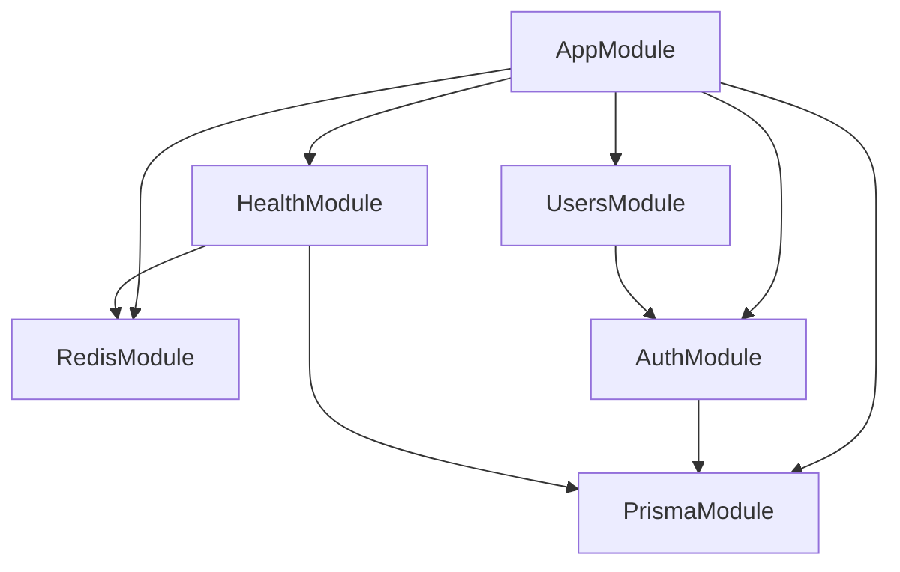
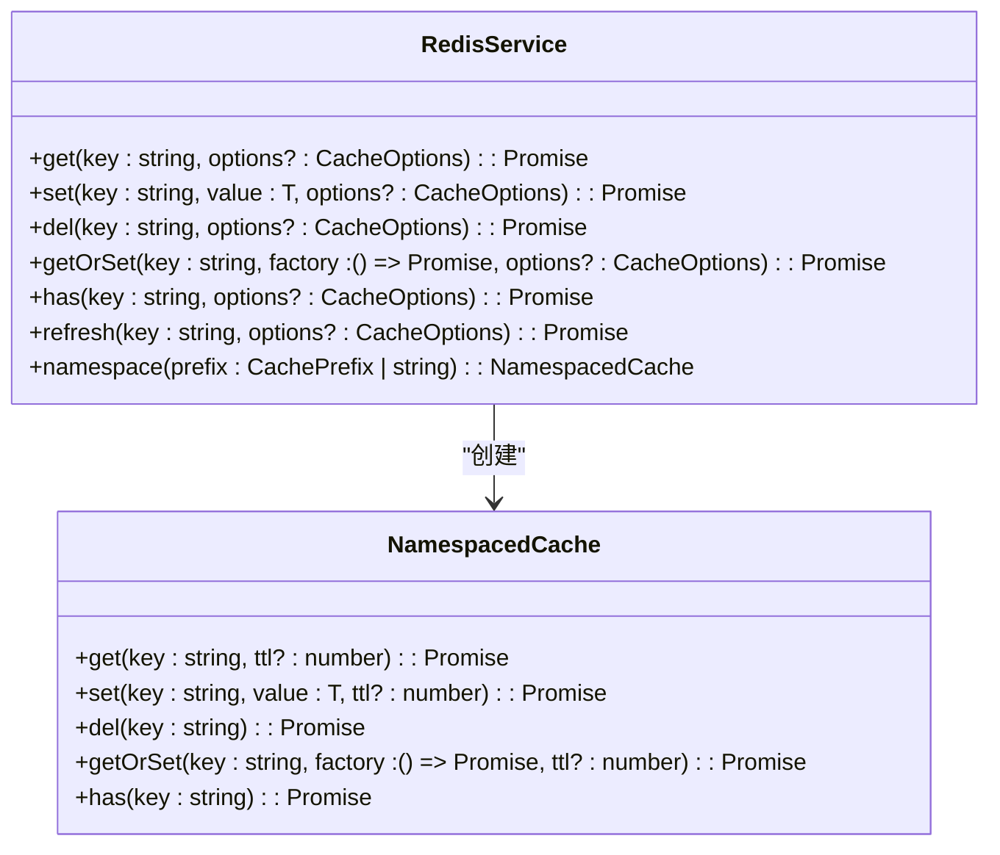
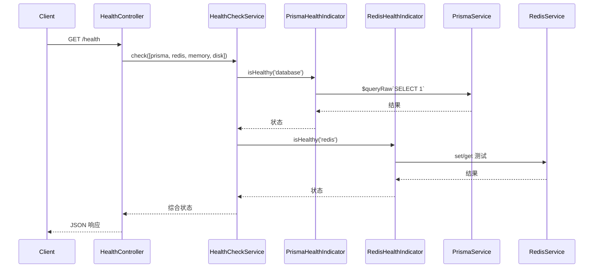
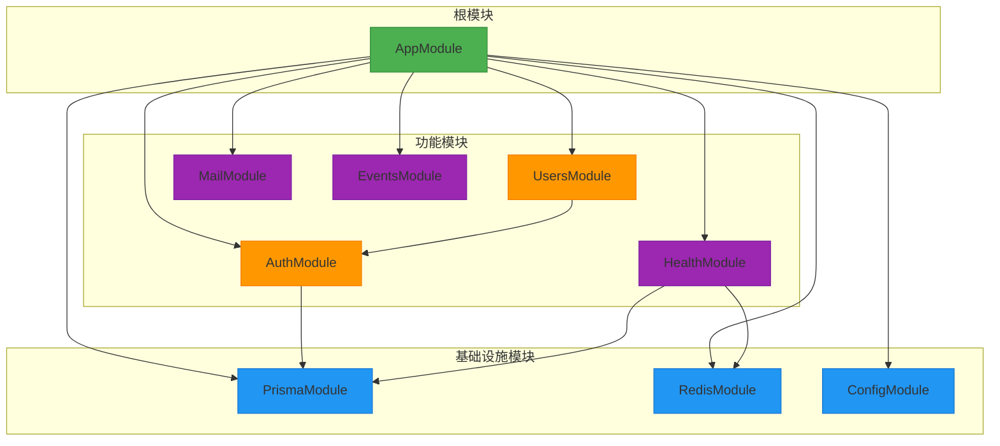

# 模块系统设计

<cite>
**本文档引用的文件**
- [app.module.ts](file://apps/backend/src/app.module.ts)
- [prisma.module.ts](file://apps/backend/src/prisma/prisma.module.ts)
- [redis.module.ts](file://apps/backend/src/redis/redis.module.ts)
- [auth.module.ts](file://apps/backend/src/auth/auth.module.ts)
- [users.module.ts](file://apps/backend/src/users/users.module.ts)
- [health.module.ts](file://apps/backend/src/health/health.module.ts)
- [prisma.service.ts](file://apps/backend/src/prisma/prisma.service.ts)
- [redis.service.ts](file://apps/backend/src/redis/redis.service.ts)
- [auth.service.ts](file://apps/backend/src/auth/auth.service.ts)
- [users.service.ts](file://apps/backend/src/users/users.service.ts)
- [prisma.health.ts](file://apps/backend/src/health/prisma.health.ts)
- [redis.health.ts](file://apps/backend/src/redis/redis.health.ts)
- [health.controller.ts](file://apps/backend/src/health/health.controller.ts)
</cite>

## 目录
1. [简介](#简介)
2. [项目结构](#项目结构)
3. [核心模块分析](#核心模块分析)
4. [模块依赖关系与服务可见性](#模块依赖关系与服务可见性)
5. [全局模块设计：PrismaModule 与 RedisModule](#全局模块设计prismamodule-与-redismodule)
6. [异步配置模式与动态配置](#异步配置模式与动态配置)
7. [模块间依赖管理策略](#模块间依赖管理策略)
8. [健康检查模块集成](#健康检查模块集成)
9. [循环依赖与懒加载解决方案](#循环依赖与懒加载解决方案)
10. [模块复用最佳实践](#模块复用最佳实践)
11. [模块依赖关系图](#模块依赖关系图)

## 简介
本文件深入分析 NestJS 模块系统在实际项目中的设计与实现。重点阐述根模块 AppModule 如何通过 `imports` 导入多个功能子模块，各模块的职责划分与封装原则，以及模块间依赖关系的管理机制。特别说明全局模块（@Global）的设计模式、异步配置（forRootAsync）的应用场景、服务可见性规则及健康检查的集成方式。

## 项目结构
项目采用典型的 NestJS 分层架构，后端模块集中于 `apps/backend/src` 目录下，每个功能模块独立封装，遵循高内聚、低耦合的设计原则。主要模块包括认证（auth）、用户（users）、数据库（prisma）、缓存（redis）、健康检查（health）等。



**模块依赖关系图来源**
- [app.module.ts](file://apps/backend/src/app.module.ts#L22-L158)
- [auth.module.ts](file://apps/backend/src/auth/auth.module.ts#L13-L31)
- [users.module.ts](file://apps/backend/src/users/users.module.ts#L6-L12)
- [health.module.ts](file://apps/backend/src/health/health.module.ts#L8-L13)

## 核心模块分析
NestJS 模块通过 `@Module()` 装饰器定义，包含 `imports`、`controllers`、`providers` 和 `exports` 四个核心属性。`AppModule` 作为根模块，通过 `imports` 集成所有子模块，形成完整的应用结构。

**AppModule 的职责**：
- 集成所有功能模块
- 配置全局中间件（如 CSRF 保护）
- 注册全局守卫（如速率限制）
- 管理跨模块依赖

**Section sources**
- [app.module.ts](file://apps/backend/src/app.module.ts#L22-L158)

## 模块依赖关系与服务可见性
NestJS 模块遵循明确的服务可见性规则：一个模块只能使用其 `imports` 中导入的模块所 `exports` 的提供者（providers）。

例如，`UsersModule` 依赖 `AuthModule` 提供的 `AuthService` 进行权限控制：

```typescript
@Module({
  imports: [AuthModule], // 导入 AuthModule
  controllers: [UsersController],
  providers: [UsersService],
  exports: [UsersService]
})
```

`AuthModule` 必须将 `AuthService` 导出，`UsersModule` 才能注入使用。

**Section sources**
- [users.module.ts](file://apps/backend/src/users/users.module.ts#L6-L12)
- [auth.module.ts](file://apps/backend/src/auth/auth.module.ts#L29)

## 全局模块设计：PrismaModule 与 RedisModule
### PrismaModule 作为全局模块
`PrismaModule` 使用 `@Global()` 装饰器，使其成为全局模块。这意味着一旦在 `AppModule` 中导入，其导出的服务（如 `PrismaService`）可在应用的任何模块中直接注入，无需再次导入。

```typescript
@Global()
@Module({
  providers: [PrismaService],
  exports: [PrismaService]
})
export class PrismaModule {}
```

这种设计适用于数据库服务等基础设施，避免在每个模块中重复导入。

**Section sources**
- [prisma.module.ts](file://apps/backend/src/prisma/prisma.module.ts#L4-L9)
- [prisma.service.ts](file://apps/backend/src/prisma/prisma.service.ts#L4-L20)

### RedisModule 的功能集成
`RedisModule` 不仅提供缓存功能，还集成了健康检查。它通过 `CacheModule.registerAsync` 异步配置 Redis 连接，并导出 `RedisService` 和 `CacheModule`，使其他模块可直接使用缓存服务。



**Diagram sources**
- [redis.service.ts](file://apps/backend/src/redis/redis.service.ts#L51-L232)

**Section sources**
- [redis.module.ts](file://apps/backend/src/redis/redis.module.ts#L26-L83)
- [redis.service.ts](file://apps/backend/src/redis/redis.service.ts#L51-L232)

## 异步配置模式与动态配置
NestJS 提供 `forRootAsync` 模式，支持通过 `ConfigService` 实现环境变量驱动的动态配置。例如，`LoggerModule`、`BullModule`、`ThrottlerModule` 等均使用此模式：

```typescript
LoggerModule.forRootAsync({
  inject: [ConfigService],
  useFactory: (config: ConfigService) => {
    const isProduction = config.get('NODE_ENV') === 'production'
    return {
      pinoHttp: {
        level: config.get('LOG_LEVEL', isProduction ? 'info' : 'debug'),
        // ...其他配置
      }
    }
  }
})
```

这种方式将配置逻辑与环境解耦，提升应用的可移植性和安全性。

**Section sources**
- [app.module.ts](file://apps/backend/src/app.module.ts#L30-L83)
- [app.module.ts](file://apps/backend/src/app.module.ts#L93-L110)
- [app.module.ts](file://apps/backend/src/app.module.ts#L113-L133)

## 模块间依赖管理策略
模块间依赖通过 `imports` 显式声明，确保依赖关系清晰可追踪。例如：
- `AuthModule` 依赖 `PrismaModule` 访问用户数据
- `UsersModule` 依赖 `AuthModule` 进行密码哈希等操作
- `HealthModule` 依赖 `PrismaModule` 和 `RedisModule` 实现健康检查

这种分层依赖结构增强了代码的可维护性和可测试性。

**Section sources**
- [auth.module.ts](file://apps/backend/src/auth/auth.module.ts#L15)
- [users.module.ts](file://apps/backend/src/users/users.module.ts#L7)
- [health.module.ts](file://apps/backend/src/health/health.module.ts#L9)

## 健康检查模块集成
`HealthModule` 使用 `@nestjs/terminus` 提供全面的健康检查功能，集成数据库、Redis、内存和磁盘的健康指示器。



**Diagram sources**
- [health.controller.ts](file://apps/backend/src/health/health.controller.ts#L18-L76)
- [prisma.health.ts](file://apps/backend/src/health/prisma.health.ts#L10-L31)
- [redis.health.ts](file://apps/backend/src/redis/redis.health.ts#L11-L42)

**Section sources**
- [health.module.ts](file://apps/backend/src/health/health.module.ts#L8-L13)
- [health.controller.ts](file://apps/backend/src/health/health.controller.ts#L18-L76)

## 循环依赖与懒加载解决方案
NestJS 通过 `forwardRef()` 解决循环依赖问题。本项目中未发现明显的循环依赖，但模块设计遵循了避免循环依赖的最佳实践：
- 将共享服务提取到独立模块
- 使用接口而非具体类进行依赖注入
- 合理规划模块层级

对于大型应用，可采用懒加载模块（Lazy Loading）优化启动性能，但本项目为单体应用，未使用此特性。

## 模块复用最佳实践
1. **单一职责原则**：每个模块只负责一个功能领域
2. **高内聚低耦合**：模块内部组件紧密相关，模块间依赖清晰
3. **全局模块谨慎使用**：仅将基础设施服务（如数据库、缓存）设为全局
4. **异步配置**：使用 `forRootAsync` 实现环境感知的动态配置
5. **显式依赖声明**：通过 `imports` 明确模块依赖关系
6. **服务导出控制**：仅导出需要被外部使用的服务

## 模块依赖关系图


**Diagram sources**
- [app.module.ts](file://apps/backend/src/app.module.ts#L22-L158)
- [auth.module.ts](file://apps/backend/src/auth/auth.module.ts#L13-L31)
- [users.module.ts](file://apps/backend/src/users/users.module.ts#L6-L12)
- [health.module.ts](file://apps/backend/src/health/health.module.ts#L8-L13)