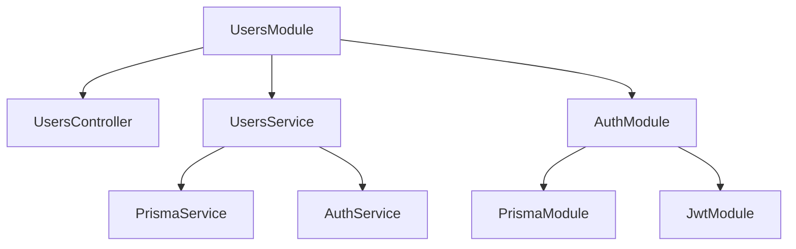
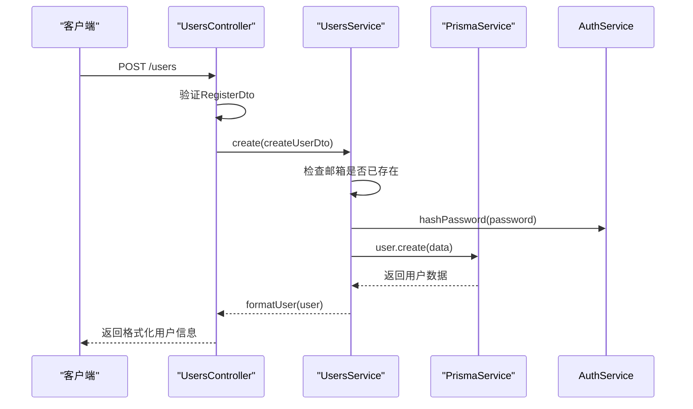

# 用户模块

<cite>
**本文档引用的文件**  
- [users.module.ts](file://apps/backend/src/users/users.module.ts)
- [users.service.ts](file://apps/backend/src/users/users.service.ts)
- [users.controller.ts](file://apps/backend/src/users/users.controller.ts)
- [prisma.service.ts](file://apps/backend/src/prisma/prisma.service.ts)
- [auth.service.ts](file://apps/backend/src/auth/auth.service.ts)
- [auth.module.ts](file://apps/backend/src/auth/auth.module.ts)
- [auth.dto.ts](file://apps/backend/src/auth/auth.dto.ts)
- [common.dto.ts](file://packages/shared/src/dto/common.dto.ts)
- [user.utils.ts](file://packages/shared/src/utils/user.utils.ts)
- [auth.schema.ts](file://packages/shared/src/schemas/auth.schema.ts)
</cite>

## 目录
1. [简介](#简介)
2. [模块结构与依赖注入](#模块结构与依赖注入)
3. [用户服务实现](#用户服务实现)
4. [用户控制器与API设计](#用户控制器与api设计)
5. [认证与访问控制](#认证与访问控制)
6. [典型使用场景](#典型使用场景)
7. [分页、排序与搜索支持](#分页排序与搜索支持)
8. [安全风险与防范措施](#安全风险与防范措施)
9. [结论](#结论)

## 简介
用户模块（UsersModule）是后端系统的核心组件之一，负责用户数据的管理与业务逻辑处理。该模块通过依赖注入机制使用PrismaService实现用户数据的持久化操作，并与AuthModule紧密集成以实现安全的访问控制。本文档将深入解析其结构与实现，涵盖服务层逻辑、控制器设计、认证机制及安全实践。

## 模块结构与依赖注入

用户模块通过NestJS的模块系统组织代码，明确声明了控制器、服务及外部依赖。其核心职责是协调用户相关的HTTP请求与数据操作。

**图示来源**  
- [users.module.ts](file://apps/backend/src/users/users.module.ts#L6-L12)
- [auth.module.ts](file://apps/backend/src/auth/auth.module.ts#L13-L31)

**本节来源**  
- [users.module.ts](file://apps/backend/src/users/users.module.ts#L1-L13)
- [auth.module.ts](file://apps/backend/src/auth/auth.module.ts#L1-L32)

## 用户服务实现

UsersService封装了所有用户相关的业务逻辑，包括用户创建、查询和更新等操作。服务通过依赖注入获取PrismaService和AuthService，分别用于数据库操作和密码加密。

### 用户创建与密码加密
在创建新用户时，服务首先检查邮箱是否已存在，若不存在则调用AuthService的`hashPassword`方法对明文密码进行哈希处理，确保密码以安全形式存储。

### 用户查询与数据格式化
查询操作直接通过PrismaService访问数据库，并使用共享工具函数`formatUser`和`formatUsers`将数据库返回的Date对象转换为ISO字符串格式，保证API响应的一致性。

### 错误处理
服务层实现了细粒度的异常处理，如使用`NotFoundException`表示用户不存在，`ConflictException`表示邮箱冲突，提升API的可调试性。

**本节来源**  
- [users.service.ts](file://apps/backend/src/users/users.service.ts#L11-L65)
- [auth.service.ts](file://apps/backend/src/auth/auth.service.ts#L144-L148)
- [user.utils.ts](file://packages/shared/src/utils/user.utils.ts#L19-L35)

## 用户控制器与API设计

UsersController暴露了RESTful风格的API端点，处理HTTP请求并调用相应服务方法。

### 路径映射与HTTP方法
- `GET /users`：获取所有用户列表
- `GET /users/:id`：根据ID获取单个用户
- `POST /users`：创建新用户（注册）

### DTO验证集成
控制器使用`RegisterDto`作为请求体的数据传输对象，该DTO基于Zod Schema构建，自动集成Swagger文档生成和运行时验证，确保输入数据的合法性。

**图示来源**  
- [users.controller.ts](file://apps/backend/src/users/users.controller.ts#L12-L42)
- [users.service.ts](file://apps/backend/src/users/users.service.ts#L44-L64)

**本节来源**  
- [users.controller.ts](file://apps/backend/src/users/users.controller.ts#L1-L43)
- [auth.dto.ts](file://apps/backend/src/auth/auth.dto.ts#L1-L19)
- [auth.schema.ts](file://packages/shared/src/schemas/auth.schema.ts#L32-L42)

## 认证与访问控制

用户模块依赖AuthModule实现访问控制。虽然当前控制器未显式使用`@UseGuards(JwtAuthGuard)`，但设计上预留了扩展性，可通过添加守卫实现管理员专属操作。

### JWT认证机制
AuthModule通过`JwtModule`和`PassportModule`配置JWT策略，使用`JwtAuthGuard`保护受控路由。`CurrentUser`装饰器可从请求上下文中提取已认证用户信息。

### 潜在的权限控制扩展
未来可为`PUT /users/:id`等敏感操作添加守卫，并在服务层校验当前用户角色，确保仅管理员可修改他人信息。

**本节来源**  
- [auth.module.ts](file://apps/backend/src/auth/auth.module.ts#L13-L31)
- [jwt-auth.guard.ts](file://apps/backend/src/auth/jwt-auth.guard.ts#L1-L10)
- [current-user.decorator.ts](file://apps/backend/src/auth/current-user.decorator.ts#L1-L19)

## 典型使用场景

### 获取用户列表
客户端发送`GET /users`请求，服务层调用`prisma.user.findMany()`获取所有用户，并返回格式化后的列表。

### 创建用户（注册）
客户端提交注册表单，包含邮箱、用户名和密码。后端验证数据格式，检查邮箱唯一性，哈希密码后存入数据库，并返回脱敏的用户信息。

**本节来源**  
- [users.controller.ts](file://apps/backend/src/users/users.controller.ts#L19-L23)
- [users.service.ts](file://apps/backend/src/users/users.service.ts#L44-L64)

## 分页、排序与搜索支持

尽管当前实现未包含分页逻辑，但可通过扩展`findAll`方法支持常见需求：

- **分页**：接收`page`和`pageSize`参数，使用Prisma的`skip`和`take`实现。
- **排序**：接收`sortField`和`sortOrder`参数，通过`orderBy`选项传递给Prisma。
- **搜索**：接收`search`关键字，在`where`条件中使用`contains`进行模糊匹配。

这些功能可基于`PaginationQuery`接口统一设计，返回`PaginatedResponse<User>`格式。

**本节来源**  
- [common.dto.ts](file://packages/shared/src/dto/common.dto.ts#L18-L29)
- [users.service.ts](file://apps/backend/src/users/users.service.ts#L21-L24)

## 安全风险与防范措施

### 信息越权访问
当前API未限制用户只能访问自己的信息，存在越权风险。应通过`@UseGuards(JwtAuthGuard)`和`@CurrentUser()`装饰器，在服务层校验请求用户ID与目标用户ID是否匹配。

### 密码安全
密码通过`bcrypt`哈希存储，盐值成本为10，符合安全实践。注册DTO强制要求密码包含字母和数字，提升强度。

### 输入验证
使用Zod Schema进行严格输入验证，防止恶意数据注入。

**本节来源**  
- [auth.service.ts](file://apps/backend/src/auth/auth.service.ts#L146-L147)
- [auth.schema.ts](file://packages/shared/src/schemas/auth.schema.ts#L39-L41)
- [users.controller.ts](file://apps/backend/src/users/users.controller.ts#L30-L32)

## 结论
用户模块通过清晰的分层设计实现了用户管理的核心功能。其依赖注入结构良好，与认证模块紧密协作，具备扩展权限控制和分页功能的基础。未来应加强访问控制，防止信息越权访问，并考虑引入缓存优化高频查询性能。