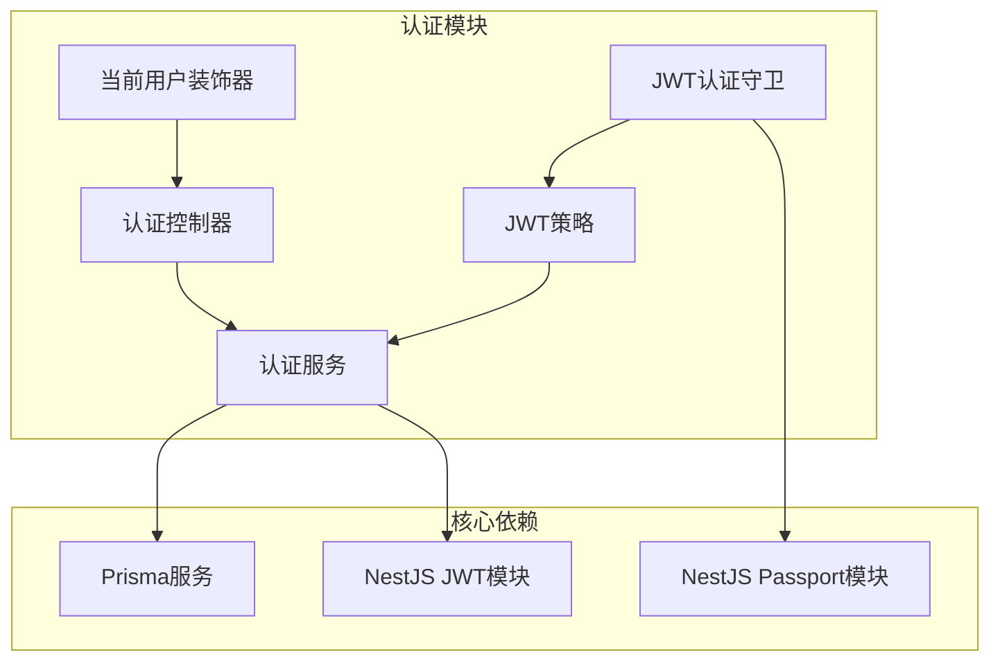
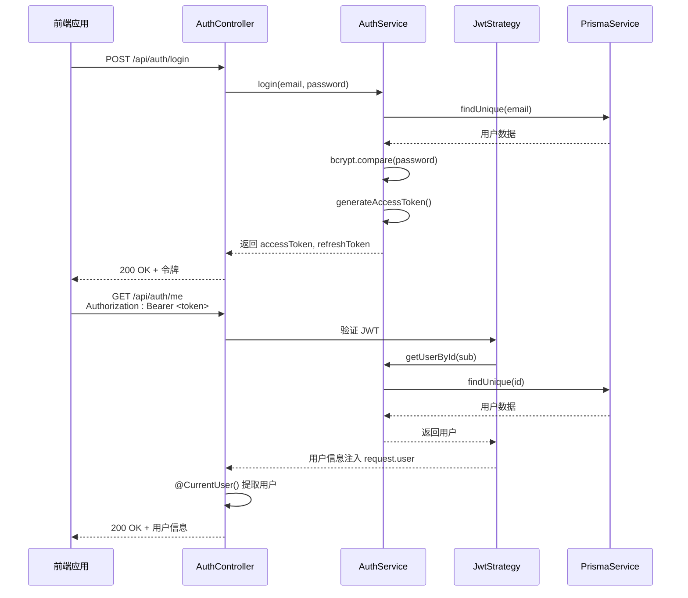
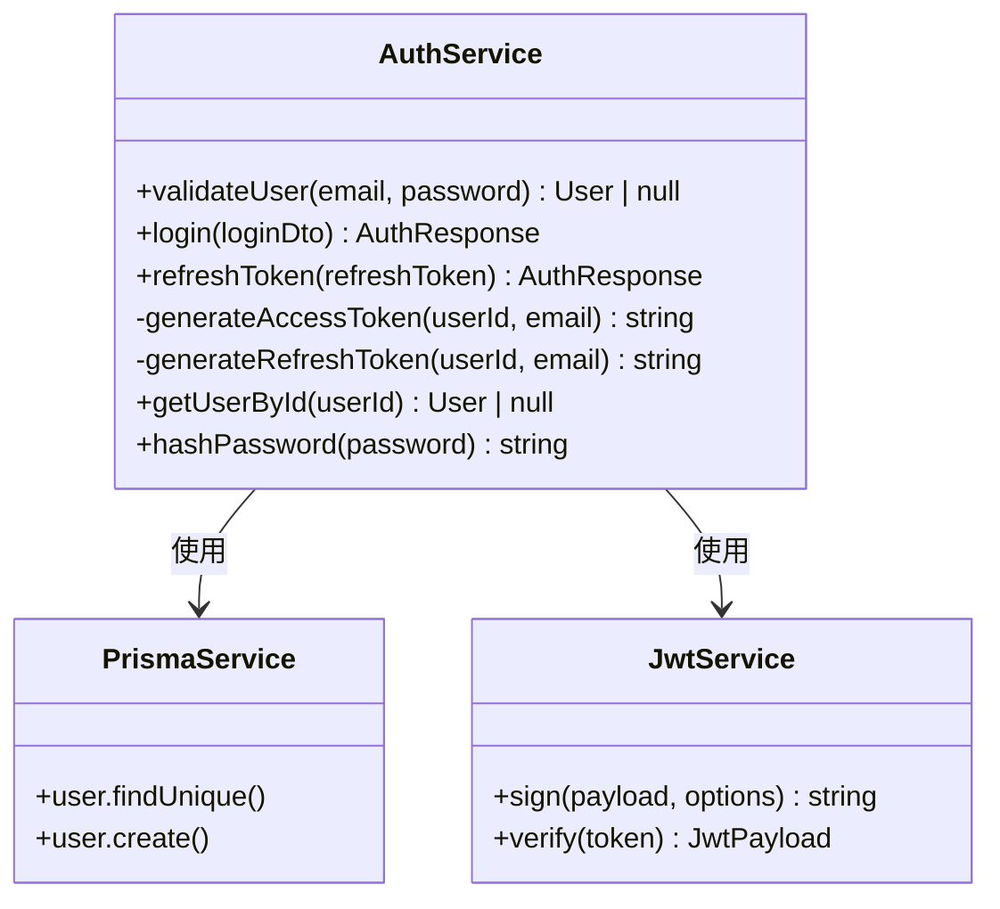
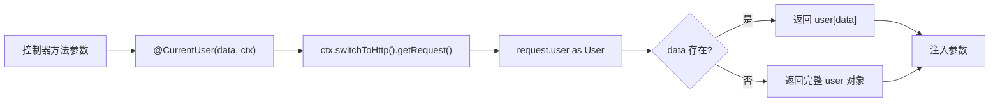
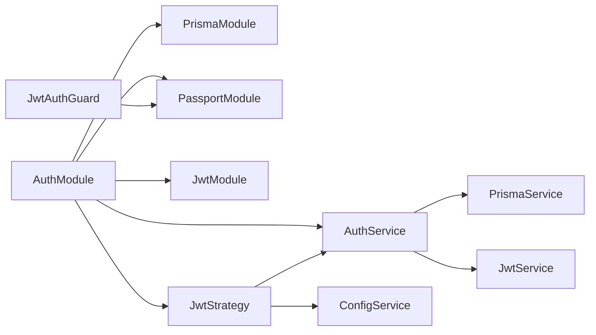

# 认证模块

<cite>
**本文档引用的文件**  
- [auth.module.ts](file://apps/backend/src/auth/auth.module.ts)
- [auth.service.ts](file://apps/backend/src/auth/auth.service.ts)
- [jwt.strategy.ts](file://apps/backend/src/auth/jwt.strategy.ts)
- [jwt-auth.guard.ts](file://apps/backend/src/auth/jwt-auth.guard.ts)
- [current-user.decorator.ts](file://apps/backend/src/auth/current-user.decorator.ts)
- [auth.controller.ts](file://apps/backend/src/auth/auth.controller.ts)
- [users.controller.ts](file://apps/backend/src/users/users.controller.ts)
- [users.service.ts](file://apps/backend/src/users/users.service.ts)
- [auth.dto.ts](file://apps/backend/src/auth/auth.dto.ts)
- [prisma.service.ts](file://apps/backend/src/prisma/prisma.service.ts)
- [common.dto.ts](file://packages/shared/src/dto/common.dto.ts)
- [auth.schema.ts](file://packages/shared/src/schemas/auth.schema.ts)
- [app.module.ts](file://apps/backend/src/app.module.ts)
- [main.ts](file://apps/backend/src/main.ts)
</cite>

## 目录

1. [项目结构](#项目结构)
2. [核心组件](#核心组件)
3. [架构概览](#架构概览)
4. [详细组件分析](#详细组件分析)
5. [依赖分析](#依赖分析)
6. [性能考虑](#性能考虑)
7. [故障排除指南](#故障排除指南)
8. [结论](#结论)

## 项目结构

本项目采用 NestJS 框架构建后端服务，认证模块（AuthModule）位于 `apps/backend/src/auth/` 目录下，与其他模块如用户模块（UsersModule）、数据库模块（PrismaModule）等协同工作。整体结构遵循模块化设计原则，各功能职责清晰分离。



**图示来源**  
- [auth.module.ts](file://apps/backend/src/auth/auth.module.ts#L1-L32)
- [auth.service.ts](file://apps/backend/src/auth/auth.service.ts#L1-L150)

**本节来源**  
- [auth.module.ts](file://apps/backend/src/auth/auth.module.ts#L1-L32)
- [app.module.ts](file://apps/backend/src/app.module.ts#L1-L159)

## 核心组件

认证模块的核心包括：`AuthService` 负责用户凭证校验与令牌生成；`JwtStrategy` 集成 Passport 实现 JWT 令牌验证；`JwtAuthGuard` 作为守卫保护受控路由；`CurrentUser` 装饰器从请求上下文中提取用户信息；`AuthController` 提供登录与刷新接口。

**本节来源**  
- [auth.service.ts](file://apps/backend/src/auth/auth.service.ts#L1-L150)
- [jwt.strategy.ts](file://apps/backend/src/auth/jwt.strategy.ts#L1-L47)
- [jwt-auth.guard.ts](file://apps/backend/src/auth/jwt-auth.guard.ts#L1-L10)
- [current-user.decorator.ts](file://apps/backend/src/auth/current-user.decorator.ts#L1-L19)

## 架构概览

系统采用无状态 JWT 认证机制，结合短期访问令牌与长期刷新令牌实现安全会话管理。用户登录后，服务端通过 Prisma 查询数据库并校验密码，成功后签发 JWT 令牌。后续请求通过 `JwtAuthGuard` 和 `JwtStrategy` 自动验证令牌有效性，并将用户信息注入请求上下文。



**图示来源**  
- [auth.controller.ts](file://apps/backend/src/auth/auth.controller.ts#L1-L51)
- [auth.service.ts](file://apps/backend/src/auth/auth.service.ts#L1-L150)
- [jwt.strategy.ts](file://apps/backend/src/auth/jwt.strategy.ts#L1-L47)

## 详细组件分析

### 认证服务分析

`AuthService` 是认证逻辑的核心，负责用户登录、令牌生成与刷新。其通过 `PrismaService` 与数据库交互，使用 `bcrypt` 进行密码哈希校验，并利用 `JwtService` 签发不同类型的 JWT 令牌。



**图示来源**  
- [auth.service.ts](file://apps/backend/src/auth/auth.service.ts#L1-L150)
- [prisma.service.ts](file://apps/backend/src/prisma/prisma.service.ts#L1-L20)

### JWT策略与守卫分析

`JwtStrategy` 继承自 `PassportStrategy(Strategy)`，配置从请求头提取 Bearer Token，并使用 `JWT_SECRET` 进行签名验证。`JwtAuthGuard` 则基于该策略实现路由保护，确保只有携带有效令牌的请求才能访问受保护接口。

```mermaid
flowchart TD
Start([请求进入]) --> Guard[JwtAuthGuard]
Guard --> Strategy[JwtStrategy.validate()]
Strategy --> Extract["从 Authorization 头提取 Token"]
Extract --> Verify["jwtService.verify()"]
Verify --> Valid{"令牌有效?"}
Valid --> |否| Return401["返回 401 Unauthorized"]
Valid --> |是| FindUser["调用 authService.getUserById()"]
FindUser --> UserExists{"用户存在?"}
UserExists --> |否| Return401
UserExists --> |是| Inject["将用户注入 request.user"]
Inject --> Proceed["继续处理请求"]
Return401 --> End([响应返回])
Proceed --> End
```

**图示来源**  
- [jwt.strategy.ts](file://apps/backend/src/auth/jwt.strategy.ts#L1-L47)
- [jwt-auth.guard.ts](file://apps/backend/src/auth/jwt-auth.guard.ts#L1-L10)

### 自定义装饰器分析

`@CurrentUser()` 装饰器通过 `createParamDecorator` 创建，从 `request.user` 中提取已验证的用户信息。支持传入键名以获取用户特定字段（如 `@CurrentUser('id')`），增强了控制器方法的灵活性。



**图示来源**  
- [current-user.decorator.ts](file://apps/backend/src/auth/current-user.decorator.ts#L1-L19)
- [auth.controller.ts](file://apps/backend/src/auth/auth.controller.ts#L47-L49)

**本节来源**  
- [auth.service.ts](file://apps/backend/src/auth/auth.service.ts#L1-L150)
- [jwt.strategy.ts](file://apps/backend/src/auth/jwt.strategy.ts#L1-L47)
- [jwt-auth.guard.ts](file://apps/backend/src/auth/jwt-auth.guard.ts#L1-L10)
- [current-user.decorator.ts](file://apps/backend/src/auth/current-user.decorator.ts#L1-L19)
- [auth.controller.ts](file://apps/backend/src/auth/auth.controller.ts#L1-L51)

## 依赖分析

认证模块依赖多个核心模块与服务，形成清晰的调用链路。`AuthModule` 引入 `PrismaModule`、`PassportModule` 和 `JwtModule`，并通过依赖注入提供 `AuthService` 和 `JwtStrategy`。



**图示来源**  
- [auth.module.ts](file://apps/backend/src/auth/auth.module.ts#L1-L32)
- [app.module.ts](file://apps/backend/src/app.module.ts#L1-L159)

**本节来源**  
- [auth.module.ts](file://apps/backend/src/auth/auth.module.ts#L1-L32)
- [app.module.ts](file://apps/backend/src/app.module.ts#L1-L159)

## 性能考虑

系统通过多层优化保障认证性能：使用 `ZodValidationPipe` 进行高效请求验证；`compression` 中间件压缩响应体；`ThrottlerGuard` 防止暴力破解攻击；`PrismaService` 实现数据库连接复用。此外，JWT 无状态特性减少了服务端会话存储开销。

**本节来源**  
- [main.ts](file://apps/backend/src/main.ts#L1-L94)
- [app.module.ts](file://apps/backend/src/app.module.ts#L1-L159)

## 故障排除指南

常见问题包括：令牌无效或过期、用户不存在、密码错误、CSRF 校验失败等。建议检查环境变量 `JWT_SECRET` 是否配置正确，数据库连接是否正常，以及请求头 `Authorization` 是否以 `Bearer ` 开头。调试时可启用详细日志查看验证流程。

**本节来源**  
- [auth.service.ts](file://apps/backend/src/auth/auth.service.ts#L63-L64)
- [jwt.strategy.ts](file://apps/backend/src/auth/jwt.strategy.ts#L40-L42)
- [main.ts](file://apps/backend/src/main.ts#L69-L70)

## 结论

本认证模块实现了完整的 JWT 无状态认证流程，结合 Prisma 进行用户凭证校验，通过 Passport 集成实现标准化 JWT 验证。`JwtAuthGuard` 与 `@CurrentUser()` 装饰器极大简化了受保护路由的开发。系统支持令牌刷新机制，具备良好的安全性与扩展性，适用于现代前后端分离应用。