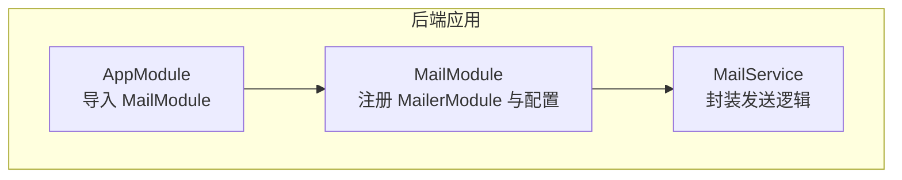
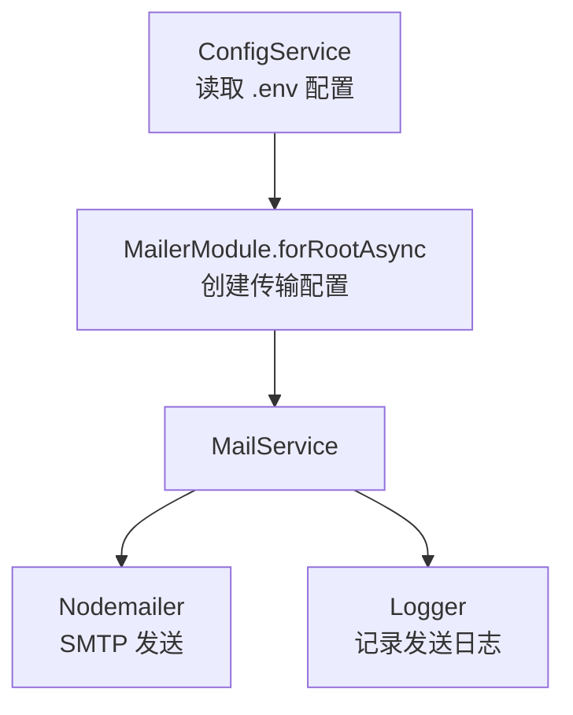
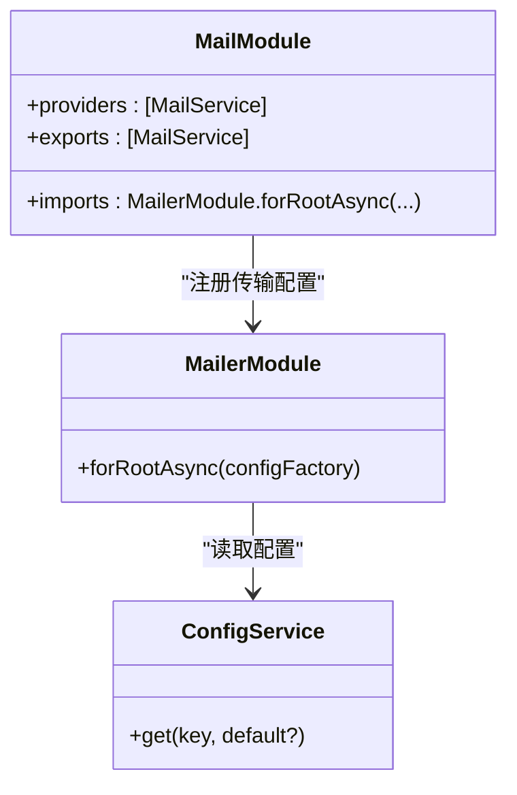
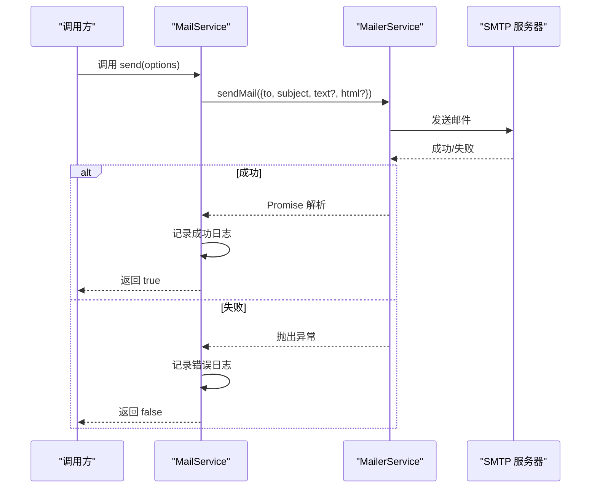
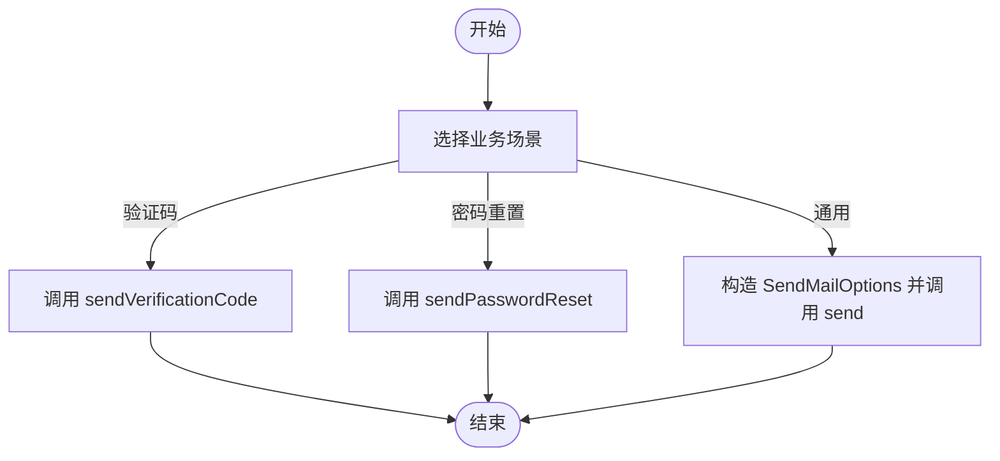
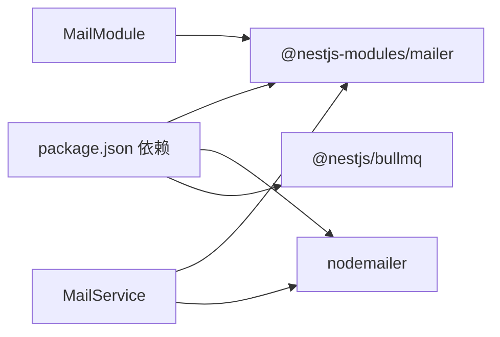

# 邮件服务模块

<cite>
**本文引用的文件**
- [apps/backend/src/mail/mail.module.ts](file://apps/backend/src/mail/mail.module.ts)
- [apps/backend/src/mail/mail.service.ts](file://apps/backend/src/mail/mail.service.ts)
- [apps/backend/src/mail/index.ts](file://apps/backend/src/mail/index.ts)
- [apps/backend/src/app.module.ts](file://apps/backend/src/app.module.ts)
- [.env.example](file://.env.example)
- [apps/backend/package.json](file://apps/backend/package.json)
</cite>

## 目录
1. [简介](#简介)
2. [项目结构](#项目结构)
3. [核心组件](#核心组件)
4. [架构总览](#架构总览)
5. [详细组件分析](#详细组件分析)
6. [依赖关系分析](#依赖关系分析)
7. [性能与可靠性](#性能与可靠性)
8. [故障排查指南](#故障排查指南)
9. [结论](#结论)
10. [附录](#附录)

## 简介
本文件系统性阐述 MailModule 与 MailService 的架构与实现，重点说明其如何基于 @nestjs-modules/mailer/Nodemailer 封装 SMTP 邮件发送能力，覆盖以下主题：
- 邮件模板管理与 HTML 邮件渲染
- 异步发送与错误处理
- 配置项（发件人、主机、端口、SSL）管理
- 实际业务场景（验证码、密码重置）的服务调用方式
- 测试环境下的邮件拦截与日志记录
- 生产环境常见问题（被标记为垃圾邮件）的预防建议

## 项目结构
Mail 模块位于后端应用的独立目录中，采用“按功能域划分”的组织方式：
- mail.module.ts：声明 MailModule，注入 @nestjs-modules/mailer 并通过 ConfigService 注入 SMTP 配置
- mail.service.ts：封装通用发送接口与常用业务模板（验证码、密码重置）
- index.ts：统一导出模块与服务，便于上层模块按需引入

图表来源
- [apps/backend/src/app.module.ts](file://apps/backend/src/app.module.ts#L135-L143)
- [apps/backend/src/mail/mail.module.ts](file://apps/backend/src/mail/mail.module.ts#L10-L33)
- [apps/backend/src/mail/mail.service.ts](file://apps/backend/src/mail/mail.service.ts#L15-L39)

章节来源
- [apps/backend/src/mail/mail.module.ts](file://apps/backend/src/mail/mail.module.ts#L1-L33)
- [apps/backend/src/mail/mail.service.ts](file://apps/backend/src/mail/mail.service.ts#L1-L81)
- [apps/backend/src/mail/index.ts](file://apps/backend/src/mail/index.ts#L1-L3)
- [apps/backend/src/app.module.ts](file://apps/backend/src/app.module.ts#L135-L143)

## 核心组件
- MailModule
  - 通过 MailerModule.forRootAsync 注册 SMTP 连接参数与默认发件人
  - 从 ConfigService 读取 MAIL_HOST、MAIL_PORT、MAIL_SECURE、MAIL_USER、MAIL_PASSWORD、MAIL_FROM
  - 导出 MailService 供其他模块注入使用
- MailService
  - 提供 send(options) 通用发送接口，支持 text/html
  - 提供 sendVerificationCode、sendPasswordReset 等业务模板方法
  - 统一记录日志（成功/失败），返回布尔结果便于上层判断

章节来源
- [apps/backend/src/mail/mail.module.ts](file://apps/backend/src/mail/mail.module.ts#L10-L33)
- [apps/backend/src/mail/mail.service.ts](file://apps/backend/src/mail/mail.service.ts#L15-L81)

## 架构总览
下图展示了 MailModule 如何在运行时装配 MailerModule，并由 MailService 调用底层 Nodemailer 完成 SMTP 发送。

图表来源
- [apps/backend/src/mail/mail.module.ts](file://apps/backend/src/mail/mail.module.ts#L12-L28)
- [apps/backend/src/mail/mail.service.ts](file://apps/backend/src/mail/mail.service.ts#L17-L39)
- [apps/backend/src/mail/mail.module.ts](file://apps/backend/src/mail/mail.module.ts#L16-L26)

## 详细组件分析

### MailModule 设计与配置注入
- 通过 ConfigService 注入环境变量，形成可移植的配置源
- defaults.from 作为全局默认发件人头，避免每次发送重复设置
- transport.host/port/secure/auth 由环境变量控制，适配不同 SMTP 供应商

图表来源
- [apps/backend/src/mail/mail.module.ts](file://apps/backend/src/mail/mail.module.ts#L10-L33)

章节来源
- [apps/backend/src/mail/mail.module.ts](file://apps/backend/src/mail/mail.module.ts#L10-L33)
- [.env.example](file://.env.example#L35-L41)

### MailService 设计与发送流程
- send(options)：接收 to/subject/text/html，调用底层 MailerService.sendMail，捕获异常并记录日志，返回布尔值
- sendVerificationCode：内置验证码模板（HTML）
- sendPasswordReset：内置密码重置模板（HTML）

图表来源
- [apps/backend/src/mail/mail.service.ts](file://apps/backend/src/mail/mail.service.ts#L24-L39)

章节来源
- [apps/backend/src/mail/mail.service.ts](file://apps/backend/src/mail/mail.service.ts#L24-L81)

### 邮件模板管理与复杂格式支持
- 通用模板：通过 send(options) 的 html 字段传入任意 HTML 结构，实现富文本与样式
- 业务模板：sendVerificationCode、sendPasswordReset 已内置常用模板，便于快速落地
- 附件支持：当前实现未直接暴露附件字段；如需附件，可在扩展 send(options) 时增加 attachments 字段，并在调用底层 sendMail 时传递

章节来源
- [apps/backend/src/mail/mail.service.ts](file://apps/backend/src/mail/mail.service.ts#L44-L81)

### 异步发送与错误处理
- send 方法为异步，内部使用 try/catch 捕获异常，保证不会中断调用链
- 成功与失败分别记录日志，便于监控与排障
- 返回布尔值，便于上层进行条件判断与重试策略

章节来源
- [apps/backend/src/mail/mail.service.ts](file://apps/backend/src/mail/mail.service.ts#L24-L39)

### 业务场景调用方式
- 验证码邮件：调用 sendVerificationCode(to, code)
- 密码重置邮件：调用 sendPasswordReset(to, resetLink)
- 通用邮件：构造 SendMailOptions 后调用 send(options)

图表来源
- [apps/backend/src/mail/mail.service.ts](file://apps/backend/src/mail/mail.service.ts#L44-L81)

## 依赖关系分析
- MailModule 依赖 @nestjs-modules/mailer 与 @nestjs/config
- MailService 依赖 @nestjs-modules/mailer 的 MailerService
- 项目整体依赖 @nestjs/bullmq（队列）与 nodemailer（底层 SMTP）

图表来源
- [apps/backend/package.json](file://apps/backend/package.json#L21-L66)
- [apps/backend/src/mail/mail.module.ts](file://apps/backend/src/mail/mail.module.ts#L1-L33)
- [apps/backend/src/mail/mail.service.ts](file://apps/backend/src/mail/mail.service.ts#L1-L20)

章节来源
- [apps/backend/package.json](file://apps/backend/package.json#L21-L66)
- [apps/backend/src/mail/mail.module.ts](file://apps/backend/src/mail/mail.module.ts#L1-L33)
- [apps/backend/src/mail/mail.service.ts](file://apps/backend/src/mail/mail.service.ts#L1-L20)

## 性能与可靠性
- 异步发送：send 方法为异步，避免阻塞请求线程
- 错误处理：捕获异常并记录日志，返回布尔值便于上层决策
- 可靠性建议：
  - 在上层使用队列（如 BullMQ）对邮件发送进行削峰填谷与失败重试
  - 对于高并发场景，建议将 send(options) 包装为队列任务，结合指数退避策略
  - 对于附件与大体积邮件，建议拆分为异步任务并限制单次发送大小

[本节为通用建议，无需特定文件引用]

## 故障排查指南
- 配置检查
  - 确认 .env 中 MAIL_HOST、MAIL_PORT、MAIL_SECURE、MAIL_USER、MAIL_PASSWORD、MAIL_FROM 是否正确
  - 在生产环境务必设置安全的 MAIL_SECURE 与强密码
- 日志定位
  - MailService 在成功与失败时均会记录日志，可通过日志系统检索对应关键字
- 常见问题
  - SSL/TLS 不匹配：检查 MAIL_SECURE 与端口组合（465/587）
  - 认证失败：核对 MAIL_USER 与 MAIL_PASSWORD
  - 垃圾邮件：检查发件域名、SPF/DKIM/DMARC 设置与邮件内容结构

章节来源
- [.env.example](file://.env.example#L35-L41)
- [apps/backend/src/mail/mail.service.ts](file://apps/backend/src/mail/mail.service.ts#L24-L39)

## 结论
MailModule 与 MailService 以简洁的方式封装了 SMTP 邮件发送能力，具备良好的可配置性与可观测性。通过内置业务模板与统一日志输出，能够快速支撑验证码与密码重置等常见场景。建议在生产环境中配合队列与完善的监控告警体系，进一步提升可靠性与安全性。

[本节为总结性内容，无需特定文件引用]

## 附录

### 配置项说明
- MAIL_HOST：SMTP 主机地址
- MAIL_PORT：SMTP 端口（默认 587）
- MAIL_SECURE：是否启用 SSL（true 对应 465，false 对应 587）
- MAIL_USER：SMTP 用户名
- MAIL_PASSWORD：SMTP 密码
- MAIL_FROM：默认发件人头

章节来源
- [.env.example](file://.env.example#L35-L41)
- [apps/backend/src/mail/mail.module.ts](file://apps/backend/src/mail/mail.module.ts#L16-L26)

### 业务场景调用路径参考
- 验证码邮件：调用 sendVerificationCode(to, code)
- 密码重置邮件：调用 sendPasswordReset(to, resetLink)
- 通用邮件：调用 send(options)

章节来源
- [apps/backend/src/mail/mail.service.ts](file://apps/backend/src/mail/mail.service.ts#L44-L81)