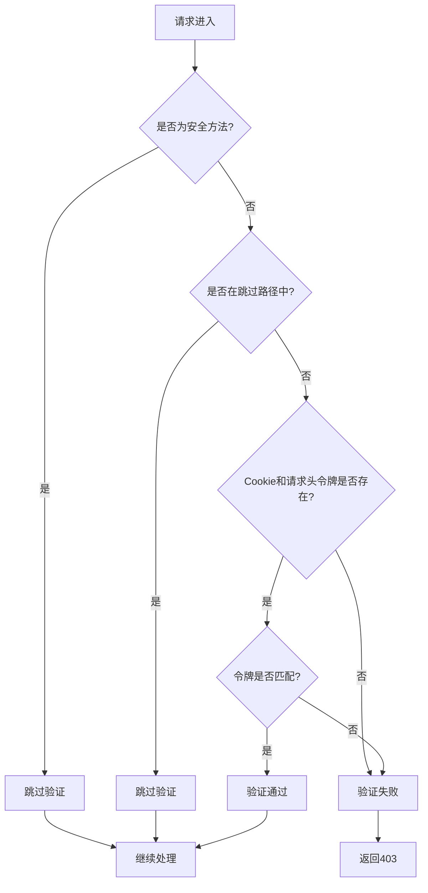
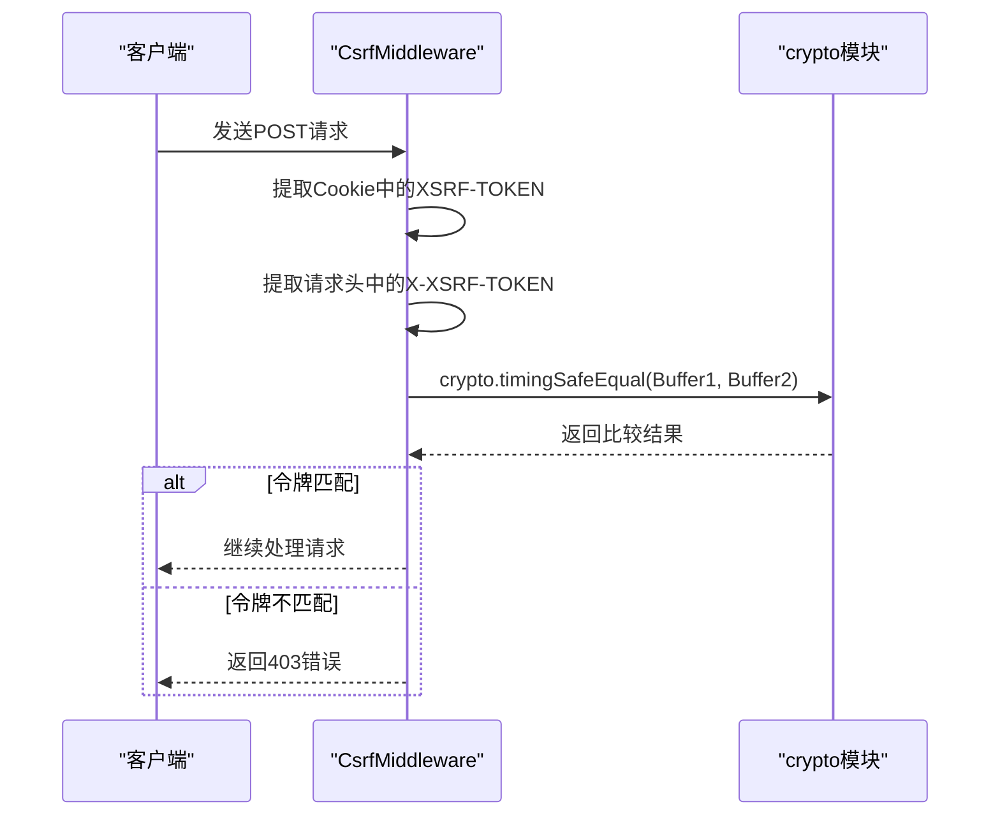
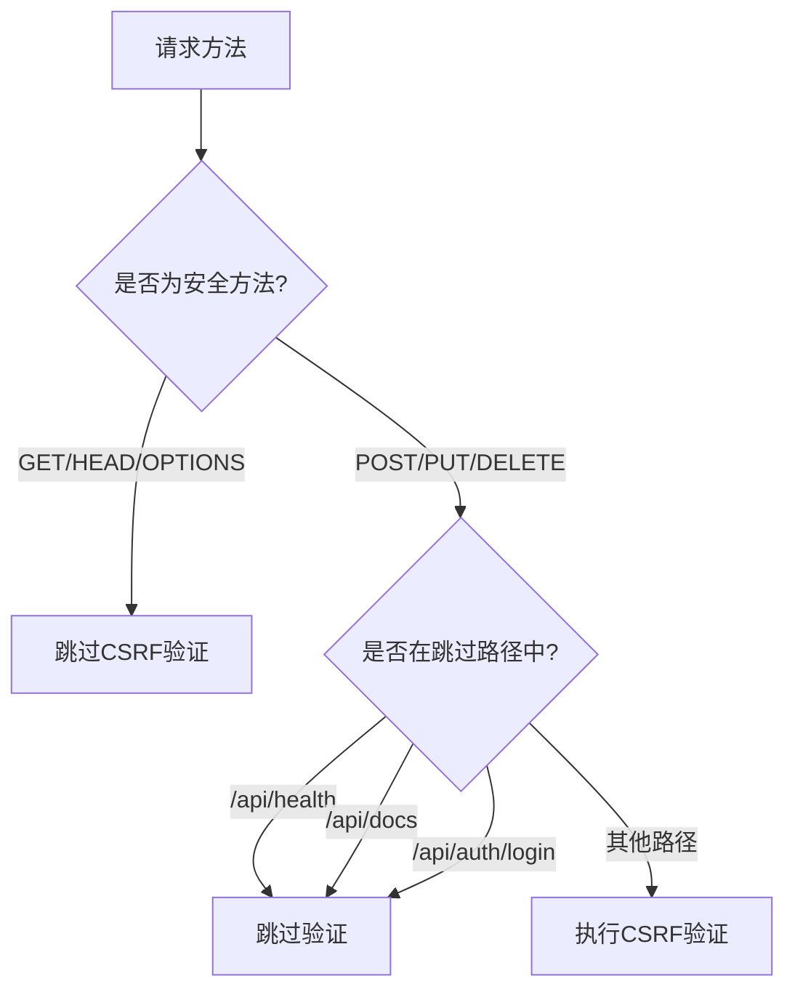
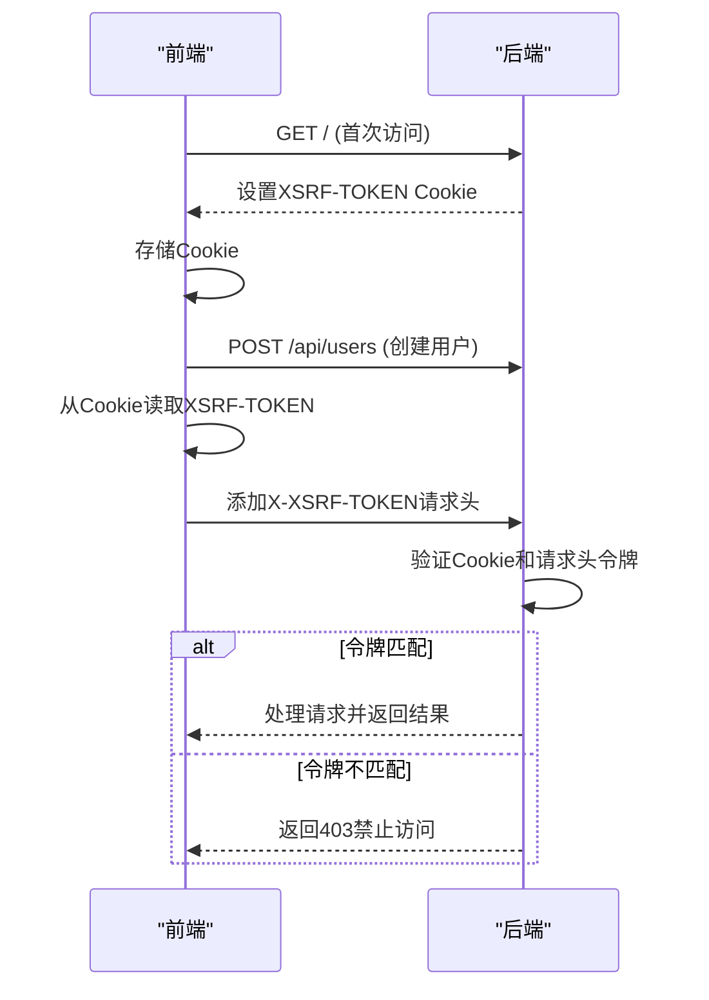

# CSRF中间件

<cite>
**本文档中引用的文件**  
- [csrf.middleware.ts](file://apps/backend/src/common/middlewares/csrf.middleware.ts)
- [auth.controller.ts](file://apps/backend/src/auth/auth.controller.ts)
- [app.module.ts](file://apps/backend/src/app.module.ts)
- [index.ts](file://apps/frontend/src/api/index.ts)
- [auth.ts](file://apps/frontend/src/stores/auth.ts)
- [.env.example](file://.env.example)
- [nginx.conf](file://apps/frontend/nginx.conf)
</cite>

## 目录
1. [引言](#引言)
2. [CSRF中间件实现机制](#csrf中间件实现机制)
3. [令牌生成与注入机制](#令牌生成与注入机制)
4. [令牌验证与安全比对](#令牌验证与安全比对)
5. [路径与方法的排除策略](#路径与方法的排除策略)
6. [Cookie安全属性配置](#cookie安全属性配置)
7. [前后端协作流程](#前后端协作流程)
8. [常见防护失效场景排查](#常见防护失效场景排查)
9. [与JWT认证的协同机制](#与jwt认证的协同机制)
10. [结论](#结论)

## 引言
跨站请求伪造（CSRF）是一种常见的Web安全攻击，攻击者诱导用户在已认证的会话中执行非预期的操作。本项目采用双重提交Cookie模式实现CSRF防护，通过`CsrfMiddleware`中间件为单页应用（SPA）提供安全保障。该机制结合JWT认证体系，在保证安全性的同时兼顾用户体验。

**Section sources**
- [csrf.middleware.ts](file://apps/backend/src/common/middlewares/csrf.middleware.ts#L1-L93)

## CSRF中间件实现机制
`CsrfMiddleware`是基于NestJS框架实现的中间件，采用双重提交Cookie（Double Submit Cookie）模式。其核心原理是：服务器生成随机令牌并设置到Cookie中，客户端从Cookie读取该令牌并放入请求头，服务器验证两者是否一致。由于攻击者无法读取目标站点的Cookie（受同源策略限制），因此无法构造包含正确令牌的请求。

该中间件通过`NestMiddleware`接口实现，使用`@Injectable()`装饰器标记为可注入服务。中间件在每个请求处理前执行，确保所有响应都包含CSRF令牌Cookie，并对非安全请求进行令牌验证。

**Diagram sources**
- [csrf.middleware.ts](file://apps/backend/src/common/middlewares/csrf.middleware.ts#L31-L51)

**Section sources**
- [csrf.middleware.ts](file://apps/backend/src/common/middlewares/csrf.middleware.ts#L1-L93)

## 令牌生成与注入机制
`ensureCsrfToken`方法负责在每个响应中注入CSRF令牌Cookie。当请求中不存在`XSRF-TOKEN` Cookie时，系统会生成一个新的32字节随机令牌。令牌使用Node.js内置的`crypto.randomBytes`方法生成，该方法基于加密安全的伪随机数生成器（CSPRNG），确保令牌的不可预测性。

生成的令牌以十六进制字符串形式存储，长度为64个字符（32字节的十六进制表示）。该方法在每个请求处理前调用，确保客户端始终拥有有效的CSRF令牌。这种设计避免了首次访问时令牌缺失的问题，提高了用户体验。

**Section sources**
- [csrf.middleware.ts](file://apps/backend/src/common/middlewares/csrf.middleware.ts#L56-L68)

## 令牌验证与安全比对
`validateCsrfToken`方法执行核心的令牌验证逻辑。该方法从Cookie和请求头中分别提取`XSRF-TOKEN`和`X-XSRF-TOKEN`值，进行严格比对。为防止时序攻击（Timing Attack），系统使用`crypto.timingSafeEqual`方法进行比较。

时序攻击利用字符串比较操作的时间差异来推断令牌内容。`timingSafeEqual`方法通过确保比较操作的执行时间与输入值无关，有效抵御此类攻击。该方法要求输入为Buffer类型，因此需要将字符串转换为Buffer进行比较。如果任一令牌缺失或比对失败，方法返回false，触发403禁止访问异常。

**Diagram sources**
- [csrf.middleware.ts](file://apps/backend/src/common/middlewares/csrf.middleware.ts#L74-L83)

**Section sources**
- [csrf.middleware.ts](file://apps/backend/src/common/middlewares/csrf.middleware.ts#L74-L83)

## 路径与方法的排除策略
为提高可用性和性能，系统设计了合理的排除策略。`safeMethods`数组包含`GET`、`HEAD`、`OPTIONS`等安全方法，这些方法不会修改服务器状态，因此无需CSRF保护。`skipPaths`数组定义了特定路径，包括健康检查、API文档和认证接口。

特别值得注意的是`/api/auth/login`接口被排除在CSRF验证之外。这是因为登录接口本身是CSRF攻击的潜在目标，但系统通过`ThrottlerGuard`实现了速率限制保护，每分钟最多允许5次登录尝试，有效防止暴力破解攻击。这种设计平衡了安全性和用户体验，避免了双重保护带来的复杂性。

**Diagram sources**
- [csrf.middleware.ts](file://apps/backend/src/common/middlewares/csrf.middleware.ts#L21-L29)
- [auth.controller.ts](file://apps/backend/src/auth/auth.controller.ts#L22-L26)

**Section sources**
- [csrf.middleware.ts](file://apps/backend/src/common/middlewares/csrf.middleware.ts#L21-L29)
- [auth.controller.ts](file://apps/backend/src/auth/auth.controller.ts#L22-L26)

## Cookie安全属性配置
CSRF令牌Cookie配置了多项安全属性以增强防护能力。`httpOnly`属性设置为`false`，允许JavaScript读取Cookie，这是双重提交模式的必要条件。`secure`属性在生产环境中设置为`true`，确保Cookie仅通过HTTPS传输，防止中间人攻击。

`sameSite`属性设置为`strict`，这是最严格的SameSite策略，防止跨站请求携带Cookie。这意味着只有在同站请求中才会发送该Cookie，有效阻止跨站请求伪造。Cookie的`path`设置为根路径`/`，确保在整个应用范围内有效，`maxAge`设置为24小时，平衡了安全性和用户体验。

**Section sources**
- [csrf.middleware.ts](file://apps/backend/src/common/middlewares/csrf.middleware.ts#L61-L67)
- [.env.example](file://.env.example#L14)

## 前后端协作流程
前后端通过HTTP客户端拦截器实现无缝协作。前端使用Axios创建`httpClient`实例，并配置请求拦截器。拦截器检查请求方法，对非`GET`、`HEAD`、`OPTIONS`的请求，从Cookie中读取`XSRF-TOKEN`值，并将其添加到`X-XSRF-TOKEN`请求头中。

这一过程完全自动化，开发者无需在每个请求中手动设置。`getCookie`辅助函数使用正则表达式从`document.cookie`中提取指定名称的Cookie值。响应拦截器还处理401未授权错误，自动清除本地存储的JWT令牌，实现安全的会话管理。

**Diagram sources**
- [index.ts](file://apps/frontend/src/api/index.ts#L24-L38)
- [csrf.middleware.ts](file://apps/backend/src/common/middlewares/csrf.middleware.ts#L74-L83)

**Section sources**
- [index.ts](file://apps/frontend/src/api/index.ts#L18-L38)
- [csrf.middleware.ts](file://apps/backend/src/common/middlewares/csrf.middleware.ts#L74-L83)

## 常见防护失效场景排查
CSRF防护可能因多种配置问题而失效。跨域配置错误是最常见的问题，当CORS策略未正确设置时，浏览器可能阻止CSRF令牌的发送。在`nginx.conf`中，反向代理配置必须正确转发请求头和Cookie，特别是`proxy_set_header`指令确保`Host`、`X-Real-IP`等关键头信息的传递。

代理服务器未正确处理Cookie也是常见问题。`nginx.conf`中的代理配置需要确保`proxy_pass`指向正确的后端服务，并且`proxy_http_version`设置为1.1以支持WebSocket。前端未正确设置请求头通常源于拦截器配置错误或Cookie读取失败，需要检查`getCookie`函数的正则表达式是否正确匹配Cookie名称。

其他排查要点包括：生产环境中`NODE_ENV`是否设置为`production`以启用`Secure` Cookie属性，`sameSite`策略是否与应用架构兼容，以及浏览器是否阻止了第三方Cookie。

**Section sources**
- [nginx.conf](file://apps/frontend/nginx.conf#L33-L43)
- [index.ts](file://apps/frontend/src/api/index.ts#L18-L21)
- [.env.example](file://.env.example#L14)

## 与JWT认证的协同机制
CSRF中间件与JWT认证体系协同工作，形成多层次的安全防护。JWT负责身份认证和会话管理，通过`Authorization`头传递Bearer令牌，而CSRF中间件负责防止跨站请求伪造。两者职责分离，互不干扰。

登录接口虽无CSRF保护，但通过`ThrottlerGuard`实现速率限制，每分钟最多5次尝试，防止暴力破解。一旦登录成功，系统返回JWT访问令牌和刷新令牌，后续请求通过JWT认证。这种设计避免了在登录阶段引入复杂的CSRF令牌管理，同时保持了足够的安全性。

对于需要高安全性的操作（如密码修改、账户删除），系统可结合使用CSRF令牌和二次认证，实现纵深防御策略。JWT的无状态特性与CSRF的有状态防护（基于Cookie）相辅相成，共同构建了健壮的安全体系。

**Section sources**
- [auth.controller.ts](file://apps/backend/src/auth/auth.controller.ts#L22-L26)
- [app.module.ts](file://apps/backend/src/app.module.ts#L146-L150)
- [csrf.middleware.ts](file://apps/backend/src/common/middlewares/csrf.middleware.ts#L24)

## 结论
`CsrfMiddleware`实现了一套完整且安全的CSRF防护机制，采用双重提交Cookie模式，有效防御跨站请求伪造攻击。通过`ensureCsrfToken`方法确保每个响应都包含安全的CSRF令牌Cookie，利用`crypto.timingSafeEqual`防止时序攻击，并通过合理的路径排除策略平衡安全性与可用性。

前后端通过HTTP拦截器实现无缝协作，自动化令牌管理降低了开发复杂度。与JWT认证体系的协同工作形成了多层次的安全防护，而速率限制机制弥补了登录接口的防护缺口。正确的部署配置和全面的失效场景排查指南确保了防护机制在各种环境下的可靠性。