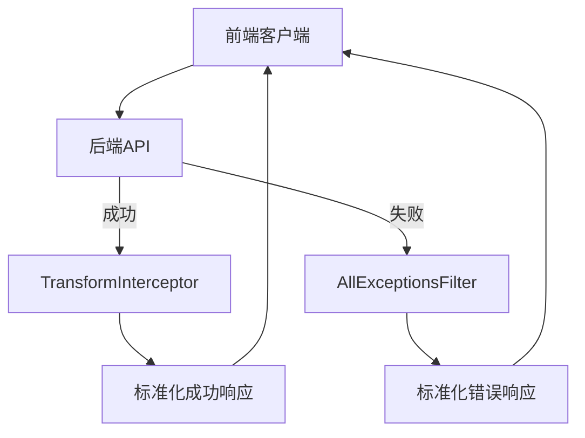
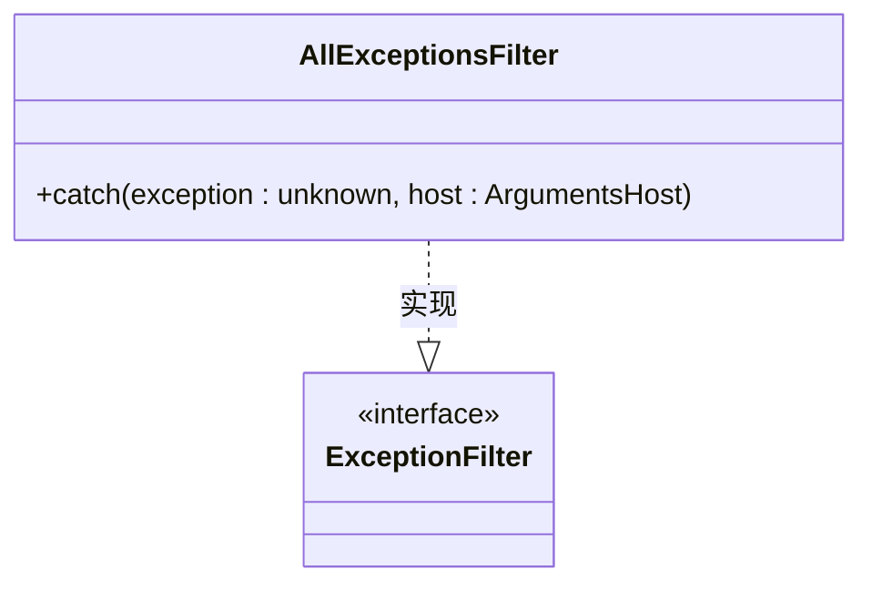
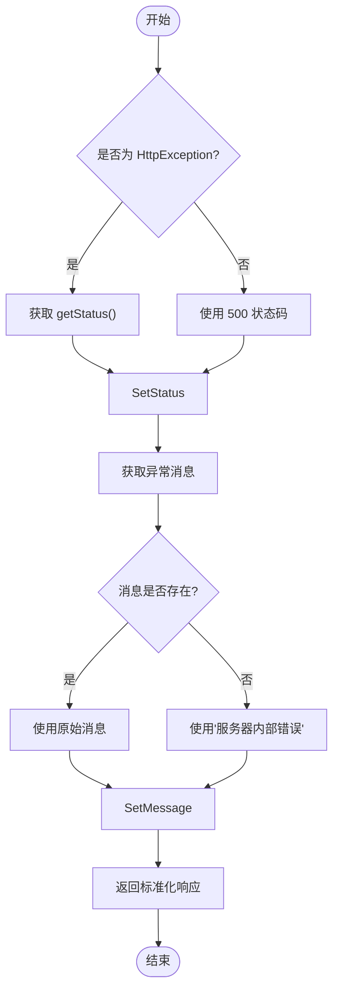
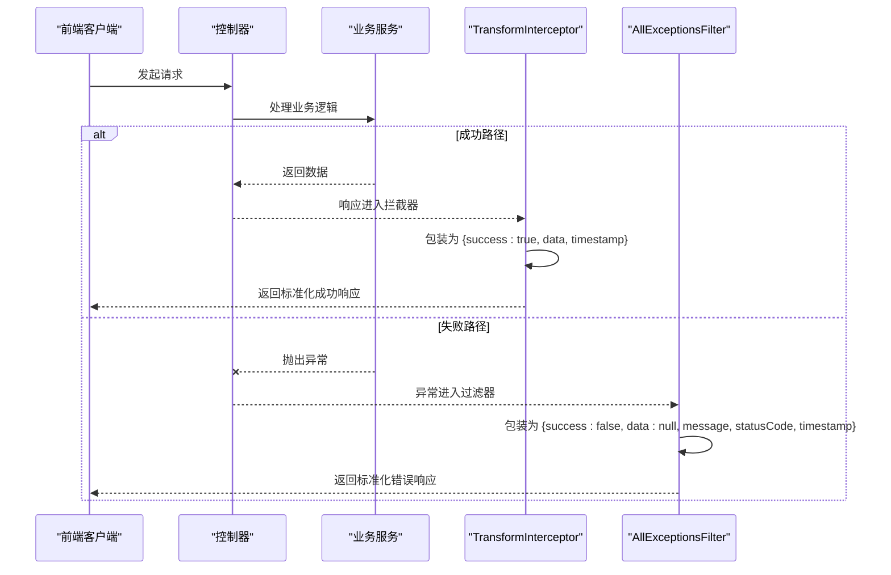
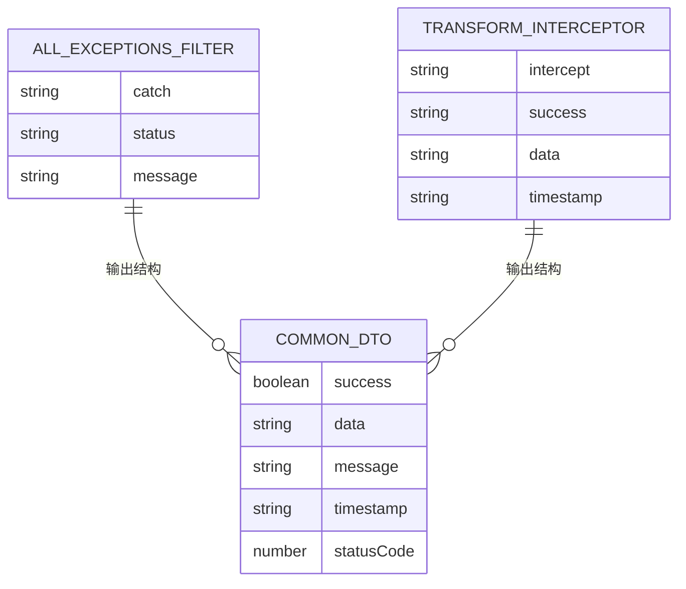

# 全局异常过滤器

<cite>
**本文档引用的文件**
- [all-exceptions.filter.ts](file://apps/backend/src/common/filters/all-exceptions.filter.ts)
- [transform.interceptor.ts](file://apps/backend/src/common/interceptors/transform.interceptor.ts)
- [common.dto.ts](file://packages/shared/src/dto/common.dto.ts)
- [main.ts](file://apps/backend/src/main.ts)
- [api.ts](file://apps/frontend/src/api/index.ts)
</cite>

## 目录
1. [简介](#简介)
2. [核心组件分析](#核心组件分析)
3. [架构概述](#架构概述)
4. [详细组件分析](#详细组件分析)
5. [依赖关系分析](#依赖关系分析)
6. [性能考虑](#性能考虑)
7. [故障排除指南](#故障排除指南)
8. [结论](#结论)

## 简介
全局异常过滤器是 NestJS 应用程序中用于统一处理所有未捕获异常的关键组件。它确保无论发生何种错误，前端都能接收到结构一致的响应，从而简化错误处理逻辑。该过滤器与响应转换拦截器形成对称设计，共同构建了完整的请求-响应生命周期处理机制。

## 核心组件分析

全局异常过滤器（AllExceptionsFilter）通过 `@Catch()` 装饰器监听所有类型的异常，包括 HTTP 异常和普通 JavaScript 错误。当异常发生时，`catch` 方法会提取状态码和消息信息，并返回标准化的 JSON 响应结构。此设计保证了后端服务的健壮性和可预测性。

**Section sources**
- [all-exceptions.filter.ts](file://apps/backend/src/common/filters/all-exceptions.filter.ts#L1-L30)

## 架构概述

**Diagram sources**
- [all-exceptions.filter.ts](file://apps/backend/src/common/filters/all-exceptions.filter.ts#L1-L30)
- [transform.interceptor.ts](file://apps/backend/src/common/interceptors/transform.interceptor.ts#L1-L29)

## 详细组件分析

### AllExceptionsFilter 实现细节

#### 异常捕获机制

**Diagram sources**
- [all-exceptions.filter.ts](file://apps/backend/src/common/filters/all-exceptions.filter.ts#L8-L30)

#### 状态码与消息提取逻辑

**Diagram sources**
- [all-exceptions.filter.ts](file://apps/backend/src/common/filters/all-exceptions.filter.ts#L14-L28)

### 对称设计：TransformInterceptor

**Diagram sources**
- [transform.interceptor.ts](file://apps/backend/src/common/interceptors/transform.interceptor.ts#L1-L29)
- [all-exceptions.filter.ts](file://apps/backend/src/common/filters/all-exceptions.filter.ts#L1-L30)

## 依赖关系分析

**Diagram sources**
- [all-exceptions.filter.ts](file://apps/backend/src/common/filters/all-exceptions.filter.ts#L1-L30)
- [transform.interceptor.ts](file://apps/backend/src/common/interceptors/transform.interceptor.ts#L1-L29)
- [common.dto.ts](file://packages/shared/src/dto/common.dto.ts#L1-L40)

## 性能考虑
全局异常过滤器的性能开销极低，因为它只在异常情况下执行。其主要操作是简单的条件判断和对象构造，不会引入显著的延迟。通过避免在正常流程中进行额外处理，该设计保持了高效率。

## 故障排除指南

### 常见异常场景处理

| 异常类型 | 错误码 | 处理策略 |
|--------|-------|--------|
| Prisma数据库错误 | 500 | 捕获并降级为"服务器内部错误" |
| Redis连接超时 | 500 | 捕获并返回标准化错误结构 |
| JWT验证失败 | 401 | 由JwtStrategy抛出UnauthorizedException，被过滤器捕获 |
| CSRF验证失败 | 403 | 由CsrfMiddleware抛出ForbiddenException，被过滤器捕获 |

**Section sources**
- [all-exceptions.filter.ts](file://apps/backend/src/common/filters/all-exceptions.filter.ts#L1-L30)
- [auth.service.ts](file://apps/backend/src/auth/auth.service.ts#L1-L149)
- [csrf.middleware.ts](file://apps/backend/src/common/middlewares/csrf.middleware.ts#L1-L92)

### 调试建议
1. 检查 `main.ts` 中是否正确注册了全局过滤器
2. 确保 `AllExceptionsFilter` 的 `catch` 方法能够处理 `unknown` 类型的异常
3. 验证前端是否正确解析标准化错误响应结构
4. 使用日志记录未预期的异常类型以进行进一步分析

## 结论
全局异常过滤器通过统一处理所有未捕获的异常，提供了稳定可靠的错误响应机制。其与 TransformInterceptor 的对称设计确保了无论请求成功或失败，前端都能接收到结构一致的响应，极大地简化了客户端的错误处理逻辑。这种设计模式提高了系统的可维护性和用户体验的一致性。