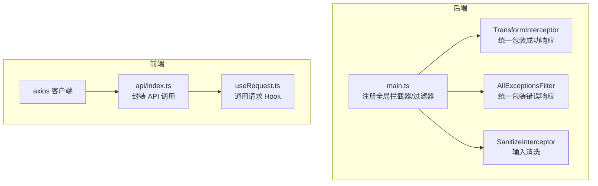
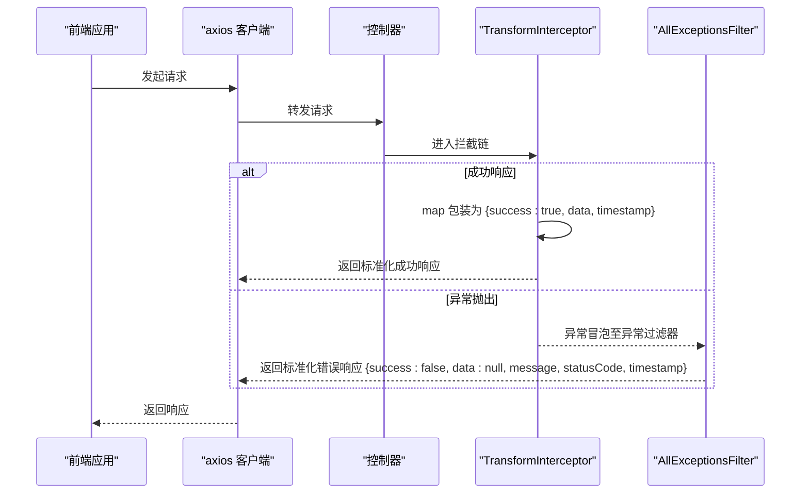
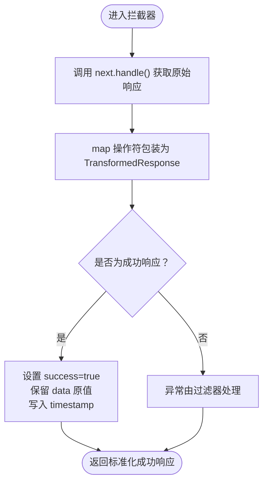
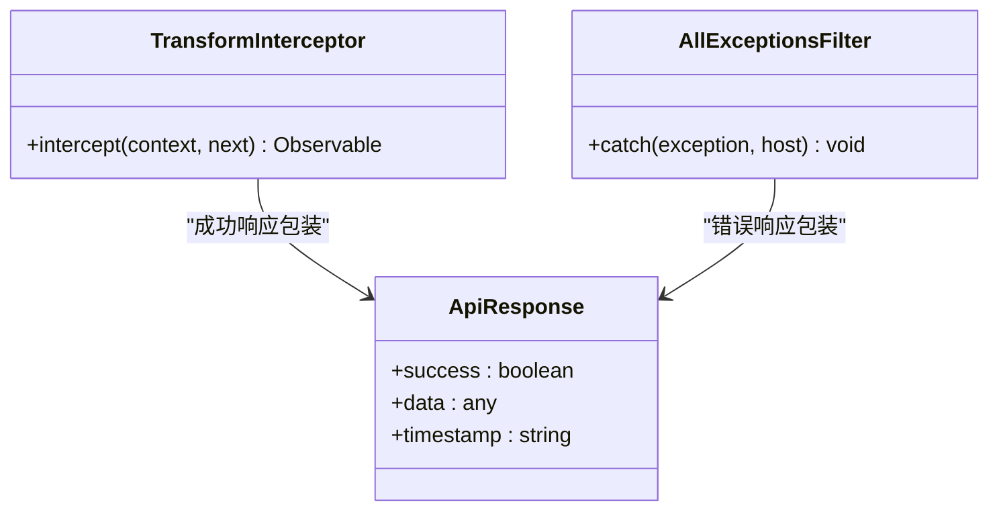
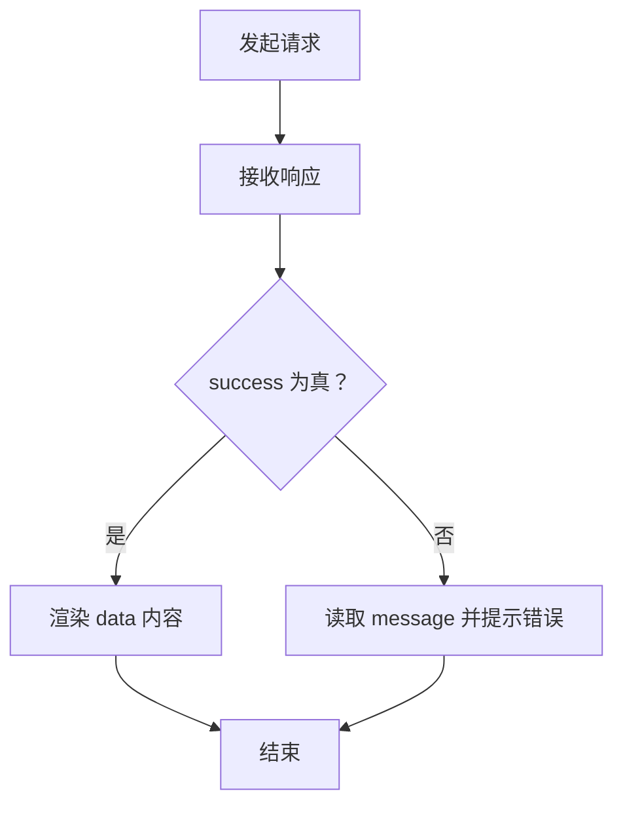
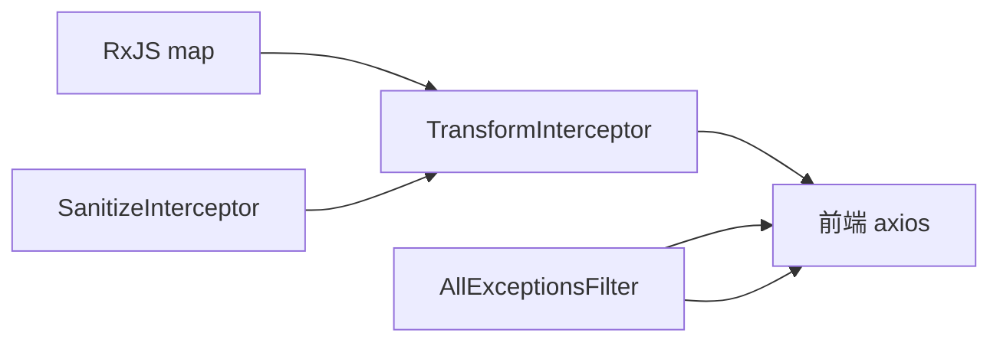

# 响应转换拦截器

<cite>
**本文引用的文件**
- [apps/backend/src/common/interceptors/transform.interceptor.ts](file://apps/backend/src/common/interceptors/transform.interceptor.ts)
- [apps/backend/src/common/filters/all-exceptions.filter.ts](file://apps/backend/src/common/filters/all-exceptions.filter.ts)
- [apps/backend/src/common/interceptors/sanitize.interceptor.ts](file://apps/backend/src/common/interceptors/sanitize.interceptor.ts)
- [apps/backend/src/main.ts](file://apps/backend/src/main.ts)
- [apps/frontend/src/api/index.ts](file://apps/frontend/src/api/index.ts)
- [apps/frontend/src/composables/useRequest.ts](file://apps/frontend/src/composables/useRequest.ts)
- [packages/shared/src/dto/common.dto.ts](file://packages/shared/src/dto/common.dto.ts)
</cite>

## 目录
1. [简介](#简介)
2. [项目结构](#项目结构)
3. [核心组件](#核心组件)
4. [架构总览](#架构总览)
5. [详细组件分析](#详细组件分析)
6. [依赖关系分析](#依赖关系分析)
7. [性能考量](#性能考量)
8. [故障排查指南](#故障排查指南)
9. [结论](#结论)
10. [附录](#附录)

## 简介
本文件围绕 TransformInterceptor 如何通过 RxJS 的 map 操作符统一包装所有“成功”响应展开，系统阐述：
- TransformedResponse 接口的字段语义：success、data、timestamp
- intercept 方法中 next.handle().pipe(map(...)) 的响应流处理机制
- 与全局异常过滤器 AllExceptionsFilter 的互补关系，共同构建标准化响应体系
- timestamp 字段在调试与日志追踪中的价值
- data 字段为 null 的边界情况处理
- 前端基于 success 字段统一处理成功/失败响应的实践建议
- 该设计如何提升 API 的可预测性与健壮性

## 项目结构
后端采用 NestJS 架构，响应转换拦截器位于公共模块中；全局异常过滤器负责错误响应标准化；前端通过 axios 客户端消费统一的响应格式。

图表来源
- [apps/backend/src/common/interceptors/transform.interceptor.ts](file://apps/backend/src/common/interceptors/transform.interceptor.ts#L1-L30)
- [apps/backend/src/common/filters/all-exceptions.filter.ts](file://apps/backend/src/common/filters/all-exceptions.filter.ts#L1-L31)
- [apps/backend/src/common/interceptors/sanitize.interceptor.ts](file://apps/backend/src/common/interceptors/sanitize.interceptor.ts#L1-L60)
- [apps/backend/src/main.ts](file://apps/backend/src/main.ts#L65-L75)
- [apps/frontend/src/api/index.ts](file://apps/frontend/src/api/index.ts#L1-L92)
- [apps/frontend/src/composables/useRequest.ts](file://apps/frontend/src/composables/useRequest.ts#L1-L44)

章节来源
- [apps/backend/src/main.ts](file://apps/backend/src/main.ts#L65-L75)

## 核心组件
- TransformInterceptor：将控制器返回的成功响应统一包装为包含 success、data、timestamp 的结构化对象。
- AllExceptionsFilter：将异常统一包装为包含 success、data、message、statusCode、timestamp 的结构化错误对象。
- SanitizeInterceptor：在进入业务逻辑之前对请求体、查询参数、路径参数进行 XSS 清洗，降低注入风险。
- 前端 axios 客户端：消费后端统一响应格式，配合前端 Hook 实现一致的错误处理与加载状态管理。

章节来源
- [apps/backend/src/common/interceptors/transform.interceptor.ts](file://apps/backend/src/common/interceptors/transform.interceptor.ts#L1-L30)
- [apps/backend/src/common/filters/all-exceptions.filter.ts](file://apps/backend/src/common/filters/all-exceptions.filter.ts#L1-L31)
- [apps/backend/src/common/interceptors/sanitize.interceptor.ts](file://apps/backend/src/common/interceptors/sanitize.interceptor.ts#L1-L60)
- [apps/frontend/src/api/index.ts](file://apps/frontend/src/api/index.ts#L1-L92)

## 架构总览
TransformInterceptor 与 AllExceptionsFilter 形成“成功/失败”的完整响应闭环：前者保证成功路径的结构一致性，后者保证失败路径的结构一致性。二者配合，使前后端交互协议稳定、可预测。

图表来源
- [apps/backend/src/common/interceptors/transform.interceptor.ts](file://apps/backend/src/common/interceptors/transform.interceptor.ts#L18-L29)
- [apps/backend/src/common/filters/all-exceptions.filter.ts](file://apps/backend/src/common/filters/all-exceptions.filter.ts#L8-L30)
- [apps/frontend/src/api/index.ts](file://apps/frontend/src/api/index.ts#L1-L92)

## 详细组件分析

### TransformInterceptor：统一包装成功响应
- 设计目标：确保所有控制器返回的成功响应具备统一的结构，便于前端一致处理。
- 关键实现：
  - 使用 NestInterceptor 接口，拦截 next.handle() 的响应流。
  - 通过 RxJS map 操作符将原始 data 包装为 { success: true, data, timestamp }。
  - timestamp 使用 ISO 字符串，便于前端解析与展示。
- 类型安全：
  - 泛型 T 表示 data 的类型，最终输出为 TransformedResponse<T>，保持编译期类型约束。
- 边界情况：
  - data 可能为 null 或空数组，拦截器不改变其值，仅追加 success 与 timestamp。
  - 对于异常，由 AllExceptionsFilter 负责包装，不进入该拦截器的 map 流。

图表来源
- [apps/backend/src/common/interceptors/transform.interceptor.ts](file://apps/backend/src/common/interceptors/transform.interceptor.ts#L18-L29)

章节来源
- [apps/backend/src/common/interceptors/transform.interceptor.ts](file://apps/backend/src/common/interceptors/transform.interceptor.ts#L1-L30)

### TransformedResponse 字段语义与前端价值
- success：布尔值，标识本次请求是否成功。前端可据此统一判断成功/失败分支，避免对不同字段名的兼容。
- data：实际业务数据，可能为对象、数组或 null。拦截器不强制 data 非空，但前端可按 success 字段决定是否显示 data。
- timestamp：ISO 字符串时间戳，便于前端记录、排序、调试与日志追踪。

章节来源
- [apps/backend/src/common/interceptors/transform.interceptor.ts](file://apps/backend/src/common/interceptors/transform.interceptor.ts#L8-L12)
- [packages/shared/src/dto/common.dto.ts](file://packages/shared/src/dto/common.dto.ts#L1-L13)

### 与 AllExceptionsFilter 的互补关系
- AllExceptionsFilter：将异常统一包装为 { success: false, data: null, message, statusCode, timestamp }，保证错误路径的结构一致性。
- TransformInterceptor：仅处理成功路径，不改变异常行为。
- 结果：前后端均能以相同结构消费响应，简化前端分支逻辑与错误提示。

图表来源
- [apps/backend/src/common/interceptors/transform.interceptor.ts](file://apps/backend/src/common/interceptors/transform.interceptor.ts#L18-L29)
- [apps/backend/src/common/filters/all-exceptions.filter.ts](file://apps/backend/src/common/filters/all-exceptions.filter.ts#L8-L30)
- [packages/shared/src/dto/common.dto.ts](file://packages/shared/src/dto/common.dto.ts#L1-L13)

章节来源
- [apps/backend/src/common/filters/all-exceptions.filter.ts](file://apps/backend/src/common/filters/all-exceptions.filter.ts#L1-L31)

### 响应流处理机制：next.handle().pipe(map(...))
- 控制器返回的数据经 next.handle() 产出 Observable。
- pipe(map(...)) 在响应流上执行映射，将原始 data 包装为标准化对象。
- 该模式天然支持异步与流式处理，无需在每个控制器重复包装。

章节来源
- [apps/backend/src/common/interceptors/transform.interceptor.ts](file://apps/backend/src/common/interceptors/transform.interceptor.ts#L18-L29)

### data 字段为 null 的边界情况
- 拦截器不对 data 做非空校验，允许返回 null 或空数组。
- 前端基于 success 判断是否展示 data；若 success 为 false，则忽略 data。
- 若业务需要区分“无数据”与“失败”，可在上层约定 message 或额外字段辅助识别。

章节来源
- [apps/backend/src/common/interceptors/transform.interceptor.ts](file://apps/backend/src/common/interceptors/transform.interceptor.ts#L20-L27)

### timestamp 字段的价值
- 调试与日志追踪：前端可记录请求时间，便于定位问题与复现。
- 与后端日志关联：后端日志可记录 timestamp，前端也可记录本地时间，便于联查。
- 展示与排序：可用于 UI 时间轴、列表排序等场景。

章节来源
- [apps/backend/src/common/interceptors/transform.interceptor.ts](file://apps/backend/src/common/interceptors/transform.interceptor.ts#L23-L26)

### 前端统一处理建议（基于 success 字段）
- axios 响应拦截器：可直接读取响应中的 success 字段，统一处理错误与成功分支。
- Vue Composables：在 useRequest 中，依据 success 字段更新 loading、error 与 data。
- 与 shared 类型配合：前端可使用 ApiResponse<T> 类型约束响应结构，提升类型安全。

图表来源
- [apps/frontend/src/api/index.ts](file://apps/frontend/src/api/index.ts#L1-L92)
- [apps/frontend/src/composables/useRequest.ts](file://apps/frontend/src/composables/useRequest.ts#L1-L44)
- [packages/shared/src/dto/common.dto.ts](file://packages/shared/src/dto/common.dto.ts#L1-L13)

章节来源
- [apps/frontend/src/api/index.ts](file://apps/frontend/src/api/index.ts#L1-L92)
- [apps/frontend/src/composables/useRequest.ts](file://apps/frontend/src/composables/useRequest.ts#L1-L44)
- [packages/shared/src/dto/common.dto.ts](file://packages/shared/src/dto/common.dto.ts#L1-L13)

## 依赖关系分析
- TransformInterceptor 依赖 RxJS 的 map 操作符，对响应流进行无侵入式包装。
- AllExceptionsFilter 依赖 @nestjs/common 的 ExceptionFilter，对异常进行统一包装。
- SanitizeInterceptor 在 TransformInterceptor 之前执行，保障输入安全，减少后续异常概率。
- 前端 axios 客户端消费后端统一响应格式，配合共享类型定义，提升一致性。

图表来源
- [apps/backend/src/common/interceptors/transform.interceptor.ts](file://apps/backend/src/common/interceptors/transform.interceptor.ts#L1-L30)
- [apps/backend/src/common/filters/all-exceptions.filter.ts](file://apps/backend/src/common/filters/all-exceptions.filter.ts#L1-L31)
- [apps/backend/src/common/interceptors/sanitize.interceptor.ts](file://apps/backend/src/common/interceptors/sanitize.interceptor.ts#L1-L60)
- [apps/frontend/src/api/index.ts](file://apps/frontend/src/api/index.ts#L1-L92)

章节来源
- [apps/backend/src/common/interceptors/transform.interceptor.ts](file://apps/backend/src/common/interceptors/transform.interceptor.ts#L1-L30)
- [apps/backend/src/common/filters/all-exceptions.filter.ts](file://apps/backend/src/common/filters/all-exceptions.filter.ts#L1-L31)
- [apps/backend/src/common/interceptors/sanitize.interceptor.ts](file://apps/backend/src/common/interceptors/sanitize.interceptor.ts#L1-L60)
- [apps/frontend/src/api/index.ts](file://apps/frontend/src/api/index.ts#L1-L92)

## 性能考量
- 拦截器与过滤器均为轻量级纯函数式处理，对性能影响极小。
- map 操作符在响应流上执行，不会阻塞控制器逻辑。
- 建议：
  - 保持响应体简洁，避免在 data 中传递超大对象。
  - 前端按需渲染，避免重复解析同一响应。

## 故障排查指南
- 成功响应仍出现失败分支：
  - 检查是否存在未捕获异常导致进入 AllExceptionsFilter。
  - 确认控制器返回值是否为 null/undefined 导致前端误判。
- 响应结构不一致：
  - 确保全局注册了 TransformInterceptor 与 AllExceptionsFilter。
  - 检查是否有局部覆盖或禁用拦截器的情况。
- 时间戳不一致：
  - 前端与后端时间源可能存在差异，建议以服务端 timestamp 为准，或在前端做时区转换。

章节来源
- [apps/backend/src/common/interceptors/transform.interceptor.ts](file://apps/backend/src/common/interceptors/transform.interceptor.ts#L18-L29)
- [apps/backend/src/common/filters/all-exceptions.filter.ts](file://apps/backend/src/common/filters/all-exceptions.filter.ts#L8-L30)
- [apps/backend/src/main.ts](file://apps/backend/src/main.ts#L65-L75)

## 结论
TransformInterceptor 通过 RxJS 的 map 操作符，将所有成功响应统一包装为标准化结构，显著提升了 API 的可预测性与健壮性。配合 AllExceptionsFilter，前后端交互协议保持一致，前端可基于 success 字段进行统一处理，简化了错误与成功分支的判断逻辑。timestamp 字段增强了调试与日志追踪能力，data 字段为 null 的边界情况也得到清晰处理。整体设计实现了“成功即结构化、失败即结构化”的响应体系。

## 附录
- 前端类型参考：ApiResponse<T>，包含 success、data、timestamp 等字段，便于在前端侧进行类型约束与提示。
- 建议：
  - 在前端 Hook 中默认读取 success 字段，统一处理 loading、error 与 data。
  - 对于分页场景，可结合共享的分页响应类型进行扩展。

章节来源
- [packages/shared/src/dto/common.dto.ts](file://packages/shared/src/dto/common.dto.ts#L1-L29)
- [apps/frontend/src/api/index.ts](file://apps/frontend/src/api/index.ts#L1-L92)
- [apps/frontend/src/composables/useRequest.ts](file://apps/frontend/src/composables/useRequest.ts#L1-L44)