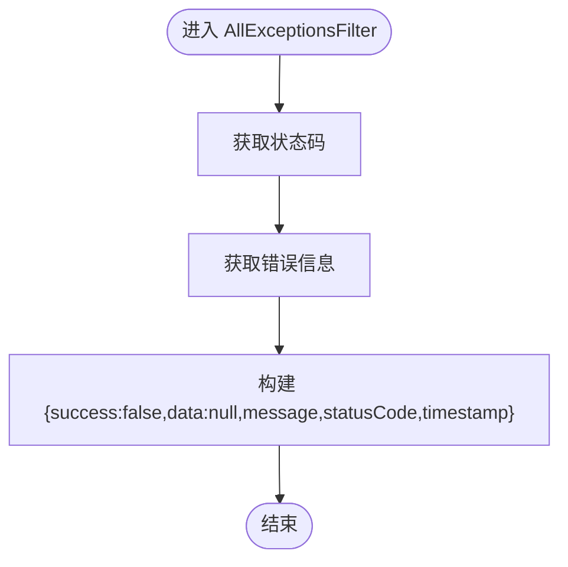

# 请求处理生命周期

<cite>
**本文引用的文件**
- [apps/backend/src/main.ts](file://apps/backend/src/main.ts)
- [apps/backend/src/app.module.ts](file://apps/backend/src/app.module.ts)
- [apps/backend/src/common/middlewares/csrf.middleware.ts](file://apps/backend/src/common/middlewares/csrf.middleware.ts)
- [apps/backend/src/common/interceptors/transform.interceptor.ts](file://apps/backend/src/common/interceptors/transform.interceptor.ts)
- [apps/backend/src/common/interceptors/sanitize.interceptor.ts](file://apps/backend/src/common/interceptors/sanitize.interceptor.ts)
- [apps/backend/src/common/filters/all-exceptions.filter.ts](file://apps/backend/src/common/filters/all-exceptions.filter.ts)
- [apps/backend/src/auth/auth.controller.ts](file://apps/backend/src/auth/auth.controller.ts)
- [apps/backend/src/auth/auth.service.ts](file://apps/backend/src/auth/auth.service.ts)
- [apps/backend/src/auth/jwt-auth.guard.ts](file://apps/backend/src/auth/jwt-auth.guard.ts)
- [apps/backend/src/auth/auth.dto.ts](file://apps/backend/src/auth/auth.dto.ts)
- [packages/shared/src/schemas/auth.schema.ts](file://packages/shared/src/schemas/auth.schema.ts)
- [apps/backend/src/redis/redis.module.ts](file://apps/backend/src/redis/redis.module.ts)
</cite>

## 目录
1. [引言](#引言)
2. [项目结构](#项目结构)
3. [核心组件](#核心组件)
4. [架构总览](#架构总览)
5. [详细组件分析](#详细组件分析)
6. [依赖关系分析](#依赖关系分析)
7. [性能考量](#性能考量)
8. [故障排查指南](#故障排查指南)
9. [结论](#结论)
10. [附录](#附录)

## 引言
本文围绕 NestJS 应用的 HTTP 请求处理生命周期展开，从 main.ts 中的 NestFactory.create() 开始，系统梳理请求在中间件（Middleware）、守卫（Guard）、拦截器（Interceptor）、管道（Pipe）与控制器（Controller）之间的流转顺序与职责边界。重点覆盖：
- CsrfMiddleware 如何在请求进入时验证 CSRF 令牌
- 全局 ThrottlerGuard 如何基于 Redis 实现速率限制
- ValidationPipe 如何结合 Zod Schema 进行请求数据校验
- TransformInterceptor 如何统一包装响应结构
- AllExceptionsFilter 如何捕获并格式化异常响应
- 结合实际代码路径绘制请求生命周期时序图，标注各阶段的数据变换与控制流
- 提供自定义中间件、守卫、拦截器的扩展方法与性能影响、调试技巧
- 常见问题如 CSRF 验证失败、速率限制触发、验证错误处理的排查指南

## 项目结构
后端应用位于 apps/backend，核心入口为 main.ts；全局中间件、守卫、拦截器、异常过滤器在 main.ts 中注册；业务控制器位于 apps/backend/src/auth 等模块；共享的 Zod Schema 位于 packages/shared。

图表来源
- [apps/backend/src/main.ts](file://apps/backend/src/main.ts#L1-L94)
- [apps/backend/src/app.module.ts](file://apps/backend/src/app.module.ts#L1-L159)
- [apps/backend/src/common/middlewares/csrf.middleware.ts](file://apps/backend/src/common/middlewares/csrf.middleware.ts#L1-L93)
- [apps/backend/src/common/interceptors/transform.interceptor.ts](file://apps/backend/src/common/interceptors/transform.interceptor.ts#L1-L30)
- [apps/backend/src/common/interceptors/sanitize.interceptor.ts](file://apps/backend/src/common/interceptors/sanitize.interceptor.ts#L1-L61)
- [apps/backend/src/common/filters/all-exceptions.filter.ts](file://apps/backend/src/common/filters/all-exceptions.filter.ts#L1-L31)
- [apps/backend/src/auth/auth.controller.ts](file://apps/backend/src/auth/auth.controller.ts#L1-L51)
- [apps/backend/src/auth/auth.service.ts](file://apps/backend/src/auth/auth.service.ts#L1-L150)
- [apps/backend/src/redis/redis.module.ts](file://apps/backend/src/redis/redis.module.ts#L1-L84)

章节来源
- [apps/backend/src/main.ts](file://apps/backend/src/main.ts#L1-L94)
- [apps/backend/src/app.module.ts](file://apps/backend/src/app.module.ts#L1-L159)

## 核心组件
- 全局中间件与安全
  - CsrfMiddleware：双重提交 Cookie 模式，确保每次响应设置 XSRF-TOKEN Cookie，并在非安全方法上校验请求头 X-XSRF-TOKEN 与 Cookie 一致性
  - CookieParser：为 CSRF 验证提供 req.cookies
  - Compression：响应压缩中间件
  - Helmet：安全头配置
  - CORS：跨域配置
- 全局守卫与限流
  - ThrottlerGuard：全局速率限制守卫，基于 Redis 存储计数与 TTL
  - RedisModule：提供 Redis 连接、TTL、键前缀等配置
- 全局拦截器
  - SanitizeInterceptor：对请求体、查询参数、路径参数进行 XSS 清理
  - TransformInterceptor：统一包装成功响应为 { success, data, timestamp }
- 全局管道
  - ZodValidationPipe：全局 Zod 校验，替代 class-validator
- 全局异常过滤器
  - AllExceptionsFilter：统一错误响应格式
- 控制器与服务
  - AuthController：登录、刷新令牌、获取当前用户信息
  - AuthService：用户凭据校验、JWT 令牌生成与刷新

章节来源
- [apps/backend/src/main.ts](file://apps/backend/src/main.ts#L1-L94)
- [apps/backend/src/app.module.ts](file://apps/backend/src/app.module.ts#L1-L159)
- [apps/backend/src/common/middlewares/csrf.middleware.ts](file://apps/backend/src/common/middlewares/csrf.middleware.ts#L1-L93)
- [apps/backend/src/common/interceptors/sanitize.interceptor.ts](file://apps/backend/src/common/interceptors/sanitize.interceptor.ts#L1-L61)
- [apps/backend/src/common/interceptors/transform.interceptor.ts](file://apps/backend/src/common/interceptors/transform.interceptor.ts#L1-L30)
- [apps/backend/src/common/filters/all-exceptions.filter.ts](file://apps/backend/src/common/filters/all-exceptions.filter.ts#L1-L31)
- [apps/backend/src/auth/auth.controller.ts](file://apps/backend/src/auth/auth.controller.ts#L1-L51)
- [apps/backend/src/auth/auth.service.ts](file://apps/backend/src/auth/auth.service.ts#L1-L150)
- [apps/backend/src/redis/redis.module.ts](file://apps/backend/src/redis/redis.module.ts#L1-L84)

## 架构总览
下图展示一次典型请求从进入应用到返回响应的完整生命周期，包括中间件、守卫、拦截器、管道与控制器的调用顺序与数据变换。

图表来源
- [apps/backend/src/main.ts](file://apps/backend/src/main.ts#L1-L94)
- [apps/backend/src/common/middlewares/csrf.middleware.ts](file://apps/backend/src/common/middlewares/csrf.middleware.ts#L1-L93)
- [apps/backend/src/app.module.ts](file://apps/backend/src/app.module.ts#L112-L151)
- [apps/backend/src/common/interceptors/sanitize.interceptor.ts](file://apps/backend/src/common/interceptors/sanitize.interceptor.ts#L1-L61)
- [apps/backend/src/common/interceptors/transform.interceptor.ts](file://apps/backend/src/common/interceptors/transform.interceptor.ts#L1-L30)
- [apps/backend/src/common/filters/all-exceptions.filter.ts](file://apps/backend/src/common/filters/all-exceptions.filter.ts#L1-L31)
- [apps/backend/src/auth/auth.controller.ts](file://apps/backend/src/auth/auth.controller.ts#L1-L51)
- [apps/backend/src/auth/auth.service.ts](file://apps/backend/src/auth/auth.service.ts#L1-L150)

## 详细组件分析

### CsrfMiddleware：双重提交 Cookie 模式
- 关键行为
  - 每次响应确保设置 XSRF-TOKEN Cookie（生产环境 secure=true，sameSite='strict'）
  - 对非安全方法（POST/PUT/PATCH/DELETE）校验请求头 X-XSRF-TOKEN 与 Cookie 是否一致
  - 安全方法（GET/HEAD/OPTIONS）与特定路径（健康检查、Swagger、登录/刷新）跳过验证
  - 使用时间安全比较防止时序攻击
- 数据流
  - 输入：Express Request/Response
  - 输出：若验证失败抛出禁止访问异常；否则放行至下一个中间件
- 扩展建议
  - 自定义跳过路径：在 skipPaths 中追加
  - 自定义安全方法集合：在 safeMethods 中调整
  - 自定义 Cookie 名称与请求头名称：修改 cookieName/headerName

图表来源
- [apps/backend/src/common/middlewares/csrf.middleware.ts](file://apps/backend/src/common/middlewares/csrf.middleware.ts#L1-L93)

章节来源
- [apps/backend/src/common/middlewares/csrf.middleware.ts](file://apps/backend/src/common/middlewares/csrf.middleware.ts#L1-L93)

### 全局 ThrottlerGuard：基于 Redis 的速率限制
- 关键行为
  - 全局注册 ThrottlerGuard，拦截所有路由
  - 通过 ThrottlerModule 配置多个限流器（short/medium/long），基于 TTL 与 limit 控制频次
  - RedisModule 提供 Redis 连接、TTL、键前缀等配置，ThrottlerGuard 使用 Redis 存储计数
- 数据流
  - 输入：请求上下文（IP/标识符）
  - 输出：若超过阈值返回 429；否则放行
- 扩展建议
  - 自定义限流器：在 ThrottlerModule 中新增 throttler
  - 自定义标识符：通过 @Throttle 装饰器指定不同标识符策略
  - 自定义跳过：@SkipThrottle 跳过限流

图表来源
- [apps/backend/src/app.module.ts](file://apps/backend/src/app.module.ts#L112-L151)
- [apps/backend/src/redis/redis.module.ts](file://apps/backend/src/redis/redis.module.ts#L1-L84)

章节来源
- [apps/backend/src/app.module.ts](file://apps/backend/src/app.module.ts#L112-L151)
- [apps/backend/src/redis/redis.module.ts](file://apps/backend/src/redis/redis.module.ts#L1-L84)

### ZodValidationPipe：请求数据校验
- 关键行为
  - 全局注册 ZodValidationPipe，替代 class-validator
  - 结合共享包中的 Zod Schema，自动进行请求体/查询/路径参数的校验
  - 与 Swagger 集成，自动生成 OpenAPI 文档
- 数据流
  - 输入：请求体/查询/路径
  - 输出：校验通过则进入后续拦截器；否则抛出验证错误
- 扩展建议
  - 在共享包中集中定义 Zod Schema，前后端共享类型
  - 使用 createZodDto 包装 DTO，自动支持 Swagger 与验证

图表来源
- [apps/backend/src/main.ts](file://apps/backend/src/main.ts#L65-L67)
- [apps/backend/src/auth/auth.dto.ts](file://apps/backend/src/auth/auth.dto.ts#L1-L18)
- [packages/shared/src/schemas/auth.schema.ts](file://packages/shared/src/schemas/auth.schema.ts#L1-L93)

章节来源
- [apps/backend/src/main.ts](file://apps/backend/src/main.ts#L65-L67)
- [apps/backend/src/auth/auth.dto.ts](file://apps/backend/src/auth/auth.dto.ts#L1-L18)
- [packages/shared/src/schemas/auth.schema.ts](file://packages/shared/src/schemas/auth.schema.ts#L1-L93)

### SanitizeInterceptor：XSS 清理
- 关键行为
  - 对请求体、查询参数、路径参数进行递归清理，不允许任何 HTML 标签
  - 保持非字符串值不变
- 数据流
  - 输入：Express Request
  - 输出：清理后的 request.body/query/params
- 扩展建议
  - 根据业务场景放宽/收紧允许标签与属性
  - 对特定字段保留白名单

图表来源
- [apps/backend/src/common/interceptors/sanitize.interceptor.ts](file://apps/backend/src/common/interceptors/sanitize.interceptor.ts#L1-L61)

章节来源
- [apps/backend/src/common/interceptors/sanitize.interceptor.ts](file://apps/backend/src/common/interceptors/sanitize.interceptor.ts#L1-L61)

### TransformInterceptor：统一响应包装
- 关键行为
  - 将成功响应统一包装为 { success: true, data, timestamp }
  - 保持原始 data 结构不变
- 数据流
  - 输入：控制器返回的数据
  - 输出：标准化响应体
- 扩展建议
  - 在响应体中加入 traceId、message 字段
  - 支持分页数据的额外元信息

图表来源
- [apps/backend/src/common/interceptors/transform.interceptor.ts](file://apps/backend/src/common/interceptors/transform.interceptor.ts#L1-L30)

章节来源
- [apps/backend/src/common/interceptors/transform.interceptor.ts](file://apps/backend/src/common/interceptors/transform.interceptor.ts#L1-L30)

### AllExceptionsFilter：异常统一格式化
- 关键行为
  - 捕获所有未处理异常，返回 { success: false, data: null, message, statusCode, timestamp }
  - 若为 HttpException 则透传状态码，否则返回 500
- 数据流
  - 输入：异常对象
  - 输出：标准化错误响应
- 扩展建议
  - 记录异常日志与堆栈
  - 区分业务异常与系统异常，返回不同 message

图表来源
- [apps/backend/src/common/filters/all-exceptions.filter.ts](file://apps/backend/src/common/filters/all-exceptions.filter.ts#L1-L31)

章节来源
- [apps/backend/src/common/filters/all-exceptions.filter.ts](file://apps/backend/src/common/filters/all-exceptions.filter.ts#L1-L31)

### AuthController 与 AuthService：登录/刷新令牌
- 关键行为
  - AuthController 使用 @Throttle/@SkipThrottle 控制登录与刷新接口的限流策略
  - AuthService 负责用户凭据校验、JWT 令牌生成与刷新
- 数据流
  - 登录：Zod 校验 -> 业务校验 -> 生成访问/刷新令牌 -> Transform 包装 -> 返回
  - 刷新：校验刷新令牌 -> 生成新的访问令牌 -> Transform 包装 -> 返回

图表来源
- [apps/backend/src/auth/auth.controller.ts](file://apps/backend/src/auth/auth.controller.ts#L1-L51)
- [apps/backend/src/auth/auth.service.ts](file://apps/backend/src/auth/auth.service.ts#L1-L150)
- [apps/backend/src/common/interceptors/transform.interceptor.ts](file://apps/backend/src/common/interceptors/transform.interceptor.ts#L1-L30)

章节来源
- [apps/backend/src/auth/auth.controller.ts](file://apps/backend/src/auth/auth.controller.ts#L1-L51)
- [apps/backend/src/auth/auth.service.ts](file://apps/backend/src/auth/auth.service.ts#L1-L150)

## 依赖关系分析
- 全局注册顺序
  - main.ts 中先注册安全中间件（Helmet、CookieParser、Compression、CORS），再注册全局守卫、管道、拦截器、过滤器
  - AppModule 中注册全局 ThrottlerGuard，并将 CsrfMiddleware 应用到所有路由
- 组件耦合
  - ThrottlerGuard 依赖 RedisModule 提供的 Redis 连接
  - ZodValidationPipe 依赖共享包中的 Zod Schema
  - CsrfMiddleware 依赖 cookie-parser 提供的 req.cookies
  - TransformInterceptor 与 AllExceptionsFilter 为纯数据变换与异常处理，低耦合
- 外部依赖
  - Redis：ThrottlerGuard 计数存储
  - Zod：请求数据校验
  - sanitize-html：XSS 清理
  - helmet/cookie-parser/compression：安全与传输优化

图表来源
- [apps/backend/src/main.ts](file://apps/backend/src/main.ts#L1-L94)
- [apps/backend/src/app.module.ts](file://apps/backend/src/app.module.ts#L112-L151)
- [apps/backend/src/common/middlewares/csrf.middleware.ts](file://apps/backend/src/common/middlewares/csrf.middleware.ts#L1-L93)
- [apps/backend/src/redis/redis.module.ts](file://apps/backend/src/redis/redis.module.ts#L1-L84)
- [packages/shared/src/schemas/auth.schema.ts](file://packages/shared/src/schemas/auth.schema.ts#L1-L93)

章节来源
- [apps/backend/src/main.ts](file://apps/backend/src/main.ts#L1-L94)
- [apps/backend/src/app.module.ts](file://apps/backend/src/app.module.ts#L112-L151)

## 性能考量
- 中间件链顺序
  - Helmet/CookieParser/Compression/CORS 在最前，避免后续处理重复开销
  - 压缩阈值与过滤器针对 SSE/WebSocket 做了特殊处理，减少不必要的压缩
- 速率限制
  - Redis 连接具备重试策略与 readyCheck，避免连接抖动导致的限流误判
  - TTL 与 limit 合理配置，避免过严导致正常用户被限流
- 数据校验
  - Zod 校验在全局管道执行，避免在控制器中重复校验
  - 与 Swagger 集成，减少文档与实现不一致带来的返工
- 响应包装
  - TransformInterceptor 仅做结构包装，无复杂计算
- 异常处理
  - AllExceptionsFilter 统一异常格式，便于前端处理与日志记录

[本节为通用性能讨论，不直接分析具体文件]

## 故障排查指南
- CSRF 验证失败
  - 症状：返回禁止访问错误
  - 排查要点
    - 确认浏览器已收到 XSRF-TOKEN Cookie（secure/sameSite/path）
    - 确认请求头 X-XSRF-TOKEN 与 Cookie 值一致且未被篡改
    - 检查是否命中 skipPaths 或安全方法
  - 参考路径
    - [apps/backend/src/common/middlewares/csrf.middleware.ts](file://apps/backend/src/common/middlewares/csrf.middleware.ts#L1-L93)
- 速率限制触发
  - 症状：返回 429 Too Many Requests
  - 排查要点
    - 检查 ThrottlerModule 配置（short/medium/long）
    - 检查 Redis 连接状态与键前缀
    - 确认是否使用 @SkipThrottle 或 @Throttle 装饰器
  - 参考路径
    - [apps/backend/src/app.module.ts](file://apps/backend/src/app.module.ts#L112-L151)
    - [apps/backend/src/redis/redis.module.ts](file://apps/backend/src/redis/redis.module.ts#L1-L84)
- 验证错误处理
  - 症状：请求被拒绝并返回验证错误
  - 排查要点
    - 检查 Zod Schema 定义与 createZodDto 包装
    - 确认请求体/查询/路径参数符合 Schema
  - 参考路径
    - [apps/backend/src/auth/auth.dto.ts](file://apps/backend/src/auth/auth.dto.ts#L1-L18)
    - [packages/shared/src/schemas/auth.schema.ts](file://packages/shared/src/schemas/auth.schema.ts#L1-L93)
- 异常响应格式
  - 症状：错误响应结构不一致
  - 排查要点
    - 确认全局异常过滤器已注册
    - 检查异常类型（HttpException vs 自定义异常）
  - 参考路径
    - [apps/backend/src/common/filters/all-exceptions.filter.ts](file://apps/backend/src/common/filters/all-exceptions.filter.ts#L1-L31)
- XSS 清理影响
  - 症状：富文本丢失
  - 排查要点
    - 检查 SanitizeInterceptor 的配置，必要时放宽白名单
  - 参考路径
    - [apps/backend/src/common/interceptors/sanitize.interceptor.ts](file://apps/backend/src/common/interceptors/sanitize.interceptor.ts#L1-L61)

章节来源
- [apps/backend/src/common/middlewares/csrf.middleware.ts](file://apps/backend/src/common/middlewares/csrf.middleware.ts#L1-L93)
- [apps/backend/src/app.module.ts](file://apps/backend/src/app.module.ts#L112-L151)
- [apps/backend/src/redis/redis.module.ts](file://apps/backend/src/redis/redis.module.ts#L1-L84)
- [apps/backend/src/auth/auth.dto.ts](file://apps/backend/src/auth/auth.dto.ts#L1-L18)
- [packages/shared/src/schemas/auth.schema.ts](file://packages/shared/src/schemas/auth.schema.ts#L1-L93)
- [apps/backend/src/common/filters/all-exceptions.filter.ts](file://apps/backend/src/common/filters/all-exceptions.filter.ts#L1-L31)
- [apps/backend/src/common/interceptors/sanitize.interceptor.ts](file://apps/backend/src/common/interceptors/sanitize.interceptor.ts#L1-L61)

## 结论
该应用通过明确的中间件、守卫、拦截器、管道与控制器分工，构建了清晰、可扩展且安全的请求处理链路。CsrfMiddleware、ThrottlerGuard、ZodValidationPipe、SanitizeInterceptor、TransformInterceptor 与 AllExceptionsFilter 各司其职，配合共享 Zod Schema 与 Redis 限流，形成从安全到性能再到用户体验的完整闭环。建议在生产环境中持续监控 Redis 连接与限流配置，结合日志与指标进行优化。

[本节为总结性内容，不直接分析具体文件]

## 附录
- 自定义扩展建议
  - 自定义中间件：实现 NestMiddleware 接口，在 AppModule 的 configure 中 apply
  - 自定义守卫：实现 CanActivate 接口，按需注入 Redis/配置服务
  - 自定义拦截器：实现 NestInterceptor 接口，注意不要阻断 next.handle()
  - 自定义管道：实现 PipeTransform 接口，结合 Zod Schema 扩展
  - 自定义异常过滤器：实现 ExceptionFilter 接口，统一错误输出
- 调试技巧
  - 使用 Pino 日志模块查看请求/响应日志与自定义日志级别
  - 在开发环境开启 pino-pretty，生产环境使用 JSON
  - 通过 Swagger 文档核对 Zod Schema 与 DTO 映射
  - 使用浏览器开发者工具检查 Cookie 与请求头是否正确传递

[本节为通用指导，不直接分析具体文件]