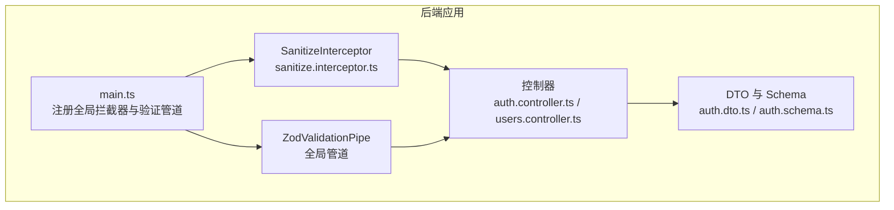
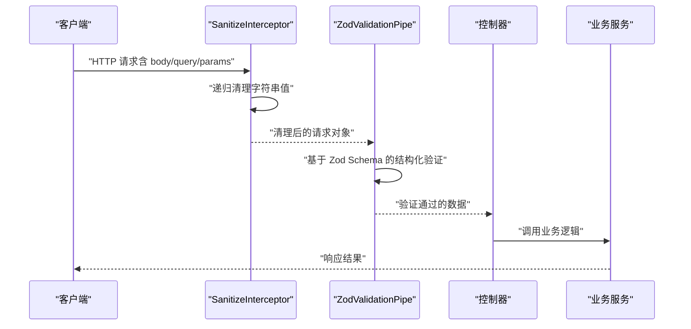
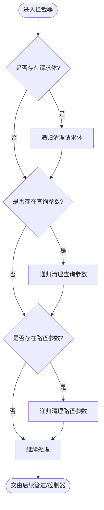
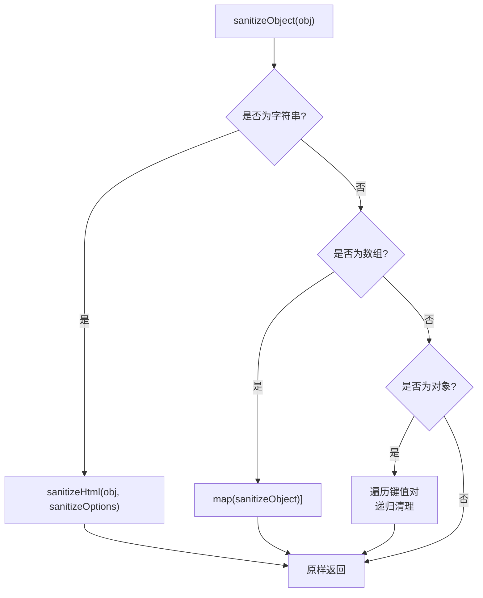
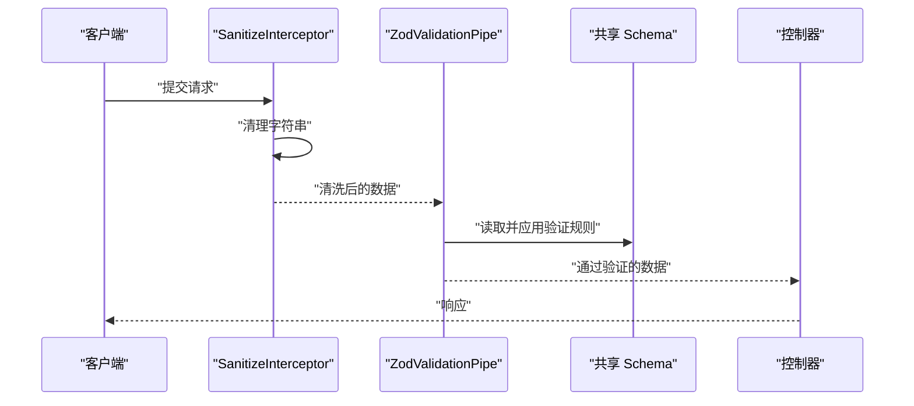
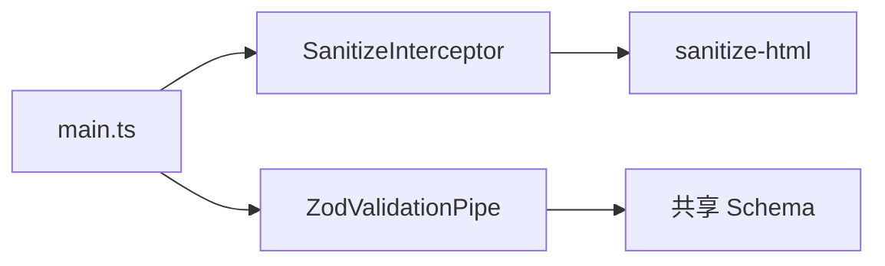

# 输入清理拦截器

<cite>
**本文引用的文件**
- [sanitize.interceptor.ts](file://apps/backend/src/common/interceptors/sanitize.interceptor.ts)
- [main.ts](file://apps/backend/src/main.ts)
- [auth.controller.ts](file://apps/backend/src/auth/auth.controller.ts)
- [users.controller.ts](file://apps/backend/src/users/users.controller.ts)
- [auth.dto.ts](file://apps/backend/src/auth/auth.dto.ts)
- [auth.schema.ts](file://packages/shared/src/schemas/auth.schema.ts)
- [package.json](file://apps/backend/package.json)
</cite>

## 目录
1. [简介](#简介)
2. [项目结构](#项目结构)
3. [核心组件](#核心组件)
4. [架构总览](#架构总览)
5. [详细组件分析](#详细组件分析)
6. [依赖分析](#依赖分析)
7. [性能考虑](#性能考虑)
8. [故障排查指南](#故障排查指南)
9. [结论](#结论)
10. [附录](#附录)

## 简介
本文件系统性解析 SanitizeInterceptor 如何在 NestJS 应用中防止 XSS 攻击。该拦截器在请求进入业务逻辑之前，对请求体（body）、查询参数（query）和路径参数（params）中的所有字符串值进行递归清理，使用 sanitize-html 库将所有 HTML 标签禁止（allowedTags: []），从而彻底阻断脚本注入风险。同时，该机制与全局 ZodValidationPipe 协作，形成“先清理后验证”的安全输入处理链路，确保后续验证阶段只面对清洗后的安全数据。

## 项目结构
SanitizeInterceptor 位于后端应用的公共拦截器目录中，并在应用启动时被注册为全局拦截器，对所有路由生效。与之配合的是全局 ZodValidationPipe，负责对 DTO 进行结构化校验。

图表来源
- [main.ts](file://apps/backend/src/main.ts#L65-L73)
- [sanitize.interceptor.ts](file://apps/backend/src/common/interceptors/sanitize.interceptor.ts#L16-L35)
- [auth.controller.ts](file://apps/backend/src/auth/auth.controller.ts#L18-L27)
- [users.controller.ts](file://apps/backend/src/users/users.controller.ts#L37-L41)
- [auth.dto.ts](file://apps/backend/src/auth/auth.dto.ts#L1-L19)
- [auth.schema.ts](file://packages/shared/src/schemas/auth.schema.ts#L1-L55)

章节来源
- [main.ts](file://apps/backend/src/main.ts#L65-L73)
- [sanitize.interceptor.ts](file://apps/backend/src/common/interceptors/sanitize.interceptor.ts#L16-L35)

## 核心组件
- SanitizeInterceptor：实现 NestInterceptor 接口，在请求进入业务处理前，对 body、query、params 三类输入进行递归字符串清理。
- sanitizeOptions：关键配置禁止所有 HTML 标签（allowedTags: []），并采用递归转义模式（disallowedTagsMode: 'recursiveEscape'），确保任何潜在的脚本载荷都会被安全处理。
- 递归清理算法：对字符串直接调用 sanitize-html；对数组逐项递归；对对象遍历键值对逐项递归；非字符串原样返回。

章节来源
- [sanitize.interceptor.ts](file://apps/backend/src/common/interceptors/sanitize.interceptor.ts#L11-L15)
- [sanitize.interceptor.ts](file://apps/backend/src/common/interceptors/sanitize.interceptor.ts#L16-L35)
- [sanitize.interceptor.ts](file://apps/backend/src/common/interceptors/sanitize.interceptor.ts#L41-L59)

## 架构总览
SanitizeInterceptor 与 ZodValidationPipe 的协作流程如下：

图表来源
- [main.ts](file://apps/backend/src/main.ts#L65-L73)
- [sanitize.interceptor.ts](file://apps/backend/src/common/interceptors/sanitize.interceptor.ts#L16-L35)
- [auth.controller.ts](file://apps/backend/src/auth/auth.controller.ts#L18-L27)
- [auth.dto.ts](file://apps/backend/src/auth/auth.dto.ts#L1-L19)
- [auth.schema.ts](file://packages/shared/src/schemas/auth.schema.ts#L1-L55)

## 详细组件分析

### SanitizeInterceptor 实现要点
- 输入范围覆盖：请求体、查询参数、路径参数三类输入均被清理。
- 递归清理策略：
  - 字符串：直接交给 sanitize-html 处理。
  - 数组：对每个元素递归清理。
  - 对象：对每个键值对递归清理。
  - 非字符串：原样返回（如数字、布尔、null、undefined）。
- sanitizeOptions 关键点：
  - allowedTags: [] 禁止一切 HTML 标签，从根本上杜绝脚本注入。
  - allowedAttributes: {} 禁止一切属性，避免危险属性（如 onclick、onload 等）。
  - disallowedTagsMode: 'recursiveEscape' 对无法识别或被禁止的标签进行递归转义，确保不会残留可执行内容。

图表来源
- [sanitize.interceptor.ts](file://apps/backend/src/common/interceptors/sanitize.interceptor.ts#L16-L35)

章节来源
- [sanitize.interceptor.ts](file://apps/backend/src/common/interceptors/sanitize.interceptor.ts#L16-L35)
- [sanitize.interceptor.ts](file://apps/backend/src/common/interceptors/sanitize.interceptor.ts#L41-L59)

### 递归清理算法细节
- 时间复杂度：对每个字符串调用 sanitize-html，整体复杂度近似 O(N)，N 为字符串总长度；数组与对象按元素/键值对线性递归，不引入额外指数级开销。
- 空间复杂度：递归深度取决于嵌套层数，最坏情况下与嵌套深度成正比；对象复制产生 O(M) 额外空间，M 为对象键值数量。
- 边界处理：对 null、undefined、非对象/数组类型直接返回，避免不必要的处理。

图表来源
- [sanitize.interceptor.ts](file://apps/backend/src/common/interceptors/sanitize.interceptor.ts#L41-L59)

章节来源
- [sanitize.interceptor.ts](file://apps/backend/src/common/interceptors/sanitize.interceptor.ts#L41-L59)

### XSS 防护实战：阻断典型载荷
- 典型载荷：
  - 由于 allowedTags: []，sanitize-html 会将该标签视为非法并进行转义或移除，最终不会在数据中残留可执行脚本。
- 其他常见载荷：onclick、onload、javascript:、vbscript:、data:text/html 等，均会被禁止标签或属性策略阻断。
- 实际效果：即便前端未做严格输入限制，后端拦截器也能在进入业务逻辑前将这些载荷清除，确保数据库与下游服务接收的是安全数据。

章节来源
- [sanitize.interceptor.ts](file://apps/backend/src/common/interceptors/sanitize.interceptor.ts#L11-L15)

### 与 ZodValidationPipe 的协作关系
- 注册顺序：全局 ZodValidationPipe 在 SanitizeInterceptor 之后注册，形成“先清理后验证”的处理链。
- 数据流：拦截器清理后的请求对象进入 ZodValidationPipe，基于共享 Schema（packages/shared）进行结构化校验，保证类型安全与业务约束。
- 优势：拦截器负责“去污”，Zod 负责“定型”，二者互补，既保证安全性又保证可维护性。

图表来源
- [main.ts](file://apps/backend/src/main.ts#L65-L73)
- [auth.dto.ts](file://apps/backend/src/auth/auth.dto.ts#L1-L19)
- [auth.schema.ts](file://packages/shared/src/schemas/auth.schema.ts#L1-L55)

章节来源
- [main.ts](file://apps/backend/src/main.ts#L65-L73)
- [auth.dto.ts](file://apps/backend/src/auth/auth.dto.ts#L1-L19)
- [auth.schema.ts](file://packages/shared/src/schemas/auth.schema.ts#L1-L55)

### 控制器中的使用示例
- 认证控制器：登录接口使用 Zod DTO，拦截器在进入业务逻辑前完成输入清理。
- 用户控制器：创建用户接口同样受益于全局拦截器，确保注册表单数据的安全性。

章节来源
- [auth.controller.ts](file://apps/backend/src/auth/auth.controller.ts#L18-L27)
- [users.controller.ts](file://apps/backend/src/users/users.controller.ts#L37-L41)

## 依赖分析
- sanitize-html：核心清理库，提供标签与属性白名单控制。
- Zod（nestjs-zod）：提供全局验证管道，与共享 Schema 协同工作。
- NestJS 拦截器机制：在管道与控制器之间插入，天然适合做输入清洗。

图表来源
- [package.json](file://apps/backend/package.json#L41-L66)
- [main.ts](file://apps/backend/src/main.ts#L65-L73)
- [sanitize.interceptor.ts](file://apps/backend/src/common/interceptors/sanitize.interceptor.ts#L11-L15)

章节来源
- [package.json](file://apps/backend/package.json#L41-L66)
- [main.ts](file://apps/backend/src/main.ts#L65-L73)

## 性能考虑
- CPU 使用与字符串处理：sanitize-html 对每个字符串进行扫描与转义，整体为线性复杂度。在高并发场景下，建议关注以下优化：
  - 白名单绕过策略：对已知安全字段（如纯数字、UUID、URL、邮箱等）进行快速判断，若命中预设安全模式则跳过 sanitize-html，减少不必要的 CPU 开销。
  - 分层缓存：对热点查询参数或路径参数进行轻量缓存，降低重复清理成本。
  - 批量输入优化：对于批量上传或大体积 JSON，建议在网关层或上游进行限流与大小限制，避免单次请求过大导致 CPU 峰值。
  - 监控指标：在生产环境开启 CPU 使用率、请求耗时、清理耗时等指标，结合日志定位热点路径。
- I/O 与内存：递归清理会产生对象复制，注意控制嵌套深度与对象规模，避免内存峰值过高。

[本节为通用性能建议，不直接分析具体文件，故无章节来源]

## 故障排查指南
- 症状：某些字段被意外清空或丢失
  - 可能原因：字段值本身包含不可识别的 HTML 片段，被 sanitize-html 视为非法并移除。
  - 排查步骤：检查该字段是否为字符串且包含尖括号、引号等特殊字符；确认是否属于预期输入类型。
- 症状：验证失败但拦截器未报错
  - 可能原因：拦截器已清理，但 Zod Schema 仍不满足约束（如长度、格式）。
  - 排查步骤：核对共享 Schema 的字段约束；确认 DTO 是否正确包裹了 Zod Schema。
- 症状：路径参数异常
  - 可能原因：路径参数中包含特殊字符，被递归清理。
  - 排查步骤：检查路由参数命名与业务期望是否一致；必要时在控制器内对特定参数进行二次校验。

章节来源
- [sanitize.interceptor.ts](file://apps/backend/src/common/interceptors/sanitize.interceptor.ts#L16-L35)
- [auth.dto.ts](file://apps/backend/src/auth/auth.dto.ts#L1-L19)
- [auth.schema.ts](file://packages/shared/src/schemas/auth.schema.ts#L1-L55)

## 结论
SanitizeInterceptor 通过“禁止一切 HTML 标签 + 递归清理 + 递归转义”的策略，有效阻断 XSS 攻击面。配合全局 ZodValidationPipe，形成“先清理后验证”的安全闭环，既提升了安全性，也保持了良好的可维护性。在高并发场景下，建议结合白名单绕过、缓存与监控等手段进一步优化性能与稳定性。

[本节为总结性内容，不直接分析具体文件，故无章节来源]

## 附录
- 关键配置参考路径
  - sanitizeOptions：[sanitize.interceptor.ts](file://apps/backend/src/common/interceptors/sanitize.interceptor.ts#L11-L15)
  - 全局拦截器注册：[main.ts](file://apps/backend/src/main.ts#L71-L73)
  - 全局验证管道注册：[main.ts](file://apps/backend/src/main.ts#L65-L67)
  - 控制器示例（登录）：[auth.controller.ts](file://apps/backend/src/auth/auth.controller.ts#L18-L27)
  - 控制器示例（创建用户）：[users.controller.ts](file://apps/backend/src/users/users.controller.ts#L37-L41)
  - DTO 与共享 Schema：[auth.dto.ts](file://apps/backend/src/auth/auth.dto.ts#L1-L19)、[auth.schema.ts](file://packages/shared/src/schemas/auth.schema.ts#L1-L55)