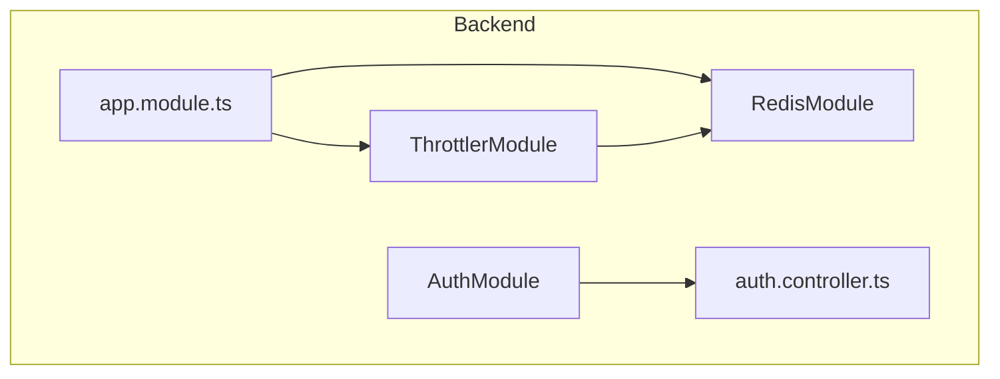
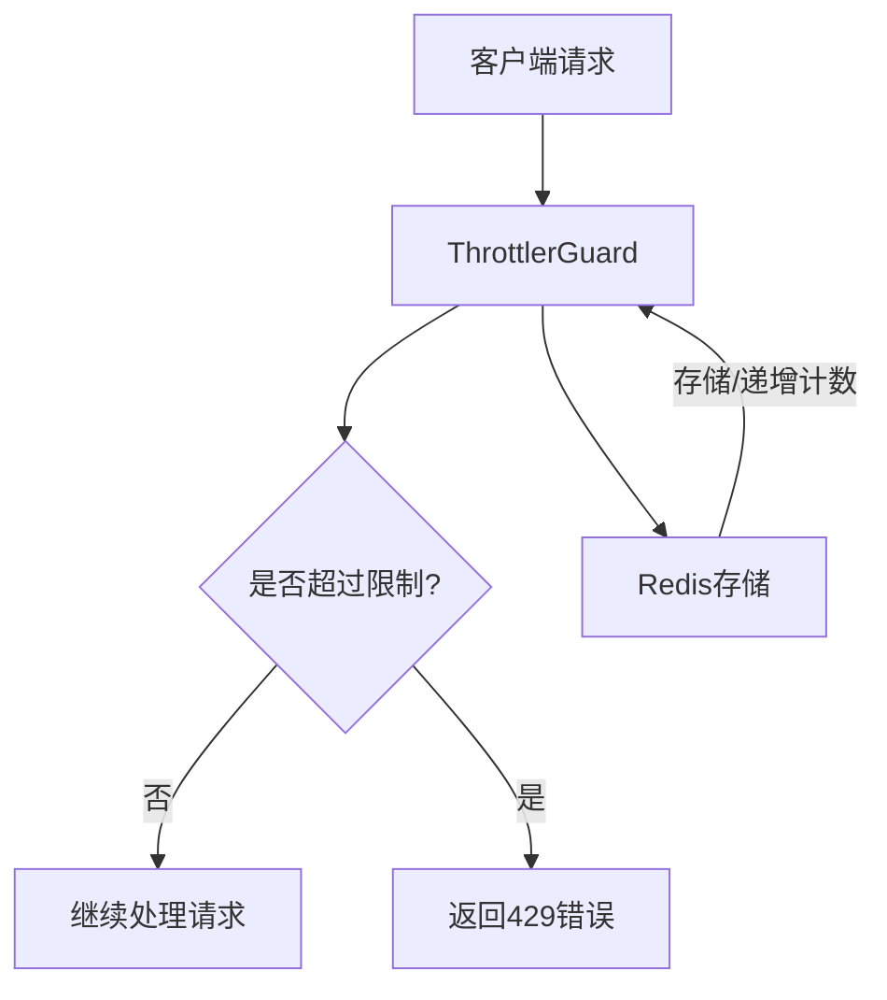
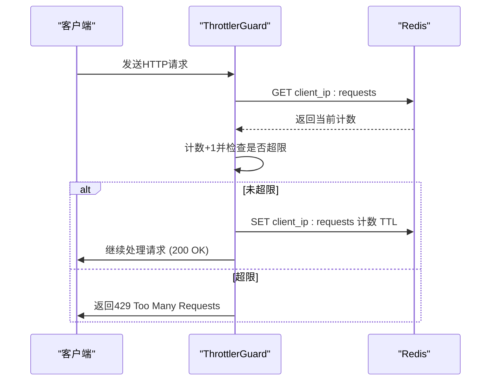
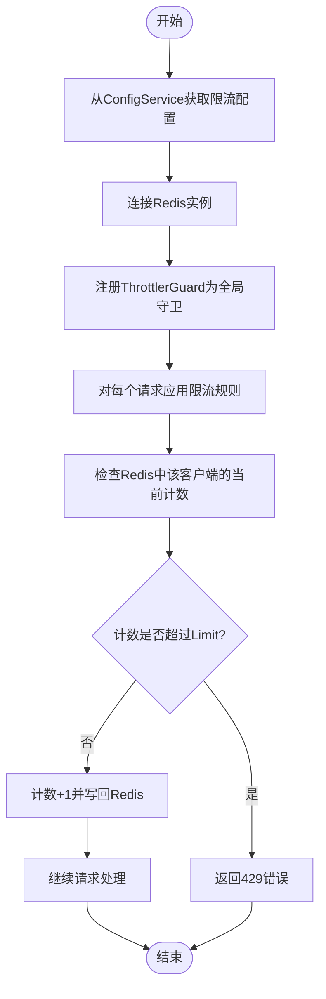
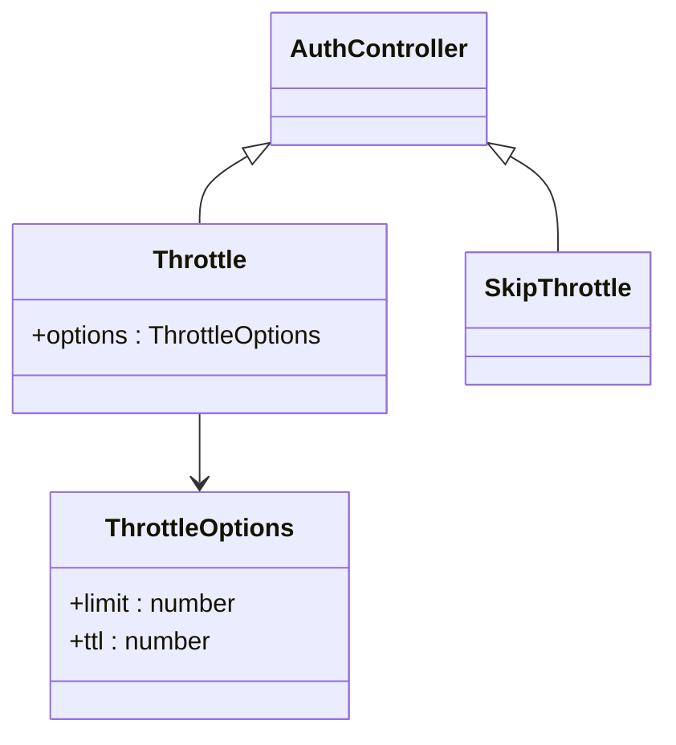
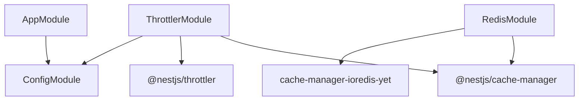

# 速率限制守卫

<cite>
**本文档中引用的文件**   
- [app.module.ts](file://apps/backend/src/app.module.ts)
- [auth.controller.ts](file://apps/backend/src/auth/auth.controller.ts)
- [redis.module.ts](file://apps/backend/src/redis/redis.module.ts)
- [redis.service.ts](file://apps/backend/src/redis/redis.service.ts)
- [.env.example](file://.env.example)
- [all-exceptions.filter.ts](file://apps/backend/src/common/filters/all-exceptions.filter.ts)
- [transform.interceptor.ts](file://apps/backend/src/common/interceptors/transform.interceptor.ts)
</cite>

## 目录
1. [简介](#简介)
2. [项目结构](#项目结构)
3. [核心组件](#核心组件)
4. [架构概述](#架构概述)
5. [详细组件分析](#详细组件分析)
6. [依赖分析](#依赖分析)
7. [性能考虑](#性能考虑)
8. [故障排除指南](#故障排除指南)
9. [结论](#结论)

## 简介
本文档深入解析基于 `ThrottlerGuard` 的多级速率限制机制。说明在 `AppModule` 中如何通过 `ThrottlerModule.forRoot` 配置 `short`、`medium`、`long` 三种限流策略，分别对应每秒20次、每分钟100次等规则。解释这些策略如何依赖 `RedisModule` 实现分布式计数，确保集群环境下限流一致性。阐述全局守卫（`APP_GUARD`）的注册机制如何使限流规则自动应用于所有路由。结合实际场景说明不同 `TTL` 和 `Limit` 参数的业务意义，如防止暴力登录、API滥用等。提供自定义限流规则的扩展方法，包括基于用户ID或IP地址的差异化策略。讨论Redis连接异常时的降级处理方案，并提供限流触发后的错误响应格式与前端重试策略建议。

## 项目结构
本项目采用NestJS框架构建后端服务，其结构遵循模块化设计原则。核心的速率限制功能主要分布在 `app.module.ts`、`redis` 模块以及 `auth` 模块中。`app.module.ts` 作为应用的根模块，负责全局配置和注册 `ThrottlerModule`。`redis` 模块提供了与Redis的连接和操作服务，是实现分布式限流的关键。`auth` 模块则展示了如何在特定业务场景（如登录）下应用和覆盖全局限流策略。

**图表来源**
- [app.module.ts](file://apps/backend/src/app.module.ts#L113-L134)
- [redis.module.ts](file://apps/backend/src/redis/redis.module.ts#L29-L78)
- [auth.controller.ts](file://apps/backend/src/auth/auth.controller.ts#L22-L33)

**章节来源**
- [app.module.ts](file://apps/backend/src/app.module.ts#L1-L159)
- [project_structure](file://)

## 核心组件
速率限制的核心组件包括 `ThrottlerModule`、`ThrottlerGuard` 和 `RedisModule`。`ThrottlerModule` 通过 `forRootAsync` 方法进行异步配置，允许从 `ConfigService` 动态注入限流规则。`ThrottlerGuard` 作为NestJS的守卫（Guard），被注册为全局守卫（`APP_GUARD`），从而拦截所有进入的HTTP请求。`RedisModule` 则利用 `cache-manager` 和 `ioredis` 库，为 `ThrottlerGuard` 提供了持久化和共享的计数存储，确保在多实例部署时，限流计数是全局一致的。

**章节来源**
- [app.module.ts](file://apps/backend/src/app.module.ts#L113-L150)
- [redis.module.ts](file://apps/backend/src/redis/redis.module.ts#L29-L78)

## 架构概述
整个速率限制机制的架构是一个典型的分层设计。最上层是业务逻辑层，如 `AuthController`，它可以选择性地应用或跳过限流。中间层是NestJS框架提供的 `ThrottlerGuard`，它负责执行具体的限流逻辑。最底层是数据存储层，由 `RedisModule` 提供，用于存储和递增每个客户端的请求计数。这种设计实现了业务逻辑与安全策略的解耦，同时利用Redis的高性能和原子操作保证了限流的准确性和效率。

**图表来源**
- [app.module.ts](file://apps/backend/src/app.module.ts#L146-L150)
- [redis.service.ts](file://apps/backend/src/redis/redis.service.ts#L85-L104)

## 详细组件分析

### 多级限流策略分析
在 `AppModule` 中，通过 `ThrottlerModule.forRootAsync` 配置了三个不同时间窗口的限流策略：
- **short**: 每1秒最多3次请求，用于防止短时间内的高频探测。
- **medium**: 每10秒最多20次请求，适用于一般的API调用频率控制。
- **long**: 每1分钟最多100次请求，用于控制长时间的总体请求量。

这些策略通过 `ConfigService` 从环境变量中读取，实现了配置的外部化和灵活性。

#### 对于API/服务组件：

**图表来源**
- [app.module.ts](file://apps/backend/src/app.module.ts#L117-L131)
- [.env.example](file://.env.example#L28-L33)

**章节来源**
- [app.module.ts](file://apps/backend/src/app.module.ts#L113-L134)

### 基于Redis的分布式计数分析
`RedisModule` 的核心是 `redisStore`，它被注入到 `CacheModule` 中。`ThrottlerGuard` 内部使用 `cache-manager` 来操作Redis。每个客户端（默认基于IP地址）的请求计数被存储为一个键值对，键的格式通常为 `throttle:<ip>:<route>`，值为当前计数，且设置了与 `TTL` 对应的过期时间。Redis的原子性 `INCR` 操作确保了在高并发下计数的准确性。

#### 对于复杂逻辑组件：

**图表来源**
- [redis.module.ts](file://apps/backend/src/redis/redis.module.ts#L46-L68)
- [redis.service.ts](file://apps/backend/src/redis/redis.service.ts#L85-L104)

**章节来源**
- [redis.module.ts](file://apps/backend/src/redis/redis.module.ts#L29-L78)
- [redis.service.ts](file://apps/backend/src/redis/redis.service.ts#L56-L231)

### 业务场景与自定义策略分析
在 `AuthController` 中，可以看到对全局限流策略的精细化控制。例如，`/login` 接口使用了更严格的限流规则（每分钟最多5次），以防止暴力破解攻击。同时，`/me` 接口使用了 `@SkipThrottle()` 装饰器，允许已认证用户绕过限流，提升用户体验。

**图表来源**
- [auth.controller.ts](file://apps/backend/src/auth/auth.controller.ts#L23-L43)

**章节来源**
- [auth.controller.ts](file://apps/backend/src/auth/auth.controller.ts#L1-L50)

## 依赖分析
速率限制机制依赖于多个关键模块和库。`ThrottlerModule` 依赖于 `@nestjs/throttler` 库。`RedisModule` 依赖于 `@nestjs/cache-manager` 和 `cache-manager-ioredis-yet` 库来实现与Redis的交互。`ConfigModule` 提供了配置注入能力，使得限流规则可以动态调整。这些依赖关系确保了系统的模块化和可维护性。

**图表来源**
- [app.module.ts](file://apps/backend/src/app.module.ts#L4)
- [redis.module.ts](file://apps/backend/src/redis/redis.module.ts#L4)
- [package.json](file://apps/backend/package.json)

**章节来源**
- [app.module.ts](file://apps/backend/src/app.module.ts#L1-L159)
- [redis.module.ts](file://apps/backend/src/redis/redis.module.ts#L1-L83)

## 性能考虑
使用Redis作为后端存储，为速率限制提供了极高的性能。Redis的内存操作和原子性命令确保了计数操作的低延迟和高并发处理能力。`ThrottlerGuard` 的设计是轻量级的，只在请求进入时进行一次Redis查询和可能的写入，对正常请求流程的性能影响最小。此外，通过配置合理的 `TTL` 和 `Limit`，可以在安全性和用户体验之间取得平衡。

## 故障排除指南
当Redis连接异常时，系统具备一定的降级能力。`RedisModule` 在连接失败时会抛出错误，这可能导致应用启动失败。在运行时，如果Redis暂时不可用，`ThrottlerGuard` 的计数功能将失效，可能导致限流策略无法生效。建议通过 `RedisHealthIndicator` 监控Redis状态，并在生产环境中配置Redis的高可用（如哨兵或集群模式）来避免单点故障。

**章节来源**
- [redis.module.ts](file://apps/backend/src/redis/redis.module.ts#L73-L76)
- [redis.health.ts](file://apps/backend/src/redis/redis.health.ts#L20-L41)
- [all-exceptions.filter.ts](file://apps/backend/src/common/filters/all-exceptions.filter.ts#L14-L28)

## 结论
本文档详细解析了基于 `ThrottlerGuard` 的多级速率限制机制。通过 `AppModule` 的配置，实现了 `short`、`medium`、`long` 三种策略的全局应用。`RedisModule` 确保了在分布式环境下的限流一致性。开发者可以通过 `@Throttle` 和 `@SkipThrottle` 装饰器在控制器层面进行精细化控制。该机制有效防止了暴力登录和API滥用，是保障API安全和稳定的重要手段。在Redis故障时，应有相应的监控和告警措施来确保服务的可靠性。