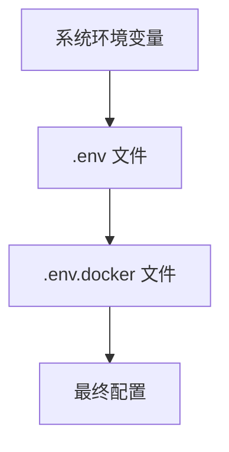
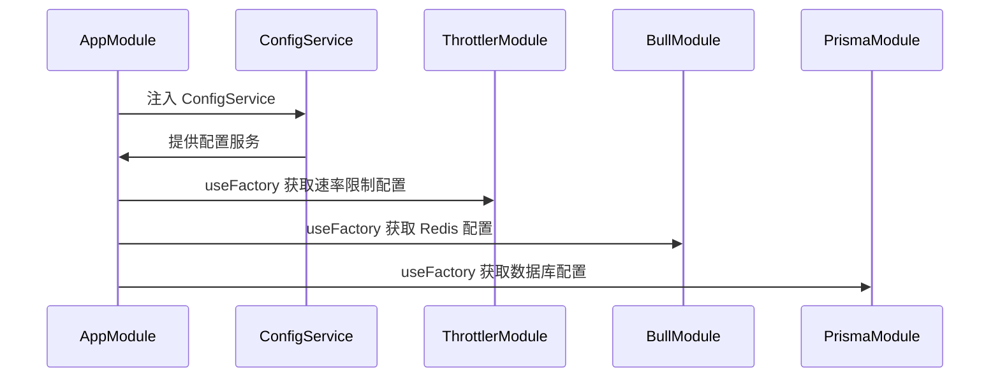
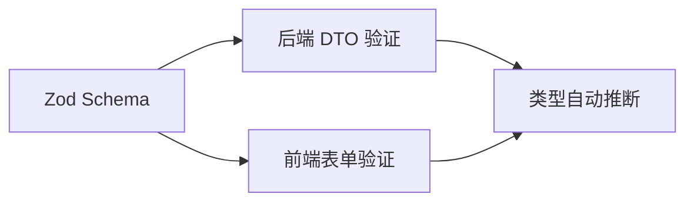
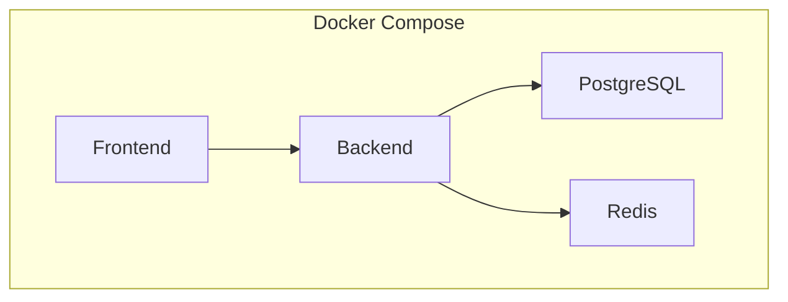

# 配置管理

<cite>
**本文档引用文件**   
- [app.module.ts](file://apps/backend/src/app.module.ts)
- [redis.module.ts](file://apps/backend/src/redis/redis.module.ts)
- [prisma.service.ts](file://apps/backend/src/prisma/prisma.service.ts)
- [.env.example](file://.env.example)
- [.env.docker.example](file://.env.docker.example)
- [docker-compose.yml](file://docker-compose.yml)
- [.dockerignore](file://.dockerignore)
- [auth.schema.ts](file://packages/shared/src/schemas/auth.schema.ts)
</cite>

## 目录
1. [配置体系概述](#配置体系概述)
2. [环境变量管理](#环境变量管理)
3. [异步配置注入](#异步配置注入)
4. [配置验证机制](#配置验证机制)
5. [容器化部署配置](#容器化部署配置)
6. [配置错误排查](#配置错误排查)

## 配置体系概述

本项目采用 NestJS 的 `@nestjs/config` 模块实现完整的配置管理体系，通过 `ConfigModule.forRoot()` 在根模块中全局注册配置服务。配置系统支持多环境配置文件加载、异步配置注入、环境变量优先级管理以及配置验证等功能。`ConfigService` 作为核心服务，为 ThrottlerModule、BullModule、PrismaModule 等组件提供动态配置能力，实现数据库连接、Redis 配置、速率限制参数的运行时注入。

**Section sources**
- [app.module.ts](file://apps/backend/src/app.module.ts#L25-L28)

## 环境变量管理

项目通过 `.env` 文件管理环境变量，支持多环境配置文件。开发环境使用 `.env` 文件，生产环境使用 `.env.docker` 文件。配置文件优先级为：`.env.docker` > `.env` > 系统环境变量。`.env.example` 文件作为模板，定义了所有必需的环境变量及其默认值。敏感信息如数据库密码、JWT 密钥等应在生产环境中通过 Docker secrets 或环境变量注入，避免硬编码。

**Diagram sources**
- [.env.example](file://.env.example)
- [.env.docker.example](file://.env.docker.example)

**Section sources**
- [.env.example](file://.env.example)
- [.env.docker.example](file://.env.docker.example)

## 异步配置注入

配置系统通过 `forRootAsync` 方法实现异步配置注入，允许在应用启动时动态获取配置。`ConfigService` 被注入到各个模块的 `useFactory` 函数中，从环境变量中读取配置值。例如，`ThrottlerModule` 使用 `THROTTLE_SHORT_TTL` 和 `THROTTLE_SHORT_LIMIT` 环境变量配置速率限制策略；`BullModule` 使用 `REDIS_HOST` 和 `REDIS_PORT` 配置 Redis 连接；`PrismaModule` 使用 `DATABASE_URL` 配置数据库连接。

**Diagram sources**
- [app.module.ts](file://apps/backend/src/app.module.ts#L113-L134)
- [redis.module.ts](file://apps/backend/src/redis/redis.module.ts#L32-L40)
- [prisma.service.ts](file://apps/backend/src/prisma/prisma.service.ts#L7)

**Section sources**
- [app.module.ts](file://apps/backend/src/app.module.ts#L113-L134)
- [redis.module.ts](file://apps/backend/src/redis/redis.module.ts#L32-L40)
- [prisma.service.ts](file://apps/backend/src/prisma/prisma.service.ts#L7)

## 配置验证机制

项目采用 Zod Schema 实现配置验证，确保环境变量的完整性和正确性。共享包 `@my-app/shared` 中定义了 `LoginSchema` 等 Zod Schema，用于前后端统一的验证逻辑。后端使用 `nestjs-zod` 包装 DTO，前端使用 `@vee-validate/zod` 进行表单验证。配置验证在应用启动时进行，确保所有必需的环境变量都已正确设置。

**Diagram sources**
- [auth.schema.ts](file://packages/shared/src/schemas/auth.schema.ts)
- [app.module.ts](file://apps/backend/src/app.module.ts#L30-L34)

**Section sources**
- [auth.schema.ts](file://packages/shared/src/schemas/auth.schema.ts)

## 容器化部署配置

容器化部署通过 `docker-compose.yml` 文件定义服务编排，使用 `.dockerignore` 文件排除敏感文件。`docker-compose.yml` 文件中定义了 PostgreSQL、Redis、后端和前端服务，通过环境变量注入配置。`.dockerignore` 文件排除了 `.env` 文件，确保敏感信息不会被包含在 Docker 镜像中。生产环境配置通过 `.env.docker` 文件管理，确保配置的隔离性和安全性。

**Diagram sources**
- [docker-compose.yml](file://docker-compose.yml)
- [.dockerignore](file://.dockerignore)

**Section sources**
- [docker-compose.yml](file://docker-compose.yml)
- [.dockerignore](file://.dockerignore)

## 配置错误排查

配置错误的常见排查步骤包括：检查 `.env` 文件是否存在且格式正确；验证环境变量名称和值是否正确；检查 `docker-compose.yml` 文件中的环境变量注入是否正确；查看应用启动日志，确认配置加载是否成功。最佳实践包括：使用 `.env.example` 作为模板；在生产环境中使用 Docker secrets 管理敏感信息；定期审查和更新环境变量。

**Section sources**
- [.env.example](file://.env.example)
- [docker-compose.yml](file://docker-compose.yml)
- [app.module.ts](file://apps/backend/src/app.module.ts)