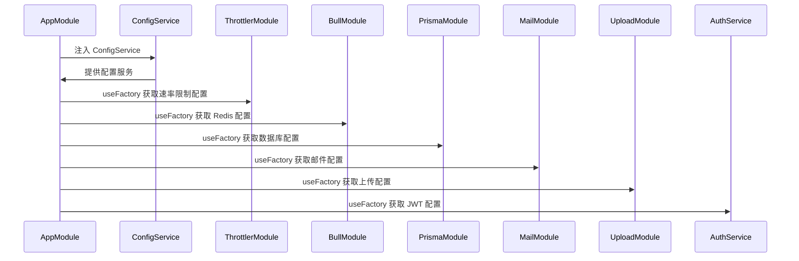

# 配置管理

<cite>
**本文档引用文件**   
- [auth.service.ts](file://apps/backend/src/auth/auth.service.ts)
- [jwt.strategy.ts](file://apps/backend/src/auth/jwt.strategy.ts)
- [prisma.service.ts](file://apps/backend/src/prisma/prisma.service.ts)
- [schema.prisma](file://apps/backend/prisma/schema.prisma)
- [prisma.config.ts](file://apps/backend/prisma/prisma.config.ts)
- [docker-compose.yml](file://docker-compose.yml)
- [docker-compose.dev.yml](file://docker-compose.dev.yml)
- [.env.example](file://.env.example)
- [.env.docker.example](file://.env.docker.example)
</cite>

## 更新摘要
**变更内容**   
- 更新JWT配置部分，说明已将单一的JWT_EXPIRES_IN环境变量拆分为JWT_ACCESS_EXPIRES_IN和JWT_REFRESH_EXPIRES_IN，以实现更精细的令牌过期时间控制
- 新增RESET_PASSWORD_EXPIRES_IN环境变量的说明，用于配置密码重置令牌的过期时间
- 更新环境变量管理部分，补充JWT相关环境变量在`.env.example`和`.env.docker.example`中的定义
- 修正配置体系概述部分，更新JWT令牌管理的配置流程
- 更新异步配置注入部分，说明`AuthService`如何通过环境变量获取JWT令牌过期时间配置
- 更新容器化部署配置部分，说明生产环境和开发环境中JWT配置的差异

## 目录
1. [配置体系概述](#配置体系概述)
2. [环境变量管理](#环境变量管理)
3. [异步配置注入](#异步配置注入)
4. [配置验证机制](#配置验证机制)
5. [容器化部署配置](#容器化部署配置)
6. [配置错误排查](#配置错误排查)

## 配置体系概述

本项目采用 NestJS 的 `@nestjs/config` 模块实现完整的配置管理体系，通过 `ConfigModule.forRoot()` 在根模块中全局注册配置服务。配置系统支持多环境配置文件加载、异步配置注入、环境变量优先级管理以及配置验证等功能。`ConfigService` 作为核心服务，为 ThrottlerModule、BullModule、PrismaModule 等组件提供动态配置能力，实现数据库连接、Redis 配置、速率限制参数的运行时注入。

在认证系统中，配置服务被用于管理JWT令牌的生命周期，通过分离访问令牌和刷新令牌的过期时间配置，实现了更灵活的安全策略。`AuthService` 在其构造函数中读取 `JWT_ACCESS_EXPIRES_IN` 和 `JWT_REFRESH_EXPIRES_IN` 环境变量来配置不同类型的令牌过期时间。

**Section sources**
- [prisma.service.ts](file://apps/backend/src/prisma/prisma.service.ts#L5-L20)
- [auth.service.ts](file://apps/backend/src/auth/auth.service.ts#L41-L44)

## 环境变量管理

项目通过 `.env` 文件管理环境变量，支持多环境配置文件。开发环境使用 `.env` 文件，生产环境使用 `.env.docker` 文件。配置文件优先级为：`.env.docker` > `.env` > 系统环境变量。`.env.example` 文件作为模板，定义了所有必需的环境变量及其默认值。敏感信息如数据库密码、JWT 密钥等应在生产环境中通过 Docker secrets 或环境变量注入，避免硬编码。

新增以下环境变量配置：

### Redis 配置
- `REDIS_HOST`: Redis 服务器地址（开发环境默认 `localhost`，Docker 环境为 `redis`）
- `REDIS_PORT`: Redis 端口（默认 `6379`）
- `REDIS_PASSWORD`: Redis 密码（可选）
- `REDIS_DB`: Redis 数据库编号（默认 `0`）
- `REDIS_KEY_PREFIX`: Redis 键前缀（默认 `app:`）
- `REDIS_DEFAULT_TTL`: 默认缓存过期时间（秒，默认 `300`）

### 邮件配置 (SMTP)
- `MAIL_HOST`: SMTP 服务器地址（如 `smtp.example.com`）
- `MAIL_PORT`: SMTP 端口（默认 `587`）
- `MAIL_SECURE`: 是否使用安全连接（`true` for 465, `false` for 587）
- `MAIL_USER`: SMTP 用户名
- `MAIL_PASSWORD`: SMTP 密码
- `MAIL_FROM`: 发件人地址（如 `"No Reply" <noreply@example.com>`）

### S3 存储配置
- `S3_BUCKET`: S3 存储桶名称（默认 `my-app-uploads`）
- `S3_REGION`: 区域（默认 `us-east-1`）
- `S3_ENDPOINT`: 可选，用于 OSS/MinIO（如 `https://oss-cn-hangzhou.aliyuncs.com`）
- `S3_ACCESS_KEY_ID`: 访问密钥 ID
- `S3_SECRET_ACCESS_KEY`: 秘密访问密钥

### 速率限制配置
- `THROTTLE_SHORT_TTL`: 短期限制时间窗口（毫秒，默认 `1000`）
- `THROTTLE_SHORT_LIMIT`: 短期限制次数（默认 `3`）
- `THROTTLE_MEDIUM_TTL`: 中期限制时间窗口（毫秒，默认 `10000`）
- `THROTTLE_MEDIUM_LIMIT`: 中期限制次数（默认 `20`）
- `THROTTLE_LONG_TTL`: 长期限制时间窗口（毫秒，默认 `60000`）
- `THROTTLE_LONG_LIMIT`: 长期限制次数（默认 `100`）

### JWT 配置变更
JWT 配置已更新为区分访问令牌和刷新令牌：
- `JWT_SECRET`: JWT 签名密钥
- `JWT_ACCESS_EXPIRES_IN`: 访问令牌过期时间（秒，默认 `900`，即 15 分钟）
- `JWT_REFRESH_EXPIRES_IN`: 刷新令牌过期时间（字符串格式，默认 `7d`）
- `RESET_PASSWORD_EXPIRES_IN`: 密码重置令牌过期时间（秒，默认 `3600`，即 1 小时）

这些环境变量在 `.env.example` 和 `.env.docker.example` 文件中均有定义，确保开发和生产环境的一致性。

### 数据库连接配置变更
根据最新的架构调整，`DATABASE_URL` 环境变量已从 Prisma schema 文件中移除，现在统一在 Docker Compose 配置文件中进行集中管理。这一变更实现了数据库连接信息的环境隔离和集中控制。

在 `docker-compose.yml` (生产环境) 和 `docker-compose.dev.yml` (开发环境) 中，`DATABASE_URL` 通过环境变量注入后端服务：
```yaml
environment:
  DATABASE_URL: postgresql://${POSTGRES_USER:-postgres}:${POSTGRES_PASSWORD:-postgres}@postgres:5432/${POSTGRES_DB:-myapp}?schema=public
```

`PrismaService` 在其构造函数中读取此环境变量来初始化数据库连接：
```typescript
constructor() {
  super({
    datasourceUrl: process.env.DATABASE_URL,
  })
}
```

**Diagram sources**
- [docker-compose.yml](file://docker-compose.yml#L79)
- [docker-compose.dev.yml](file://docker-compose.dev.yml#L81)
- [prisma.service.ts](file://apps/backend/src/prisma/prisma.service.ts#L7-L8)
- [schema.prisma](file://apps/backend/prisma/schema.prisma#L6-L8)
- [.env.example](file://.env.example#L23-L26)
- [.env.docker.example](file://.env.docker.example#L34-L37)

**Section sources**
- [docker-compose.yml](file://docker-compose.yml#L79)
- [docker-compose.dev.yml](file://docker-compose.dev.yml#L81)
- [prisma.service.ts](file://apps/backend/src/prisma/prisma.service.ts#L7-L8)
- [schema.prisma](file://apps/backend/prisma/schema.prisma#L6-L8)
- [.env.example](file://.env.example#L23-L26)
- [.env.docker.example](file://.env.docker.example#L34-L37)

## 异步配置注入

配置系统通过 `forRootAsync` 方法实现异步配置注入，允许在应用启动时动态获取配置。`ConfigService` 被注入到各个模块的 `useFactory` 函数中，从环境变量中读取配置值。例如，`ThrottlerModule` 使用 `THROTTLE_SHORT_TTL` 和 `THROTTLE_SHORT_LIMIT` 环境变量配置速率限制策略；`BullModule` 使用 `REDIS_HOST` 和 `REDIS_PORT` 配置 Redis 连接；`PrismaModule` 使用 `DATABASE_URL` 配置数据库连接。

新增模块的异步配置：
- `MailModule`: 使用 `MAIL_HOST`、`MAIL_PORT`、`MAIL_SECURE`、`MAIL_USER`、`MAIL_PASSWORD` 和 `MAIL_FROM` 配置 SMTP 邮件服务
- `UploadModule`: 使用 `UPLOAD_MAX_SIZE` 和 `UPLOAD_MAX_FILES` 配置文件上传限制
- `StorageService`: 使用 `S3_BUCKET`、`S3_REGION`、`S3_ENDPOINT`、`S3_ACCESS_KEY_ID` 和 `S3_SECRET_ACCESS_KEY` 配置 S3 云存储

对于JWT配置，`AuthService` 通过读取 `JWT_ACCESS_EXPIRES_IN` 和 `JWT_REFRESH_EXPIRES_IN` 环境变量来配置不同类型的令牌过期时间，实现了更精细的令牌生命周期管理。



**Diagram sources**
- [prisma.service.ts](file://apps/backend/src/prisma/prisma.service.ts#L7-L8)
- [auth.service.ts](file://apps/backend/src/auth/auth.service.ts#L41-L44)

**Section sources**
- [prisma.service.ts](file://apps/backend/src/prisma/prisma.service.ts#L7-L8)
- [auth.service.ts](file://apps/backend/src/auth/auth.service.ts#L41-L44)

## 配置验证机制

项目采用 Zod Schema 实现配置验证，确保环境变量的完整性和正确性。共享包 `@my-app/shared` 中定义了 `LoginSchema` 等 Zod Schema，用于前后端统一的验证逻辑。后端使用 `nestjs-zod` 包装 DTO，前端使用 `@vee-validate/zod` 进行表单验证。配置验证在应用启动时进行，确保所有必需的环境变量都已正确设置。


**Diagram sources**
- [prisma.config.ts](file://apps/backend/prisma/prisma.config.ts#L3)

**Section sources**
- [prisma.config.ts](file://apps/backend/prisma/prisma.config.ts#L3)

## 容器化部署配置

容器化部署通过 `docker-compose.yml` 和 `docker-compose.dev.yml` 文件定义服务编排，使用 `.dockerignore` 文件排除敏感文件。`docker-compose.yml` 用于生产环境，`docker-compose.dev.yml` 用于开发环境。两个文件均定义了 PostgreSQL、Redis、后端和前端服务，但配置策略不同。

### 开发环境配置 (docker-compose.dev.yml)
开发环境配置文件 `docker-compose.dev.yml` 支持代码热更新，修改代码后容器内自动重载。其主要特点包括：
- **PostgreSQL**: 使用 `postgres:16-alpine` 镜像，端口映射 `5432:5432`，数据卷 `postgres_data_dev`
- **Redis**: 使用 `redis:7-alpine` 镜像，端口映射 `6379:6379`，数据卷 `redis_data_dev`
- **后端服务**: 挂载项目目录 `.` 到 `/app`，实现代码热更新；使用 `backend_node_modules` 卷隔离依赖
- **前端服务**: 挂载项目目录 `.` 到 `/app`，实现热更新；使用 `frontend_node_modules` 卷隔离依赖
- **网络**: 使用独立的 `myapp-network-dev` 网络
- **数据库连接**: `DATABASE_URL` 环境变量在 `backend` 服务中定义，指向 `postgres` 容器
- **Prisma 生成**: `prisma generate` 命令在容器启动时执行，使用 `--schema=prisma/schema.prisma` 参数明确指定 schema 文件路径

### 生产环境配置 (docker-compose.yml)
生产环境配置文件 `docker-compose.yml` 采用构建镜像方式部署，不支持热更新。其主要特点包括：
- **资源限制**: 为 PostgreSQL、Redis、后端和前端服务设置内存限制
- **安全配置**: 启用 `no-new-privileges:true` 安全选项
- **只读文件系统**: 前端服务启用只读根文件系统增强安全性
- **健康检查**: 为后端和前端服务配置健康检查
- **网络**: 使用独立的 `myapp-network` 网络
- **数据库连接**: `DATABASE_URL` 环境变量在 `backend` 服务中定义，指向 `postgres` 容器，实现了与开发环境的配置隔离

在 `docker-compose.dev.yml` 中，后端服务的环境变量配置已扩展：
- Redis 配置：`REDIS_HOST`, `REDIS_PORT`, `REDIS_PASSWORD`, `REDIS_DB`, `REDIS_KEY_PREFIX`, `REDIS_DEFAULT_TTL`
- 邮件配置：`MAIL_HOST`, `MAIL_PORT`, `MAIL_SECURE`, `MAIL_USER`, `MAIL_PASSWORD`, `MAIL_FROM`
- S3 存储配置：`S3_BUCKET`, `S3_REGION`, `S3_ENDPOINT`, `S3_ACCESS_KEY_ID`, `S3_SECRET_ACCESS_KEY`
- 文件上传配置：`UPLOAD_MAX_SIZE`, `UPLOAD_MAX_FILES`
- JWT 配置：`JWT_SECRET`, `JWT_ACCESS_EXPIRES_IN`, `JWT_REFRESH_EXPIRES_IN`, `RESET_PASSWORD_EXPIRES_IN`


**Diagram sources**
- [docker-compose.yml](file://docker-compose.yml)
- [docker-compose.dev.yml](file://docker-compose.dev.yml)
- [prisma.config.ts](file://apps/backend/prisma/prisma.config.ts#L3)

**Section sources**
- [docker-compose.yml](file://docker-compose.yml)
- [docker-compose.dev.yml](file://docker-compose.dev.yml)
- [prisma.config.ts](file://apps/backend/prisma/prisma.config.ts#L3)

## 配置错误排查

配置错误的常见排查步骤包括：检查 `.env` 文件是否存在且格式正确；验证环境变量名称和值是否正确；检查 `docker-compose.yml` 文件中的环境变量注入是否正确；查看应用启动日志，确认配置加载是否成功。新增排查场景：
- Redis 连接失败：检查 `REDIS_HOST`、`REDIS_PORT`、`REDIS_PASSWORD` 配置
- 邮件发送失败：检查 `MAIL_HOST`、`MAIL_PORT`、`MAIL_USER`、`MAIL_PASSWORD` 配置
- S3 上传失败：检查 `S3_ACCESS_KEY_ID`、`S3_SECRET_ACCESS_KEY`、`S3_BUCKET` 配置
- JWT 令牌验证失败：检查 `JWT_SECRET` 配置是否一致
- **数据库连接失败**：检查 `DATABASE_URL` 环境变量是否已正确注入到容器中，确认 `docker-compose.yml` 或 `docker-compose.dev.yml` 中的 `DATABASE_URL` 配置是否正确
- **JWT令牌过期时间异常**：检查 `JWT_ACCESS_EXPIRES_IN` 和 `JWT_REFRESH_EXPIRES_IN` 环境变量配置是否正确，确认 `auth.service.ts` 中的配置读取逻辑
- **密码重置功能失效**：检查 `RESET_PASSWORD_EXPIRES_IN` 环境变量配置，确认其值是否合理（建议1-24小时）

最佳实践包括：使用 `.env.example` 作为模板；在生产环境中使用 Docker secrets 管理敏感信息；定期审查和更新环境变量。

**Section sources**
- [docker-compose.yml](file://docker-compose.yml)
- [docker-compose.dev.yml](file://docker-compose.dev.yml)
- [prisma.service.ts](file://apps/backend/src/prisma/prisma.service.ts)
- [auth.service.ts](file://apps/backend/src/auth/auth.service.ts)