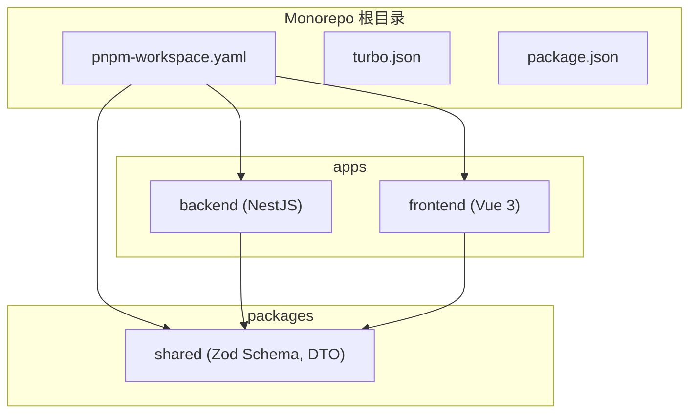
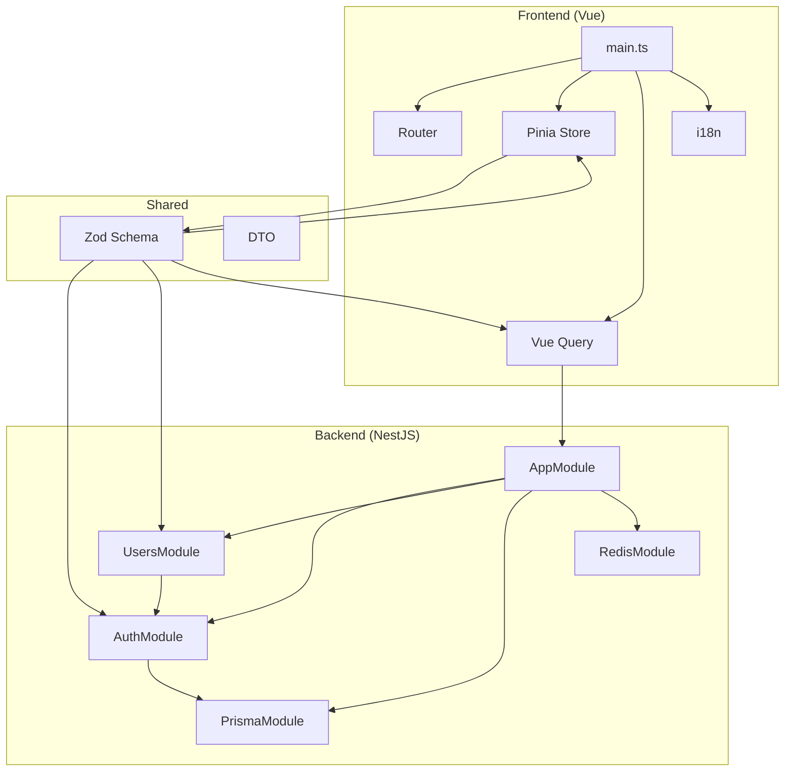
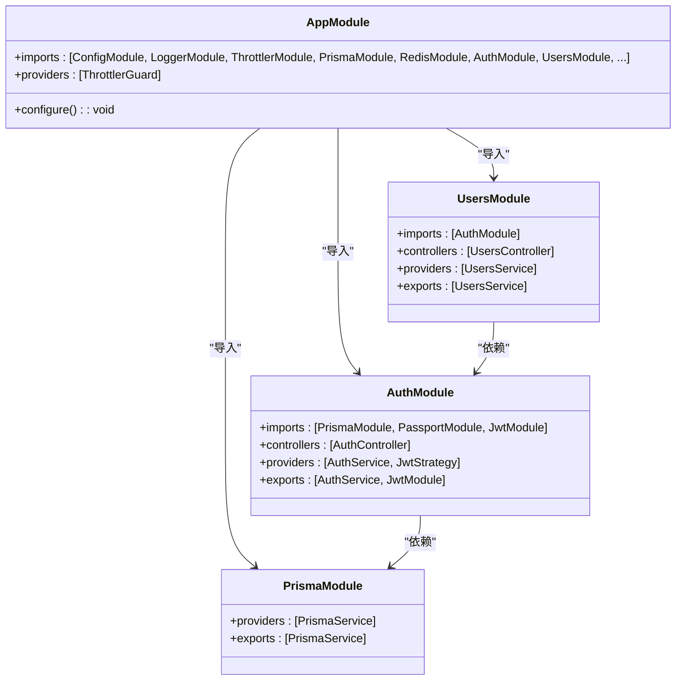
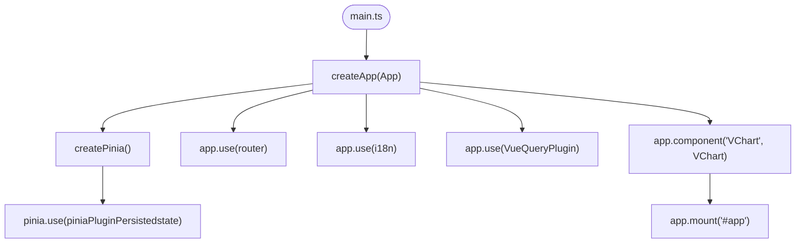
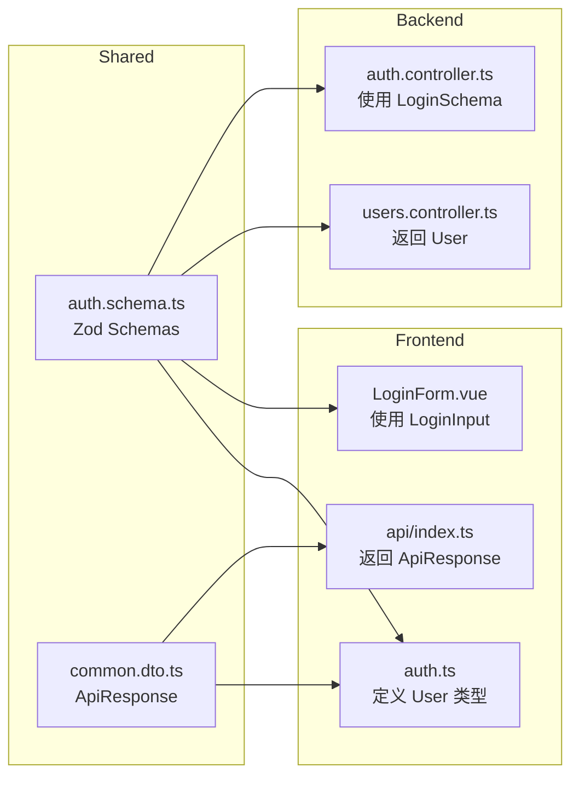
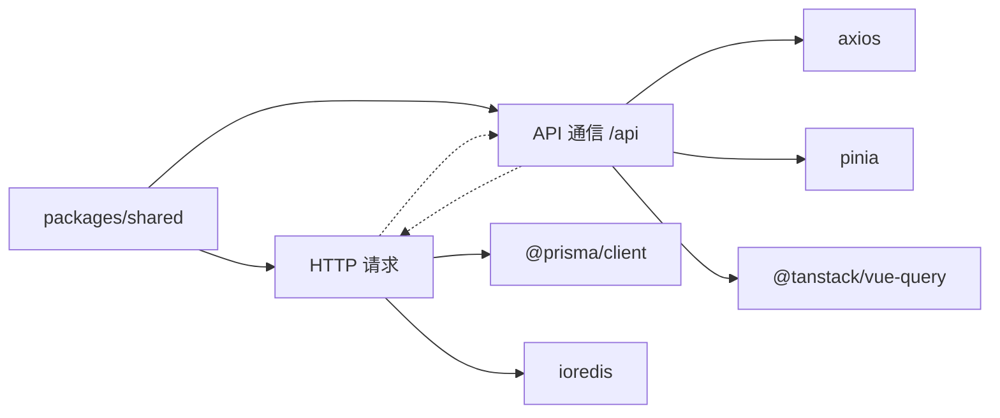

# 架构设计

<cite>
**本文档中引用的文件**  
- [app.module.ts](file://apps/backend/src/app.module.ts)
- [main.ts](file://apps/frontend/src/main.ts)
- [index.ts](file://packages/shared/src/index.ts)
- [auth.module.ts](file://apps/backend/src/auth/auth.module.ts)
- [users.module.ts](file://apps/backend/src/users/users.module.ts)
- [prisma.module.ts](file://apps/backend/src/prisma/prisma.module.ts)
- [router/index.ts](file://apps/frontend/src/router/index.ts)
- [auth.ts](file://apps/frontend/src/stores/auth.ts)
- [auth.schema.ts](file://packages/shared/src/schemas/auth.schema.ts)
- [auth.controller.ts](file://apps/backend/src/auth/auth.controller.ts)
- [users.controller.ts](file://apps/backend/src/users/users.controller.ts)
- [index.ts](file://apps/frontend/src/api/index.ts)
- [i18n/index.ts](file://apps/frontend/src/i18n/index.ts)
- [common.dto.ts](file://packages/shared/src/dto/common.dto.ts)
- [prisma.service.ts](file://apps/backend/src/prisma/prisma.service.ts)
- [users.ts](file://apps/frontend/src/stores/users.ts)
</cite>

## 目录
1. [引言](#引言)
2. [项目结构](#项目结构)
3. [核心组件](#核心组件)
4. [架构概览](#架构概览)
5. [详细组件分析](#详细组件分析)
6. [依赖分析](#依赖分析)
7. [性能考虑](#性能考虑)
8. [故障排除指南](#故障排除指南)
9. [结论](#结论)

## 引言
本架构文档深入分析了基于 pnpm Monorepo 的全栈应用设计。该架构通过将 backend、frontend 和 shared 三个核心包组织在单一代码库中，实现了高效的依赖管理和跨团队协作。后端采用 NestJS 模块化设计，前端基于 Vue 3 和 Pinia 实现响应式状态管理，而 shared 包作为单一可信源（Single Source of Truth），确保了前后端数据结构的一致性。本文档将详细阐述各部分的设计原理、集成方式及其带来的工程优势。

## 项目结构

**Diagram sources**  
- [pnpm-workspace.yaml](file://pnpm-workspace.yaml)
- [apps/backend](file://apps/backend)
- [apps/frontend](file://apps/frontend)
- [packages/shared](file://packages/shared)

**Section sources**  
- [pnpm-workspace.yaml](file://pnpm-workspace.yaml)

## 核心组件

本项目由三大核心组件构成：后端服务（NestJS）、前端应用（Vue 3）和共享库（Shared）。后端通过模块化设计实现功能解耦，前端通过组合式 API 和状态管理实现高效开发，共享库则通过 Zod Schema 统一了数据验证规则，确保了系统整体的一致性和可靠性。

**Section sources**  
- [app.module.ts](file://apps/backend/src/app.module.ts)
- [main.ts](file://apps/frontend/src/main.ts)
- [index.ts](file://packages/shared/src/index.ts)

## 架构概览

**Diagram sources**  
- [app.module.ts](file://apps/backend/src/app.module.ts)
- [main.ts](file://apps/frontend/src/main.ts)
- [index.ts](file://packages/shared/src/index.ts)

## 详细组件分析

### 后端模块化设计分析

NestJS 的模块系统是本项目后端架构的核心。`AppModule` 作为根模块，通过 `@Module` 装饰器导入并整合了多个功能模块，实现了清晰的职责分离和依赖注入。

**Diagram sources**  
- [app.module.ts](file://apps/backend/src/app.module.ts#L22-L158)
- [auth.module.ts](file://apps/backend/src/auth/auth.module.ts#L13-L30)
- [users.module.ts](file://apps/backend/src/users/users.module.ts#L6-L11)
- [prisma.module.ts](file://apps/backend/src/prisma/prisma.module.ts#L5-L8)

**Section sources**  
- [app.module.ts](file://apps/backend/src/app.module.ts#L1-L159)
- [auth.module.ts](file://apps/backend/src/auth/auth.module.ts#L1-L32)
- [users.module.ts](file://apps/backend/src/users/users.module.ts#L1-L13)
- [prisma.module.ts](file://apps/backend/src/prisma/prisma.module.ts#L1-L10)

### 前端初始化流程分析

前端的入口文件 `main.ts` 负责初始化整个 Vue 应用，集成路由、状态管理、查询库和国际化等核心功能，构建了应用的运行时环境。

**Diagram sources**  
- [main.ts](file://apps/frontend/src/main.ts#L32-L56)
- [router/index.ts](file://apps/frontend/src/router/index.ts#L7-L43)
- [auth.ts](file://apps/frontend/src/stores/auth.ts#L10-L96)
- [i18n/index.ts](file://apps/frontend/src/i18n/index.ts#L17-L27)

**Section sources**  
- [main.ts](file://apps/frontend/src/main.ts#L1-L57)
- [router/index.ts](file://apps/frontend/src/router/index.ts#L1-L44)
- [auth.ts](file://apps/frontend/src/stores/auth.ts#L1-L97)
- [i18n/index.ts](file://apps/frontend/src/i18n/index.ts#L1-L28)

### 共享包与单一可信源分析

`shared` 包是连接前后端的桥梁，其核心是使用 Zod 定义的 Schema，这些 Schema 被编译为 TypeScript 类型，实现了数据验证和类型定义的统一。

**Diagram sources**  
- [auth.schema.ts](file://packages/shared/src/schemas/auth.schema.ts#L24-L93)
- [common.dto.ts](file://packages/shared/src/dto/common.dto.ts#L4-L13)
- [auth.controller.ts](file://apps/backend/src/auth/auth.controller.ts#L8)
- [users.controller.ts](file://apps/backend/src/users/users.controller.ts#L5)
- [LoginView.vue](file://apps/frontend/src/views/LoginView.vue#L2)
- [index.ts](file://apps/frontend/src/api/index.ts#L2)
- [auth.ts](file://apps/frontend/src/stores/auth.ts#L4)

**Section sources**  
- [auth.schema.ts](file://packages/shared/src/schemas/auth.schema.ts#L1-L94)
- [common.dto.ts](file://packages/shared/src/dto/common.dto.ts#L1-L40)
- [index.ts](file://packages/shared/src/index.ts#L1-L9)

## 依赖分析

**Diagram sources**  
- [package.json](file://apps/backend/package.json)
- [package.json](file://apps/frontend/package.json)
- [package.json](file://packages/shared/package.json)
- [pnpm-workspace.yaml](file://pnpm-workspace.yaml)

**Section sources**  
- [pnpm-workspace.yaml](file://pnpm-workspace.yaml)

## 性能考虑

本架构在性能方面进行了多项优化。后端通过 RedisModule 实现缓存，PrismaModule 提供高效的数据库访问，ThrottlerModule 防止滥用。前端通过 Vue Query 实现数据缓存和去重请求，Pinia 的持久化插件减少了重复登录。共享包的使用减少了重复的类型定义和验证逻辑，提升了整体编译和运行效率。

## 故障排除指南

当遇到跨包类型不一致或模块导入错误时，应首先检查 `shared` 包中的 Zod Schema 是否为最新版本，并确认 pnpm workspace 的链接是否正常。对于认证相关问题，需检查 `AuthModule` 的 JWT 配置和 `CsrfMiddleware` 的应用。前端状态管理问题可检查 `auth.ts` 和 `users.ts` 中的状态同步逻辑。

**Section sources**  
- [auth.ts](file://apps/frontend/src/stores/auth.ts#L1-L97)
- [users.ts](file://apps/frontend/src/stores/users.ts#L1-L42)
- [app.module.ts](file://apps/backend/src/app.module.ts#L154-L157)
- [auth.module.ts](file://apps/backend/src/auth/auth.module.ts#L17-L24)

## 结论

该 pnpm Monorepo 架构通过清晰的模块划分和共享库设计，实现了高内聚、低耦合的系统结构。NestJS 的模块化设计确保了后端代码的可维护性，Vue 3 的组合式 API 和 Pinia 提供了灵活的前端开发体验，而 shared 包作为单一可信源，从根本上保证了数据的一致性和类型安全。这种架构非常适合中大型全栈应用的长期演进和团队协作。