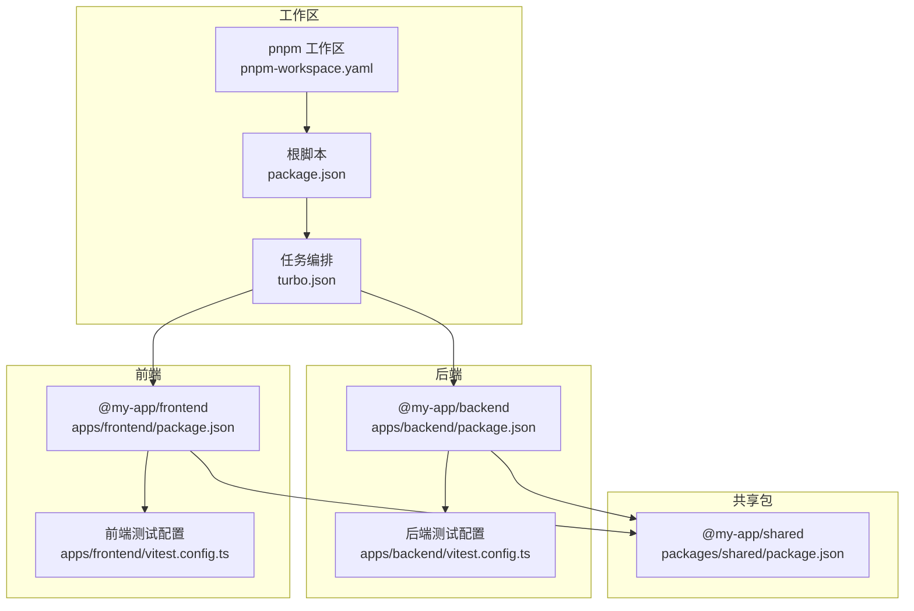
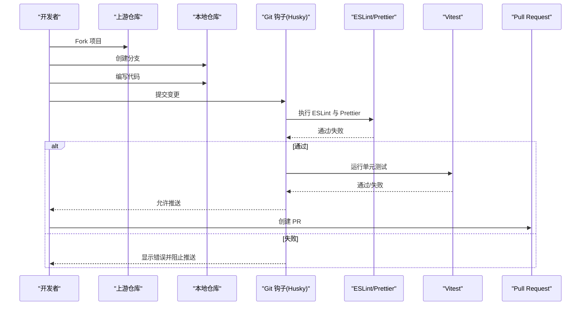
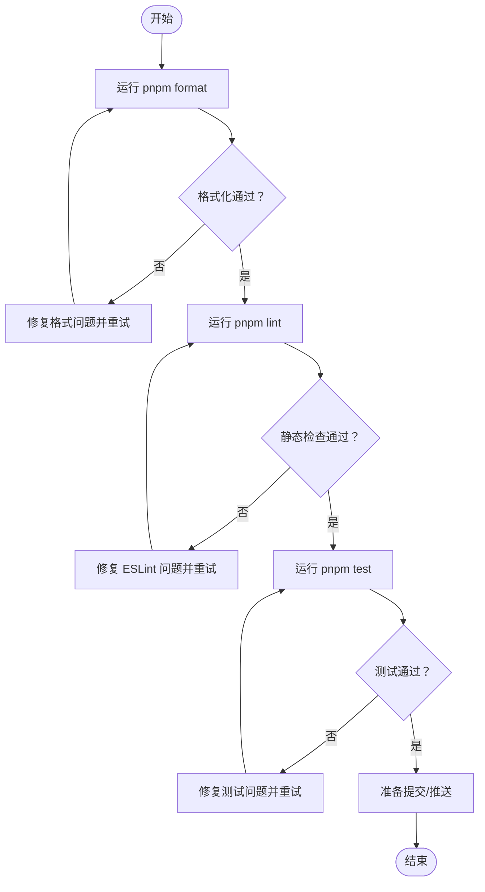
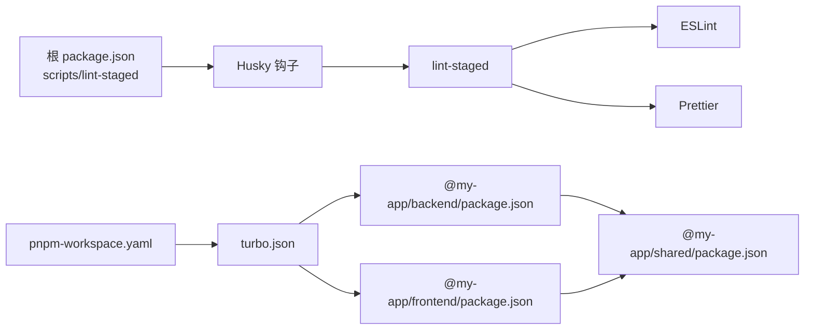

# 贡献指南

<cite>
**本文引用的文件**
- [README.md](file://README.md)
- [package.json](file://package.json)
- [eslint.config.mjs](file://eslint.config.mjs)
- [.prettierrc](file://.prettierrc)
- [turbo.json](file://turbo.json)
- [pnpm-workspace.yaml](file://pnpm-workspace.yaml)
- [apps/backend/package.json](file://apps/backend/package.json)
- [apps/frontend/package.json](file://apps/frontend/package.json)
- [apps/backend/vitest.config.ts](file://apps/backend/vitest.config.ts)
- [apps/frontend/vitest.config.ts](file://apps/frontend/vitest.config.ts)
- [packages/shared/package.json](file://packages/shared/package.json)
</cite>

## 目录
1. [简介](#简介)
2. [项目结构](#项目结构)
3. [核心组件](#核心组件)
4. [架构总览](#架构总览)
5. [详细组件分析](#详细组件分析)
6. [依赖分析](#依赖分析)
7. [性能考虑](#性能考虑)
8. [故障排查指南](#故障排查指南)
9. [结论](#结论)
10. [附录](#附录)

## 简介
本指南面向希望为本项目做出贡献的开发者，提供从 Fork 到提交 Pull Request 的完整流程说明，并明确代码规范、测试与质量检查要求，帮助你快速上手并高质量地参与协作。

## 项目结构
本项目采用 pnpm monorepo 架构，包含后端（NestJS）、前端（Vue 3）、共享包（DTO、Schema、工具函数），并通过 Turbo 进行任务编排，配合 Husky + lint-staged 实现提交前质量把关。

图表来源
- [pnpm-workspace.yaml](file://pnpm-workspace.yaml#L1-L4)
- [package.json](file://package.json#L1-L50)
- [turbo.json](file://turbo.json#L1-L24)
- [apps/backend/package.json](file://apps/backend/package.json#L1-L87)
- [apps/frontend/package.json](file://apps/frontend/package.json#L1-L80)
- [apps/backend/vitest.config.ts](file://apps/backend/vitest.config.ts#L1-L23)
- [apps/frontend/vitest.config.ts](file://apps/frontend/vitest.config.ts#L1-L20)
- [packages/shared/package.json](file://packages/shared/package.json#L1-L33)

章节来源
- [pnpm-workspace.yaml](file://pnpm-workspace.yaml#L1-L4)
- [package.json](file://package.json#L1-L50)
- [turbo.json](file://turbo.json#L1-L24)

## 核心组件
- 贡献流程：Fork -> Branch -> Commit -> Push -> PR
- 代码规范：ESLint + Prettier；提交前必须运行格式化与静态检查
- 测试：Vitest（后端、前端分别配置）
- 质量门禁：Husky + lint-staged（提交前自动执行）

章节来源
- [README.md](file://README.md#L473-L480)
- [package.json](file://package.json#L1-L50)
- [eslint.config.mjs](file://eslint.config.mjs#L1-L23)
- [.prettierrc](file://.prettierrc#L1-L12)
- [apps/backend/vitest.config.ts](file://apps/backend/vitest.config.ts#L1-L23)
- [apps/frontend/vitest.config.ts](file://apps/frontend/vitest.config.ts#L1-L20)

## 架构总览
贡献流程与质量门禁在提交阶段协同工作，确保每次变更都满足统一的代码风格与质量标准。

图表来源
- [package.json](file://package.json#L1-L50)
- [eslint.config.mjs](file://eslint.config.mjs#L1-L23)
- [.prettierrc](file://.prettierrc#L1-L12)
- [apps/backend/vitest.config.ts](file://apps/backend/vitest.config.ts#L1-L23)
- [apps/frontend/vitest.config.ts](file://apps/frontend/vitest.config.ts#L1-L20)

## 详细组件分析

### 贡献流程（Fork -> Branch -> Commit -> Push -> PR）
- Fork 项目到你的 GitHub 账户
- 在本地创建功能分支（建议使用 feature/ 前缀）
- 编写代码并遵循代码规范
- 提交前务必运行格式化与静态检查（见“代码规范”）
- 将分支推送到你的 Fork
- 在上游仓库创建 Pull Request，等待审查与合并

章节来源
- [README.md](file://README.md#L473-L480)

### 代码规范与质量门禁
- 统一使用 ESLint 与 Prettier
- 根配置位于根目录，前后端继承该配置
- 提交前自动执行 lint-staged + Husky，确保一致性
- 格式化与静态检查命令：
  - pnpm format（格式化）
  - pnpm format:check（格式检查）
  - pnpm lint（静态检查）
  - pnpm lint:fix（自动修复）

图表来源
- [package.json](file://package.json#L1-L50)
- [eslint.config.mjs](file://eslint.config.mjs#L1-L23)
- [.prettierrc](file://.prettierrc#L1-L12)
- [apps/backend/vitest.config.ts](file://apps/backend/vitest.config.ts#L1-L23)
- [apps/frontend/vitest.config.ts](file://apps/frontend/vitest.config.ts#L1-L20)

章节来源
- [README.md](file://README.md#L429-L435)
- [package.json](file://package.json#L1-L50)
- [eslint.config.mjs](file://eslint.config.mjs#L1-L23)
- [.prettierrc](file://.prettierrc#L1-L12)

### 测试运行与覆盖率
- 后端测试配置：使用 Vitest，环境为 Node，覆盖 reporter 包含 text/json/html
- 前端测试配置：使用 Vitest，环境为 happy-dom，覆盖 reporter 包含 text/json/html
- 常用命令：
  - pnpm test（运行测试）
  - pnpm test:watch（监听模式）
  - pnpm test:coverage（生成覆盖率报告）

章节来源
- [apps/backend/vitest.config.ts](file://apps/backend/vitest.config.ts#L1-L23)
- [apps/frontend/vitest.config.ts](file://apps/frontend/vitest.config.ts#L1-L20)
- [package.json](file://package.json#L1-L50)

### 提交信息与 PR 建议
- 提交信息建议采用简洁明了的描述，说明变更动机与影响范围
- PR 描述建议包含：
  - 问题背景或需求来源
  - 解决方案概述
  - 变更范围与风险提示
  - 测试结果与覆盖率情况
  - 是否需要特别关注的点（如破坏性变更、性能影响等）

章节来源
- [README.md](file://README.md#L473-L480)

## 依赖分析
- 工作区与任务编排
  - pnpm-workspace.yaml 声明工作区范围
  - turbo.json 定义 build/dev/lint/test 等任务依赖关系与缓存策略
- 质量工具链
  - 根 ESLint 配置统一前后端规则
  - Prettier 规则集中于 .prettierrc
  - husky + lint-staged 在提交阶段拦截并执行检查
- 项目内依赖
  - 后端与前端各自维护 scripts 与依赖，共享包通过 workspace:* 引入

图表来源
- [package.json](file://package.json#L1-L50)
- [pnpm-workspace.yaml](file://pnpm-workspace.yaml#L1-L4)
- [turbo.json](file://turbo.json#L1-L24)
- [apps/backend/package.json](file://apps/backend/package.json#L1-L87)
- [apps/frontend/package.json](file://apps/frontend/package.json#L1-L80)
- [packages/shared/package.json](file://packages/shared/package.json#L1-L33)

章节来源
- [pnpm-workspace.yaml](file://pnpm-workspace.yaml#L1-L4)
- [turbo.json](file://turbo.json#L1-L24)
- [package.json](file://package.json#L1-L50)

## 性能考虑
- 使用 Turbo 并行执行任务，减少重复构建与检查时间
- 测试覆盖率报告默认启用多种 reporter，便于定位问题与优化
- 提交前格式化与静态检查可提前发现低级问题，降低 CI 成本

章节来源
- [turbo.json](file://turbo.json#L1-L24)
- [apps/backend/vitest.config.ts](file://apps/backend/vitest.config.ts#L1-L23)
- [apps/frontend/vitest.config.ts](file://apps/frontend/vitest.config.ts#L1-L20)

## 故障排查指南
- 提交被拒绝（Husky/lint-staged）
  - 确认已安装依赖并初始化钩子：执行根脚本中的 prepare 命令
  - 重新运行 pnpm format 与 pnpm lint，修复报错后再提交
- 测试失败
  - 使用 pnpm test:watch 定位失败用例
  - 检查测试环境与覆盖率配置是否符合预期
- 共享包无法解析
  - 确认共享包的 exports 字段已正确配置，以便 Node 正常解析

章节来源
- [package.json](file://package.json#L1-L50)
- [README.md](file://README.md#L429-L435)
- [packages/shared/package.json](file://packages/shared/package.json#L1-L33)

## 结论
遵循本指南的贡献流程与质量规范，将显著提升协作效率与代码质量。请在提交前确保格式化、静态检查与测试全部通过，并在 PR 描述中清晰说明变更内容与影响。

## 附录
- 常用命令速查
  - pnpm format / pnpm format:check
  - pnpm lint / pnpm lint:fix
  - pnpm test / pnpm test:watch / pnpm test:coverage
  - pnpm dev / pnpm build
  - pnpm db:generate / pnpm db:push / pnpm db:migrate / pnpm db:studio

章节来源
- [README.md](file://README.md#L103-L149)
- [package.json](file://package.json#L1-L50)