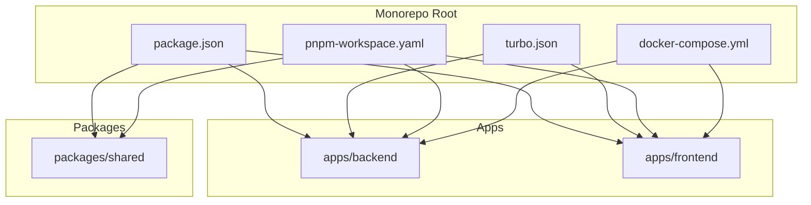
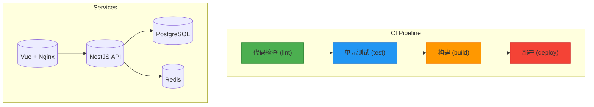
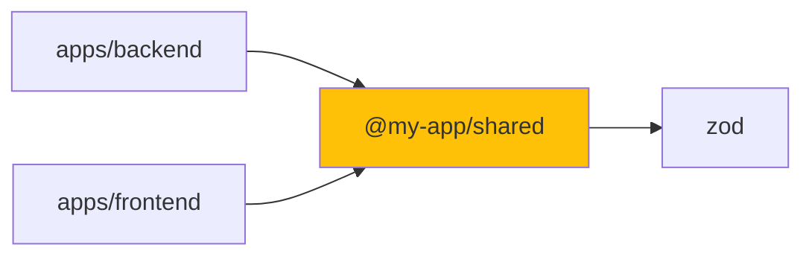
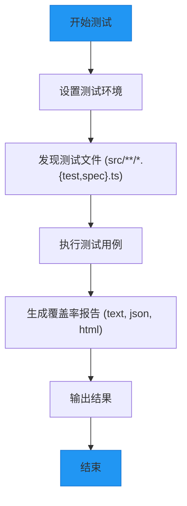
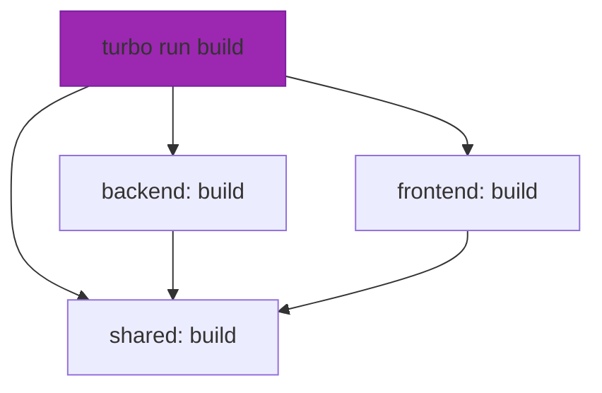

# CI/CD 流程

<cite>
**本文档中引用的文件**  
- [turbo.json](file://turbo.json)
- [package.json](file://package.json)
- [pnpm-workspace.yaml](file://pnpm-workspace.yaml)
- [apps/backend/package.json](file://apps/backend/package.json)
- [apps/frontend/package.json](file://apps/frontend/package.json)
- [packages/shared/package.json](file://packages/shared/package.json)
- [docker-compose.yml](file://docker-compose.yml)
- [apps/backend/Dockerfile](file://apps/backend/Dockerfile)
- [apps/frontend/Dockerfile](file://apps/frontend/Dockerfile)
- [apps/backend/vitest.config.ts](file://apps/backend/vitest.config.ts)
- [apps/frontend/vitest.config.ts](file://apps/frontend/vitest.config.ts)
- [tsconfig.base.json](file://tsconfig.base.json)
</cite>

## 目录
1. [简介](#简介)
2. [项目结构](#项目结构)
3. [核心组件](#核心组件)
4. [架构概览](#架构概览)
5. [详细组件分析](#详细组件分析)
6. [依赖分析](#依赖分析)
7. [性能考虑](#性能考虑)
8. [故障排除指南](#故障排除指南)
9. [结论](#结论)

## 简介
本文档旨在设计并文档化一个基于 Turbo 的高效 CI/CD 流水线，利用 pnpm workspaces 进行依赖管理，并集成前端与后端的测试策略。通过 turbo.json 中的 pipeline 配置实现增量构建和缓存，从而加速测试和部署流程。文档提供完整的 CI 脚本示例（如 GitHub Actions 或 GitLab CI），涵盖代码检查、单元测试、构建和部署阶段，并说明缓存策略、并行执行和失败回滚的最佳实践。

## 项目结构
本项目采用 monorepo 架构，使用 pnpm workspaces 管理多个子包。主要包含两个应用：NestJS 后端（`apps/backend`）和 Vue 前端（`apps/frontend`），以及一个共享库（`packages/shared`）。Turbo 用于任务编排，Docker 和 docker-compose 用于容器化部署。



**Diagram sources**  
- [package.json](file://package.json)
- [turbo.json](file://turbo.json)
- [pnpm-workspace.yaml](file://pnpm-workspace.yaml)
- [docker-compose.yml](file://docker-compose.yml)

**Section sources**  
- [package.json](file://package.json)
- [pnpm-workspace.yaml](file://pnpm-workspace.yaml)

## 核心组件
系统由三个核心部分组成：后端服务（NestJS）、前端界面（Vue）和共享类型库。Turbo 负责任务调度与缓存，pnpm workspaces 实现依赖共享与一致性。Vitest 用于前后端的单元测试，Docker 实现容器化部署。

**Section sources**  
- [turbo.json](file://turbo.json)
- [apps/backend/package.json](file://apps/backend/package.json)
- [apps/frontend/package.json](file://apps/frontend/package.json)
- [packages/shared/package.json](file://packages/shared/package.json)

## 架构概览
系统采用微服务架构，通过 Docker 容器部署 PostgreSQL、Redis、NestJS 后端和 Vue 前端。CI/CD 流水线通过 Turbo 实现任务依赖管理与缓存，确保仅重新构建受影响的部分。



**Diagram sources**  
- [turbo.json](file://turbo.json)
- [docker-compose.yml](file://docker-compose.yml)

## 详细组件分析

### Turbo 流水线配置分析
Turbo 的 `turbo.json` 文件定义了 `build`、`lint`、`test` 等任务及其依赖关系。`dependsOn: ["^build"]` 表示当前包的 `build` 任务依赖于其依赖包的 `build` 任务，实现增量构建。`outputs` 字段指定缓存输出目录，如 `dist/**` 和 `coverage/**`，提升后续执行效率。

**Section sources**  
- [turbo.json](file://turbo.json#L3-L23)

### pnpm Workspaces 依赖管理
`pnpm-workspace.yaml` 文件配置了 `apps/*` 和 `packages/*` 作为 workspace 包，允许跨包共享依赖和版本。`@my-app/shared` 包通过 `workspace:*` 引用，确保本地开发时实时同步变更，避免版本不一致问题。



**Diagram sources**  
- [pnpm-workspace.yaml](file://pnpm-workspace.yaml)
- [packages/shared/package.json](file://packages/shared/package.json)

### 测试策略与 Vitest 集成
前后端均使用 Vitest 进行单元测试。后端配置 `environment: 'node'`，前端使用 `happy-dom` 模拟 DOM 环境。`vitest.config.ts` 文件通过 `include` 和 `exclude` 精确控制测试范围，并启用覆盖率报告。



**Diagram sources**  
- [apps/backend/vitest.config.ts](file://apps/backend/vitest.config.ts#L1-L23)
- [apps/frontend/vitest.config.ts](file://apps/frontend/vitest.config.ts#L1-L20)

### CI 脚本示例（GitHub Actions）
以下为 GitHub Actions 的 CI 流水线示例，涵盖 lint、test、build 和 deploy 阶段：

```yaml
name: CI/CD Pipeline
on: [push, pull_request]
jobs:
  ci:
    runs-on: ubuntu-latest
    steps:
      - uses: actions/checkout@v4
      - uses: pnpm/action-setup@v4
      - uses: actions/setup-node@v4
        with:
          node-version: 20
          cache: pnpm

      - run: pnpm install
      - run: pnpm run lint
      - run: pnpm run test:coverage
      - run: pnpm run build

      - name: Build and Push Docker Images
        if: github.ref == 'refs/heads/main'
        run: |
          docker login -u ${{ secrets.DOCKER_USER }} -p ${{ secrets.DOCKER_PASS }}
          docker compose build
          docker compose push
```

**Section sources**  
- [package.json](file://package.json)
- [docker-compose.yml](file://docker-compose.yml)

## 依赖分析
项目依赖通过 pnpm workspaces 统一管理，Turbo 根据 `package.json` 中的依赖关系构建任务图。`^` 前缀表示跨包依赖，确保任务按拓扑顺序执行。Docker 多阶段构建进一步优化依赖安装与镜像大小。



**Diagram sources**  
- [turbo.json](file://turbo.json)
- [package.json](file://package.json)

**Section sources**  
- [turbo.json](file://turbo.json)
- [package.json](file://package.json)

## 性能考虑
- **增量构建**：Turbo 利用文件哈希和任务输出缓存，避免重复构建未变更模块。
- **并行执行**：CI 流水线可并行运行 lint、test 和 build 任务，缩短总执行时间。
- **Docker 缓存**：多阶段构建复用中间层镜像，减少 CI 中的构建耗时。
- **依赖扁平化**：pnpm 减少冗余依赖，加快安装速度。

## 故障排除指南
- **缓存失效**：清除 `.turbo` 目录或运行 `pnpm turbo clean`。
- **依赖冲突**：检查 `pnpm-lock.yaml` 是否同步，运行 `pnpm install` 重新解析。
- **Docker 构建失败**：确认 `Dockerfile` 中的 `COPY` 路径正确，且依赖已安装。
- **测试环境错误**：确保 `vitest.config.ts` 中的 `environment` 配置正确。

**Section sources**  
- [turbo.json](file://turbo.json)
- [apps/backend/Dockerfile](file://apps/backend/Dockerfile)
- [apps/frontend/Dockerfile](file://apps/frontend/Dockerfile)

## 结论
本项目通过 Turbo + pnpm workspaces 实现了高效的 monorepo CI/CD 流水线，支持增量构建、缓存复用和并行执行。结合 Docker 容器化部署，确保了开发、测试和生产环境的一致性。未来可进一步集成自动化发布、蓝绿部署和监控告警机制，提升系统可靠性。