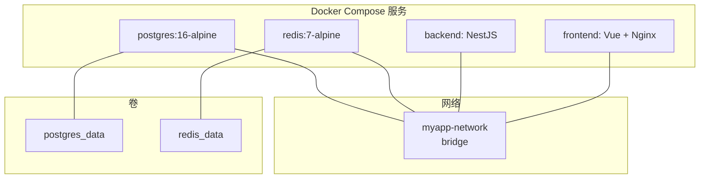
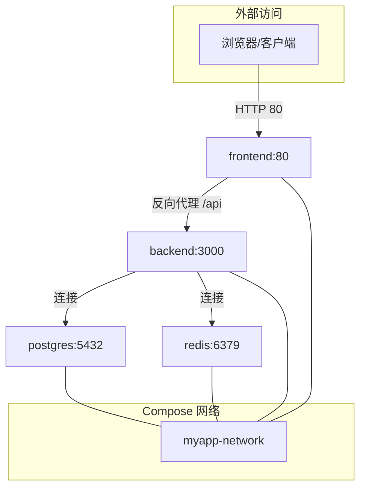
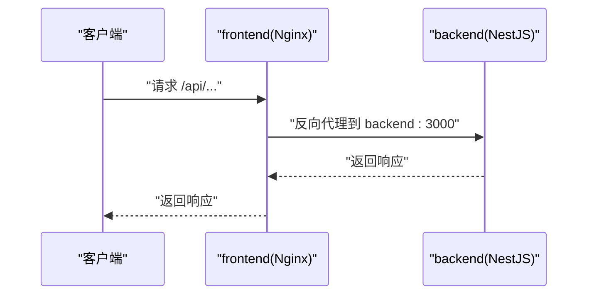
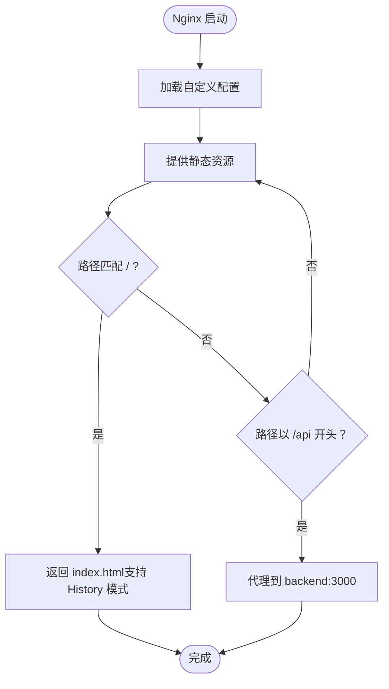
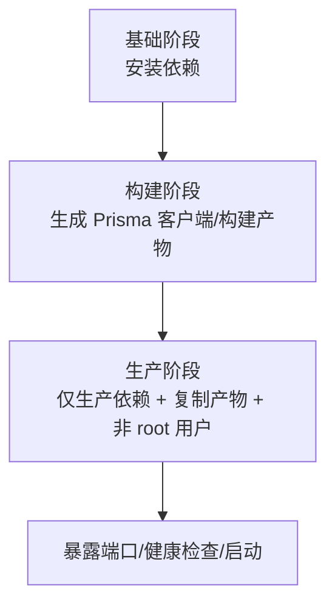
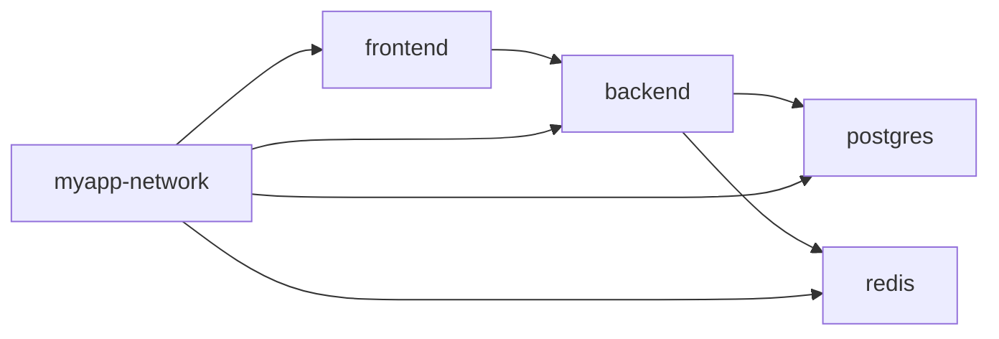
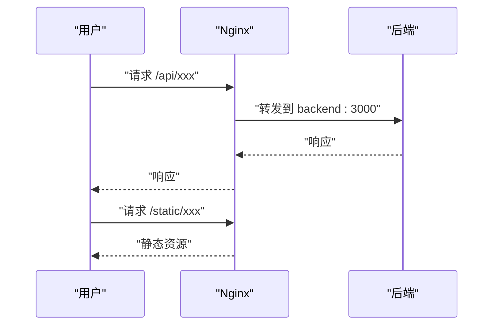

# Docker 部署

<cite>
**本文引用的文件**
- [docker-compose.yml](file://docker-compose.yml)
- [apps/backend/Dockerfile](file://apps/backend/Dockerfile)
- [apps/frontend/Dockerfile](file://apps/frontend/Dockerfile)
- [.env.docker.example](file://.env.docker.example)
- [.env.example](file://.env.example)
- [apps/frontend/nginx.conf](file://apps/frontend/nginx.conf)
- [apps/backend/src/main.ts](file://apps/backend/src/main.ts)
- [apps/backend/src/redis/redis.module.ts](file://apps/backend/src/redis/redis.module.ts)
- [apps/backend/src/mail/mail.module.ts](file://apps/backend/src/mail/mail.module.ts)
- [apps/backend/src/upload/storage.service.ts](file://apps/backend/src/upload/storage.service.ts)
- [package.json](file://package.json)
- [turbo.json](file://turbo.json)
- [pnpm-workspace.yaml](file://pnpm-workspace.yaml)
</cite>

## 更新摘要
**已做更改**
- 更新了环境变量注入语法，从 $${VAR} 统一改为 ${VAR}
- 新增 Redis、邮件、S3 存储、速率限制等环境变量的详细说明
- 补充了新环境变量在后端模块中的实际应用位置
- 更新了附录中的环境变量示例文件说明

## 目录
1. [简介](#简介)
2. [项目结构](#项目结构)
3. [核心组件](#核心组件)
4. [架构总览](#架构总览)
5. [详细组件分析](#详细组件分析)
6. [依赖分析](#依赖分析)
7. [性能考虑](#性能考虑)
8. [故障排查指南](#故障排查指南)
9. [结论](#结论)
10. [附录](#附录)

## 简介
本指南面向希望使用 docker-compose 一键启动整套应用栈（后端 NestJS、前端 Vue、PostgreSQL、Redis）的用户。文档将从部署流程、服务配置、环境变量注入、健康检查、网络与卷管理、镜像构建细节、环境覆盖文件定制、常见问题与性能优化等方面进行全面说明，并提供可操作的命令与可视化图示，帮助你在开发、预发布与生产环境中稳定运行该模板。

## 项目结构
该仓库采用 monorepo 结构，包含后端（NestJS）、前端（Vue + Nginx）以及共享包。Docker 相关配置集中在根目录的 compose 文件与各应用的 Dockerfile 中；环境变量示例位于根目录的 .env.* 文件。

图表来源
- [docker-compose.yml](file://docker-compose.yml#L1-L108)

章节来源
- [docker-compose.yml](file://docker-compose.yml#L1-L108)
- [pnpm-workspace.yaml](file://pnpm-workspace.yaml#L1-L4)

## 核心组件
- 后端（backend）
  - 运行时：Node.js 20 Alpine
  - 构建方式：多阶段构建（基础依赖安装、构建产物、生产镜像）
  - 端口：3000（容器内）
  - 健康检查：/health
  - 依赖：postgres（数据库）、redis（缓存/队列）
  - 环境变量：NODE_ENV、PORT、DATABASE_URL、REDIS_*、JWT_* 等
- 前端（frontend）
  - 运行时：Nginx Alpine
  - 构建方式：多阶段构建（基础依赖安装 -> 构建 -> 生产镜像含 Nginx）
  - 端口：80（容器内）
  - 健康检查：/health
  - 依赖：backend（反向代理到 /api）
  - Nginx 配置：Gzip、安全头、静态缓存、SPA 路由回退、/api 代理
- 数据库（postgres）
  - 版本：16-alpine
  - 端口：5432（容器内）
  - 卷：postgres_data
  - 健康检查：pg_isready
- 缓存/队列（redis）
  - 版本：7-alpine
  - 端口：6379（容器内）
  - 卷：redis_data
  - 健康检查：redis-cli ping

章节来源
- [docker-compose.yml](file://docker-compose.yml#L1-L108)
- [apps/backend/Dockerfile](file://apps/backend/Dockerfile#L1-L81)
- [apps/frontend/Dockerfile](file://apps/frontend/Dockerfile#L1-L65)
- [apps/frontend/nginx.conf](file://apps/frontend/nginx.conf#L1-L59)

## 架构总览
下图展示了容器间的依赖关系、网络与端口映射、以及健康检查策略。

图表来源
- [docker-compose.yml](file://docker-compose.yml#L1-L108)
- [apps/frontend/nginx.conf](file://apps/frontend/nginx.conf#L1-L59)

## 详细组件分析

### 后端服务（NestJS）
- 端口映射
  - 容器内：3000
  - 主机映射：3000（可在 docker-compose 中按需调整）
- 环境变量注入
  - NODE_ENV、PORT、DATABASE_URL、REDIS_HOST、REDIS_PORT、JWT_SECRET、JWT_EXPIRES_IN 等
  - DATABASE_URL 已内置指向 postgres 服务名与默认数据库名
- 健康检查
  - /health（HTTP 200）
- 依赖关系
  - 依赖 postgres 与 redis 健康后再启动
- 关键实现点
  - 应用启动设置全局前缀、CORS、Helmet、压缩、Zod 验证、Swagger 文档等
  - 端口来自环境变量（默认 3000）

图表来源
- [apps/frontend/nginx.conf](file://apps/frontend/nginx.conf#L1-L59)
- [docker-compose.yml](file://docker-compose.yml#L1-L108)

章节来源
- [docker-compose.yml](file://docker-compose.yml#L45-L77)
- [apps/backend/src/main.ts](file://apps/backend/src/main.ts#L1-L94)

### 前端服务（Vue + Nginx）
- 端口映射
  - 容器内：80
  - 主机映射：80（可在 docker-compose 中按需调整）
- 健康检查
  - /health（HTTP 200）
- 依赖关系
  - 依赖 backend 健康后再启动
- Nginx 配置要点
  - Gzip 压缩、安全头、静态资源缓存、SPA 路由回退、/api 反向代理到 backend:3000、隐藏文件拒绝访问

图表来源
- [apps/frontend/nginx.conf](file://apps/frontend/nginx.conf#L1-L59)

章节来源
- [docker-compose.yml](file://docker-compose.yml#L78-L100)
- [apps/frontend/nginx.conf](file://apps/frontend/nginx.conf#L1-L59)

### 数据库（PostgreSQL）
- 端口映射
  - 容器内：5432
  - 主机映射：5432（可在 docker-compose 中按需调整）
- 健康检查
  - pg_isready
- 卷
  - postgres_data（持久化）

章节来源
- [docker-compose.yml](file://docker-compose.yml#L1-L24)

### 缓存/队列（Redis）
- 端口映射
  - 容器内：6379
  - 主机映射：6379（可在 docker-compose 中按需调整）
- 健康检查
  - redis-cli ping
- 卷
  - redis_data（持久化）

章节来源
- [docker-compose.yml](file://docker-compose.yml#L25-L44)

### Dockerfile 多阶段构建与关键指令
- 后端 Dockerfile
  - 基础阶段：安装 pnpm、复制工作区配置与包清单、安装依赖
  - 构建阶段：复制源码、生成 Prisma 客户端、构建共享包与后端
  - 生产阶段：仅安装生产依赖、复制 Prisma schema 与构建产物、切换非 root 用户、暴露端口、健康检查、启动命令
- 前端 Dockerfile
  - 基础阶段：安装 pnpm、复制工作区配置与包清单、安装依赖
  - 构建阶段：复制源码、构建共享包与前端
  - 生产阶段：基于 nginx:alpine、移除默认配置、复制自定义 nginx.conf、复制静态构建产物、切换非 root 用户、暴露端口、健康检查、启动 nginx

图表来源
- [apps/backend/Dockerfile](file://apps/backend/Dockerfile#L1-L81)
- [apps/frontend/Dockerfile](file://apps/frontend/Dockerfile#L1-L65)

章节来源
- [apps/backend/Dockerfile](file://apps/backend/Dockerfile#L1-L81)
- [apps/frontend/Dockerfile](file://apps/frontend/Dockerfile#L1-L65)

## 依赖分析
- 服务间耦合
  - backend 依赖 postgres 与 redis（健康检查条件）
  - frontend 依赖 backend（/api 代理）
- 网络
  - 所有服务加入同一 bridge 网络，容器间可通过服务名互访
- 卷
  - postgres_data、redis_data 用于持久化

图表来源
- [docker-compose.yml](file://docker-compose.yml#L1-L108)

章节来源
- [docker-compose.yml](file://docker-compose.yml#L1-L108)

## 性能考虑
- 镜像分层缓存
  - 将变更频率低的步骤放在前面（如安装依赖、复制清单），变更频繁的步骤放在后面（如复制源码、构建）
  - 多阶段构建减少最终镜像体积
- 最小化镜像体积
  - 使用 alpine 基础镜像
  - 生产阶段仅安装生产依赖
  - 前端使用 nginx:alpine 并移除默认配置
- 静态资源优化
  - Nginx 启用 Gzip 与长缓存
  - SPA 路由回退避免 404
- 运行时安全
  - 非 root 用户运行（后端与前端）
- 健康检查
  - 通过健康检查确保服务可用性，便于编排与自动恢复

章节来源
- [apps/backend/Dockerfile](file://apps/backend/Dockerfile#L1-L81)
- [apps/frontend/Dockerfile](file://apps/frontend/Dockerfile#L1-L65)
- [apps/frontend/nginx.conf](file://apps/frontend/nginx.conf#L1-L59)

## 故障排查指南
- 容器间网络通信失败
  - 确认所有服务在同一网络（compose 默认桥接网络）
  - 使用服务名而非 localhost 进行内部通信（如 DATABASE_URL 使用 postgres 服务名）
  - 检查防火墙与安全组（如宿主机）
- 数据库初始化延迟
  - 使用 healthcheck 条件启动（backend 依赖 postgres 与 redis 健康）
  - 如需更严格的初始化顺序，可在后端启动脚本中增加重试逻辑或等待脚本
- 环境变量未生效
  - 确认 .env 或 .env.docker 已正确加载（compose 会读取 .env）
  - 在 docker-compose 中显式声明 environment 字段以覆盖默认值
  - 检查变量拼写与大小写
  - **注意**：环境变量注入语法已从 $${VAR} 更新为 ${VAR}，请确保使用新语法
- 健康检查失败
  - 查看容器日志（docker compose logs -f）
  - 确认端口映射与监听地址一致
  - 检查后端 /health 实现与 Nginx /health 实现是否正确
- CORS 与代理问题
  - 前端 /api 代理到 backend:3000，确认后端允许来源与凭证
  - 后端 CORS 配置来源于环境变量（CORS_ORIGIN），请确保其与前端访问域名一致

章节来源
- [docker-compose.yml](file://docker-compose.yml#L1-L108)
- [apps/frontend/nginx.conf](file://apps/frontend/nginx.conf#L1-L59)
- [apps/backend/src/main.ts](file://apps/backend/src/main.ts#L1-L94)

## 结论
通过 docker-compose 一键启动整套应用栈，配合多阶段 Dockerfile 与 Nginx 配置，可以在开发、预发布与生产环境中快速部署。建议在生产环境：
- 使用 .env.docker 并严格管理敏感信息
- 为数据库与 Redis 配置持久化卷
- 使用健康检查与重启策略保障可用性
- 通过 Nginx 提升静态资源性能与安全性

## 附录

### 一键部署命令
- 构建镜像
  - docker compose build
- 启动服务
  - docker compose up -d
- 查看日志
  - docker compose logs -f
- 停止与清理
  - docker compose down
  - docker compose down -v --rmi local（清理卷与本地镜像）

章节来源
- [package.json](file://package.json#L1-L51)

### 环境变量与覆盖文件
- **新环境变量说明**：
  - **Redis 配置**：REDIS_PASSWORD、REDIS_DB、REDIS_KEY_PREFIX、REDIS_DEFAULT_TTL
  - **邮件配置**：MAIL_HOST、MAIL_PORT、MAIL_SECURE、MAIL_USER、MAIL_PASSWORD、MAIL_FROM
  - **S3 存储配置**：S3_BUCKET、S3_REGION、S3_ENDPOINT、S3_ACCESS_KEY_ID、S3_SECRET_ACCESS_KEY
  - **速率限制配置**：THROTTLE_SHORT_TTL、THROTTLE_SHORT_LIMIT、THROTTLE_MEDIUM_TTL、THROTTLE_MEDIUM_LIMIT、THROTTLE_LONG_TTL、THROTTLE_LONG_LIMIT
  - **文件上传限制**：UPLOAD_MAX_SIZE、UPLOAD_MAX_FILES
- .env.docker.example
  - 包含 NODE_ENV、POSTGRES_*、JWT_* 等关键变量示例
- .env.example
  - 包含开发环境常用变量（如 DATABASE_URL、REDIS_*、JWT_*、CORS_ORIGIN 等）
- 在 docker-compose 中，environment 字段会覆盖 .env 中的同名变量
- 建议在不同环境使用不同的 .env 文件或通过 CI/CD 注入环境变量

章节来源
- [.env.docker.example](file://.env.docker.example#L1-L72)
- [.env.example](file://.env.example#L1-L51)
- [docker-compose.yml](file://docker-compose.yml#L1-L108)
- [apps/backend/src/redis/redis.module.ts](file://apps/backend/src/redis/redis.module.ts#L1-L84)
- [apps/backend/src/mail/mail.module.ts](file://apps/backend/src/mail/mail.module.ts#L1-L34)
- [apps/backend/src/upload/storage.service.ts](file://apps/backend/src/upload/storage.service.ts#L1-L124)

### 端口与健康检查对照表
- 后端（backend）
  - 端口：3000（容器内）
  - 健康检查：/health
- 前端（frontend）
  - 端口：80（容器内）
  - 健康检查：/health
- 数据库（postgres）
  - 端口：5432（容器内）
  - 健康检查：pg_isready
- 缓存/队列（redis）
  - 端口：6379（容器内）
  - 健康检查：redis-cli ping

章节来源
- [docker-compose.yml](file://docker-compose.yml#L1-L108)
- [apps/frontend/nginx.conf](file://apps/frontend/nginx.conf#L1-L59)

### 服务启动顺序与依赖
- 后端依赖 postgres 与 redis 健康
- 前端依赖后端健康
- 建议在生产中增加数据库迁移与初始化脚本（可在后端启动前执行）

章节来源
- [docker-compose.yml](file://docker-compose.yml#L45-L100)

### Nginx 与后端交互流程

图表来源
- [apps/frontend/nginx.conf](file://apps/frontend/nginx.conf#L1-L59)
- [docker-compose.yml](file://docker-compose.yml#L78-L100)