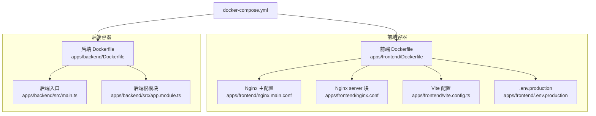
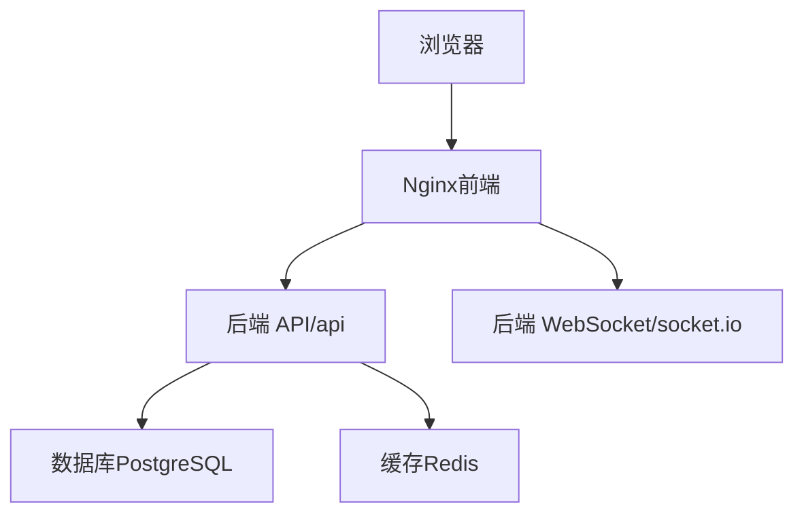
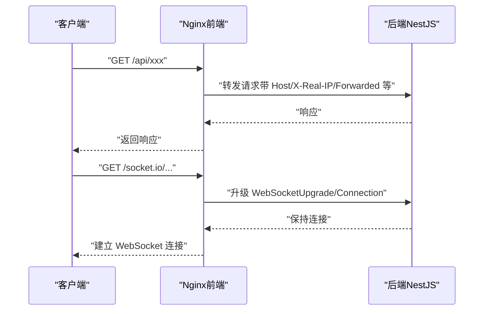

# 前端 Nginx 非 root 用户与只读文件系统配置

<cite>
**本文引用的文件**
- [apps/frontend/nginx.main.conf](file://apps/frontend/nginx.main.conf)
- [apps/frontend/nginx.conf](file://apps/frontend/nginx.conf)
- [apps/frontend/Dockerfile](file://apps/frontend/Dockerfile)
- [apps/frontend/vite.config.ts](file://apps/frontend/vite.config.ts)
- [apps/frontend/.env.production](file://apps/frontend/.env.production)
- [docker-compose.yml](file://docker-compose.yml)
- [apps/backend/Dockerfile](file://apps/backend/Dockerfile)
- [apps/backend/src/main.ts](file://apps/backend/src/main.ts)
- [apps/backend/src/app.module.ts](file://apps/backend/src/app.module.ts)
</cite>

## 目录
1. [简介](#简介)
2. [项目结构](#项目结构)
3. [核心组件](#核心组件)
4. [架构总览](#架构总览)
5. [组件详解](#组件详解)
6. [依赖关系分析](#依赖关系分析)
7. [性能考量](#性能考量)
8. [故障排查指南](#故障排查指南)
9. [结论](#结论)
10. [附录](#附录)

## 简介
本文件聚焦于前端容器中 Nginx 的“非 root 用户”与“只读文件系统”安全加固配置，结合仓库中的 Dockerfile、Nginx 主配置与派生配置、以及 docker-compose 中的安全选项，系统性说明如何在不牺牲功能性的前提下实现：
- Nginx 在非 root 用户下运行
- Nginx 在只读文件系统下稳定工作
- 通过临时目录迁移与权限控制，适配只读根文件系统
- 通过健康检查与最小化权限，提升容器安全性

## 项目结构
前端 Nginx 相关的关键文件组织如下：
- Nginx 主配置：apps/frontend/nginx.main.conf（适配非 root 用户与只读文件系统）
- Nginx server 块配置：apps/frontend/nginx.conf（路由、代理、安全头、缓存策略）
- 前端构建与发布镜像：apps/frontend/Dockerfile（多阶段构建、非 root 用户、只读文件系统）
- 前端开发与生产配置：apps/frontend/vite.config.ts、apps/frontend/.env.production
- 容器编排与安全选项：docker-compose.yml（只读根文件系统、tmpfs、健康检查）
- 后端容器镜像与安全选项：apps/backend/Dockerfile（非 root 用户）

图表来源
- [apps/frontend/nginx.main.conf](file://apps/frontend/nginx.main.conf#L1-L39)
- [apps/frontend/nginx.conf](file://apps/frontend/nginx.conf#L1-L145)
- [apps/frontend/Dockerfile](file://apps/frontend/Dockerfile#L1-L84)
- [apps/frontend/vite.config.ts](file://apps/frontend/vite.config.ts#L1-L133)
- [apps/frontend/.env.production](file://apps/frontend/.env.production#L1-L3)
- [apps/backend/Dockerfile](file://apps/backend/Dockerfile#L1-L97)
- [apps/backend/src/main.ts](file://apps/backend/src/main.ts#L1-L94)
- [apps/backend/src/app.module.ts](file://apps/backend/src/app.module.ts#L1-L159)
- [docker-compose.yml](file://docker-compose.yml#L1-L189)

章节来源
- [apps/frontend/nginx.main.conf](file://apps/frontend/nginx.main.conf#L1-L39)
- [apps/frontend/nginx.conf](file://apps/frontend/nginx.conf#L1-L145)
- [apps/frontend/Dockerfile](file://apps/frontend/Dockerfile#L1-L84)
- [apps/frontend/vite.config.ts](file://apps/frontend/vite.config.ts#L1-L133)
- [apps/frontend/.env.production](file://apps/frontend/.env.production#L1-L3)
- [docker-compose.yml](file://docker-compose.yml#L1-L189)
- [apps/backend/Dockerfile](file://apps/backend/Dockerfile#L1-L97)
- [apps/backend/src/main.ts](file://apps/backend/src/main.ts#L1-L94)
- [apps/backend/src/app.module.ts](file://apps/backend/src/app.module.ts#L1-L159)

## 核心组件
- Nginx 主配置（适配非 root 用户与只读文件系统）
  - 关键点：不使用 user 指令；pid 放在 /tmp；临时路径迁移到 /tmp；访问/错误日志路径可写
  - 参考路径：[apps/frontend/nginx.main.conf](file://apps/frontend/nginx.main.conf#L1-L39)
- Nginx server 块配置（路由、代理、安全头、缓存）
  - 关键点：Vue Router history 模式支持；/api 代理至后端；WebSocket 支持；静态资源长期缓存；隐藏文件与敏感文件禁止访问
  - 参考路径：[apps/frontend/nginx.conf](file://apps/frontend/nginx.conf#L1-L145)
- 前端 Dockerfile（非 root 用户、只读文件系统、健康检查）
  - 关键点：移除默认 Nginx 配置与 IPv6 初始化脚本；复制主配置与 server 块；构建产物复制到 /usr/share/nginx/html；创建非 root 用户并设置权限；切换到非 root 用户；暴露 80 端口；健康检查；以 daemon off 启动
  - 参考路径：[apps/frontend/Dockerfile](file://apps/frontend/Dockerfile#L1-L84)
- docker-compose.yml（只读根文件系统、tmpfs、健康检查）
  - 关键点：frontend 服务启用 read_only: true，并挂载 /var/run、/var/cache/nginx、/tmp 为 tmpfs；后端服务启用 no-new-privileges；前后端健康检查
  - 参考路径：[docker-compose.yml](file://docker-compose.yml#L1-L189)
- 后端 Dockerfile（非 root 用户）
  - 关键点：创建非 root 用户并切换；设置工作目录与权限；生产环境启动命令
  - 参考路径：[apps/backend/Dockerfile](file://apps/backend/Dockerfile#L1-L97)

章节来源
- [apps/frontend/nginx.main.conf](file://apps/frontend/nginx.main.conf#L1-L39)
- [apps/frontend/nginx.conf](file://apps/frontend/nginx.conf#L1-L145)
- [apps/frontend/Dockerfile](file://apps/frontend/Dockerfile#L1-L84)
- [docker-compose.yml](file://docker-compose.yml#L1-L189)
- [apps/backend/Dockerfile](file://apps/backend/Dockerfile#L1-L97)

## 架构总览
前端 Nginx 作为反向代理与静态资源服务器，提供 Vue 应用的静态分发、API 代理与 WebSocket 代理；后端 NestJS 提供业务接口与文档。两者通过 docker-compose 在同一网络中通信，前端容器以只读文件系统运行，仅通过 tmpfs 挂载必要的可写目录。

图表来源
- [apps/frontend/nginx.conf](file://apps/frontend/nginx.conf#L90-L122)
- [apps/backend/src/main.ts](file://apps/backend/src/main.ts#L1-L94)
- [docker-compose.yml](file://docker-compose.yml#L1-L189)

## 组件详解

### Nginx 主配置（非 root 用户与只读文件系统）
- 不使用 user 指令，避免非 root 用户无法切换用户导致的启动失败
- pid 文件放置在 /tmp（可写目录）
- 所有临时路径（client_body_temp_path、proxy_temp_path、fastcgi_temp_path、uwsgi_temp_path、scgi_temp_path）迁移到 /tmp，适配只读文件系统
- 访问/错误日志路径可写，确保日志正常输出
- include conf.d 下的 server 块配置

参考路径
- [apps/frontend/nginx.main.conf](file://apps/frontend/nginx.main.conf#L1-L39)

章节来源
- [apps/frontend/nginx.main.conf](file://apps/frontend/nginx.main.conf#L1-L39)

### Nginx server 块配置（路由、代理、安全头、缓存）
- 性能优化：gzip、sendfile、tcp_nopush/tcp_nodelay、open_file_cache
- 安全头：X-Frame-Options、X-Content-Type-Options、X-XSS-Protection、Referrer-Policy、Content-Security-Policy、Permissions-Policy、隐藏版本号
- 路由：
  - /health 健康检查端点
  - Vue Router history 模式：try_files $uri $uri/ /index.html
  - /api 代理到后端 3000 端口，传递 Host、X-Real-IP、X-Forwarded-For、X-Forwarded-Proto 等头部
  - /socket.io WebSocket 升级代理，长连接超时设置
  - 静态资源长期缓存（js/css/png/jpg/gif/ico/svg/woff/woff2/ttf/eot/webp/avif 等）
  - 禁止访问隐藏文件与敏感文件（.env、.git、.htaccess、.htpasswd、.ini、.log、.sh、.sql、.conf 等）

参考路径
- [apps/frontend/nginx.conf](file://apps/frontend/nginx.conf#L1-L145)

章节来源
- [apps/frontend/nginx.conf](file://apps/frontend/nginx.conf#L1-L145)

### 前端 Dockerfile（非 root 用户与只读文件系统）
- 多阶段构建：基础镜像、构建阶段、生产镜像
- 移除默认 Nginx 配置与 IPv6 初始化脚本，避免只读文件系统报错
- 复制自定义主配置与 server 块配置
- 复制构建产物到 /usr/share/nginx/html
- 创建非 root 用户并设置权限：
  - 设置 /usr/share/nginx/html、/var/cache/nginx、/var/log/nginx、/var/run/nginx.pid 的属主属组
  - 清理缓存以减小镜像体积
- 切换到非 root 用户
- 暴露 80 端口
- 健康检查：访问 /health
- 以 daemon off 启动 Nginx

参考路径
- [apps/frontend/Dockerfile](file://apps/frontend/Dockerfile#L1-L84)

章节来源
- [apps/frontend/Dockerfile](file://apps/frontend/Dockerfile#L1-L84)

### docker-compose.yml（只读根文件系统与安全选项）
- 前端服务：
  - read_only: true（根文件系统只读）
  - tmpfs 挂载：/var/run、/var/cache/nginx、/tmp（满足 Nginx 运行期写需求）
  - 健康检查：访问 http://localhost:80/health
- 后端服务：
  - security_opt: no-new-privileges:true
  - 健康检查：访问 http://localhost:3000/api/health
- 网络与资源限制：桥接网络、内存限制

参考路径
- [docker-compose.yml](file://docker-compose.yml#L1-L189)

章节来源
- [docker-compose.yml](file://docker-compose.yml#L1-L189)

### 后端 Dockerfile（非 root 用户）
- 创建非 root 用户并切换
- 设置工作目录与权限
- 生产环境启动命令

参考路径
- [apps/backend/Dockerfile](file://apps/backend/Dockerfile#L1-L97)

章节来源
- [apps/backend/Dockerfile](file://apps/backend/Dockerfile#L1-L97)

### 前端构建与 API 基础地址
- Vite 配置：
  - 根据环境与构建目标设置 base 路径（相对路径、生产路径等）
  - 开发服务器代理 /api 到 http://localhost:3000
- 生产环境 API 基础地址：
  - 通过 .env.production 设置 VITE_API_BASE_URL，用于生产打包时的 API 域名

参考路径
- [apps/frontend/vite.config.ts](file://apps/frontend/vite.config.ts#L1-L133)
- [apps/frontend/.env.production](file://apps/frontend/.env.production#L1-L3)

章节来源
- [apps/frontend/vite.config.ts](file://apps/frontend/vite.config.ts#L1-L133)
- [apps/frontend/.env.production](file://apps/frontend/.env.production#L1-L3)

## 依赖关系分析
- 前端 Nginx 依赖后端 API 与 WebSocket 服务，通过 /api 与 /socket.io 代理转发
- 前端容器通过 docker-compose 在同一网络中通信，后端服务健康检查依赖前端健康检查
- 前端容器启用只读根文件系统，仅通过 tmpfs 挂载必要目录，确保 Nginx 运行期写需求（pid、临时文件、日志）得到满足
- 后端容器同样采用非 root 用户运行，提升安全性

图表来源
- [apps/frontend/nginx.conf](file://apps/frontend/nginx.conf#L90-L122)
- [apps/backend/src/main.ts](file://apps/backend/src/main.ts#L1-L94)

章节来源
- [apps/frontend/nginx.conf](file://apps/frontend/nginx.conf#L90-L122)
- [apps/backend/src/main.ts](file://apps/backend/src/main.ts#L1-L94)

## 性能考量
- Nginx 层面：
  - gzip 压缩、sendfile、keepalive、open_file_cache 等参数提升静态资源与缓存命中率
  - 静态资源长期缓存（1 年）减少带宽与服务器压力
- 前端构建层面：
  - Vite 的开发代理与生产 base 路径配置，确保开发与生产环境一致的 API 访问方式
- 后端层面：
  - 压缩中间件、Helmet 安全头、速率限制等在后端保障传输效率与安全

章节来源
- [apps/frontend/nginx.conf](file://apps/frontend/nginx.conf#L1-L145)
- [apps/frontend/vite.config.ts](file://apps/frontend/vite.config.ts#L1-L133)
- [apps/backend/src/main.ts](file://apps/backend/src/main.ts#L1-L94)

## 故障排查指南
- 健康检查失败
  - 前端：确认 /health 端点可用，检查 Nginx 是否以 daemon off 启动，确认 HEALTHCHECK 命令可访问
    - 参考路径：[apps/frontend/Dockerfile](file://apps/frontend/Dockerfile#L79-L84)
    - 参考路径：[apps/frontend/nginx.conf](file://apps/frontend/nginx.conf#L71-L76)
  - 后端：确认 /api/health 可访问，检查 CORS 配置是否允许前端域名
    - 参考路径：[apps/backend/src/main.ts](file://apps/backend/src/main.ts#L58-L63)
    - 参考路径：[docker-compose.yml](file://docker-compose.yml#L76-L90)
- 404 或路由问题（Vue Router history 模式）
  - 确认 try_files $uri $uri/ /index.html 生效
    - 参考路径：[apps/frontend/nginx.conf](file://apps/frontend/nginx.conf#L78-L88)
- 代理失败或 WebSocket 断连
  - 确认 /api 与 /socket.io 代理配置正确，Host、X-Real-IP、X-Forwarded-* 等头部传递
    - 参考路径：[apps/frontend/nginx.conf](file://apps/frontend/nginx.conf#L90-L122)
- 只读文件系统相关错误
  - 确认 /tmp、/var/run、/var/cache/nginx 已通过 tmpfs 挂载
    - 参考路径：[docker-compose.yml](file://docker-compose.yml#L176-L181)
  - 确认 Nginx 主配置中的临时路径迁移到 /tmp
    - 参考路径：[apps/frontend/nginx.main.conf](file://apps/frontend/nginx.main.conf#L28-L36)
- 权限问题
  - 确认 /usr/share/nginx/html、/var/cache/nginx、/var/log/nginx、/var/run/nginx.pid 的属主属组为非 root 用户
    - 参考路径：[apps/frontend/Dockerfile](file://apps/frontend/Dockerfile#L57-L71)

章节来源
- [apps/frontend/Dockerfile](file://apps/frontend/Dockerfile#L57-L84)
- [apps/frontend/nginx.conf](file://apps/frontend/nginx.conf#L71-L122)
- [apps/frontend/nginx.main.conf](file://apps/frontend/nginx.main.conf#L28-L36)
- [docker-compose.yml](file://docker-compose.yml#L176-L181)
- [apps/backend/src/main.ts](file://apps/backend/src/main.ts#L58-L63)

## 结论
该配置通过以下手段实现了前端 Nginx 的“非 root 用户 + 只读文件系统”安全加固：
- Nginx 主配置规避非 root 用户切换问题，将 pid 与临时路径迁移到 /tmp
- docker-compose 将关键目录挂载为 tmpfs，满足运行期写需求
- 前端 Dockerfile 明确创建非 root 用户并设置权限，最终以非 root 用户运行
- 通过 /api 与 /socket.io 代理，实现与后端的稳定通信
- 健康检查与最小化权限进一步提升了可观测性与安全性

## 附录
- 前端 API 基础地址建议在生产环境通过 .env.production 设置，确保打包后的静态资源能正确访问后端接口
  - 参考路径：[apps/frontend/.env.production](file://apps/frontend/.env.production#L1-L3)
- 后端 CORS 允许前端域名，确保代理与认证流程正常
  - 参考路径：[apps/backend/src/main.ts](file://apps/backend/src/main.ts#L58-L63)