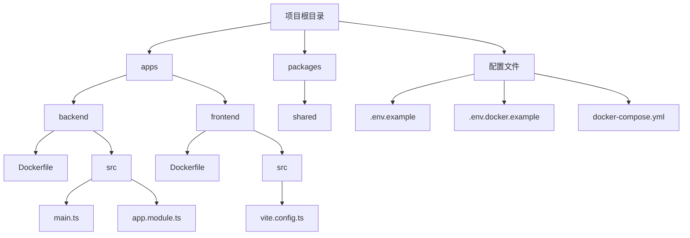
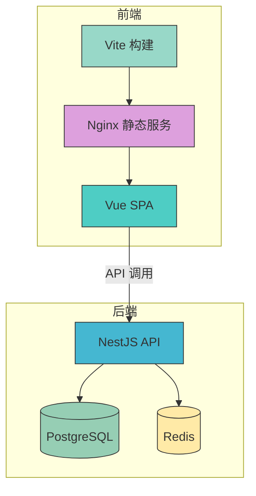
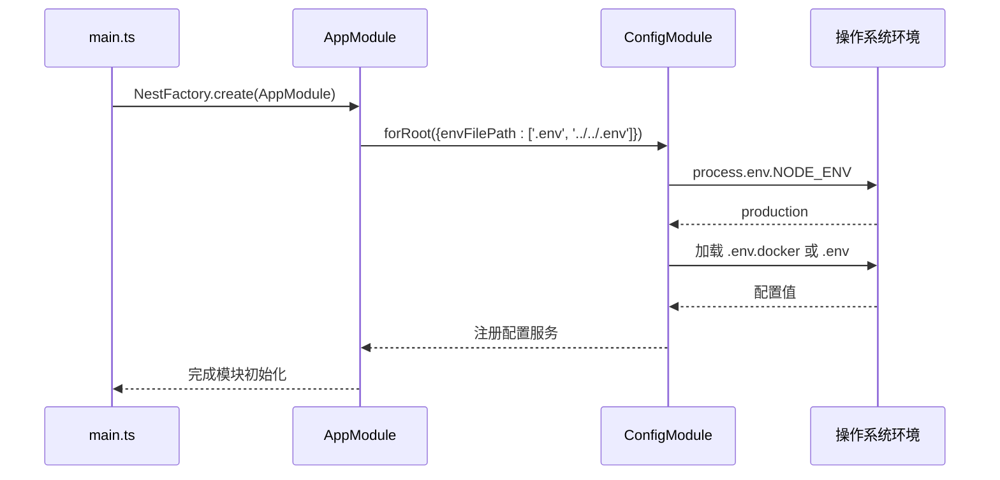
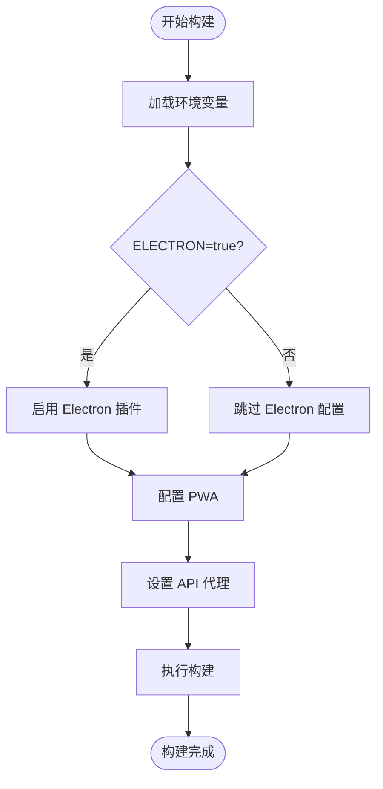
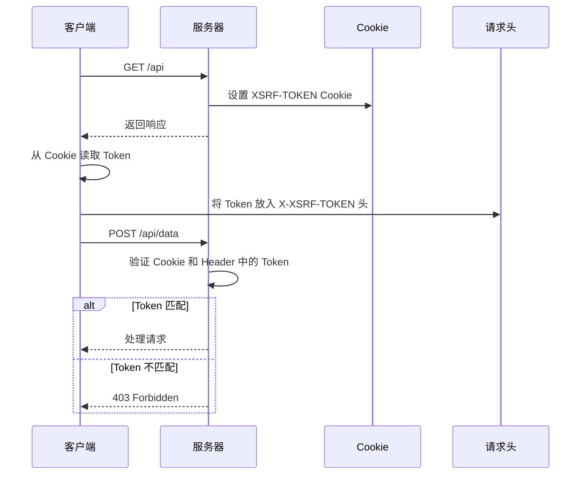
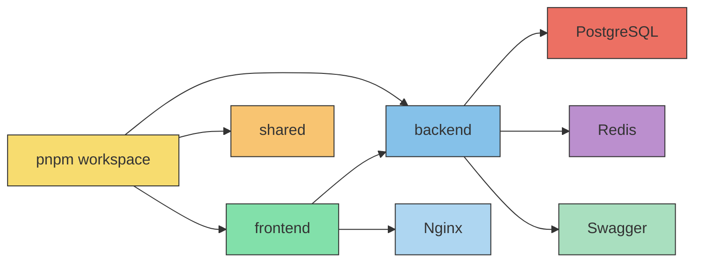

# 生产环境配置

<cite>
**本文档中引用的文件**  
- [.env.example](file://.env.example)
- [.env.docker.example](file://.env.docker.example)
- [apps/backend/src/main.ts](file://apps/backend/src/main.ts)
- [apps/backend/src/app.module.ts](file://apps/backend/src/app.module.ts)
- [apps/frontend/vite.config.ts](file://apps/frontend/vite.config.ts)
- [docker-compose.yml](file://docker-compose.yml)
- [apps/backend/src/auth/auth.service.ts](file://apps/backend/src/auth/auth.service.ts)
- [apps/backend/src/common/filters/all-exceptions.filter.ts](file://apps/backend/src/common/filters/all-exceptions.filter.ts)
- [apps/backend/src/common/interceptors/sanitize.interceptor.ts](file://apps/backend/src/common/interceptors/sanitize.interceptor.ts)
- [apps/backend/src/common/middlewares/csrf.middleware.ts](file://apps/backend/src/common/middlewares/csrf.middleware.ts)
- [apps/frontend/Dockerfile](file://apps/frontend/Dockerfile)
</cite>

## 目录
1. [简介](#简介)
2. [项目结构](#项目结构)
3. [核心组件](#核心组件)
4. [架构概述](#架构概述)
5. [详细组件分析](#详细组件分析)
6. [依赖分析](#依赖分析)
7. [性能考虑](#性能考虑)
8. [故障排除指南](#故障排除指南)
9. [结论](#结论)

## 简介
本项目是一个基于 NestJS 和 Vue 的全栈模板，支持多环境部署、Docker 容器化和微服务架构。本文档深入讲解其生产环境的配置策略，涵盖环境变量管理、敏感信息保护、配置验证机制、前后端配置加载方式以及多环境分离方案。

## 项目结构
该项目采用 Monorepo 结构，包含后端（NestJS）、前端（Vue）和共享库三个主要部分。通过 pnpm workspace 实现依赖统一管理和跨包引用。配置文件集中管理，支持开发、测试和生产环境的差异化配置。

**Diagram sources**
- [.env.example](file://.env.example)
- [.env.docker.example](file://.env.docker.example)
- [docker-compose.yml](file://docker-compose.yml)

**Section sources**
- [.env.example](file://.env.example)
- [.env.docker.example](file://.env.docker.example)
- [docker-compose.yml](file://docker-compose.yml)

## 核心组件
系统核心由 NestJS 后端服务和 Vue 前端应用组成，通过 REST API 和 WebSocket 进行通信。后端使用 Prisma 作为 ORM，Redis 用于缓存和队列，PostgreSQL 作为主数据库。前端通过 Vite 构建，支持 PWA 和 Electron 桌面应用。

**Section sources**
- [apps/backend/src/main.ts](file://apps/backend/src/main.ts)
- [apps/frontend/vite.config.ts](file://apps/frontend/vite.config.ts)

## 架构概述
系统采用前后端分离架构，通过 Nginx 反向代理实现统一入口。后端服务通过 Docker 容器部署，使用 docker-compose 管理多个服务实例。配置通过环境变量注入，敏感信息通过外部密钥管理服务保护。

**Diagram sources**
- [docker-compose.yml](file://docker-compose.yml)
- [apps/frontend/Dockerfile](file://apps/frontend/Dockerfile)

## 详细组件分析

### 后端配置模块分析
NestJS 使用 `ConfigModule` 管理应用配置，支持从 `.env` 文件和环境变量中加载配置。配置项通过依赖注入提供给各个模块，确保类型安全和可测试性。

#### 配置加载机制

**Diagram sources**
- [apps/backend/src/main.ts](file://apps/backend/src/main.ts)
- [apps/backend/src/app.module.ts](file://apps/backend/src/app.module.ts)

### 前端构建时配置注入
前端使用 Vite 的构建时变量注入机制，在编译阶段将环境变量嵌入到打包文件中。这种方式避免了运行时暴露敏感信息的风险。

#### 构建配置流程

**Diagram sources**
- [apps/frontend/vite.config.ts](file://apps/frontend/vite.config.ts)

### 安全中间件配置
系统实现了多层次的安全防护机制，包括 Helmet 安全头、CSRF 保护、速率限制和输入清理。

#### CSRF 保护机制

**Diagram sources**
- [apps/backend/src/common/middlewares/csrf.middleware.ts](file://apps/backend/src/common/middlewares/csrf.middleware.ts)

## 依赖分析
项目通过 pnpm workspace 实现依赖共享，使用 Docker 容器隔离运行环境。后端服务依赖 PostgreSQL 和 Redis，前端通过 Nginx 托管静态资源。

**Diagram sources**
- [pnpm-workspace.yaml](file://pnpm-workspace.yaml)
- [docker-compose.yml](file://docker-compose.yml)

**Section sources**
- [pnpm-workspace.yaml](file://pnpm-workspace.yaml)
- [docker-compose.yml](file://docker-compose.yml)

## 性能考虑
系统在性能方面进行了多项优化：使用 Redis 缓存频繁访问的数据，通过 BullMQ 处理异步任务，启用 Gzip 压缩减少传输体积，使用 Pino 日志库降低日志写入开销。

## 故障排除指南
常见问题包括环境变量未正确加载、数据库连接失败、Redis 服务不可用等。建议检查 `.env` 文件是否存在，确认 Docker 服务是否正常运行，并查看日志输出定位具体错误。

**Section sources**
- [apps/backend/src/common/filters/all-exceptions.filter.ts](file://apps/backend/src/common/filters/all-exceptions.filter.ts)
- [apps/backend/src/main.ts](file://apps/backend/src/main.ts)

## 结论
该模板项目提供了完整的生产环境配置方案，通过环境变量分离、Docker 容器化、配置验证和安全中间件等手段，确保了应用在生产环境中的稳定性、安全性和可维护性。建议在实际部署时使用 Secrets Manager 管理敏感信息，并建立完善的配置版本控制流程。