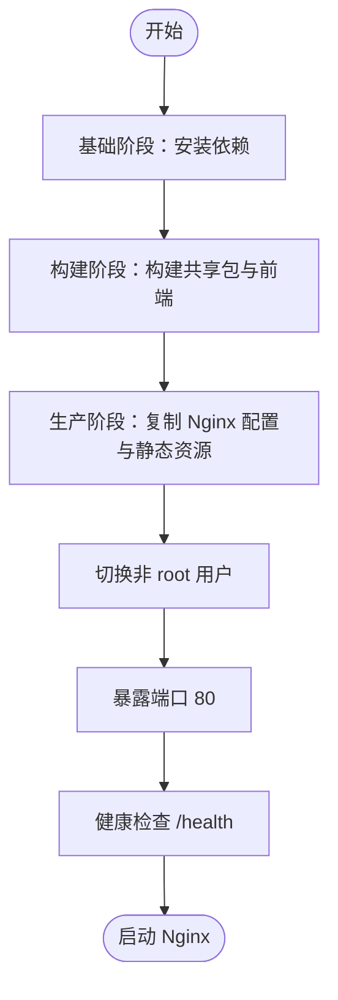

# 部署

<cite>
**本文引用的文件**
- [docker-compose.yml](file://docker-compose.yml)
- [apps/backend/Dockerfile](file://apps/backend/Dockerfile)
- [apps/frontend/Dockerfile](file://apps/frontend/Dockerfile)
- [apps/frontend/nginx.conf](file://apps/frontend/nginx.conf)
- [turbo.json](file://turbo.json)
- [.env.example](file://.env.example)
- [.env.docker.example](file://.env.docker.example)
- [package.json](file://package.json)
- [README.md](file://README.md)
- [pnpm-workspace.yaml](file://pnpm-workspace.yaml)
</cite>

## 目录
1. [简介](#简介)
2. [项目结构](#项目结构)
3. [核心组件](#核心组件)
4. [架构总览](#架构总览)
5. [详细组件分析](#详细组件分析)
6. [依赖分析](#依赖分析)
7. [性能考虑](#性能考虑)
8. [故障排查指南](#故障排查指南)
9. [结论](#结论)
10. [附录](#附录)

## 简介
本指南面向从开发到生产的完整部署流程，围绕仓库中的 docker-compose.yml、Dockerfile、Nginx 配置、Turbo 构建配置以及环境变量示例展开，帮助你一键启动后端、前端、PostgreSQL、Redis，并在生产环境安全地配置关键参数、优化构建与运行效率，同时给出 Nginx 反向代理、SSL 与监控的最佳实践建议。

## 项目结构
该仓库采用 pnpm monorepo 结构，后端与前端分别位于 apps/backend 与 apps/frontend，共享包位于 packages/shared。容器编排通过 docker-compose.yml 统一管理 PostgreSQL、Redis、后端与前端服务；前端生产镜像内置 Nginx 并使用 apps/frontend/nginx.conf 提供静态资源服务与反向代理。

图表来源
- [docker-compose.yml](file://docker-compose.yml#L1-L108)
- [apps/backend/Dockerfile](file://apps/backend/Dockerfile#L1-L81)
- [apps/frontend/Dockerfile](file://apps/frontend/Dockerfile#L1-L65)
- [apps/frontend/nginx.conf](file://apps/frontend/nginx.conf#L1-L59)

章节来源
- [pnpm-workspace.yaml](file://pnpm-workspace.yaml#L1-L4)
- [package.json](file://package.json#L1-L51)

## 核心组件
- 容器编排与网络
  - docker-compose.yml 定义了 postgres、redis、backend、frontend 四个服务，统一桥接网络 myapp-network，并为各服务配置健康检查、依赖顺序与端口映射。
- 后端镜像
  - apps/backend/Dockerfile 采用多阶段构建：基础依赖安装、共享包与后端构建、生产镜像安装仅生产依赖并生成 Prisma 客户端，最终以非 root 用户运行 Node 应用。
- 前端镜像与 Nginx
  - apps/frontend/Dockerfile 采用多阶段构建：基础依赖安装、共享包与前端构建、生产镜像使用 nginx:alpine，复制自定义 nginx.conf 与 dist 静态资源，非 root 用户运行 Nginx。
- Nginx 配置
  - apps/frontend/nginx.conf 提供 Gzip 压缩、安全头、健康检查端点、Vue Router 历史模式回退、WebSocket 反代、静态资源缓存与隐藏文件保护等。
- 构建与增量
  - turbo.json 定义 build、lint、test 等任务的依赖与输出，结合 pnpm workspace 实现跨包增量构建。
- 环境变量
  - .env.example 与 .env.docker.example 提供开发与 Docker 环境的关键变量示例，包括 DATABASE_URL、REDIS_*、JWT_*、邮件与文件存储等。

章节来源
- [docker-compose.yml](file://docker-compose.yml#L1-L108)
- [apps/backend/Dockerfile](file://apps/backend/Dockerfile#L1-L81)
- [apps/frontend/Dockerfile](file://apps/frontend/Dockerfile#L1-L65)
- [apps/frontend/nginx.conf](file://apps/frontend/nginx.conf#L1-L59)
- [.env.example](file://.env.example#L1-L53)
- [.env.docker.example](file://.env.docker.example#L1-L23)
- [turbo.json](file://turbo.json#L1-L24)

## 架构总览
下图展示生产部署时的典型流量路径：客户端请求经 Nginx（前端镜像）到达后端 API 或静态资源；后端连接 PostgreSQL 与 Redis；Nginx 提供反向代理与静态资源缓存。

图表来源
- [apps/frontend/nginx.conf](file://apps/frontend/nginx.conf#L1-L59)
- [apps/backend/Dockerfile](file://apps/backend/Dockerfile#L1-L81)
- [docker-compose.yml](file://docker-compose.yml#L1-L108)

## 详细组件分析

### Docker Compose 一键启动与服务关系
- 服务定义
  - postgres：使用官方 postgres:16-alpine，持久化数据卷，健康检查基于 pg_isready。
  - redis：使用官方 redis:7-alpine，启用 AOF，持久化数据卷，健康检查基于 redis-cli ping。
  - backend：基于 apps/backend/Dockerfile 构建，暴露 3000 端口，依赖 postgres 与 redis 健康后再启动，健康检查访问 /health。
  - frontend：基于 apps/frontend/Dockerfile 构建，暴露 80 端口，依赖 backend 健康后再启动，健康检查访问 /health。
- 网络与卷
  - 使用自定义 bridge 网络 myapp-network，便于容器间通过服务名通信。
  - postgres_data 与 redis_data 卷用于持久化数据。
- 关键环境变量
  - backend 设置 DATABASE_URL、REDIS_HOST、REDIS_PORT、JWT_SECRET、JWT_EXPIRES_IN 等，这些值在生产环境需替换为真实配置。

图表来源
- [docker-compose.yml](file://docker-compose.yml#L1-L108)

章节来源
- [docker-compose.yml](file://docker-compose.yml#L1-L108)

### 后端镜像构建与运行
- 多阶段构建
  - 基础阶段：安装 pnpm 与工作区依赖，准备 monorepo 构建环境。
  - 构建阶段：生成 Prisma 客户端，构建共享包与后端应用。
  - 生产阶段：仅安装生产依赖，复制 Prisma schema 与构建产物，生成 Prisma 客户端，切换非 root 用户，暴露 3000 端口，健康检查访问 /health，CMD 启动 Node 应用。
- 运行时安全
  - 使用非 root 用户运行，降低权限风险。
- 健康检查
  - 内置 HEALTHCHECK，便于 Compose 识别服务可用性。

图表来源
- [apps/backend/Dockerfile](file://apps/backend/Dockerfile#L1-L81)

章节来源
- [apps/backend/Dockerfile](file://apps/backend/Dockerfile#L1-L81)

### 前端镜像与 Nginx 配置
- 多阶段构建
  - 基础阶段：安装 pnpm 与工作区依赖。
  - 构建阶段：构建共享包与前端应用。
  - 生产阶段：使用 nginx:alpine，移除默认配置，复制自定义 nginx.conf 与 dist 静态资源，非 root 用户运行，暴露 80 端口，健康检查访问 /health。
- Nginx 配置要点
  - Gzip 压缩与安全头。
  - /health 健康检查返回文本。
  - Vue Router 历史模式回退至 /index.html。
  - /api 反向代理到后端 3000 端口，透传 Host、X-Real-IP、X-Forwarded-*、Connection/Upgrade 等头部，支持 WebSocket。
  - 静态资源缓存与隐藏文件保护。

图表来源
- [apps/frontend/Dockerfile](file://apps/frontend/Dockerfile#L1-L65)
- [apps/frontend/nginx.conf](file://apps/frontend/nginx.conf#L1-L59)

章节来源
- [apps/frontend/Dockerfile](file://apps/frontend/Dockerfile#L1-L65)
- [apps/frontend/nginx.conf](file://apps/frontend/nginx.conf#L1-L59)

### 环境变量与生产配置
- 开发与 Docker 环境变量
  - .env.example 提供开发场景下的 DATABASE_URL、REDIS_*、JWT_*、CORS、日志级别、邮件与文件存储等示例。
  - .env.docker.example 提供 Docker 环境下的 NODE_ENV、POSTGRES_* 与 JWT_* 示例。
- 生产环境关键变量
  - DATABASE_URL：指向生产数据库主机与凭据。
  - REDIS_HOST/REDIS_PORT/REDIS_PASSWORD/REDIS_DB/REDIS_KEY_PREFIX：根据实际 Redis 配置调整。
  - JWT_SECRET/JWT_EXPIRES_IN：JWT 密钥与过期策略，务必在生产环境随机且保密。
  - MAIL_*：SMTP 邮件配置。
  - S3_*：对象存储配置（S3/OSS/MinIO）。
  - CORS_ORIGIN：允许的前端域名或来源列表。
- Compose 中的变量注入
  - docker-compose.yml 中 backend 服务直接使用 ${VAR} 注入环境变量，需确保 .env 或外部环境提供对应值。

章节来源
- [.env.example](file://.env.example#L1-L53)
- [.env.docker.example](file://.env.docker.example#L1-L23)
- [docker-compose.yml](file://docker-compose.yml#L56-L68)

### CI/CD 与增量构建（Turbo）
- Turbo 任务定义
  - build 任务依赖上游包（^build），输出 dist/**，适合在 CI 中进行增量构建与缓存。
  - dev 任务不缓存，persistent 为 true，适合本地开发。
  - lint、test 任务依赖 build，输出 coverage/**，便于在流水线中复用缓存。
- pnpm 工作区
  - pnpm-workspace.yaml 声明 apps/* 与 packages/*，与 Turbo 配合实现跨包增量构建。
- 建议的 CI 步骤
  - 安装依赖（pnpm install）。
  - Turbo 构建（turbo run build）。
  - Turbo 测试（turbo run test）。
  - 构建镜像（docker compose build）。
  - 部署（docker compose up -d）。

图表来源
- [turbo.json](file://turbo.json#L1-L24)
- [pnpm-workspace.yaml](file://pnpm-workspace.yaml#L1-L4)
- [package.json](file://package.json#L1-L51)

章节来源
- [turbo.json](file://turbo.json#L1-L24)
- [pnpm-workspace.yaml](file://pnpm-workspace.yaml#L1-L4)
- [package.json](file://package.json#L1-L51)

## 依赖分析
- 组件耦合
  - backend 依赖 postgres 与 redis，frontend 依赖 backend 提供的 API。
  - 健康检查确保服务按序启动，避免冷启动时的连接失败。
- 外部依赖
  - PostgreSQL 与 Redis 版本固定，保证兼容性。
  - Nginx 镜像与 Node 镜像均为 alpine，体积小、启动快。
- 可能的循环依赖
  - 当前编排未发现循环依赖，服务间通过健康检查与 depends_on 顺序控制启动。

图表来源
- [apps/frontend/Dockerfile](file://apps/frontend/Dockerfile#L1-L65)
- [apps/frontend/nginx.conf](file://apps/frontend/nginx.conf#L1-L59)
- [apps/backend/Dockerfile](file://apps/backend/Dockerfile#L1-L81)
- [docker-compose.yml](file://docker-compose.yml#L1-L108)

章节来源
- [docker-compose.yml](file://docker-compose.yml#L1-L108)

## 性能考虑
- 镜像体积与启动速度
  - 使用 alpine 基础镜像，减少镜像体积与启动时间。
- 构建缓存
  - Turbo 的输出缓存（dist/**、coverage/**）与 pnpm 的锁定文件，有助于 CI 加速。
- Nginx 优化
  - 启用 Gzip 压缩与静态资源缓存，减少带宽与延迟。
- 数据与缓存
  - Redis 启用 AOF，提升持久化可靠性；合理设置 TTL 与 key 前缀，避免键冲突。
- 健康检查
  - 合理的间隔、超时与重试次数，避免误判与过度探测。

## 故障排查指南
- 健康检查失败
  - 检查 backend 与 frontend 的健康检查端点是否可达，确认 /health 返回 200。
- 数据库连接失败
  - 确认 DATABASE_URL 与网络连通性，检查 postgres 服务健康状态。
- Redis 连接失败
  - 确认 REDIS_HOST/REDIS_PORT/REDIS_PASSWORD，检查 redis 服务健康状态。
- CORS 与反向代理
  - 确认前端 Nginx 的 /api 反代配置正确，后端 CORS 允许来源匹配。
- 日志查看
  - 使用 docker compose logs -f 查看实时日志，定位异常。
- 端口占用
  - 若宿主 80/3000 端口被占用，调整映射或释放端口。

章节来源
- [docker-compose.yml](file://docker-compose.yml#L1-L108)
- [apps/frontend/nginx.conf](file://apps/frontend/nginx.conf#L1-L59)
- [apps/backend/Dockerfile](file://apps/backend/Dockerfile#L1-L81)
- [apps/frontend/Dockerfile](file://apps/frontend/Dockerfile#L1-L65)

## 结论
通过 docker-compose.yml 与两份 Dockerfile，本项目实现了后端、前端、PostgreSQL、Redis 的一体化部署；配合 Turbo 的增量构建与 Nginx 的静态资源与反代能力，可在生产环境中获得稳定、高效与可维护的交付体验。生产部署时务必重视环境变量的安全配置与网络隔离，并结合监控与日志体系持续优化。

## 附录

### 从开发到生产的完整部署步骤
- 准备环境变量
  - 复制 .env.docker.example 为 .env.docker（或在外部环境注入），填写 DATABASE_URL、REDIS_*、JWT_SECRET 等。
- 启动数据库与缓存
  - 使用 docker compose 启动 postgres 与 redis，等待健康检查通过。
- 初始化数据库
  - 在本地执行数据库初始化命令（如 db:push、db:generate），确保 Prisma 客户端与 Schema 就绪。
- 构建与运行
  - docker compose build 构建镜像，docker compose up -d 启动全部服务。
- 验证
  - 访问 /health 检查健康状态，访问前端页面与后端 API 端点验证功能。
- 停止与清理
  - docker compose down 停止服务，docker compose down -v --rmi local 清理卷与本地镜像。

章节来源
- [README.md](file://README.md#L379-L427)
- [package.json](file://package.json#L22-L26)
- [docker-compose.yml](file://docker-compose.yml#L1-L108)

### 生产环境关键环境变量清单
- 数据库
  - DATABASE_URL：生产数据库连接字符串。
- 缓存与队列
  - REDIS_HOST、REDIS_PORT、REDIS_PASSWORD、REDIS_DB、REDIS_KEY_PREFIX。
- 后端
  - PORT、NODE_ENV、JWT_SECRET、JWT_EXPIRES_IN、CORS_ORIGIN。
- 邮件与文件存储
  - MAIL_HOST、MAIL_PORT、MAIL_USER、MAIL_PASSWORD、S3_BUCKET、S3_REGION、S3_ACCESS_KEY_ID、S3_SECRET_ACCESS_KEY。
- 其他
  - LOG_LEVEL、UPLOAD_MAX_SIZE、UPLOAD_MAX_FILES。

章节来源
- [.env.example](file://.env.example#L1-L53)
- [.env.docker.example](file://.env.docker.example#L1-L23)
- [docker-compose.yml](file://docker-compose.yml#L56-L68)

### CI/CD 流程建议
- 触发条件
  - push 到主分支或打标签。
- 步骤
  - 安装依赖（pnpm install）。
  - Turbo 构建（turbo run build）。
  - Turbo 测试（turbo run test）。
  - 构建镜像（docker compose build）。
  - 部署（docker compose up -d）。
  - 发送通知（可选）。
- 缓存
  - 缓存 pnpm-store、dist、coverage 等目录，加速后续流水线。

章节来源
- [turbo.json](file://turbo.json#L1-L24)
- [package.json](file://package.json#L1-L51)

### Nginx 反向代理、SSL 与监控最佳实践
- 反向代理
  - 使用 apps/frontend/nginx.conf 的 /api 反代到后端 3000 端口，透传必要的头部以支持 WebSocket。
- SSL 证书
  - 在生产环境使用 Let’s Encrypt 或商业证书，结合 Nginx 的 ssl_certificate 与 ssl_certificate_key 指令启用 HTTPS。
- 监控
  - 集成 Prometheus 与 Grafana，采集 Nginx 与后端指标；使用日志聚合系统（如 ELK/EFK）集中收集日志。
  - 对 /health 健康检查端点进行告警，确保服务可用性。

[本节为通用实践建议，不直接分析具体文件，故不附加章节来源]