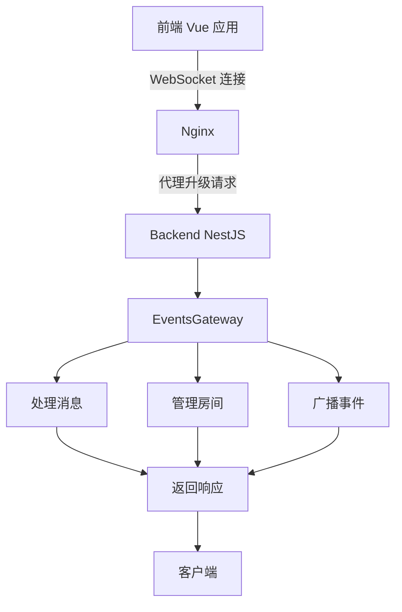

# 部署最佳实践

<cite>
**本文档引用的文件**
- [nginx.conf](file://apps/frontend/nginx.conf)
- [Dockerfile](file://apps/frontend/Dockerfile)
- [docker-compose.yml](file://docker-compose.yml)
- [README.md](file://README.md)
- [events.gateway.ts](file://apps/backend/src/events/events.gateway.ts)
- [events.module.ts](file://apps/backend/src/events/events.module.ts)
- [app.module.ts](file://apps/backend/src/app.module.ts)
- [redis.module.ts](file://apps/backend/src/redis/redis.module.ts)
</cite>

## 目录
1. [简介](#简介)
2. [Nginx 反向代理与负载均衡配置](#nginx-反向代理与负载均衡配置)
3. [SSL/TLS 证书集成](#ssl/tls-证书集成)
4. [监控与日志策略](#监控与日志策略)
5. [高可用性与部署策略](#高可用性与部署策略)
6. [安全加固建议](#安全加固建议)
7. [性能调优技巧](#性能调优技巧)

## 简介
本项目是一个基于 NestJS 和 Vue 3 的全栈应用模板，采用 pnpm Monorepo 架构。项目通过 Docker Compose 进行容器编排，前端使用 Nginx 作为反向代理服务器，后端使用 Node.js 运行 NestJS 应用。本文档旨在提供生产环境部署的高级最佳实践，涵盖 Nginx 配置、SSL/TLS 证书集成、监控与日志策略、高可用性部署、安全加固和性能调优等方面。

**Section sources**
- [README.md](file://README.md#L3-L16)

## Nginx 反向代理与负载均衡配置
Nginx 在本项目中作为前端静态资源的反向代理和负载均衡器。通过 `nginx.conf` 文件配置，实现了 gzip 压缩、缓存头设置和 HTTPS 重定向等功能。

### Gzip 压缩
Gzip 压缩可以显著减少传输数据的大小，提高页面加载速度。在 `nginx.conf` 中，通过以下配置启用 Gzip 压缩：

```nginx
gzip on;
gzip_vary on;
gzip_min_length 1024;
gzip_comp_level 6;
gzip_proxied any;
gzip_types
    text/plain
    text/css
    text/xml
    text/javascript
    application/javascript
    application/json
    application/xml
    application/xml+rss
    application/x-javascript
    image/svg+xml
    font/woff
    font/woff2;
```

这些配置确保了文本、CSS、JavaScript 和 JSON 等资源在传输时被压缩，从而减少带宽消耗和提高响应速度。`gzip_comp_level` 设置为 6，在压缩效率和 CPU 消耗之间取得了良好平衡。

### 缓存头设置
为了提高前端资源的加载速度，Nginx 配置了静态资源的缓存策略。在 `nginx.conf` 中，通过以下配置设置缓存头：

```nginx
location ~* \.(js|css|png|jpg|jpeg|gif|ico|svg|woff|woff2|ttf|eot|webp|avif)$ {
    expires 1y;
    add_header Cache-Control "public, immutable";
    access_log off;
}
```

这些配置确保了静态资源在客户端浏览器中被长期缓存，减少了重复请求，提高了用户体验。同时，通过 `access_log off` 禁用了静态资源的访问日志记录，减少了 I/O 操作。

### HTTPS 重定向
为了确保数据传输的安全性，Nginx 配置了 HTTPS 重定向。虽然 `nginx.conf` 文件中没有直接配置 HTTPS 重定向，但可以通过在 `docker-compose.yml` 文件中配置 Nginx 容器的端口映射来实现：

```yaml
frontend:
  build:
    context: .
    dockerfile: apps/frontend/Dockerfile
  container_name: myapp-frontend
  restart: unless-stopped
  ports:
    - '80:80'
    - '443:443'
  depends_on:
    backend:
      condition: service_healthy
  healthcheck:
    test: ['CMD', 'wget', '--no-verbose', '--tries=1', '--spider', 'http://localhost:80/health']
    interval: 30s
    timeout: 10s
    start_period: 5s
    retries: 3
  networks:
    - myapp-network
```

通过将 443 端口映射到主机，可以配置 Nginx 服务器以支持 HTTPS，并在配置文件中添加相应的 SSL 证书和密钥路径。

### Nginx 安全头配置
为了增强前端应用的安全性，`nginx.conf` 配置了多项安全头，以防范常见的 Web 攻击：

```nginx
# 防止点击劫持
add_header X-Frame-Options "SAMEORIGIN" always;

# 防止 MIME 类型混淆攻击
add_header X-Content-Type-Options "nosniff" always;

# XSS 保护
add_header X-XSS-Protection "1; mode=block" always;

# 引用来源策略
add_header Referrer-Policy "strict-origin-when-cross-origin" always;

# 内容安全策略
add_header Content-Security-Policy "default-src 'self'; script-src 'self' 'unsafe-inline' 'unsafe-eval'; style-src 'self' 'unsafe-inline'; img-src 'self' data: blob: https:; font-src 'self' data:; connect-src 'self' ws: wss:; frame-ancestors 'self';" always;

# 权限策略
add_header Permissions-Policy "camera=(), microphone=(), geolocation=()" always;

# 隐藏 nginx 版本号
server_tokens off;
```

这些安全头提供了多层防护：
- `X-Frame-Options` 防止页面被嵌入到其他网站的 iframe 中，抵御点击劫持攻击。
- `X-Content-Type-Options` 阻止浏览器对文件 MIME 类型进行猜测，防止 MIME 混淆攻击。
- `X-XSS-Protection` 启用浏览器的 XSS 过滤器。
- `Referrer-Policy` 控制 Referer 头的发送行为，保护用户隐私。
- `Content-Security-Policy` (CSP) 是最重要的安全头之一，它定义了页面可以加载哪些资源，有效防止跨站脚本攻击(XSS)。本配置允许从同源加载脚本、样式、图片等资源，并特别允许 `ws:` 和 `wss:` 协议用于 WebSocket 连接。
- `Permissions-Policy` 限制了敏感浏览器 API 的使用，如摄像头、麦克风和地理位置。
- `server_tokens off` 隐藏了 Nginx 的版本信息，减少攻击面。

**Updated** 新增了 Nginx 安全头配置说明

**Section sources**
- [nginx.conf](file://apps/frontend/nginx.conf#L43-L65)

### WebSocket 代理配置
项目后端通过 NestJS 的 `EventsGateway` 实现了 WebSocket 功能，用于实时通信。Nginx 配置了专门的 location 块来代理 WebSocket 连接：

```nginx
location /socket.io {
    proxy_pass http://backend:3000;
    proxy_http_version 1.1;
    proxy_set_header Upgrade $http_upgrade;
    proxy_set_header Connection "upgrade";
    proxy_set_header Host $host;
    proxy_set_header X-Real-IP $remote_addr;
    proxy_set_header X-Forwarded-For $proxy_add_x_forwarded_for;
    proxy_set_header X-Forwarded-Proto $scheme;

    # WebSocket 长连接超时
    proxy_read_timeout 86400s;
    proxy_send_timeout 86400s;
}
```

此配置的关键点包括：
- `proxy_http_version 1.1` 和 `Upgrade`、`Connection` 头的设置是 WebSocket 代理的核心，它们允许 HTTP 连接升级到 WebSocket 协议。
- `proxy_set_header` 系列指令确保了客户端的真实 IP 地址、主机名和协议类型被正确传递给后端服务。
- `proxy_read_timeout` 和 `proxy_send_timeout` 设置为 86400 秒（24 小时），以支持 WebSocket 的长连接特性，避免连接因超时而被意外关闭。

后端的 `EventsGateway` 类（位于 `events.gateway.ts`）通过 `@WebSocketGateway` 装饰器配置了 WebSocket 服务，支持 CORS 和命名空间 `/events`，并实现了消息处理、房间管理等实时通信功能。

**Updated** 新增了 WebSocket 代理配置说明

**Section sources**
- [nginx.conf](file://apps/frontend/nginx.conf#L108-L122)
- [events.gateway.ts](file://apps/backend/src/events/events.gateway.ts#L17-L23)
- [events.module.ts](file://apps/backend/src/events/events.module.ts#L8-L12)

**Diagram sources**
- [events.gateway.ts](file://apps/backend/src/events/events.gateway.ts#L17-L23)



### 前端 Nginx 非 root 用户运行
为了遵循最小权限原则，提高容器安全性，前端 Nginx 容器在 `Dockerfile` 中配置为以非 root 用户运行。在 `apps/frontend/Dockerfile` 文件中，通过以下指令创建并切换到非 root 用户：

```dockerfile
# 创建非 root 用户并配置权限
RUN addgroup -g 1001 -S frontend && \
    adduser -S -D -H -u 1001 -s /sbin/nologin -G frontend frontend && \
    # 设置文件所有权
    chown -R frontend:frontend /usr/share/nginx/html && \
    chown -R frontend:frontend /var/cache/nginx && \
    # 创建并设置日志目录权限
    mkdir -p /var/log/nginx && \
    chown -R frontend:frontend /var/log/nginx && \
    # 设置 PID 文件权限
    touch /var/run/nginx.pid && \
    chown frontend:frontend /var/run/nginx.pid && \
    # 清理缓存减小镜像大小
    rm -rf /var/cache/apk/*

# 切换到非 root 用户
USER frontend
```

此配置创建了一个名为 `frontend` 的非特权用户（UID 1001），并将 Nginx 所需的目录和文件的所有权分配给该用户。通过 `USER frontend` 指令，容器以该非 root 用户身份运行 Nginx 进程。这种做法显著降低了安全风险，即使容器被攻破，攻击者也无法获得 root 权限，从而限制了潜在的损害范围。

**Updated** 新增了前端 Nginx 非 root 用户运行说明

**Section sources**
- [Dockerfile](file://apps/frontend/Dockerfile#L57-L73)

### 只读文件系统配置
为了提高容器的安全性，前端 Nginx 容器在 `docker-compose.yml` 中配置了只读文件系统：

```yaml
frontend:
  # ... 其他配置
  read_only: true
  tmpfs:
    - /var/run
    - /var/cache/nginx
    - /tmp
```

此配置将容器的根文件系统设置为只读，防止恶意代码在运行时修改容器内的文件，大大降低了安全风险。同时，通过 `tmpfs` 挂载了必要的临时目录：
- `/var/run` 用于存放 Nginx 的 PID 文件和 Unix 域套接字。
- `/var/cache/nginx` 用于存放 Nginx 的缓存数据。
- `/tmp` 用于临时文件存储。

这种配置遵循了最小权限原则，确保容器只能在指定的内存临时目录中进行写操作，而不能修改应用代码或配置文件。

**Updated** 新增了只读文件系统配置说明

**Section sources**
- [docker-compose.yml](file://docker-compose.yml#L176-L180)
- [Dockerfile](file://apps/frontend/Dockerfile#L54-L66)

## SSL/TLS 证书集成
为了确保数据传输的安全性，建议使用 Let's Encrypt 提供的免费 SSL/TLS 证书。Let's Encrypt 是一个自动化的、开放的证书颁发机构，可以轻松地为网站提供 SSL/TLS 证书。

### 申请 Let's Encrypt 证书
1. **安装 Certbot**：Certbot 是 Let's Encrypt 的官方客户端，可以自动申请和续期证书。
   ```bash
   sudo apt-get update
   sudo apt-get install certbot python3-certbot-nginx
   ```

2. **申请证书**：使用 Certbot 申请证书，并自动配置 Nginx。
   ```bash
   sudo certbot --nginx -d your-domain.com
   ```

3. **自动续期**：Certbot 会自动配置定时任务，定期检查证书的有效期并自动续期。
   ```bash
   sudo certbot renew --dry-run
   ```

### 配置 Nginx 使用 SSL 证书
在 `nginx.conf` 文件中，添加以下配置以启用 HTTPS：

```nginx
server {
    listen 443 ssl;
    server_name your-domain.com;

    ssl_certificate /etc/letsencrypt/live/your-domain.com/fullchain.pem;
    ssl_certificate_key /etc/letsencrypt/live/your-domain.com/privkey.pem;

    ssl_protocols TLSv1.2 TLSv1.3;
    ssl_ciphers HIGH:!aNULL:!MD5;

    location / {
        proxy_pass http://backend:3000;
        proxy_http_version 1.1;
        proxy_set_header Upgrade $http_upgrade;
        proxy_set_header Connection 'upgrade';
        proxy_set_header Host $host;
        proxy_set_header X-Real-IP $remote_addr;
        proxy_set_header X-Forwarded-For $proxy_add_x_forwarded_for;
        proxy_set_header X-Forwarded-Proto $scheme;
        proxy_cache_bypass $http_upgrade;
    }
}
```

这些配置确保了 Nginx 服务器使用 SSL/TLS 证书，提供安全的 HTTPS 连接。

**Section sources**
- [nginx.conf](file://apps/frontend/nginx.conf#L1-L59)

## 监控与日志策略
为了确保系统的稳定性和可维护性，建议使用 Prometheus/Grafana 或 ELK Stack 进行系统监控。

### 健康检查参数优化
项目的 `docker-compose.yml` 文件中配置了多个服务的健康检查，这些检查对于确保服务的高可用性和正确启动顺序至关重要。针对前端 Nginx 服务，健康检查参数已进行优化：

```yaml
frontend:
  # ... 其他配置
  healthcheck:
    test: ['CMD', 'wget', '--no-verbose', '--tries=1', '--spider', 'http://localhost:80/health']
    interval: 30s
    timeout: 10s
    start_period: 5s
    retries: 3
```

此配置的关键参数说明：
- `test`: 使用 `wget` 命令访问 Nginx 的 `/health` 端点。该端点在 `nginx.conf` 中定义，返回简单的 "healthy" 响应，用于快速检查服务的存活状态。
- `interval`: 健康检查的间隔时间为 30 秒，平衡了检查频率和系统开销。
- `timeout`: 每次检查的超时时间为 10 秒，防止检查过程阻塞过久。
- `start_period`: 启动期为 5 秒，允许容器在启动后有短暂时间完成初始化，避免因启动慢而被误判为不健康。
- `retries`: 在判定服务不健康前，允许连续失败 3 次，增加了检查的容错性，避免因短暂网络波动导致服务重启。

后端服务的健康检查更为复杂，通过调用 `/api/health` 端点来检查数据库和 Redis 等关键依赖的健康状况，确保服务在所有依赖都正常时才被视为就绪。

**Updated** 新增了健康检查参数优化说明

**Section sources**
- [docker-compose.yml](file://docker-compose.yml#L158-L163)
- [nginx.conf](file://apps/frontend/nginx.conf#L71-L76)

### Prometheus/Grafana
Prometheus 是一个开源的监控系统，Grafana 是一个开源的可视化工具。通过 Prometheus 收集系统指标，Grafana 进行可视化展示。

1. **安装 Prometheus 和 Grafana**：
   ```bash
   docker run -d -p 9090:9090 prom/prometheus
   docker run -d -p 3000:3000 grafana/grafana
   ```

2. **配置 Prometheus**：在 `prometheus.yml` 文件中配置数据源。
   ```yaml
   scrape_configs:
     - job_name: 'node'
       static_configs:
         - targets: ['localhost:9090']
   ```

3. **配置 Grafana**：在 Grafana 中添加 Prometheus 数据源，并创建仪表板。

### ELK Stack
ELK Stack 由 Elasticsearch、Logstash 和 Kibana 组成，用于日志的收集、处理和可视化。

1. **安装 ELK Stack**：
   ```bash
   docker-compose up -d
   ```

2. **配置 Logstash**：在 `logstash.conf` 文件中配置日志输入和输出。
   ```conf
   input {
     file {
       path => "/var/log/nginx/*.log"
       start_position => "beginning"
     }
   }

   output {
     elasticsearch {
       hosts => ["http://elasticsearch:9200"]
       index => "nginx-%{+YYYY.MM.dd}"
     }
   }
   ```

3. **配置 Kibana**：在 Kibana 中添加 Elasticsearch 数据源，并创建可视化仪表板。

**Section sources**
- [README.md](file://README.md#L363-L369)

## 高可用性与部署策略
为了确保系统的高可用性，建议采用蓝绿部署或金丝雀发布策略。

### 蓝绿部署
蓝绿部署是一种零停机部署策略，通过两个独立的环境（蓝色和绿色）来实现无缝切换。

1. **准备两个环境**：一个用于生产（蓝色），一个用于新版本（绿色）。
2. **部署新版本**：将新版本部署到绿色环境。
3. **测试新版本**：在绿色环境中进行充分测试。
4. **切换流量**：通过负载均衡器将流量从蓝色环境切换到绿色环境。
5. **回滚**：如果新版本出现问题，可以快速切换回蓝色环境。

### 金丝雀发布
金丝雀发布是一种逐步发布新版本的策略，通过将新版本逐步暴露给一小部分用户来降低风险。

1. **部署新版本**：将新版本部署到生产环境，但只对一小部分用户开放。
2. **监控新版本**：密切监控新版本的性能和用户反馈。
3. **逐步扩大范围**：如果新版本表现良好，逐步扩大用户范围。
4. **完全发布**：当新版本稳定后，对所有用户开放。

**Section sources**
- [README.md](file://README.md#L380-L427)

## 安全加固建议
为了确保系统的安全性，建议采取以下措施：

### 最小权限原则
- **用户权限**：为每个用户分配最小必要的权限，避免过度授权。
- **服务账户**：为每个服务创建独立的服务账户，限制其权限范围。
- **容器用户**：如 `Dockerfile` 所示，创建了非 root 用户 `frontend` 并以该用户身份运行 Nginx，遵循最小权限原则。

### 定期镜像更新
- **定期更新**：定期更新 Docker 镜像，确保使用最新的安全补丁。
- **自动化更新**：使用 CI/CD 工具自动化镜像更新流程。

### 漏洞扫描
- **定期扫描**：使用漏洞扫描工具定期扫描系统，发现潜在的安全问题。
- **修复漏洞**：及时修复发现的漏洞，确保系统安全。

**Section sources**
- [README.md](file://README.md#L353-L362)
- [Dockerfile](file://apps/frontend/Dockerfile#L54-L69)

## 性能调优技巧
为了提高系统的性能，建议采取以下措施：

### 数据库连接池配置
- **连接池大小**：根据应用的并发需求，合理配置数据库连接池的大小。
- **连接超时**：设置合理的连接超时时间，避免长时间占用连接。

### Redis 内存策略调整
Redis 服务在 `docker-compose.yml` 中配置了明确的内存限制和内存回收策略：

```yaml
redis:
  image: redis:7-alpine
  # ... 其他配置
  command: redis-server --appendonly yes --maxmemory 256mb --maxmemory-policy noeviction
  # ... 其他配置
```

此配置的关键点包括：
- `--maxmemory 256mb`：将 Redis 的最大内存使用量限制为 256MB。这与 `docker-compose.yml` 中为 Redis 容器设置的 256M 内存限制相匹配，防止 Redis 消耗过多内存导致系统不稳定。
- `--maxmemory-policy noeviction`：设置内存回收策略为 `noeviction`。这意味着当 Redis 达到内存上限时，新的写入操作将返回错误，而不是驱逐（删除）现有的数据。这种策略优先保证数据的完整性，适用于缓存数据丢失可能导致业务逻辑错误的场景。应用层需要处理因内存不足导致的写入失败。

此外，后端的 `RedisModule` 在 `redis.module.ts` 中通过 `ConfigService` 从环境变量 `REDIS_DEFAULT_TTL` 配置了默认的缓存过期时间（TTL），实现了应用层的缓存生命周期管理。

**Updated** 新增了 Redis 内存策略调整说明

**Section sources**
- [docker-compose.yml](file://docker-compose.yml#L44)
- [redis.module.ts](file://apps/backend/src/redis/redis.module.ts#L40)

### 前端资源优化
- **资源压缩**：使用 Gzip 压缩前端资源，减少传输数据的大小。
- **缓存策略**：合理设置缓存头，提高前端资源的加载速度。

**Section sources**
- [README.md](file://README.md#L380-L427)
- [nginx.conf](file://apps/frontend/nginx.conf#L7-L12)
- [nginx.conf](file://apps/frontend/nginx.conf#L45-L50)