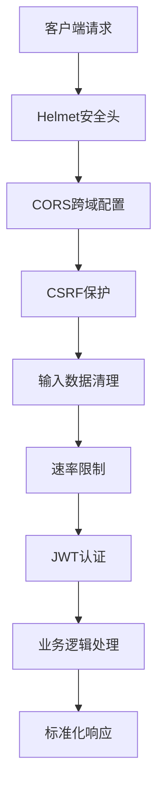
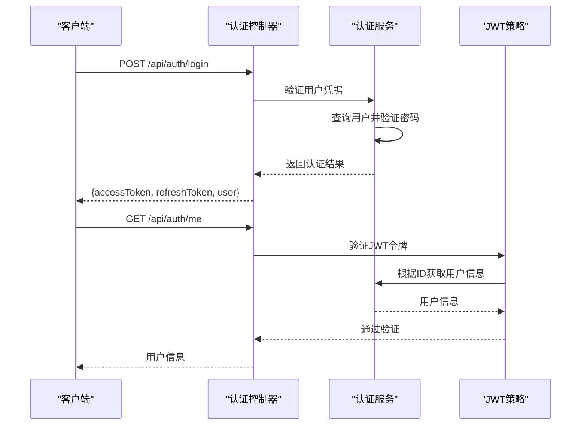
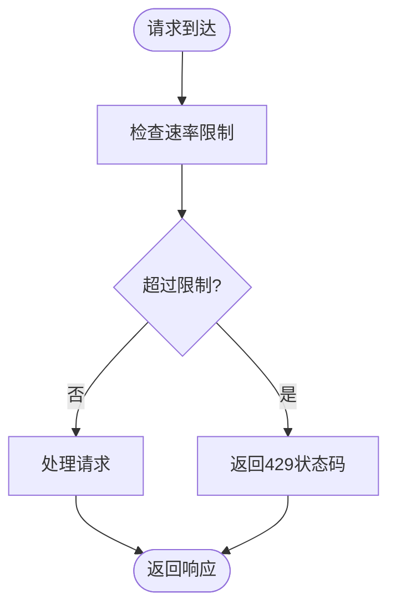
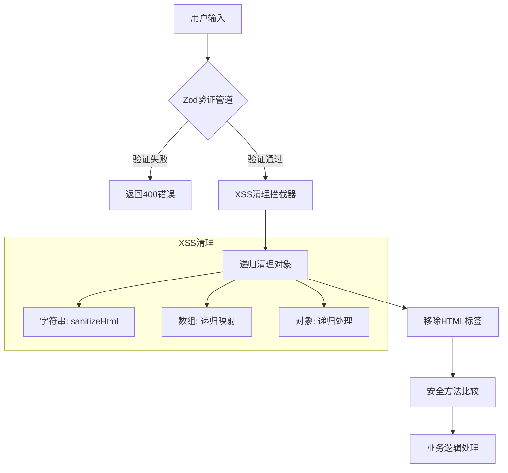
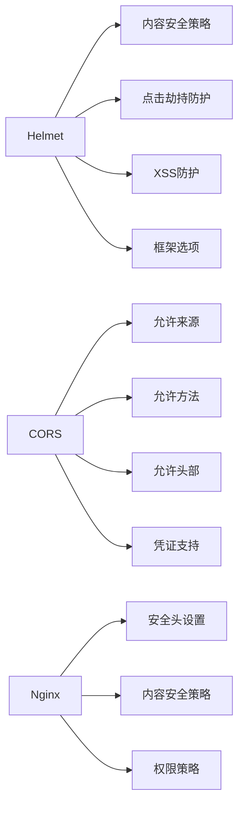
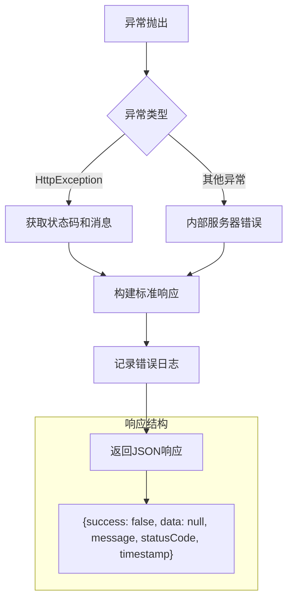

# 安全特性

<cite>
**本文档引用的文件**   
- [main.ts](file://apps/backend/src/main.ts)
- [app.module.ts](file://apps/backend/src/app.module.ts)
- [auth.service.ts](file://apps/backend/src/auth/auth.service.ts)
- [auth.controller.ts](file://apps/backend/src/auth/auth.controller.ts)
- [jwt.strategy.ts](file://apps/backend/src/auth/jwt.strategy.ts)
- [csrf.middleware.ts](file://apps/backend/src/common/middlewares/csrf.middleware.ts)
- [sanitize.interceptor.ts](file://apps/backend/src/common/interceptors/sanitize.interceptor.ts)
- [all-exceptions.filter.ts](file://apps/backend/src/common/filters/all-exceptions.filter.ts)
- [auth.module.ts](file://apps/backend/src/auth/auth.module.ts)
- [nginx.conf](file://apps/frontend/nginx.conf)
</cite>

## 目录
1. [安全防护机制](#安全防护机制)
2. [认证与授权](#认证与授权)
3. [速率限制策略](#速率限制策略)
4. [输入验证与清理](#输入验证与清理)
5. [安全头与CORS配置](#安全头与cors配置)
6. [异常处理与日志](#异常处理与日志)

## 安全防护机制

本项目采用多层次的安全防护机制，确保应用在生产环境中的安全性。通过集成多种安全中间件和防护策略，有效抵御常见的Web攻击。

**图表来源**
- [main.ts](file://apps/backend/src/main.ts#L24-L37)
- [app.module.ts](file://apps/backend/src/app.module.ts#L155-L157)
- [csrf.middleware.ts](file://apps/backend/src/common/middlewares/csrf.middleware.ts#L15-L93)

## 认证与授权

系统采用双令牌机制（accessToken + refreshToken）进行用户认证，确保会话安全。认证流程通过JWT（JSON Web Token）实现，结合Passport策略进行权限验证。

**图表来源**
- [auth.controller.ts](file://apps/backend/src/auth/auth.controller.ts#L15-L50)
- [auth.service.ts](file://apps/backend/src/auth/auth.service.ts#L21-L150)
- [jwt.strategy.ts](file://apps/backend/src/auth/jwt.strategy.ts#L17-L47)

**本节来源**
- [auth.service.ts](file://apps/backend/src/auth/auth.service.ts#L9-L149)
- [auth.controller.ts](file://apps/backend/src/auth/auth.controller.ts#L1-L50)
- [jwt.strategy.ts](file://apps/backend/src/auth/jwt.strategy.ts#L1-L47)

## 速率限制策略

系统配置了三级速率限制策略，有效防止暴力破解和DDoS攻击。通过ThrottlerGuard实现全局速率控制，并针对不同接口设置特定限制。

| 级别 | 时间窗口 | 最大请求数 | 说明 |
|------|----------|------------|------|
| 短期 | 1秒 | 3次 | 防止暴力破解 |
| 中期 | 10秒 | 20次 | 正常使用限制 |
| 长期 | 1分钟 | 100次 | 整体流量控制 |

**图表来源**
- [app.module.ts](file://apps/backend/src/app.module.ts#L113-L134)
- [auth.controller.ts](file://apps/backend/src/auth/auth.controller.ts#L23-L34)

**本节来源**
- [app.module.ts](file://apps/backend/src/app.module.ts#L113-L134)
- [auth.controller.ts](file://apps/backend/src/auth/auth.controller.ts#L23-L34)

## 输入验证与清理

系统采用Zod Schema进行输入验证，并通过XSS清理拦截器防止跨站脚本攻击。所有用户输入都会经过严格的验证和清理流程。

**图表来源**
- [main.ts](file://apps/backend/src/main.ts#L66-L72)
- [sanitize.interceptor.ts](file://apps/backend/src/common/interceptors/sanitize.interceptor.ts#L10-L61)

**本节来源**
- [main.ts](file://apps/backend/src/main.ts#L66-L72)
- [sanitize.interceptor.ts](file://apps/backend/src/common/interceptors/sanitize.interceptor.ts#L1-L61)

## 安全头与CORS配置

通过Helmet中间件设置安全头，并配置CORS策略，增强应用的安全性。同时在Nginx层面也配置了相应的安全头。

**图表来源**
- [main.ts](file://apps/backend/src/main.ts#L25-L37)
- [main.ts](file://apps/backend/src/main.ts#L58-L63)
- [nginx.conf](file://apps/frontend/nginx.conf#L55-L65)

**本节来源**
- [main.ts](file://apps/backend/src/main.ts#L25-L37)
- [main.ts](file://apps/backend/src/main.ts#L58-L63)
- [nginx.conf](file://apps/frontend/nginx.conf#L55-L65)

## 异常处理与日志

系统实现了全局异常过滤器，统一处理所有未捕获的异常，并返回标准化的错误响应格式。同时配置了详细的日志记录。

**图表来源**
- [all-exceptions.filter.ts](file://apps/backend/src/common/filters/all-exceptions.filter.ts#L8-L31)
- [main.ts](file://apps/backend/src/main.ts#L68-L69)

**本节来源**
- [all-exceptions.filter.ts](file://apps/backend/src/common/filters/all-exceptions.filter.ts#L1-L31)
- [main.ts](file://apps/backend/src/main.ts#L68-L69)