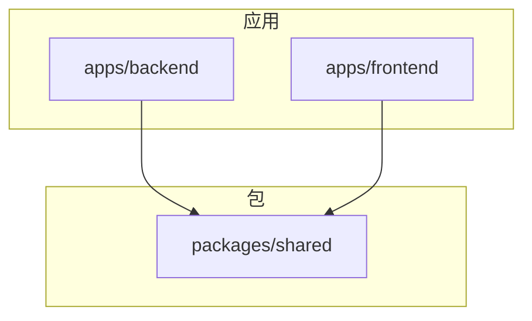
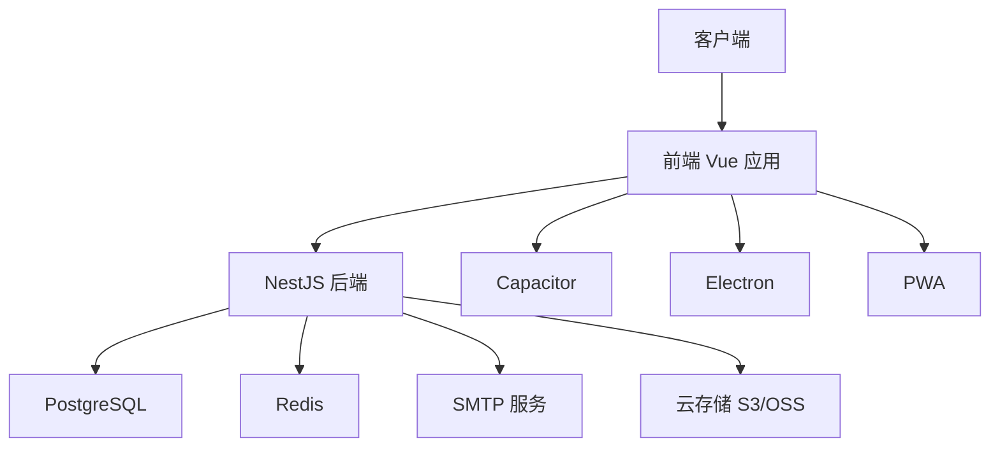
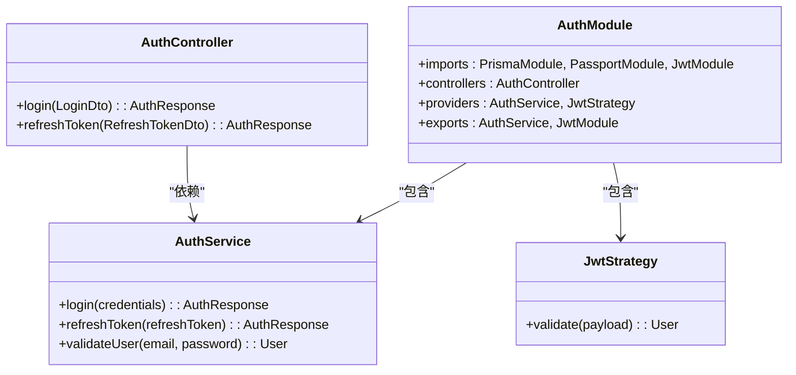
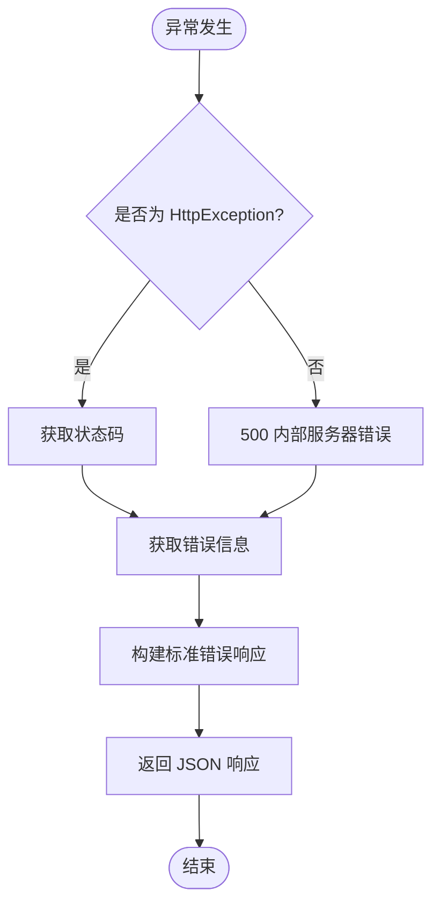
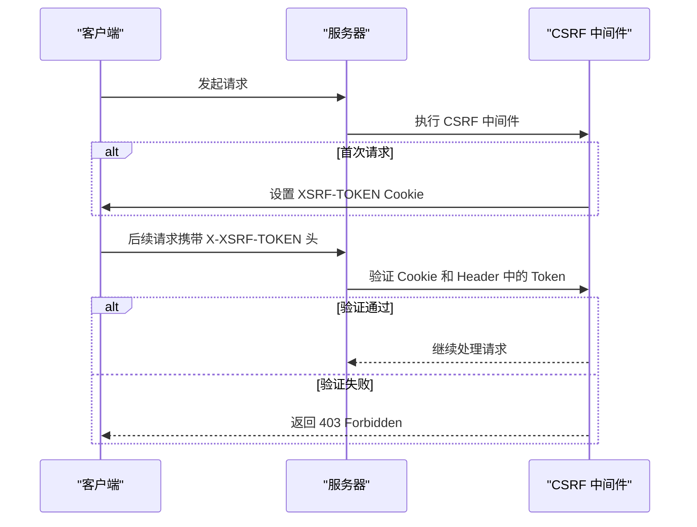
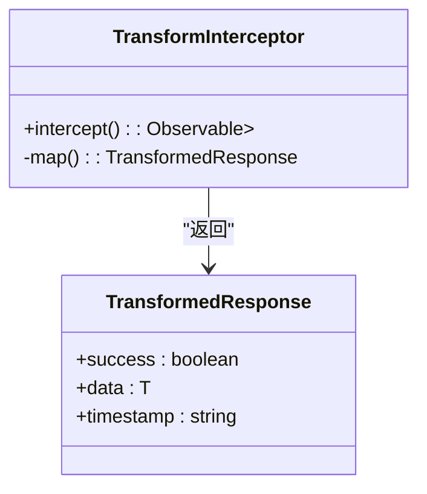

# 开发规范

<cite>
**本文档引用的文件**
- [main.ts](file://apps/backend/src/main.ts)
- [app.module.ts](file://apps/backend/src/app.module.ts)
- [main.ts](file://apps/frontend/src/main.ts)
- [App.vue](file://apps/frontend/src/App.vue)
- [auth.module.ts](file://apps/backend/src/auth/auth.module.ts)
- [all-exceptions.filter.ts](file://apps/backend/src/common/filters/all-exceptions.filter.ts)
- [sanitize.interceptor.ts](file://apps/backend/src/common/interceptors/sanitize.interceptor.ts)
- [transform.interceptor.ts](file://apps/backend/src/common/interceptors/transform.interceptor.ts)
- [csrf.middleware.ts](file://apps/backend/src/common/middlewares/csrf.middleware.ts)
- [router/index.ts](file://apps/frontend/src/router/index.ts)
- [eslint.config.mjs](file://eslint.config.mjs)
- [.prettierrc](file://.prettierrc)
- [README.md](file://README.md)
</cite>

## 目录
1. [简介](#简介)
2. [项目结构](#项目结构)
3. [核心组件](#核心组件)
4. [架构概览](#架构概览)
5. [详细组件分析](#详细组件分析)
6. [依赖分析](#依赖分析)
7. [性能考虑](#性能考虑)
8. [故障排除指南](#故障排除指南)
9. [结论](#结论)

## 简介
本项目是一个基于 **NestJS + Vue 3** 的全栈应用模板，采用 **pnpm Monorepo** 架构，集成了现代 Web 开发的最佳实践和工具链。项目包含后端服务、前端应用、共享包以及跨端能力（Capacitor 和 Electron），并提供了完整的开发、测试、构建和部署流程。

**Section sources**
- [README.md](file://README.md#L1-L585)

## 项目结构
项目采用 Monorepo 结构，分为 `apps` 和 `packages` 两个主要目录：

- `apps/backend`: NestJS 后端服务，负责 API 提供、数据库操作、认证授权等
- `apps/frontend`: Vue 3 前端应用，使用 Vite 构建，支持 PWA、Capacitor 和 Electron
- `packages/shared`: 共享包，包含 DTO、Schema、工具函数等前后端共用代码

后端关键目录包括认证、用户管理、数据库、缓存、定时任务等模块；前端包含组件、路由、状态管理、国际化等功能。



**Diagram sources**
- [README.md](file://README.md#L10-L18)

**Section sources**
- [README.md](file://README.md#L162-L205)

## 核心组件
项目的核心组件包括后端的认证模块、全局异常处理、安全防护，以及前端的路由、状态管理和 UI 组件库集成。这些组件共同构成了系统的稳定性和安全性基础。

**Section sources**
- [main.ts](file://apps/backend/src/main.ts#L1-L94)
- [app.module.ts](file://apps/backend/src/app.module.ts#L1-L159)
- [main.ts](file://apps/frontend/src/main.ts#L1-L57)

## 架构概览
系统采用前后端分离架构，后端基于 NestJS 框架，使用模块化设计，通过依赖注入实现组件解耦。前端基于 Vue 3 和 Vite，使用 Pinia 进行状态管理，Vue Router 进行路由控制。

后端通过 Prisma ORM 与 PostgreSQL 交互，使用 Redis 实现缓存和队列功能，集成 BullMQ 处理后台任务。认证采用 JWT 双令牌机制，配合 CSRF 保护确保安全性。



**Diagram sources**
- [README.md](file://README.md#L23-L40)
- [README.md](file://README.md#L41-L54)

**Section sources**
- [README.md](file://README.md#L8-L18)

## 详细组件分析

### 认证模块分析
认证模块实现了 JWT 双令牌机制，包含访问令牌和刷新令牌，确保用户会话的安全性。



**Diagram sources**
- [auth.module.ts](file://apps/backend/src/auth/auth.module.ts#L1-L32)

**Section sources**
- [auth.module.ts](file://apps/backend/src/auth/auth.module.ts#L1-L32)

### 异常处理分析
全局异常过滤器统一处理所有未捕获的异常，返回标准化的错误响应格式。



**Diagram sources**
- [all-exceptions.filter.ts](file://apps/backend/src/common/filters/all-exceptions.filter.ts#L1-L31)

**Section sources**
- [all-exceptions.filter.ts](file://apps/backend/src/common/filters/all-exceptions.filter.ts#L1-L31)

### 安全防护分析
系统实现了多层次的安全防护机制，包括 Helmet 安全头、CSRF 保护、XSS 防护等。



**Diagram sources**
- [csrf.middleware.ts](file://apps/backend/src/common/middlewares/csrf.middleware.ts#L1-L93)

**Section sources**
- [csrf.middleware.ts](file://apps/backend/src/common/middlewares/csrf.middleware.ts#L1-L93)

### 响应转换分析
全局响应转换拦截器将所有成功响应统一包装为标准格式。



**Diagram sources**
- [transform.interceptor.ts](file://apps/backend/src/common/interceptors/transform.interceptor.ts#L1-L30)

**Section sources**
- [transform.interceptor.ts](file://apps/backend/src/common/interceptors/transform.interceptor.ts#L1-L30)

## 依赖分析
项目使用 pnpm workspace 管理多包依赖，通过 `pnpm-workspace.yaml` 配置工作空间。共享包 `@my-app/shared` 被前后端共同引用，确保类型和验证逻辑的一致性。

```mermaid
graph LR
A[apps/backend] --> C[@my-app/shared]
B[apps/frontend] --> C[@my-app/shared]
C --> D[zod]
A --> E[prisma]
A --> F[redis]
B --> G[vue]
B --> H[tailwindcss]
```

**Diagram sources**
- [README.md](file://README.md#L6-L18)
- [package.json](file://package.json#L1-L20)

**Section sources**
- [README.md](file://README.md#L68-L73)

## 性能考虑
后端使用 Pino 日志库，生产环境采用 JSON 格式输出，开发环境使用 pino-pretty 格式化。响应启用 Gzip 压缩，仅对大于 1KB 的响应进行压缩。

BullMQ 队列配置了指数退避重试策略，初始延迟 1 秒，最多重试 3 次。速率限制采用三级策略：1秒内最多3次、10秒内最多20次、1分钟内最多100次。

**Section sources**
- [main.ts](file://apps/backend/src/main.ts#L42-L55)
- [app.module.ts](file://apps/backend/src/app.module.ts#L113-L134)

## 故障排除指南
常见问题包括 Docker 构建失败、共享包未正确构建、Zod 依赖缺失等。开发前需确保启动 PostgreSQL 和 Redis 服务，首次运行需执行数据库迁移。

前端 `zod` 依赖必须在 `apps/frontend/package.json` 中显式声明，否则 Docker 构建会失败。修改共享包后需重新构建：`pnpm --filter @my-app/shared build`。

**Section sources**
- [README.md](file://README.md#L522-L533)

## 结论
本项目提供了一个现代化的全栈开发模板，集成了最佳实践和技术栈。通过 Monorepo 架构和共享包机制，实现了前后端代码的高效复用和一致性维护。完善的开发工具链和部署流程，使得项目易于维护和扩展。