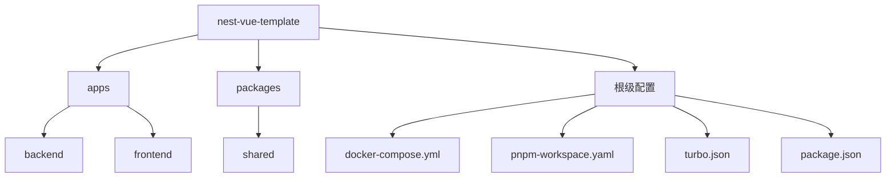
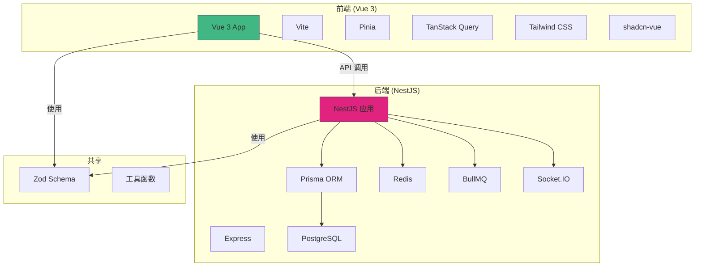
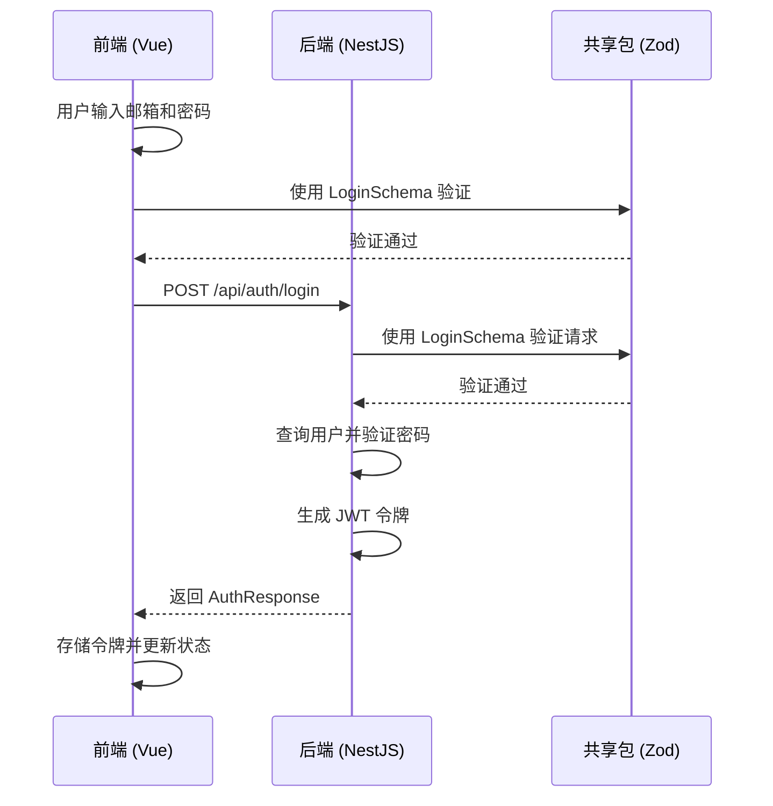
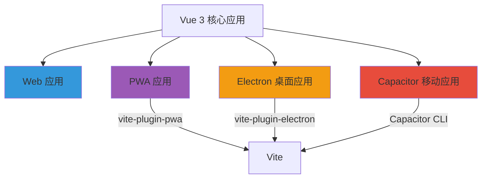

# 项目概述

<cite>
**本文档中引用的文件**  
- [README.md](file://README.md)
- [package.json](file://package.json)
- [pnpm-workspace.yaml](file://pnpm-workspace.yaml)
- [turbo.json](file://turbo.json)
- [apps/backend/package.json](file://apps/backend/package.json)
- [apps/backend/src/main.ts](file://apps/backend/src/main.ts)
- [apps/backend/src/app.module.ts](file://apps/backend/src/app.module.ts)
- [apps/frontend/package.json](file://apps/frontend/package.json)
- [apps/frontend/src/main.ts](file://apps/frontend/src/main.ts)
- [apps/frontend/src/App.vue](file://apps/frontend/src/App.vue)
- [apps/frontend/vite.config.ts](file://apps/frontend/vite.config.ts)
- [packages/shared/package.json](file://packages/shared/package.json)
- [packages/shared/src/index.ts](file://packages/shared/src/index.ts)
- [packages/shared/src/schemas/auth.schema.ts](file://packages/shared/src/schemas/auth.schema.ts)
</cite>

## 目录

1. [简介](#简介)
2. [项目结构](#项目结构)
3. [核心组件](#核心组件)
4. [架构概览](#架构概览)
5. [详细组件分析](#详细组件分析)
6. [依赖分析](#依赖分析)
7. [性能考量](#性能考量)
8. [故障排除指南](#故障排除指南)
9. [结论](#结论)

## 简介

nest-vue-template 是一个基于 **NestJS** 和 **Vue 3** 的全栈开发模板，采用 **pnpm Monorepo** 架构，为开发者提供开箱即用的企业级功能起点。该项目集成了现代 Web 开发的最佳实践和工具链，支持多端部署能力，包括 Web、PWA、Electron 桌面应用以及通过 Capacitor 实现的 iOS 和 Android 移动应用。

本模板的核心价值在于其统一的技术栈和高效的开发流程。通过共享包（`@my-app/shared`）实现前后端类型和验证逻辑的统一，确保数据一致性。项目利用 Zod Schema 作为单一可信源，结合 `nestjs-zod` 和 `@vee-validate/zod`，实现了前后端数据验证的无缝对接。此外，pnpm Monorepo 与 Turbo 构建系统的结合，显著提升了多包项目的构建和开发效率。

## 项目结构

该项目采用清晰的 Monorepo 结构，将前端、后端和共享代码分离，便于维护和扩展。



**Diagram sources**
- [README.md](file://README.md#L5-L15)

**Section sources**
- [README.md](file://README.md#L5-L15)
- [project_structure](file://project_structure)

## 核心组件

### 后端 (NestJS)
后端基于 NestJS 10 构建，采用模块化设计。核心模块包括：
- **AuthModule**: 基于 JWT 和 Passport 的认证系统
- **PrismaModule**: 使用 Prisma ORM 进行数据库操作
- **RedisModule**: 集成 Redis 用于缓存和会话管理
- **MailModule**: 封装 Nodemailer 实现邮件发送
- **EventsModule**: 通过 Socket.IO 提供 WebSocket 支持
- **ScheduledTasksModule**: 使用 BullMQ 处理后台定时任务

### 前端 (Vue 3)
前端采用 Vue 3 + Vite 构建，具备现代化的开发体验：
- **状态管理**: 使用 Pinia 并集成持久化插件
- **API 请求**: 通过 TanStack Query 管理数据获取和缓存
- **UI 组件**: 基于 shadcn-vue (Reka UI) 和 Tailwind CSS
- **表单验证**: 使用 VeeValidate 集成 Zod Schema
- **国际化**: 通过 Vue I18n 支持多语言

### 共享包 (@my-app/shared)
共享包是连接前后端的桥梁，包含：
- **Zod Schemas**: 定义 API 请求/响应的验证规则和类型
- **DTOs**: 通用的数据传输对象
- **工具函数**: 可复用的业务逻辑工具

**Section sources**
- [README.md](file://README.md#L153-L193)
- [apps/backend/src/app.module.ts](file://apps/backend/src/app.module.ts#L8-L16)
- [apps/frontend/src/main.ts](file://apps/frontend/src/main.ts#L2-L18)
- [packages/shared/src/index.ts](file://packages/shared/src/index.ts)

## 架构概览



**Diagram sources**
- [README.md](file://README.md#L18-L68)
- [apps/backend/src/main.ts](file://apps/backend/src/main.ts)
- [apps/frontend/src/main.ts](file://apps/frontend/src/main.ts)

## 详细组件分析

### 认证流程分析

#### 认证模块交互


**Diagram sources**
- [packages/shared/src/schemas/auth.schema.ts](file://packages/shared/src/schemas/auth.schema.ts)
- [apps/backend/src/auth/auth.controller.ts](file://apps/backend/src/auth/auth.controller.ts)
- [apps/frontend/src/components/LoginForm.vue](file://apps/frontend/src/components/LoginForm.vue)

### 多端部署架构



**Diagram sources**
- [README.md](file://README.md#L50-L56)
- [apps/frontend/vite.config.ts](file://apps/frontend/vite.config.ts)
- [apps/frontend/package.json](file://apps/frontend/package.json)

## 依赖分析

```mermaid
graph LR
Root[根 package.json] --> Backend[@my-app/backend]
Root --> Frontend[@my-app/frontend]
Root --> Shared[@my-app/shared]
Backend --> Shared
Frontend --> Shared
Backend --> Prisma[Prisma Client]
Backend --> Redis[ioredis]
Backend --> Bull[BullMQ]
Frontend --> Pinia[Pinia]
Frontend --> Query[TanStack Query]
Frontend --> Tailwind[Tailwind CSS]
style Root fill:#2ecc71
style Backend fill:#e74c3c
style Frontend fill:#3498db
style Shared fill:#f39c12
```

**Diagram sources**
- [package.json](file://package.json)
- [apps/backend/package.json](file://apps/backend/package.json)
- [apps/frontend/package.json](file://apps/frontend/package.json)
- [packages/shared/package.json](file://packages/shared/package.json)

**Section sources**
- [package.json](file://package.json)
- [pnpm-workspace.yaml](file://pnpm-workspace.yaml)

## 性能考量

该项目在设计时充分考虑了性能优化：

1. **构建性能**: 使用 pnpm Monorepo 和 Turbo 构建系统，实现任务的并行执行和缓存，极大提升了构建速度。
2. **运行时性能**: 
   - 后端启用 Gzip 压缩（compression 中间件）
   - 前端使用 Vite 提供的快速热更新和按需编译
   - 通过 Redis 缓存频繁访问的数据
3. **网络性能**: 
   - 前端使用 TanStack Query 进行智能数据缓存和去重
   - PWA 配置 Service Worker 实现离线访问和资源缓存
4. **数据库性能**: 使用 Prisma ORM 提供类型安全的数据库访问，并支持查询优化。

这些优化措施共同确保了应用在开发和生产环境下的高效运行。

## 故障排除指南

### 常见问题及解决方案

| 问题 | 可能原因 | 解决方案 |
|------|---------|---------|
| 开发服务器无法启动 | 依赖未安装或版本不匹配 | 运行 `pnpm install` 重新安装依赖 |
| 数据库连接失败 | PostgreSQL 或 Redis 服务未运行 | 使用 `docker compose up postgres redis -d` 启动服务 |
| 共享包类型无法解析 | 共享包未正确构建 | 在 `packages/shared` 目录下运行 `pnpm build` |
| 跨域请求被拒绝 | CORS 配置不正确 | 检查后端 `main.ts` 中的 CORS 配置 |
| PWA 无法离线工作 | Service Worker 注册失败 | 检查 `vite.config.ts` 中的 PWA 插件配置 |

**Section sources**
- [README.md](file://README.md#L436-L487)
- [apps/backend/src/main.ts](file://apps/backend/src/main.ts#L57-L63)
- [apps/frontend/vite.config.ts](file://apps/frontend/vite.config.ts#L54-L107)

## 结论

nest-vue-template 项目为全栈开发者提供了一个功能完备、架构清晰的现代化开发起点。其核心优势在于：

1. **统一的技术栈**: 整合了 NestJS、Vue 3、Prisma、Zod 等现代技术，形成高效的技术闭环。
2. **Monorepo 架构**: 通过 pnpm workspace 和共享包，实现了代码复用和依赖管理的最佳实践。
3. **多端部署能力**: 一套代码可编译为 Web、PWA、桌面和移动应用，极大提升了开发效率。
4. **企业级特性**: 内置了认证、缓存、队列、邮件、日志等企业应用所需的核心功能。
5. **开发体验优化**: 集成了 Docker、Turbo、Vitest 等工具，提供了流畅的开发、测试和部署流程。

对于初学者，该项目提供了清晰的项目结构和详尽的文档，降低了全栈开发的入门门槛。对于经验丰富的开发者，其模块化设计和扩展性为复杂业务场景的实现提供了坚实的基础。无论是构建 MVP 还是企业级应用，nest-vue-template 都是一个值得考虑的优秀模板。